# Rancangan Sequence Diagram 15 UC (30 Sept 2026)

Langkah 4 dari rencana 7 langkah. Bahan menggambar *sequence diagram* Gambar 4.11, 4.13, …, 4.39 (satu per UC; nomor perkiraan mengikuti rumus Kerangka R12: UC-n → Gambar 4.(9+2n)).

**Status (30 Sept, malam):** hasil verifikasi langkah 5 sudah diterapkan ke tabel dan blok Mermaid di bawah (bukti: `laporan-verifikasi-langkah5.md`; keputusan Daniel di bagian I laporan itu; ringkasan perubahan di bagian 20). Tanda verifikasi yang sudah terjawab dihapus. **Status sebelumnya:** pola dan contoh UC-08 serta UC-13 **DISETUJUI** Daniel (30 Sept). **Versi terbaru (30 Sept, sore): blok Mermaid di dokumen ini sama persis dengan 15 widget di Miro** (lihat bagian 19). Penyesuaian notasi dan tujuh tambahan pesan dicatat di bagian 19; pesan tambahan diberi nomor sisipan (mis. `7a`) agar rujukan nomor pesan lama tetap berlaku. Tiga keputusan Daniel (30 Sept):
1. Pola dua UC contoh disetujui.
2. **Keenam gambar lama (4.18–4.23) dibuat ulang** dengan lifeline seragam R12. Isi dan urutan pesan tetap mengikuti `rancangan-sequence-diagram.md` (terverifikasi 27 Sept); yang berubah hanya lifeline tempat pesan digambar. Ke-15 UC semuanya punya gambar sendiri, termasuk UC-06.
3. **Bila kode rute memanggil ORM langsung, `:Layanan` tidak digambar**; pesan digambar `:RuteAPI → :BasisData`. Ini dasar kalimat KNF-12 "sebagian modul". Menyimpang dari keseragaman R12 secara sadar.

**Acuan:** `claude/Kerangka Bab IV - Analisis dan Perancangan (Revisi 12).md` (deskripsi UC), `claude/Spesifikasi Use Case Diagram dan Activity Diagram (30 Sept 2026).md` (node activity), `rancangan-sequence-diagram.md` (6 gambar terverifikasi), `claude/Sequence Diagram Miro - Catatan Notasi (27 Sept 2026).md`, `claude/Pedoman Penulisan dan Diagram (disepakati).md`, `claude/Koreksi Konteks - Dokumen Mentah dan Filter Status (30 Sept 2026).md`, `penjelasan-proyek-aplikasi.md`.

**Verifikasi.** Semua butir yang sebelumnya ditandai belum pasti sudah dijawab atau dihapus; dokumen ini tidak lagi memakai tanda tersebut. Isi diverifikasi terhadap `src/` pada langkah 5.

Miro tidak disentuh dalam langkah ini.

---

## 0. Pola yang Berlaku untuk 15 UC

### 0.1 Lifeline

| Lifeline | Isi | Kolom arsitektur (Gambar 4.9) |
|---|---|---|
| Aktor | Nama sama persis dengan use case diagram (Pengguna, Pegawai, Ketua Tim, PPK, PPSPM, KSBU, PJ Kinerja, Admin) | — |
| `:Halaman<Nama>` | Halaman React di peramban | Logika presentasi |
| `:RuteAPI` | Satu lifeline untuk semua endpoint dalam UC itu. Pemeriksaan asal permintaan, sesi, peran, dan skema digambar sebagai *self-call* | Logika aplikasi |
| `:Layanan<Nama>` | Modul `src/lib/*`. Modul transisi status (`fsm.ts`) digambar sebagai *self-call* `periksaTransisi(asal, aksi, aktor)`. *Repository* yang diinjeksikan digabung ke lifeline ini (pesannya langsung ke `:BasisData`) | Logika aplikasi |
| `:BasisData` | PostgreSQL lewat Drizzle, termasuk `mulaiTransaksi()`, `commit()`, `rollback()` | Akses dan penyimpanan data |
| `:PenyimpananFile` | Modul penyimpanan file dan filesystem lokal. Hanya ada bila UC mengunggah, memindah, membaca, atau menghapus file | Penyimpanan data |

Keputusan 3: bila rute memanggil ORM langsung, lifeline `:Layanan` dihapus dan *self-call* `periksaTransisi()` pindah ke `:RuteAPI`. Bila modul file hanya fungsi privat layanan (kasus 4.22), pembacaan file digambar sebagai *self-call* layanan.

### 0.2 Pesan dan fragmen

- Diagram UC-02 s.d. UC-15 dimulai **setelah login** (sudah di sequence UC-01). Diagram dibuka dengan langkah singkat membuka menu/detail agar sepadan dengan node awal activity.
- Paling banyak **satu `alt` untuk cabang utama** (sepadan dengan *decision* utama activity). `break` dan `loop` dipakai untuk cabang yang punya *decision* di activity atau yang menjadi klaim rancangan (KNF-06, KNF-07, KNF-11). Kegagalan umum 400/401/403 yang tidak punya *decision* di activity cukup disebut di narasi. Pengecualian (dua `alt`) hanya pada UC-01 (bagian masuk dan bagian keluar) dan UC-09 (menu laporan dan pintu lampiran dari 4.22); keduanya dijelaskan di tempat.
- *Guard* pada satu pesan memakai notasi Dennis `[guard] pesan()`, tanpa fragmen.
- Pesan halaman → aktor adalah panggilan (garis penuh), bukan *return* (catatan Miro butir 4). *Return* (garis putus-putus) hanya bila membawa nilai; dilabeli kata benda atau kode HTTP.
- Label pesan: bahasa Indonesia, `kataKerjaObjek(argumen)`. Nama fungsi kode hanya di kolom Sumber. Kode status internal (mis. `IN_PPK_VALIDATION`) boleh di argumen; label tampilannya di tabel 0.4.
- Setiap pesan diberi **Padanan**: node activity (ID dari Spesifikasi 30 Sept) dan langkah deskripsi UC (aturan V3 Dennis). Pesan tanpa padanan activity adalah rincian teknis di dalam satu aksi "Sistem …".

### 0.3 Kolom tabel pesan

**No · Dari → Ke · Pesan · Padanan (activity · langkah UC) · Sumber**. Jenis pesan ditandai pada kolom Dari → Ke: `→` panggilan, `⇢` *return*, `↻` *self-call*, `⇝` asinkron. *Return* yang tidak membawa data baru tidak diberi baris tersendiri di tabel; ia hanya digambar di blok Mermaid.

### 0.4 Label status

| Kode | Label tampilan | Label di halaman laporan |
|---|---|---|
| `IN_PPK_VALIDATION` | Diajukan ke PPK | — |
| `IN_PPSPM_APPROVAL` | Menunggu PPSPM | — |
| `NEED_REVISION` | Perlu Revisi | — |
| `COMPLETED` | Selesai | Material |
| `TERSIMPAN` | Tersimpan | Non-Material |
| Berkas `OPEN` / `CLOSED`+`AKTIF` / `USUL_MUSNAH` / `DIMUSNAHKAN` | Terbuka / Tersimpan / Usul Pembersihan / File Dibersihkan | — |

### 0.5 Mermaid

Mermaid hanya untuk verifikasi dan acuan menggambar (widget Miro, lihat catatan notasi 27 Sept). Konvensi blok (disamakan dengan widget Miro 27 Sept): *return* `--)` (garis putus-putus, kepala panah terbuka); aktor diberi `activate`/`deactivate` sepanjang skenario; *guard* fragmen dan pesan ditulis dalam `[...]`; baris `title` hanya untuk render lokal, di Miro judul ditaruh pada judul widget "Gambar 4.xx: sd …". Kelima belas blok versi terbaru sudah dirender tanpa galat sintaks dengan mermaid-cli (30 Sept sore) dan sudah digambar di Miro; render ulang bila ada koreksi setelah langkah 5.

### 0.6 Ringkasan 15 gambar

| UC | Frame `sd …` | Lifeline Layanan | File | Fragmen | Asal |
|---|---|---|---|---|---|
| UC-01 | Login dan Logout | `:LayananAutentikasi` | — | `break` batas percobaan; `alt` berhasil/gagal; `alt` berpindah peran/keluar | Baru |
| UC-02 | Mengelola Profil dan Kata Sandi | `:LayananAkun` | ya (foto) | `alt` kata sandi/foto; `break` ×2 | Baru |
| UC-03 | Mengajukan Dokumen | `:LayananPengajuan` | ya | `loop` unggah (`break` ×2); `alt` material/non-material; `loop` pindah file; `break` gagal | 4.18 + 4.19 dibuat ulang |
| UC-04 | Mengelola Dokumen yang Diajukan | `:LayananDokumen` | ya | `alt` lihat lampiran/revisi; `break` 403, 410 ×2, perbaikan belum lengkap, konflik | 4.22 (pintu alur kerja) dibuat ulang + revisi baru |
| UC-05 | Memvalidasi Dokumen | — (rute → ORM) | — | `alt` setujui/tolak; `break` konflik, catatan tidak valid | 4.20 dibuat ulang + tolak |
| UC-06 | Menyetujui Dokumen | — (rute → ORM) | — | sama dengan UC-05 | Baru (sepola 4.20) |
| UC-07 | Memberkaskan Dokumen | `:LayananBerkas` | — | `break` berkas tertutup; `alt` terbuka/belum ada | 4.21 dibuat ulang |
| UC-08 | Mengelola Berkas | `:LayananBerkas` | ya | `alt` tutup/bersihkan; `break` ×2; `loop` hapus file | Baru (disetujui) |
| UC-09 | Melihat Laporan Dokumen | `:LayananLaporan` | — | `alt` menu; `alt` pintu lampiran (4.22 KSBU); `break` ×4 | Baru + 4.22 (pintu KSBU) |
| UC-10 | Memantau Nominal Realisasi | `:LayananLaporan` | — | `loop` ubah periode; `alt` per fungsi/per pegawai | Baru |
| UC-11 | Memantau Dokumen Tim | `:LayananLaporan` | — | `break` ×2 (ekspor) | Baru |
| UC-12 | Membersihkan Lampiran Dokumen Non-Material | `:LayananPembersihan` | ya | `break` frasa/penugasan; `loop` ×2 | 4.23 dibuat ulang |
| UC-13 | Melihat Log Aktivitas | — (rute → ORM) | — | `alt` ditolak/berhak | Baru (disetujui) |
| UC-14 | Mengelola Pengguna dan Penugasan Ketua Tim | `:LayananPengguna` | — | `alt` tambah pengguna/tugaskan; `break` ×1 | Baru |
| UC-15 | Mengelola Data Master dan Pengaturan | — (rute → ORM) | — | `alt` tambah-ubah/nonaktifkan; `break` ×1 | Baru |

---
## UC-01 Login dan Logout — `sd Login dan Logout` (Gambar 4.11)

**Konteks.** Dua bagian dalam satu frame. Bagian masuk (yang di-*include* UC-02 s.d. UC-15): pengguna mengirim username/NIP dan kata sandi, sistem membuat sesi 8 jam. Bagian keluar: berpindah peran aktif atau keluar. UC ini satu-satunya yang memuat dua `alt`, karena activity-nya memang punya dua bagian (A1–A7 dan D4).

**Lifeline:** Pengguna · `:HalamanLogin` · `:RuteAPI` · `:LayananAutentikasi` · `:BasisData`. Endpoint: `POST /api/auth/login`, `POST /api/auth/role-switch`, `POST /api/auth/logout`.

| No | Dari → Ke | Pesan | Padanan | Sumber |
|---|---|---|---|---|
| 1 | Pengguna → Halaman | `bukaHalamanLogin()` | A1 · 1 | `/login` |
| 2 | Pengguna → Halaman | `isiKredensialDanMasuk(identitas, kataSandi)` | A2 · 2 | identitas = username atau NIP |
| 3 | Halaman → Rute | `kirimKredensial(identitas, kataSandi)` | A2 · 2 | `apiMutation('/auth/login')`, `login.tsx:73` |
| 3a | Rute ↻ | `periksaAsalPermintaan()` | — | `requireSameOrigin`, `login.ts:23-24` |
| 4 | Rute ↻ | `validasiSkema()` | — | `loginSchema` |
| 5 | Rute ↻ | `periksaBatasPercobaan(identitas, IP)` | D1 · 3a | `login-rate-limit.ts` (memori proses), `login.ts:41-50`. Urutan terverifikasi: skema → batas → akun → status akun → kata sandi → peran |
| — | `break [5 kali gagal dalam 10 menit]` | | | |
| 6 | Rute ⇢ Halaman | `429 (login dijeda 15 menit)` | A3 · 3a | `Retry-After` |
| 7 | Halaman → Pengguna | `tampilkanPesanJeda()` | A3 | |
| — | akhir `break` | | | |
| 8 | Rute → Layanan | `masuk(identitas, kataSandi)` | D2 · 3 | `loginWithLocalCredentials`, `local-auth-service.ts` |
| 9 | Layanan → BasisData | `cariAkun(username atau NIP)` | D2 · 3 | `or(eq(username), eq(nipNrp))`, `local-auth-service.ts:150` |
| 10 | BasisData ⇢ Layanan | `akun, hash, peran` | | |
| 11 | Layanan ↻ | `periksaAkunAktif()` | D3 · 3b | `is_active`, `local-auth-service.ts:66-72`. Akun nonaktif = alur alternatif: 403 "Akun Anda tidak aktif. Hubungi Administrator.", tidak dihitung sebagai percobaan gagal (lihat narasi) |
| 12 | Layanan ↻ | `verifikasiKataSandi(kataSandi, hash)` | D2 · 3 | Argon2id, `password.ts`; `local-auth-service.ts:74-77` |
| 12a | Layanan ↻ | `periksaPeran()` | D3 · 3b | `validateAssignedRoles`, `role-resolution.ts:19-31`, `local-auth-service.ts:79-86` |
| — | `alt [kredensial valid dan akun aktif]` | | | |
| 13 | Layanan → BasisData | `buatSesi(pengguna, 8 jam)` | A5 · 3 | token 32 byte, disimpan SHA-256 (`session-token.ts:13-25`); `SESSION_DURATION_SECONDS` |
| 15 | Layanan ⇢ Rute | `tokenSesi, peran` | | |
| 16 | Rute ↻ | `setelCookieSesiDanPeranAktif()` | — | `dms_session` HttpOnly, `dms_active_role` (`session-cookies.ts`) |
| 17 | Rute ⇢ Halaman | `200 (peran aktif)` | | |
| 18 | Halaman → Pengguna | `tampilkanDashboardPeran()` | A7 · 4 | |
| — | `[else] kredensial salah` | | | |
| 19 | Layanan ⇢ Rute | `penolakan kredensial` | | `local-auth-service.ts:165-172` |
| 20 | Rute ↻ | `catatPercobaanGagal(identitas, IP)` | D1 | hanya respons 401 yang dihitung, `login.ts:59-65` |
| 21 | Rute ⇢ Halaman | `[batas tercapai] 429 (login dijeda 15 menit)` | A3 · 3a | kegagalan ke-5 langsung dijawab 429 (`login.ts:61-64`) |
| 21a | Rute ⇢ Halaman | `[batas belum tercapai] 401 (login gagal)` | A4/A6 · 3a, 3b | `login.ts:67-70` |
| 22 | Halaman → Pengguna | `tampilkanPesanGagal()` | A4/A6 | |
| — | akhir `alt`; `alt [berpindah peran]` | | D4 · 4a | |
| 23 | Pengguna → Halaman | `pilihPeranLain(peran)` | A8 · 4a | header, `AppLayout.tsx:332` |
| 24 | Halaman → Rute | `pindahPeran(peran)` | A8 | `POST /api/auth/role-switch` |
| 25 | Rute ↻ | `periksaSesiDanPeranDimiliki(peran)` | A8 · 4a | menolak ADMIN dan peran yang tidak dimiliki dengan 403; tanpa sesi 401; `role-switch.ts:39-72` |
| 26 | Rute ↻ | `setelCookiePeranAktif(peran)` | A9 | hanya ruang kerja UI; hak akses server tetap gabungan peran |
| 27 | Rute ⇢ Halaman | `200` | | |
| 28 | Halaman → Pengguna | `tampilkanMenuPeranBaru()` | A9 | |
| — | `[else] keluar` | | | |
| 29 | Pengguna → Halaman | `pilihKeluar()` | A10 · 5 | |
| 30 | Halaman → Rute | `keluar()` | A10 | `POST /api/auth/logout` |
| 31 | Rute → Layanan | `cabutSesi(tokenSesi)` | A11 · 6 | `revokeSessionByTokenHash`, `session-repository.ts:119-131`; `logout.ts:24` |
| 31a | Layanan → BasisData | `tandaiSesiDicabut(tokenSesi)` | A11 | |
| 31b | Rute ↻ | `hapusCookieSesiDanPeran()` | A11 | `logout.ts:30-33` |
| 32 | Rute ⇢ Halaman | `200` | | |
| 33 | Halaman → Pengguna | `tampilkanHalamanLogin()` | A11 · 6 | |

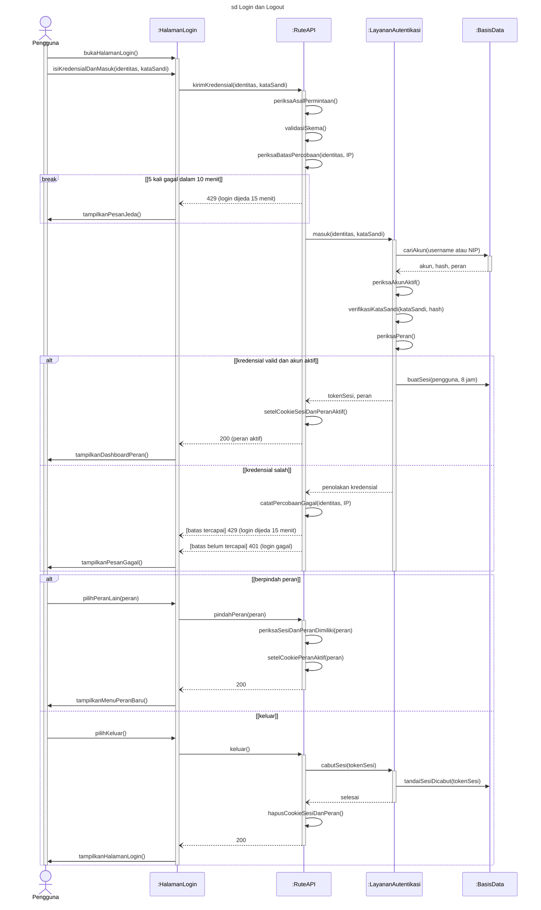

**Narasi.** Bila login gagal, pengguna mengulang dari pesan 2 (activity A4 → M1). **Alur alternatif akun nonaktif:** akun yang dinonaktifkan Admin (atau yang perannya tidak valid) ditolak dengan 403 dan pesan tersendiri ("Akun Anda tidak aktif. Hubungi Administrator."), sebelum kata sandi diperiksa, dan tidak menambah hitungan percobaan gagal. Berpindah peran hanya untuk pengguna dengan lebih dari satu peran operasional; Admin ditolak (403). Batas percobaan disimpan di memori proses (keterbatasan K-3). Sesi selalu 8 jam (opsi "ingat saya" sudah dihapus).

**Terverifikasi (30 Sept):** urutan skema → batas → akun → status akun → kata sandi → peran; same-origin ada; `last_login_at` tidak ditulis (pesan 14 dihapus); role-switch menolak dengan 403; logout lewat modul sesi.

---

## UC-02 Mengelola Profil dan Kata Sandi — `sd Mengelola Profil dan Kata Sandi` (Gambar 4.13)

**Konteks.** Skenario utama: mengganti kata sandi; setelah berhasil semua sesi dicabut. Cabang kedua: mengunggah foto profil. Menghapus foto disebut di narasi.

**Lifeline:** Pengguna · `:HalamanProfil` · `:RuteAPI` · `:LayananAkun` · `:BasisData` · `:PenyimpananFile`. Endpoint: `GET /api/users/me`, `POST /api/users/me/change-password`, `POST /api/users/me?avatar=1` (unggah foto; `DELETE` untuk menghapus).

| No | Dari → Ke | Pesan | Padanan | Sumber |
|---|---|---|---|---|
| 1 | Pengguna → Halaman | `bukaProfil()` | A1 · 2 | `/profile` |
| 2 | Halaman → Rute | `muatProfil()` | A2 · 3 | `GET /api/users/me` |
| 3 | Rute ↻ | `periksaSesi()` | — | |
| 4 | Rute → BasisData | `bacaProfil(pengguna)` | A2 | ORM langsung, `me.ts:34-43` |
| 5 | Rute ⇢ Halaman | `200 (profil)` | | |
| 6 | Halaman → Pengguna | `tampilkanProfil()` | A2 · 3 | |
| — | `alt [ubah kata sandi]` | | D1 · 4 | |
| 7 | Pengguna → Halaman | `isiKataSandi(lama, baru)` | A3 · 4 | form lama, baru, konfirmasi |
| 7a | Halaman ↻ | `validasiIsian(lama, baru, konfirmasi)` | A3 | wajib, minimal 8 karakter, konfirmasi cocok, `profile.tsx:341-362` |
| 8 | Halaman → Rute | `gantiKataSandi(lama, baru)` | A3 | `POST /api/users/me/change-password` |
| 9 | Rute ↻ | `periksaAsalPermintaan()`, `periksaSesi()`, `validasiSkema()` | — | kata sandi baru minimal 8 karakter, tanpa batas maksimum, `change-password.ts:22-49` |
| 10 | Rute → Layanan | `gantiKataSandi(pengguna, lama, baru)` | D2 · 5 | `local-user-passwords.ts` |
| 11 | Layanan → BasisData | `bacaHashKataSandi(pengguna)` | D2 | |
| 12 | Layanan ↻ | `verifikasiKataSandiLama()` | D2 · 5 | Argon2id |
| — | `break [kata sandi lama salah]` | | | |
| 13 | Layanan ⇢ Rute ⇢ Halaman | `penolakan` → `400 (kata sandi lama salah)` | A4 · 5a | `local-user-passwords.ts:65-68` |
| 14 | Halaman → Pengguna | `tampilkanPesanDitolak()` | A4 | |
| — | akhir `break` | | | |
| 15 | Layanan ↻ | `hashKataSandiBaru()` | A5 · 5 | Argon2id |
| 16 | Layanan → BasisData | `simpanHashKataSandi(pengguna)` | A5 · 5 | |
| 17 | Layanan → BasisData | `cabutSemuaSesi(pengguna)` | A5 · 5 | `revokeAllUserSessions`, `local-user-passwords.ts:92`; sesi saat ini ikut dicabut |
| 17a | Rute ↻ | `hapusCookieSesiDanPeran()` | A5 | `change-password.ts:58-61` |
| 18 | Rute ⇢ Halaman | `200` | | |
| 19 | Halaman → Pengguna | `arahkanKeLogin()` | A6 · 6 | `/login?password_changed=1`, `profile.tsx:373-376` |
| — | `[else] unggah foto profil` | | D1 · 4a | |
| 20 | Pengguna → Halaman | `pilihFotoProfil(berkas)` | A7 · 4a | |
| 20a | Halaman ↻ | `validasiFormatDanUkuran()` | A7 | jpeg/png/webp, ≤ 2 MB, `profile.tsx:216-232` |
| 21 | Halaman → Rute | `unggahFotoProfil(berkas)` | A7 | `POST /api/users/me?avatar=1` multipart, `profile.tsx:251-254` |
| 22 | Rute ↻ | `periksaAsalPermintaan()`, `periksaSesi()` | — | |
| 23 | Rute → PenyimpananFile | `simpanFotoProfil(pengguna, berkas)` | D3 · 4a | modul `profile-avatar.ts` dipanggil langsung oleh rute (keputusan 3), `me.ts:130-143`; `profile-avatar.ts:138-192` |
| 24 | PenyimpananFile ↻ | `periksaBerkasFoto()` | D3 · 4a | MIME, ekstensi, ≤ 2 MB, panjang isi, *signature*, `profile-avatar.ts:110-160` |
| — | `break [berkas foto tidak valid]` | | | |
| 25 | PenyimpananFile ⇢ Rute ⇢ Halaman | `penolakan` → `400 (berkas tidak valid)` | A8 · 4a1 (usulan) | `me.ts:141-143, 316-337` |
| 25a | Halaman → Pengguna | `tampilkanPesanDitolak()` | A8 | tambahan 30 Sept sore (T6) |
| — | akhir `break` | | | |
| 26 | PenyimpananFile ⇢ Rute | `kunciPenyimpanan` | A9 · 4a | file tersimpan di filesystem lokal |
| 27 | Rute → BasisData | `perbaruiDataFoto(pengguna)` | A9 | kolom `avatar_*`, ORM langsung, `me.ts:145-157` |
| 27a | Rute → PenyimpananFile | `hapusFotoLama()` | A9 | `me.ts:163-165` |
| 28 | Rute ⇢ Halaman | `200` | | |
| 29 | Halaman → Pengguna | `tampilkanFotoBaru()` | A9 | |

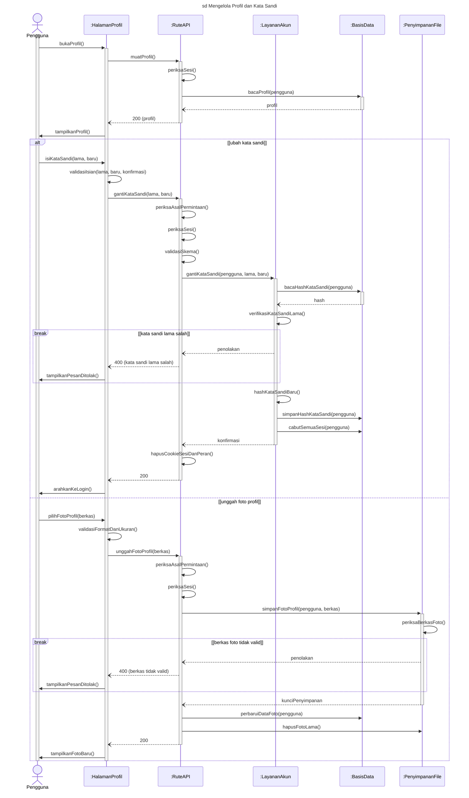

**Narasi.** Menghapus foto profil (activity A10–A11, alur 4b) memakai pola cabang kedua tanpa pemeriksaan berkas. Kata sandi disimpan sebagai *hash* Argon2id; penggantian mencabut semua sesi pengguna.

**Terverifikasi (30 Sept):** profil dibaca ORM langsung; ganti kata sandi lewat `local-user-passwords.ts` (400 bila lama salah; sesi saat ini ikut dicabut); foto: rute → modul `profile-avatar.ts` (filesystem) + ORM, tanpa `:LayananAkun`; unggah `POST /api/users/me?avatar=1`.

---

## UC-03 Mengajukan Dokumen — `sd Mengajukan Dokumen` (Gambar 4.15)

**Konteks.** Gabungan Gambar 4.18 (pengajuan) dan 4.19 (unggah lampiran) lama, dibuat ulang dengan lifeline seragam. Isi dan urutan pesan mengikuti versi terverifikasi 27 Sept. Perubahan lifeline: `:RuteAjukanDokumen` dan `:RuteUnggah` → `:RuteAPI`; `:ModulTransisiStatus` → *self-call* `periksaTransisi()` di `:LayananPengajuan`; `:RepositoryPengajuan` digabung (pesannya langsung `:LayananPengajuan → :BasisData`); `:ModulPenyimpananFile` dan `:PembersihUnggahanTertunda` → `:PenyimpananFile`. Pesan pembuatan objek `buatRepository()` tidak digambar lagi; injeksi *repository* (KNF-12) dinarasikan. Skenario utama: dokumen material; non-material pada `alt`.

**Lifeline:** Pegawai · `:HalamanPengajuan` · `:RuteAPI` · `:LayananPengajuan` · `:BasisData` · `:PenyimpananFile`. Endpoint: `GET /api/users/me/is-ketua-tim/$kegiatanId`, `GET /api/master-kelengkapan`, `POST /api/upload`, `POST /api/dokumen/submit`.

| No | Dari → Ke | Pesan | Padanan | Sumber |
|---|---|---|---|---|
| 1 | Pegawai → Halaman | `bukaAjukanDokumen()` | A1 · 2 | `/pegawai/dokumen/aju` |
| 2 | Pegawai → Halaman | `pilihFungsiDanKegiatan(kegiatanId)` | A2 · 3 | |
| 3 | Halaman → Rute | `ambilStatusKetuaTim(kegiatanId)` | A3 · 4 | `GET /api/users/me/is-ketua-tim/$kegiatanId`, dipanggil saat kegiatan dipilih (`aju.tsx:349-359, 510`) |
| 3a | Rute ↻ | `periksaSesi()` | — | `users/me/is-ketua-tim/$kegiatanId.ts:18-22` |
| 4 | Rute → BasisData | `bacaPenugasanKetuaTim(pengguna, kegiatanId)` | A3 | ORM langsung, `is-ketua-tim/$kegiatanId.ts:37-44` |
| 5 | Halaman → Pegawai | `tampilkanStatusKetuaTimAtauAnggota()` | A3 · 4 | |
| 6 | Pegawai → Halaman | `pilihKarakteristikDanRantai(Material, rantai, tanggal)` | D1, A4 · 5 | rantai = komponen, jenis, kategori, detail |
| 7 | Halaman → Rute | `ambilKelengkapan(kegiatan, statusKetuaTim)` | A5 · 6 | `GET /api/master-kelengkapan?kegiatan_id&is_ketua_tim` (`KelengkapanChecklist.tsx:100-105`); dipanggil ulang setiap pilihan rantai berubah |
| 7-2 | Rute ↻ | `periksaSesi()` | — | `requireAnyLocalSession`, tanpa pemeriksaan peran, `master-kelengkapan.ts:72-73` |
| 7a | Rute → BasisData; BasisData ⇢ Rute ⇢ Halaman | `bacaMasterKelengkapan(kegiatan, statusKetuaTim)` → `daftar kelengkapan seluruh rantai` → `200 (daftar kelengkapan)` | A5 | ORM langsung, `master-kelengkapan.ts:76-112`; rantai tidak disaring di server |
| 8 | Halaman ↻ | `cocokkanKelengkapan()` | A5 · 6 | exact-match 6 kolom di peramban, `KelengkapanChecklist.tsx:107-115`, `kelengkapan-match.ts:31-41` |
| 9 | Halaman → Pegawai | `tampilkanChecklist()` | A5 · 6 | |
| — | `loop [setiap butir kelengkapan atau lampiran]` (dari 4.19) | | M1–D3 · 7 | |
| 10 | Pegawai → Halaman | `pilihFile(file, butirKelengkapan)` | A6 · 7 | `FileUploadButton.tsx:137` |
| 11 | Halaman ↻ | `validasiFileDiKlien()` | D2 | `FileUploadButton.tsx:141` |
| 12 | Halaman → Rute | `unggahLampiran(file, kelengkapanId, namaDokumen)` | A6 | `upload.ts:74-96` |
| 13 | Rute ↻ | `periksaAsalPermintaan()`, `periksaSesi()` | — | `:61-67`; tanpa pemeriksaan peran |
| 14 | Rute → PenyimpananFile | `buatDeskriptorUnggah(nama, MIME, ukuran, pengguna, kelengkapanId)` | D2 · 7 | `local-upload.ts:199-220` |
| 15 | PenyimpananFile ↻ | `validasiMetadataFile()` | D2 · 7 | ekstensi, MIME, pasangan, ≤ 5 MB, `:107-140` |
| 16 | PenyimpananFile ⇢ Rute | `deskriptor (pathPending)` | | |
| — | `break [metadata tidak valid]` → Rute ⇢ Halaman `400 (alasan penolakan)` | | A7 · 7a | `upload.ts:152-176` |
| 17 | Rute → PenyimpananFile | `tulisKeAreaPending(isiFile, pathPending)` | A8 · 7 | `upload.ts:120-127` |
| 18 | PenyimpananFile ↻ | `periksaUkuranDanSignatureIsi()` | D2 · 7 | `:236-258` |
| — | `break [signature tidak cocok]` → Rute ⇢ Halaman `400 (File tidak valid)` | | A7 · 7a | `upload.ts:168-171` |
| 19 | Rute ⇝ PenyimpananFile | `sapuUnggahanKedaluwarsa()` | — | asinkron, `upload.ts:139`, maks. sekali per jam |
| 20 | Rute ⇢ Halaman | `201 (url, nama, kelengkapan_id, uploaded_at)` | A8 | `:141-146` |
| 21 | Halaman → Pegawai | `tandaiButirTerunggah()` | A8, D3 | |
| — | akhir `loop` | | | |
| 22 | Pegawai → Halaman | `isiNominalDanKeterangan(nominal, keterangan)` | D4, A9 · 8 | |
| 23 | Pegawai → Halaman | `tekanAjukan()` | A10 · 9 | tombol nonaktif bila kelengkapan wajib kurang, `aju.tsx:1075` |
| 24 | Halaman → Pegawai | `tampilkanKonfirmasi()` | A10 | `aju.tsx:1175-1191` |
| 25 | Pegawai → Halaman | `konfirmasiAjukan()` | A10 | |
| 26 | Halaman ↻ | `validasiIsianFormulir()` | — | `aju.tsx:577` |
| 27 | Halaman → Rute | `ajukanDokumen(dataDokumen, lampiranPending)` | D5 · 10 | `aju.tsx:602` |
| 28 | Rute ↻ | `periksaAsalPermintaan()`, `validasiSkema()`, `validasiNominalDanRantai()`, `periksaSesiDanPeran(PEGAWAI)` | D5 · 10 | `submit.ts:325-353`, `:42-51`; skema dicek sebelum sesi |
| 29 | Rute → PenyimpananFile | `periksaFilePending(lampiranPending, pengguna)` | D5 | `submit.ts:53-70`; gagal → 400 (narasi) |
| 30 | Rute → Layanan | `siapkanPengajuan(dataDokumen, aktor, repository)` | D5 · 10 | `local-submit-write-bridge.ts:262-355` |
| 31 | Layanan ↻ | `periksaLampiranTidakKosong()` | D5 | `:518-524` |
| 32 | Layanan → BasisData | `ambilKegiatan(kegiatanId)` | — | `:274` |
| 33 | Layanan → BasisData | `periksaPenugasanKetuaTim(pengguna, kegiatanId)` | D5 · 10 | `:282-292`; hasilnya menggantikan klaim klien |
| 34 | Layanan → BasisData | `ambilKelengkapanWajib(6 kolom pilihan)` | D5 · 10 | `:540-575` |
| 35 | Layanan ↻ | `pastikanKelengkapanWajibTerunggah()` | D5 · 10 | `:577-586` |
| 36 | Layanan → BasisData | `ambilNamaSimpulDaun(rantai)` | — | `:461-505` |
| — | `alt [material]` | | D6 · 11 | `:439-459` |
| 37 | Layanan ↻ | `periksaTransisi(DRAFT, SUBMIT, PEGAWAI)` → `IN_PPK_VALIDATION` | A13 · 11 | `fsm.ts:20-25` |
| — | `[else] non-material` | | D6 · 5a | |
| 38 | Layanan ↻ | `tetapkanStatusTersimpan(aksi STORE)` | A14 · 5a | `:442-452`; satu-satunya jalur di luar modul transisi |
| — | akhir `alt` | | | |
| 39 | Layanan ⇢ Rute | `rencanaTulis` | | |
| 40 | Rute → Layanan | `jalankanRencanaTulis(rencanaTulis, setelahTulis)` | A12 · 10 | `:366-400` |
| 41 | Layanan → BasisData | `mulaiTransaksi()` | A12 | `:371`; `local-submit-drizzle-adapter.ts:148` |
| 42 | Layanan → BasisData | `simpanDokumen(status DRAFT)`, `ubahStatus(statusTujuan)`, `tulisRiwayat(SUBMIT atau STORE)` | A12 · 10 | `:372`, `:378`, `:384` |
| 43 | Layanan → Rute | `setelahTulis()` | A12 | *callback* milik rute, `local-submit-write-bridge.ts:386`, `submit.ts:94-101` |
| — | `loop [setiap file pending]` | | | `submit.ts:243-283` |
| 44 | Rute → PenyimpananFile | `pindahkanFile(pending ke lokasi tetap)` | A12 · 10 | `submit.ts:257-262` |
| — | akhir `loop`; `break [pemindahan file atau commit gagal]` | | D5 [Tidak] · 10a | |
| 45 | Layanan → BasisData | `rollback()` | A11 · 10a | |
| 46 | Rute → PenyimpananFile | `kembalikanFile()` | A11 · 10a | `submit.ts:113-119`, `:278` |
| 47 | Rute ⇢ Halaman | `500 (pesan kesalahan)` | A11 · 10a | |
| — | akhir `break` | | | |
| 48 | Layanan → BasisData | `commit()` | A12 | |
| 49 | Rute ⇢ Halaman | `201 (dokumen)` | A13/A14 | `submit.ts:124` |
| 50 | Halaman → Pegawai | `tampilkanHasilPengajuan()` | M3 · 11 | `aju.tsx:623-634` |

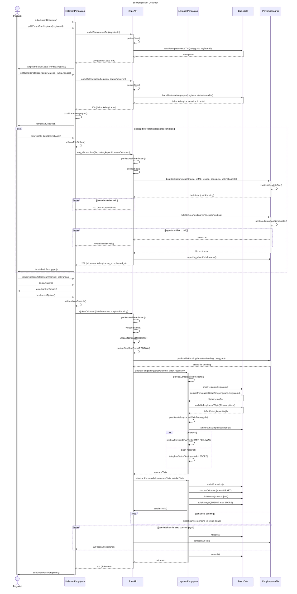

**Narasi.** (1) Server memeriksa ulang semua syarat formulir; (2) rute membuat *repository* lalu menyuntikkannya ke layanan pengajuan (`submit.ts:79-86`), sehingga layanan tidak bergantung langsung pada ORM (KNF-12); di gambar pesan *repository* digabung ke `:LayananPengajuan → :BasisData`; (3) aturan transisi diputuskan modul transisi status, kecuali jalur non-material yang disengaja; (4) dokumen, status, riwayat, dan pemindahan file terjadi dalam satu transaksi sehingga status `DRAFT` tidak pernah tersimpan permanen (KNF-11). Urutan cabang gagal: bila pemindahan file gagal, file dikembalikan lebih dulu; bila *commit* gagal, transaksi batal lebih dulu (gambar memakai urutan kedua). Non-material mengisi nama dokumen (activity B1) dan tidak memakai checklist bila jenis permintaan kosong. Halaman yang ditinggalkan sebelum Ajukan membuang unggahan tertunda (`POST /api/upload?cleanup=pending`, alur 9a). Cabang 400/401/403 lain (skema, sesi, peran, klaim Ketua Tim tanpa penugasan, file pending bukan milik pengguna) hanya di narasi. Penyerahan dokumen fisik kepada PPK berjalan di luar sistem.

**Terverifikasi (30 Sept):** status Ketua Tim lewat `GET /api/users/me/is-ketua-tim/$kegiatanId` (ORM langsung, dipanggil saat kegiatan dipilih); checklist lewat `GET /api/master-kelengkapan` dengan parameter kegiatan dan status Ketua Tim saja, rantai dicocokkan di peramban; nomor baris `submit.ts` bergeser sejak 8bbfdb6 (sudah diperbarui).

---
## UC-04 Mengelola Dokumen yang Diajukan — `sd Mengelola Dokumen yang Diajukan` (Gambar 4.17)

**Konteks.** Skenario utama sesuai R12: Pegawai membuka detail dokumen miliknya lalu membuka lampiran. Bagian lampiran adalah **pintu lampiran dokumen alur kerja dari Gambar 4.22 lama**, dibuat ulang: `:RuteURLLampiran` dan `:RuteAksesFile` → `:RuteAPI`; `:LayananAksesFile` → `:LayananDokumen`; pembacaan file tetap *self-call* layanan (fungsi privat `readLocalLogicalPathFile`, keputusan C2 verifikasi 27 Sept). Pintu lampiran dokumen tambahan KSBU dari 4.22 dipindah ke UC-09, karena Pegawai tidak membuka dokumen tambahan KSBU dari menu ini. Cabang kedua `alt`: revisi dokumen yang ditolak (baru).

**Lifeline:** Pegawai · `:HalamanDokumen` · `:RuteAPI` · `:LayananDokumen` · `:BasisData` · `:PenyimpananFile`. Endpoint: `GET /api/dokumen/$id`, `GET /api/dokumen/$id/preview/$lampiranIndex` (atau `/download/`), `GET /api/files/access?token=…`, `POST /api/upload`, `PATCH /api/dokumen/$id`, `POST /api/dokumen/$id/submit`.

| No | Dari → Ke | Pesan | Padanan | Sumber |
|---|---|---|---|---|
| 1 | Pegawai → Halaman | `bukaDokumenDiajukan()`, `pilihDokumen(idDokumen)` | A1, A3 · 2, 4 | `/pegawai/dokumen` |
| 2 | Halaman → Rute | `muatDetailDokumen(idDokumen)` | A4 · 5 | `GET /api/dokumen/$id` |
| 3 | Rute ↻ | `periksaSesi()` | — | `dokumen.$id.ts:344-350` |
| 4 | Rute → BasisData | `bacaDokumen(idDokumen)` | A4 · 5 | ORM langsung, `dokumen.$id.ts:356-402` |
| 4a | Rute ↻ | `periksaHakBaca(peran, status)` | A4 | `canSessionReadDokumen`, `dokumen.$id.ts:58-117`; 403 di `:410-412` |
| 5 | Rute ⇢ Halaman | `200 (detail, lampiran)` | | respons memuat `berkas_dimusnahkan`, `:414-422` |
| 5a | Halaman → Rute | `muatRiwayat(idDokumen)` | A4 · 5 | `GET /api/dokumen/$id/log`, `ActivityLog.tsx:61`; riwayat dimuat terpisah |
| 5b | Rute ↻ | `periksaSesiDanHakBaca()` | — | `dokumen.$id.log.ts:64-88` |
| 5c | Rute → BasisData; BasisData ⇢ Rute ⇢ Halaman | `bacaRiwayat(idDokumen)` → `riwayat` → `200 (riwayat)` | A4 | `dokumen.$id.log.ts:93-104` |
| 6 | Halaman → Pegawai | `tampilkanDetailDanTimeline()` | A4 · 5 | |
| — | `alt [membuka lampiran]` (dari 4.22, jalur alur kerja) | | D1 · 6 | |
| 7 | Pegawai → Halaman | `tekanPratinjau(indeksLampiran)` | A5 · 6 | |
| 8 | Halaman → Rute | `mintaTautanLampiran(idDokumen, indeksLampiran)` | A6 · 6 | |
| 9 | Rute → Layanan | `buatURLAkses(idDokumen, indeksLampiran, mode pratinjau)` | A6 | `document-file-access.ts:61-135` |
| 10 | Layanan ↻ | `periksaSesi()` | — | `:74-78` |
| 11 | Layanan → BasisData | `muatKonteksDokumen(idDokumen)` | A6 | `:227-264` |
| 12 | Layanan ↻ | `periksaHakBaca(peran, status, penugasan)` | A6 · 6 | `:326-374` |
| — | `break [tidak berhak]` → Rute ⇢ Halaman `403` | | 6 | `:101-103` |
| 13 | Layanan ↻ | `periksaLampiranBelumDibersihkan()` | A6 | `:266-302` |
| — | `break [lampiran dibersihkan atau berkas dimusnahkan]` → Rute ⇢ Halaman `410` | | | `:270-284` |
| 14 | Layanan ↻ | `terbitkanToken(pengguna, sesi, dokumen, indeks, 15 menit)` | A6 · 6 | HMAC; unduh 1 jam |
| 15 | Rute ⇢ Halaman | `200 (signedUrl)` | A6 | |
| 16 | Halaman → Rute | `aksesFile(token)` | A7 | `files/access.ts` |
| 17 | Rute ↻ | `bacaSesi()` | — | `files/access.ts:15` |
| 18 | Rute → Layanan | `verifikasiToken(token, sesi)` | A7 | `internal-file-access.ts:82-140` |
| 19 | Layanan ↻ | `periksaTandaTanganDanKedaluwarsa()`, `periksaSesiCocokDenganToken()` | A7 | 401 / 403 (narasi) |
| 20 | Layanan → BasisData | `muatKonteksDokumen(idDokumen)` | A7 | `:160-169` |
| 21 | Layanan ↻ | `periksaHakBaca(peran, status, penugasan)` | A7 · 6 | pemeriksaan kedua, `:171-173` |
| 22 | Layanan ↻ | `periksaLampiranBelumDibersihkan()` | A7 | `:175` |
| — | `break [sudah dibersihkan atau dimusnahkan]` → Rute ⇢ Halaman `410` | | | |
| 23 | Layanan ↻ | `bacaFile(pathLogis)` | A7 | fungsi privat, `internal-file-access.ts:357` |
| 24 | Rute ⇢ Halaman | `200 (aliran file)` | A7 | header aman, `:388`, `:400` |
| 25 | Halaman → Pegawai | `tampilkanPratinjau()` | A7 · 6 | |
| — | `[else] revisi (Perlu Revisi, harus diperbaiki Pegawai)` | | D1 · A1 | |
| 26 | Pegawai → Halaman | `bukaRevisiDanBacaCatatan()` | R1 · A1 | `/pegawai/dokumen/$id/revisi` |
| 27 | Pegawai → Halaman | `gantiLampiran(file)` | R2 · A1 | unggah ke area tertunda sama dengan UC-03 pesan 10–21 (`AttachmentEditor.tsx:242`) |
| 28 | Pegawai → Halaman | `perbaikiNominal()` | R2 · A1 | dokumen Material: tidak ada kolom keterangan |
| 28a | Pegawai → Halaman | `tekanAjukanUlang()` | R2 · A1 | satu tombol "Ajukan Ulang", `revisi.tsx:671-682` |
| 28b | Halaman → Pegawai | `tampilkanKonfirmasi()` | R2 | "Ajukan ulang dokumen?", `revisi.tsx:715-761` |
| 28c | Pegawai → Halaman | `konfirmasiAjukanUlang()` | R2 | |
| 29 | Halaman → Rute | `simpanPerbaikan(lampiran, nominal)` | R2 | `PATCH /api/dokumen/$id`, body `{lampiranUrls, nominalRealisasi}` (`revisi.tsx:282-285`); skema `.strict()`; `validateNominalUpdate` |
| 30 | Rute → PenyimpananFile | `pindahkanFile(pending ke lokasi tetap)` | R2 | sebelum pembaruan basis data, `dokumen.$id.ts:543-570` |
| 31 | Rute → BasisData | `perbaruiLampiranDanNominal(idDokumen)` | R2 | ORM langsung, `dokumen.$id.ts:577-619` |
| 32 | Rute → PenyimpananFile | `hapusLampiranLamaTakDirujuk()` | — | setelah basis data diperbarui, `dokumen.$id.ts:635` |
| 33 | Halaman → Rute | `ajukanUlang(idDokumen)` | D2 · A1 | `POST /api/dokumen/$id/submit`, dikirim otomatis setelah `200` PATCH (`revisi.tsx:291-294`); bila PATCH gagal, tidak dikirim |
| 34 | Rute ↻ | `periksaAsalPermintaan()`, `periksaSesiDanPemilik()` | — | |
| 34a | Rute → BasisData | `ambilDokumen(idDokumen)` | R4 · A1 | `dokumen.$id.submit.ts:61-84`; pemilik 403, status bukan Perlu Revisi target Pegawai 400 |
| 34b | Rute ↻ | `periksaTransisi(NEED_REVISION, RESUBMIT, PEGAWAI)` | R4 · A1 | `dokumen.$id.submit.ts:112-116`; `fsm.ts:50-55`; dijalankan sebelum pemeriksaan syarat |
| 35 | Rute → Layanan | `periksaSyaratKirimUlang(dokumen)` | D2 · A1 | `validateResubmitRequirements`, `resubmit-validation.ts:41-86`; menerima data dari rute |
| 36 | Layanan → BasisData | `ambilKelengkapanWajib(6 kolom)` | D2 | `resubmit-validation.ts:64-75` |
| — | `break [perbaikan belum lengkap]` → Rute ⇢ Halaman `400 (pesan)` | | R3 · A1 (usulan) | |
| 38 | Rute → BasisData | `mulaiTransaksi()`, `ubahStatusBersyarat(IN_PPK_VALIDATION, jika status = NEED_REVISION dan target = USER)` | R4 · A1 | transaksi dibuka rute, `dokumen.$id.submit.ts:145-160` |
| — | `break [0 baris berubah]` → `rollback()`, Rute ⇢ Halaman `409` | | catatan R4 · A4 | |
| 39 | Rute → BasisData | `tulisRiwayat(RESUBMIT)`, `commit()` | R4 · A1 | |
| 40 | Rute ⇢ Halaman | `200` | R4 | |
| 41 | Halaman → Pegawai | `tampilkanStatusDiajukanKePPK()` | R4 · A1 | |

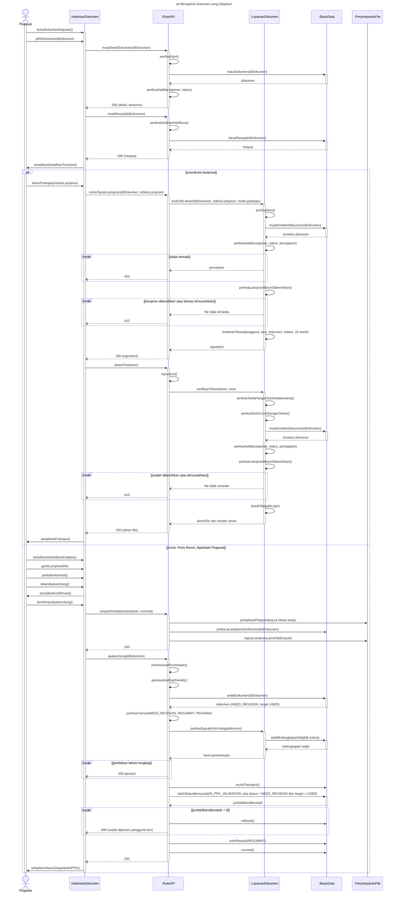

**Narasi.** Pada jalur lampiran, hak baca diperiksa **dua kali** (saat URL diterbitkan dan saat dipakai), dan token hanya berlaku untuk pengguna dan sesi pemintanya (KNF-06). Token tidak sah → 401, milik sesi lain → 403 (narasi). Pada revisi, file lama yang diganti baru dihapus setelah basis data berhasil diperbarui dan hanya bila tidak dirujuk baris lain. Ubah dokumen non-material (activity U1–U2, alur A2) memakai `PATCH /api/dokumen/$id` seperti pesan 29–32; hapus non-material (H1–H2, alur A3) memakai `DELETE /api/dokumen/$id` dan mencatat `DOKUMEN_DIHAPUS_PERMANEN` di tabel audit (`dokumen.$id.ts:804`). Ubah non-material mencatat riwayat `UPDATE` (`dokumen.$id.ts:611-618`); perbaikan Material tidak mencatat riwayat sampai diajukan ulang. Keduanya hanya di narasi.

**Terverifikasi (30 Sept):** riwayat dimuat lewat permintaan terpisah (`/api/dokumen/$id/log`); PATCH memindahkan file, memperbarui basis data, lalu menghapus lampiran lama (ORM langsung); kirim ulang: rute ORM langsung, `transition` sebelum syarat, transaksi dibuka rute; `validateResubmitRequirements` menerima data dari rute dan hanya membaca kelengkapan wajib; ubah non-material mencatat riwayat `UPDATE`.

---

## UC-05 Memvalidasi Dokumen — `sd Memvalidasi Dokumen` (Gambar 4.19)

**Konteks.** Gambar 4.20 lama dibuat ulang. Sesuai keputusan 3, **tanpa `:Layanan`**: rute memanggil ORM langsung (`approve.ts:4-5`), dan modul transisi digambar sebagai *self-call* `:RuteAPI`. Cabang utama mengikuti activity D2: `alt` Setujui / Tolak. Konflik 409 (klaim KNF-07, dari 4.20) tetap digambar sebagai `break`.

**Makna:** validasi = pemeriksaan kelengkapan dokumen secara elektronik yang berjalan paralel dengan alur fisik (4.2.2 butir 7). Tidak mengesahkan dokumen dan tidak menyetujui pembayaran.

**Lifeline:** PPK · `:HalamanValidasi` · `:RuteAPI` · `:BasisData`. Endpoint: `POST /api/ppk/dokumen/$id/approve`, `POST /api/ppk/dokumen/$id/reject`.

| No | Dari → Ke | Pesan | Padanan | Sumber |
|---|---|---|---|---|
| 1 | PPK → Halaman | `bukaValidasiDokumen()`, `pilihDokumen(idDokumen)` | A1, A3 · 2, 4 | `/ppk/inbox`, `/ppk/dokumen/$id` |
| 2 | Halaman → Rute | `muatDetailDokumen(idDokumen)` | A4 · 5 | `GET /api/ppk/dokumen/$id`, `ppk/dokumen/$id/index.tsx:120` |
| 2b | Rute ↻ | `periksaSesiDanPeran(PPK)` | — | sesi 401, PPK 403, UUID 404, `api/ppk/dokumen/$id.ts:35-47` |
| 2a | Rute → BasisData; BasisData ⇢ Rute | `bacaDokumen(idDokumen)` → `dokumen dan lampiran` | A4 | ORM langsung, `:50-86`; status di luar tahap PPK → 400 (`:93-101`) |
| 2c | Rute → BasisData; BasisData ⇢ Rute | `bacaRiwayat(idDokumen)` → `riwayat` | A4 | `:103-115` |
| 3 | Rute ⇢ Halaman | `200 (detail, lampiran, riwayat)` | A4 | lampiran dibuka seperti UC-04 pesan 7–25 |
| 4 | Halaman → PPK | `tampilkanDetail()` | A4, A5 · 5 | |
| — | `alt [dokumen lengkap]` | | D2 · 6 | |
| 5 | PPK → Halaman | `tekanSetujui()` | A6 · 6 | |
| 6 | Halaman → PPK | `tampilkanKonfirmasi()` | A6 | `index.tsx:284-291` |
| 7 | PPK → Halaman | `konfirmasiSetujui()` | A6 | |
| 8 | Halaman → Rute | `setujuiDokumen(idDokumen)` | A7 · 7 | `index.tsx:140` |
| 9 | Rute ↻ | `periksaAsalPermintaan()`, `periksaSesiDanPeran(PPK)`, `validasiSkema()` | — | `approve.ts:27-46` |
| 10 | Rute → BasisData | `ambilDokumen(idDokumen)` | A7 | `:58-71` |
| 11 | Rute ↻ | `pastikanStatusDiajukanKePPK()` | A7 | `:79-83` |
| 12 | Rute ↻ | `periksaTransisi(IN_PPK_VALIDATION, APPROVE, PPK)` → `IN_PPSPM_APPROVAL` | A7 · 7 | `:86`; `fsm.ts:26-31` |
| 13 | Rute → BasisData | `mulaiTransaksi()` | A7 | `:92` |
| 14 | Rute → BasisData | `ubahStatusBersyarat(IN_PPSPM_APPROVAL, jika status = IN_PPK_VALIDATION)` | A7 · 7 | `:93-106` |
| 15 | BasisData ⇢ Rute | `jumlahBarisBerubah` | | |
| — | `break [jumlahBarisBerubah = 0]` → `rollback()`, Rute ⇢ Halaman `409` | | catatan A7 · 7a | `:108-110`, `:121` |
| 16 | Rute → BasisData | `tulisRiwayat(PPK_APPROVE)`, `commit()` | A7 · 7 | `:113-119` |
| 17 | Rute ⇢ Halaman | `200 (Dokumen diteruskan ke PPSPM)` | A7 | `:126-129` |
| 18 | Halaman → PPK | `tampilkanHasilValidasi()` | A7 | `index.tsx:147` |
| — | `[else] tidak lengkap` | | D2 · 6a | |
| 19 | PPK → Halaman | `tekanTolak()`, `tulisCatatan(catatan)` | A8 · 6a | |
| 19a | Halaman ↻ | `validasiCatatan(10-2000 karakter)` | A8 | tombol konfirmasi nonaktif bila < 10 karakter, `ConfirmDialog.tsx:186-191`; `index.tsx:295-310` |
| 20 | Halaman → Rute | `tolakDokumen(idDokumen, catatan)` | A8 | `POST …/reject` |
| 21 | Rute ↻ | `periksaAsalPermintaan()`, `periksaSesiDanPeran(PPK)`, `validasiSkema(catatan 10–2000 karakter)` | D3 · 6a | `rejectDokumenSchema`, `schemas/dokumen.ts:103-105` |
| — | `break [catatan tidak valid]` → Rute ⇢ Halaman `400` | | A9 · 6a | pertahanan server; tidak tercapai dari formulir normal |
| 22 | Rute → BasisData | `ambilDokumen(idDokumen)` | A10 | `reject.ts:59-77` |
| 22a | Rute ↻ | `pastikanStatusDiajukanKePPK()` | A10 | 400 bila bukan Diajukan ke PPK, `reject.ts:79-84` |
| 23 | Rute ↻ | `periksaTransisi(IN_PPK_VALIDATION, REJECT, PPK)` → `NEED_REVISION`, target USER | A10 · 6a | `fsm.ts:32-37` |
| 24 | Rute → BasisData | `mulaiTransaksi()`, `ubahStatusBersyarat(NEED_REVISION, target USER, catatan)` | A10 | penjaga konflik sepola (narasi) |
| 25 | Rute → BasisData | `tulisRiwayat(PPK_REJECT, catatan)`, `commit()` | A10 · 6a | |
| 26 | Rute ⇢ Halaman | `200` | A10 | |
| 27 | Halaman → PPK | `tampilkanHasilPenolakan()` | A10 | |

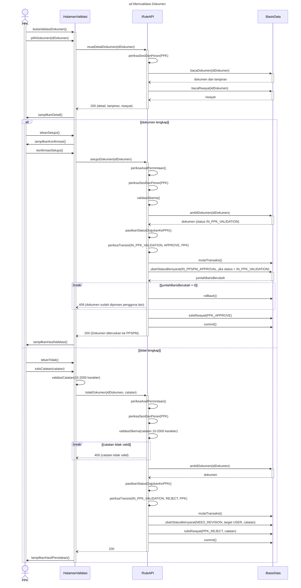

**Narasi.** Penjaga konflik (`UPDATE … WHERE status = asal`) berlaku sama pada penolakan (KNF-07); riwayat ditulis dalam transaksi yang sama (KNF-08). Menu Revisi Dokumen (activity B1–B8, alur A2): kirim ulang oleh PPK (`POST /api/ppk/resubmit/$id`, transisi `RESUBMIT_PPK` langsung ke Menunggu PPSPM setelah `validateResubmitRequirements`) dan kembalikan ke Pegawai (`POST /api/ppk/kembalikan/$id`, transisi `KEMBALIKAN`, catatan otomatis berisi alasan penolakan PPSPM) memakai pola cabang pertama. Menu Dokumen Tervalidasi/Tidak Valid (C1–C2) hanya membaca daftar. Ketiganya di narasi.

**Terverifikasi (30 Sept):** endpoint detail `GET /api/ppk/dokumen/$id` (ORM langsung; memuat riwayat); catatan < 10 karakter dicegah juga di formulir; reject sepola approve (termasuk cek status dan penjaga konflik).

---

## UC-06 Menyetujui Dokumen — `sd Menyetujui Dokumen` (Gambar 4.21)

**Konteks.** Baru, sepola UC-05 (penjelasan proyek B.5: "Persetujuan PPSPM juga sepola", transisi #4 dan #5). Tanpa `:Layanan`: rute PPSPM memanggil ORM langsung (terverifikasi `approve.ts:85`, `reject.ts:89`).

**Makna:** persetujuan = pemeriksaan kelengkapan secara elektronik; tidak mengesahkan dokumen dan tidak menyetujui pembayaran.

**Lifeline:** PPSPM · `:HalamanPersetujuan` · `:RuteAPI` · `:BasisData`. Endpoint: `POST /api/ppspm/dokumen/$id/approve`, `POST /api/ppspm/dokumen/$id/reject`.

| No | Dari → Ke | Pesan | Padanan | Sumber |
|---|---|---|---|---|
| 1 | PPSPM → Halaman | `bukaPersetujuanDokumen()`, `pilihDokumen(idDokumen)` | A1, A3 · 2, 4 | `/ppspm/inbox` |
| 2 | Halaman → Rute | `muatDetailDokumen(idDokumen)` | A4 · 5 | `GET /api/ppspm/dokumen/$id`, `ppspm/dokumen/$id.tsx:92` |
| 2b | Rute ↻ | `periksaSesiDanPeran(PPSPM)` | — | sesi 401, PPSPM 403, UUID 404, `api/ppspm/dokumen/$id.ts:41-45` |
| 2a | Rute → BasisData; BasisData ⇢ Rute | `bacaDokumen(idDokumen)` → `dokumen dan lampiran` | A4 | ORM langsung, `:48-87`; tahap di luar PPSPM → 400 (`:89-91`) |
| 2c | Rute → BasisData; BasisData ⇢ Rute ⇢ Halaman | `bacaRiwayat(idDokumen)` → `riwayat dan tanggal validasi PPK` → `200 (detail, lampiran, riwayat)` | A4 | `:93-117` |
| 3 | Halaman → PPSPM | `tampilkanDetail()` | A4, A5 · 5 | |
| — | `alt [dokumen lengkap]` | | D2 · 6 | |
| 4 | PPSPM → Halaman | `tekanSetujui()`; Halaman → PPSPM `tampilkanKonfirmasi()`; `konfirmasiSetujui()` | A6 · 6 | `ConfirmDialog` "Setujui dokumen ini?", `ppspm/dokumen/$id.tsx:263-272` |
| 5 | Halaman → Rute | `setujuiDokumen(idDokumen)` | A7 · 7 | `POST /api/ppspm/dokumen/$id/approve` |
| 6 | Rute ↻ | `periksaAsalPermintaan()`, `periksaSesiDanPeran(PPSPM)`, `validasiSkema()` | — | `approve.ts:27-42` |
| 7 | Rute → BasisData | `ambilDokumen(idDokumen)` | A7 | |
| 8 | Rute ↻ | `pastikanStatusMenungguPPSPM()` | A7 | 400 bila bukan Menunggu PPSPM, `approve.ts:62`; juga cek riwayat persetujuan ganda (narasi) |
| 9 | Rute ↻ | `periksaTransisi(IN_PPSPM_APPROVAL, APPROVE, PPSPM)` → `COMPLETED` | A7 · 7 | `fsm.ts:38-43` |
| 10 | Rute → BasisData | `mulaiTransaksi()`, `ubahStatusBersyarat(COMPLETED, jika status = IN_PPSPM_APPROVAL)` | A7 | penjaga konflik (`fc59b44`) |
| — | `break [jumlahBarisBerubah = 0]` → `rollback()`, `409` | | catatan A7 · 7a | |
| 11 | Rute → BasisData | `tulisRiwayat(PPSPM_APPROVE)`, `commit()` | A7 · 7 | |
| 12 | Rute ⇢ Halaman; Halaman → PPSPM | `200` → `tampilkanHasilPersetujuan()` | A7 · 7 | dokumen masuk kotak masuk KSBU |
| — | `[else] tidak lengkap` | | D2 · 6a | |
| 13 | PPSPM → Halaman | `tekanTolak()`, `tulisCatatan(catatan)` | A8 · 6a | |
| 13a | Halaman ↻ | `validasiCatatan(10-2000 karakter)` | A8 | `ppspm/dokumen/$id.tsx:141, 274-286` |
| 14 | Halaman → Rute | `tolakDokumen(idDokumen, catatan)` | A8 | `POST …/reject` |
| 15 | Rute ↻ | `periksaAsalPermintaan()`, `periksaSesiDanPeran(PPSPM)`, `validasiSkema(catatan 10–2000 karakter)` | D3 · 6a | `rejectDokumenSchema` |
| — | `break [catatan tidak valid]` → `400` | | A9 · 6a | |
| 16 | Rute → BasisData | `ambilDokumen(idDokumen)` | A10 | `reject.ts:46-60` |
| 16a | Rute ↻ | `pastikanStatusMenungguPPSPM()` | A10 | 400, `reject.ts:65-83` |
| 17 | Rute ↻ | `periksaTransisi(IN_PPSPM_APPROVAL, REJECT, PPSPM)` → `NEED_REVISION`, target PPK | A10 · 6a | `fsm.ts:44-49` |
| 18 | Rute → BasisData | `mulaiTransaksi()`, `ubahStatusBersyarat(NEED_REVISION, target PPK, catatan)`, `tulisRiwayat(PPSPM_REJECT, catatan)`, `commit()` | A10 · 6a | |
| 19 | Rute ⇢ Halaman; Halaman → PPSPM | `200` → `tampilkanHasilPenolakan()` | A10 | |

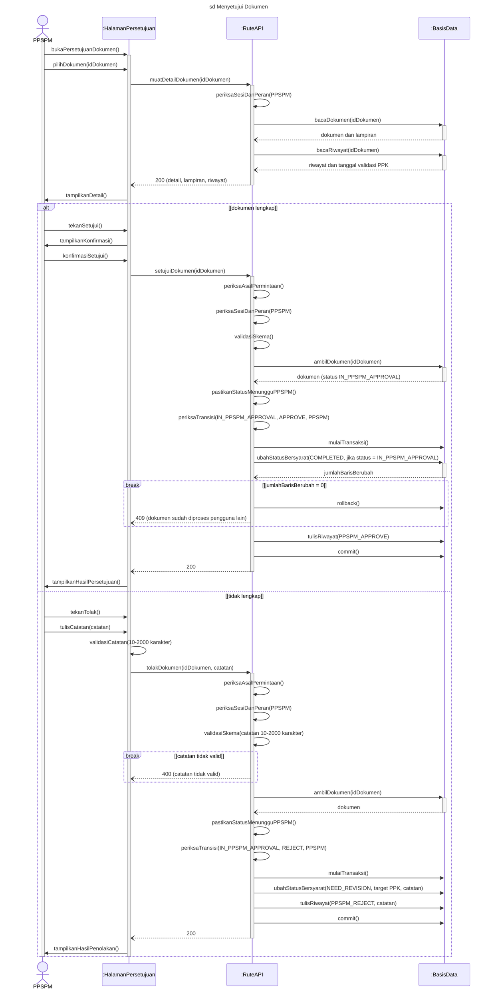

**Narasi.** Dokumen yang disetujui berstatus Selesai dan masuk kotak masuk Pengklasifikasian Dokumen KSBU (UC-07); statusnya tidak berubah lagi saat diberkaskan. Dokumen yang ditolak kembali ke PPK (target PPK), yang menindaklanjutinya di UC-05. Menu Dokumen Ditolak/Selesai (C1–C2) di narasi. Rute persetujuan juga menolak (400) bila riwayat `PPSPM_APPROVE` sudah ada (`approve.ts:64-79`); tidak digambar karena tidak punya *decision* di activity.

**Terverifikasi (30 Sept):** rute PPSPM memanggil ORM langsung; urutan asal → sesi/PPSPM → skema → UUID; ada dialog konfirmasi; endpoint detail `GET /api/ppspm/dokumen/$id`.

---
## UC-07 Memberkaskan Dokumen — `sd Memberkaskan Dokumen` (Gambar 4.23)

**Konteks.** Gambar 4.21 lama dibuat ulang. Perubahan lifeline: `:RuteKlasifikasiDokumen` → `:RuteAPI`; `:RepositoryBerkas` digabung (pesannya `:LayananBerkas → :BasisData`; pembuatan *repository* oleh rute di dalam transaksi dinarasikan). `alt` bersarang "tersisip/kalah balapan" diganti *guard* Dennis pada pesan tunggal, karena dua operand-nya hanya berbeda satu pesan. Ditambah langkah awal memilih Tahun Anggaran dan Cara Pembayaran (activity A4, catatan "cara pembayaran yang tertutup tidak muncul"). Skenario utama: dokumen Selesai; penambahan dokumen KSBU di narasi.

**Lifeline:** KSBU · `:HalamanPengklasifikasian` · `:RuteAPI` · `:LayananBerkas` · `:BasisData`. Endpoint: `GET /api/kasubag/klasifikasi`, `POST /api/kasubag/dokumen/$id/archive`.

| No | Dari → Ke | Pesan | Padanan | Sumber |
|---|---|---|---|---|
| 1 | KSBU → Halaman | `bukaPengklasifikasian()`, `pilihDokumen(idDokumen)` | A1–A3 · 2–4 | `/kasubag/inbox`, `/kasubag/dokumen/$id` |
| 2 | KSBU → Halaman | `pilihTahunAnggaran(tahun)` | A4 · 4 | TA diisi awal dengan tahun dokumen (`kasubag/dokumen/$id/index.tsx:300`); KSBU memilih tahun anggaran sendiri (`:656-673`); yang dikirim hanya `tahun_anggaran`. Tidak ada peringatan bila TA ≠ tahun dokumen (keterbatasan K-UC07-TA) |
| 3 | Halaman → Rute | `muatCaraPembayaran(tahun)` | A4 | `klasifikasi/index.ts:130-137,165-172` |
| 4 | Rute ↻ | `periksaSesiDanPeran(KSBU)` | — | `requireKepalaSubBagianUmum` |
| 5 | Rute → BasisData | `bacaKlasifikasiAktif()` | A4 | ORM langsung, `klasifikasi/index.ts:148-163` |
| 5a | Rute → BasisData | `bacaBerkas(tahun)` | A4 | `berkas_arsip` pada TA itu, `klasifikasi/index.ts:176-182` |
| 6 | Rute → Layanan | `saringCaraPembayaranLayak(klasifikasi, berkas, tahun)` | A4 | fungsi murni tanpa basis data, `berkas-klasifikasi-eligibility.ts:90-127`; `klasifikasi/index.ts:184-186`; Cara Pembayaran yang berkasnya tertutup pada TA itu tidak dapat dipilih |
| 7 | Rute ⇢ Halaman | `200 (pohon Cara Pembayaran yang layak)` | A4 | |
| 8 | KSBU → Halaman | `pilihCaraPembayaran(klasifikasiId)` | A4 · 4 | |
| 9 | Halaman → KSBU; KSBU → Halaman | `tampilkanKonfirmasi()`; `konfirmasiKlasifikasi()` | A4 | `index.tsx:844-857` |
| 10 | Halaman → Rute | `klasifikasikanDokumen(idDokumen, klasifikasiId, tahunAnggaran)` | M1 · 5 | `index.tsx:407-414` |
| 11 | Rute ↻ | `periksaAsalPermintaan()`, `periksaSesiDanPeran(KSBU)`, `validasiSkema(klasifikasiId, tahunAnggaran)` | — | `archive.ts:52-77` |
| 12 | Rute → BasisData | `ambilDokumen(idDokumen)` | — | `:88-95`; bukan Selesai → 400 (narasi) |
| 13 | Rute → BasisData | `mulaiTransaksi()` | — | `:106` |
| 14 | Rute → Layanan | `dapatkanAtauBuatBerkasTerbuka(klasifikasiId, tahunAnggaran)` | D3 · 5 | `berkas-arsip-service.ts:249-272`; *repository* dibuat rute, `archive.ts:107` |
| 15 | Layanan → BasisData | `ambilKlasifikasi(klasifikasiId)` | — | `archive.ts:145-169` |
| 16 | Layanan ↻ | `pastikanSimpulDaunAktif()` | — | `:812-825` |
| 17 | Layanan → BasisData | `cariBerkas(klasifikasiId, tahunAnggaran)` | D3 · 5 | `:851-876` |
| — | `break [hanya ada berkas tertutup]` | | D4 · 5a | |
| 18 | Layanan ⇢ Rute | `penolakan: berkas TA ini sudah ditutup` | A6 · 5a | `berkas-arsip-service.ts:868-873` |
| 19 | Rute → BasisData; Rute ⇢ Halaman | `rollback()`; `409 (Berkas untuk Cara Pembayaran ini TA {tahun} sudah ditutup)` | A6 · 5a | `berkas-arsip-api.ts:93,103` |
| 19a | Halaman → KSBU | `tampilkanPesanDitolak()` | A6 · 5a | tambahan 30 Sept sore (T6) |
| — | akhir `break`; `alt [ada berkas terbuka]` | | D4 [Ya] | |
| 20 | Layanan ↻ | `pakaiBerkasTerbuka()` | M3 · 5 | `:256` |
| — | `[else] belum ada berkas` | | D3 [Tidak] | |
| 21 | Layanan → BasisData | `sisipkanBerkasTerbuka(klasifikasiId, tahunAnggaran)` | A5 · 5 | `ON CONFLICT DO NOTHING`, `archive.ts:195-211` |
| 22 | Layanan → BasisData | `[baris tersisip] catatRiwayatBerkas(BERKAS_DIBUKA)` | A5 | `:886-889` |
| 23 | Layanan → BasisData | `[kalah balapan] bacaUlangBerkas(klasifikasiId, tahunAnggaran)` | A5 | `:268-269`; tanpa riwayat |
| — | akhir `alt` | | | |
| 24 | Layanan ⇢ Rute | `berkas` | | |
| 25 | Rute → Layanan | `tambahkanDokumenKeBerkas(idBerkas, idDokumen)` | A7 · 6 | `:293-322` |
| 26 | Layanan → BasisData | `ambilBerkas(idBerkas)` | A7 | `:274-291` |
| 27 | Layanan ↻ | `pastikanBerkasTerbuka()` | A7 | bukan OPEN → 409 (narasi) |
| 28 | Layanan → BasisData | `ambilSumberDokumen(idDokumen)` | A7 | `:299` |
| 29 | Layanan → BasisData | `sisipkanItemBerkas(WORKFLOW, idDokumen)` | A7 · 6 | UNIQUE `dokumen_id` → 409 (narasi) |
| 30 | Layanan → BasisData | `catatRiwayatBerkas(DOKUMEN_PERSETUJUAN_DIKLASIFIKASIKAN)` | A7 · 6 | `:313-319` |
| 31 | Rute → BasisData | `commit()` | A7 | `archive.ts:119` |
| 32 | Rute ⇢ Halaman | `200 (Dokumen berhasil diklasifikasikan)` | A7 | `:132` |
| 33 | Halaman → KSBU | `tampilkanDaftarBerkas()` | F2 | `index.tsx:417`; status dokumen tetap Selesai |

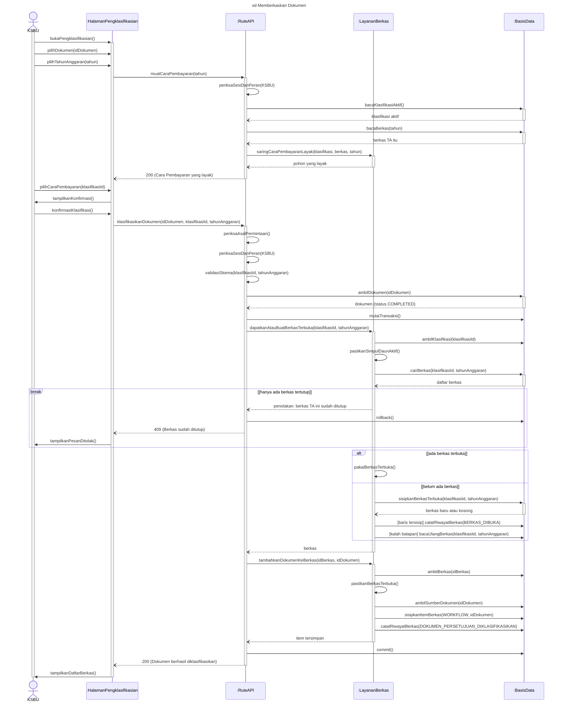

**Narasi.** (1) TA dipilih KSBU (diisi awal dengan tahun dokumen; KSBU bebas memilih tahun lain), sedangkan tahun dokumen berasal dari tanggal dokumen yang diisi Pegawai; keduanya independen (Q5). Sistem tidak memberi peringatan bila keduanya berbeda (keterbatasan K-UC07-TA). (2) Pasangan (Cara Pembayaran, TA) yang sudah ditutup terkunci secara sengaja: satu Cara Pembayaran = satu SPM per TA (Q2). (3) Keunikan pasangan dijaga *unique index* `berkas_arsip_klasifikasi_tahun_unique`, sehingga dua permintaan bersamaan tetap menghasilkan satu berkas, dan hanya pemenang yang mencatat `BERKAS_DIBUKA` (KNF-11). (4) Rute membuat *repository* berkas di dalam transaksi lalu menyuntikkannya ke layanan (KNF-12). **Penambahan Dokumen** (activity B1–B5, alur A1): KSBU mengisi metadata dan mengunggah 1–5 lampiran lewat area tertunda (pola UC-03 pesan 10–21), lalu `POST /api/kasubag/manual-arsip` memakai *get-or-create* yang sama (pesan 14–24) dan menyisipkan item `MANUAL`, tanpa PPK dan PPSPM; lampiran kosong ditolak "Minimal 1 lampiran wajib diunggah".

**Terverifikasi (30 Sept):** penyaringan kelayakan dijalankan di rute dengan dua kueri ORM lalu fungsi murni (bukan layanan); Cara Pembayaran dimuat setelah TA terisi (diisi awal dari tahun dokumen) dan dimuat ulang setiap TA berubah.

---

## UC-08 Mengelola Berkas — `sd Mengelola Berkas` (Gambar 4.25) — DISETUJUI

**Konteks.** Skenario utama: KSBU membuka detail berkas lalu (a) menutup berkas terbuka dengan Nomor SPM dan masa simpan minimal, atau (b) membersihkan file berkas berstatus Usul Pembersihan. Pembersihan = pengelolaan daur hidup dokumen elektronik, bukan penyusutan arsip; metadata, Nomor SPM, dan riwayat tetap tersimpan.

**Lifeline:** KSBU · `:HalamanBerkas` · `:RuteAPI` · `:LayananBerkas` · `:BasisData` · `:PenyimpananFile`. Endpoint: `GET /api/kasubag/berkas/$id`, `POST /api/kasubag/berkas/$id/close`, `POST /api/kasubag/berkas/$id/lifecycle`.

| No | Dari → Ke | Pesan | Padanan | Sumber |
|---|---|---|---|---|
| 1 | KSBU → Halaman | `bukaDetailBerkas(idBerkas)` | A1–A3 · 2–4 | |
| 2 | Halaman → Rute | `muatDetailBerkas(idBerkas)` | A4 | |
| 3 | Rute ↻ | `periksaSesiDanPeran(KSBU)` | — | `requireBerkasArsipApiSession` |
| 4 | Rute → Layanan → BasisData | `ambilDetailBerkas(idBerkas)` → `bacaBerkasIsiDanRiwayat(idBerkas)` | A4 | `berkas-arsip-read-model.ts` |
| 5 | Rute ⇢ Halaman | `200 (detail berkas)` | A4 | |
| 6 | Halaman → KSBU | `tampilkanDetailBerkas()` | A4 | |
| — | `alt [tutup berkas: berkas Terbuka]` | | D1 · 4 | |
| 7 | KSBU → Halaman | `pilihTutupBerkas()` | T1 | |
| 8 | Halaman → KSBU | `tampilkanDialogTutup()` | — | `CloseBerkasDialog` (tanpa ketik frasa) |
| 9 | KSBU → Halaman | `isiDanKonfirmasi(nomorSPM, masaSimpan)` | T3 · 5 | 1/3/5/10 tahun/permanen |
| 10 | Halaman ↻ | `validasiIsian()` | D3 | |
| 11 | Halaman → Rute | `tutupBerkas(idBerkas, nomorSPM, masaSimpan)` | — | |
| 12 | Rute ↻ | `periksaAsalPermintaan()`, `periksaSesiDanPeran(KSBU)`, `periksaIsian()` | D3 | skema `.strict()`, `schemas/berkas-arsip.ts:46-58` |
| 13 | Rute → Layanan | `tutupBerkas(idBerkas, nomorSPM, masaSimpan)` | — | |
| 14 | Layanan → BasisData | `mulaiTransaksi()` | — | |
| 15 | Layanan → BasisData | `bacaBerkasDanJumlahItem(idBerkas)` | D2 | |
| 16 | Layanan ↻ | `pastikanTerbukaDanBerisi()` | D2 · 4a | |
| — | `break [berkas kosong atau sudah ditutup]` → `rollback()`, `4xx` | | T2 · 4a | |
| 17 | Layanan → BasisData | `perbaruiStatusBerkas(CLOSED, AKTIF, nomorSPM, masaSimpan)` | T5 · 6 | B.3; `berkas_arsip_closed_metadata_check` |
| 18 | Layanan → BasisData | `catatRiwayatBerkas(BERKAS_DITUTUP)`, `commit()` | T5 · 6 | |
| 19 | Rute ⇢ Halaman; Halaman → KSBU | `200` → `tampilkanHasilTutup()` | T5 | |
| — | `[else] bersihkan file: berkas Usul Pembersihan` | | D1 · A4 | |
| 20 | KSBU → Halaman | `pilihBersihkanFile()`; Halaman → KSBU `tampilkanDialogKonfirmasi()`; `ketikKonfirmasi("BERSIHKAN FILE BERKAS")` | P1 · A4 | |
| 21 | Halaman → Rute | `bersihkanFileBerkas(idBerkas, frasa)` | — | `POST …/lifecycle` (aksi `approve_destruction`) |
| 22 | Rute ↻ | `periksaAsalPermintaan()`, `periksaSesiDanPeran(KSBU)`, `periksaFrasa()` | D4 | `z.literal`, `lifecycle.ts:28` |
| — | `break [frasa tidak sesuai]` → `400` | | P2 · A4a | |
| 23 | Rute → Layanan | `bersihkanFileBerkas(idBerkas)` | — | `berkas-arsip-physical-destruction.ts` |
| 24 | Layanan → BasisData | `bacaBerkasDanItem(idBerkas)` | — | |
| 25 | Layanan ↻ | `pastikanStatusUsulPembersihan()`, `susunDaftarFile()` | — | daftar file dari isi berkas, bukan masukan klien |
| 26 | Layanan → BasisData | `mulaiTransaksi()`, `perbaruiStatusBerkas(DIMUSNAHKAN)`, `tandaiLampiranDibersihkan(BERKAS_DIMUSNAHKAN)`, `catatRiwayatBerkas(BERKAS_DIMUSNAHKAN)`, `catatAudit(BERKAS_LAMPIRAN_DIBERSIHKAN)`, `commit()` | P3 · A4 | `:713` (audit) |
| 27 | Layanan → PenyimpananFile | `hapusFileAman(daftarPath)` + `loop [setiap path]` `hapusFile(pathLogis)` | P3 · A4 | |
| 28 | Rute ⇢ Halaman; Halaman → KSBU | `200` → `tampilkanHasilPembersihan()` | P3 | |

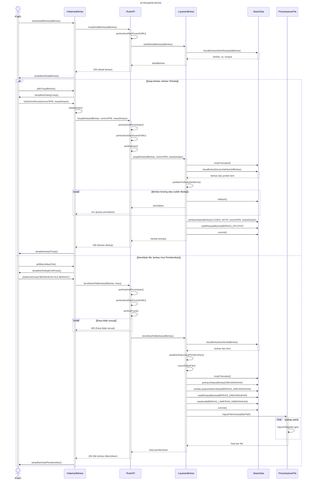

**Narasi.** Setelah ditutup, Cara Pembayaran yang sama tidak dapat dipakai lagi pada TA yang sama. Akses file berkas sesudah dibersihkan dijawab 410. Tidak digambar: ekspor ZIP berkas atau CSV metadata (A1; `GET /api/kasubag/berkas/$id/export-zip`, diunduh lewat navigasi biasa, ≤ 500 dokumen, diawali `DAFTAR_ISI.txt`); usulkan pembersihan dan batalkan usulan (A2, A3; `lifecycle` aksi `propose_destruction`/`cancel_proposal`, pola cabang kedua tanpa frasa dan tanpa `:PenyimpananFile`); ubah metadata berkas; 401/403.

**Catatan urutan.** Pesan 26–27 mengikuti narasi Gambar 4.23 yang terverifikasi ("pembersihan file berkas: status diubah dulu, baru file dihapus"), **bukan** urutan Kerangka R12 Blok 2 (`hapusBerkasFisik()` sebelum `perbaruiStatusBerkas()`). Kerangka R12 perlu disesuaikan.

---

## UC-09 Melihat Laporan Dokumen — `sd Melihat Laporan Dokumen` (Gambar 4.27)

**Konteks.** Satu frame untuk tiga menu: Laporan Saya (Pegawai), Laporan Kegiatan (Ketua Tim), Laporan Kinerja (PJ Kinerja). Aktor digambar sebagai **Pengguna** (aktor abstrak di use case diagram) dengan *guard* peran pada operand. Dokumen yang tampil adalah **bahan (bukti dukung)** penyusunan laporan kinerja individu, tim, dan satker; laporan kinerja itu disusun di luar aplikasi. Periode wajib dipilih; filter Status Material/Non-Material opsional.

Dua `alt` (pengecualian pola, 0.2): (1) menu laporan (activity D1); (2) **pintu lampiran**, memuat pintu lampiran dokumen tambahan KSBU dari Gambar 4.22 lama yang dibuat ulang di sini (`:RuteLaporanLampiran` → `:RuteAPI`). Pintu lampiran dokumen alur kerja dirujuk ke UC-04 pesan 7–25 (catatan `ref`).

**Lifeline:** Pengguna · `:HalamanLaporan` · `:RuteAPI` · `:LayananLaporan` · `:BasisData`. Endpoint: `GET /api/laporan/saya`, `GET /api/laporan/kegiatan`, `GET /api/laporan/kinerja?scope=laporan_kinerja`, `GET /api/laporan/manual-arsip/$id/attachments/$attachmentId/{preview,download}`, `POST …/export-zip?mode=ticket`, `GET …/export-zip?ticket=…`.

| No | Dari → Ke | Pesan | Padanan | Sumber |
|---|---|---|---|---|
| — | `alt [Laporan Saya: Pegawai]` | | D1 · 2–3 | |
| 1 | Pengguna → Halaman | `bukaLaporanSaya()` | S1 · 2 | `/pegawai/laporan/saya` |
| 2 | Halaman → Rute | `muatLaporanSaya()` | S2 · 3 | `GET /api/laporan/saya` |
| 3 | Rute ↻ | `periksaSesi()` | — | |
| 4 | Rute → BasisData | `ambilDokumenMilikSendiri(pengguna)` | S2 · 3 | ORM langsung; status Selesai dan Tersimpan milik sendiri, `saya.ts:41-85` |
| 5 | Rute ⇢ Halaman | `200 (dokumen)` | S2 | |
| — | `[Laporan Kegiatan: Ketua Tim dengan penugasan]` | | D1 · A1 | |
| 6 | Pengguna → Halaman | `bukaLaporanKegiatan()` | K1 · A1 | |
| 7 | Halaman → Rute | `muatLaporanKegiatan()` | K2 | tanpa parameter `scope`; cakupan bawaan server: Selesai dan Tersimpan (`kegiatan-scope.ts:12-19`); `pegawai/laporan/kegiatan.tsx:213` |
| 8 | Rute ↻ | `periksaSesi()` | — | |
| 9 | Rute → BasisData | `ambilPenugasanKetuaTim(pengguna)` | K2 · A1 | `kegiatan.ts:84-91`; tanpa penugasan → 200 daftar kosong |
| 10 | Rute → BasisData | `ambilDokumenSelesaiDanTersimpan(kegiatanDipimpin)` | K2 · A1 | Selesai berkomponen dan Tersimpan, `kegiatan.ts:96-147` |
| 11 | Rute → Layanan | `tandaiBerkasDimusnahkan()` | K2 · A3 | `loadDestroyedArchiveIds`, `manual-realisasi.ts:28`; `kegiatan.ts:154` |
| 12 | Rute → Layanan | `ambilDokumenTambahanKSBU(kegiatanDipimpin)` | K2 · A1 | `listManualRealisasiRows`, `manual-realisasi.ts:77`; `kegiatan.ts:157-161` |
| 13 | Rute ⇢ Halaman | `200 (dokumen dan dokumen tambahan KSBU)` | K2 | |
| — | `[Laporan Kinerja: PJ Kinerja]` | | D1 · A2 | |
| 14 | Pengguna → Halaman | `bukaLaporanKinerja()` | J1 · A2 | |
| 15 | Halaman → Rute | `muatLaporanKinerja(scope laporan_kinerja, periode)` | J2 · A2 | periode dikirim sebagai `start_date`/`end_date` |
| 16 | Rute ↻ | `periksaSesiDanPeran(PJ Kinerja)` | — | peran lain 403, `kinerja.ts:145-147` |
| 17 | Rute → Layanan | `tandaiBerkasDimusnahkan()` | J2 · A3 | `kinerja.ts:168` |
| 18 | Rute → BasisData | `ambilDokumenSatker(periode)` | J2 · A2 | Material Selesai + Non-Material Tersimpan, `:188-208`; penyaringan tanggal dokumen di server `:240-241` |
| 19 | Rute → Layanan | `ambilDokumenTambahanKSBU(periode)` | J2 | `:264` |
| 20 | Rute ⇢ Halaman | `200 (dokumen satker, maks. 2000 baris)` | J2 | |
| — | akhir `alt` | | M1 | |
| 21 | Pengguna → Halaman | `pilihPeriode(periode)` | S3/K3/J3 · 4 | wajib; bawaan Bulanan (Laporan Saya) / Triwulan |
| 22 | Halaman ↻ | `saringPeriode(tanggal dokumen)` | S3/K3 · 4 | di peramban, `periode.ts:121`; Laporan Kinerja mengulang pesan 15–20 |
| 23 | Pengguna → Halaman | `[perlu menyaring status] pilihStatus(Material atau Non-Material)` | D2, A1 · 4a | opsional, `status-laporan.ts:11` |
| 24 | Halaman ↻ | `hitungTotalNominal()` | K2 | hanya Laporan Kegiatan; dihitung di peramban; berkas dimusnahkan dan Non-Material tidak dihitung (`countedNominalRealisasi`, `kegiatan-scope.ts:63-70`; `kegiatan.tsx:1366`) |
| 25 | Pengguna → Halaman | `pilihDokumen(id)`, `tekanPratinjau(lampiran)` | D3, A2–A4 · 5 | |
| — | `alt [lampiran dokumen alur kerja]` | | A3 · 5 | |
| 26 | Halaman → Rute; Rute ⇢ Halaman | `ref Gambar 4.17: aksesLampiranAlurKerja(idDokumen, indeksLampiran)` → `200 (aliran file)` | A3–A4 | = UC-04 pesan 8–24; digambar sebagai pesan ber-label `ref` (bukan *note*) agar tidak tumpang tindih (L1) |
| — | `[lampiran dokumen tambahan KSBU]` (dari 4.22) | | A3 · 5 | |
| 27 | Halaman → Rute | `mintaLampiranManualArsip(idManualArsip, idLampiran)` | A3 | `GET /api/laporan/manual-arsip/$id/attachments/$attachmentId/preview` |
| 28 | Rute → Layanan | `periksaSesiDanHakLampiran(peran, idManualArsip)` | A3 | `requireLaporanManualArsipSession`, `manual-arsip.ts:223-248`; Ketua Tim hanya kegiatan yang dipimpin (`:250-262`); dijalankan di modul `manual-arsip.ts`, bukan di rute |
| 28a | Layanan → BasisData | `bacaKepemilikanKegiatan(idManualArsip)` | A3 | hanya untuk Ketua Tim, `manual-arsip.ts:250-262` |
| — | `break [tidak berhak atas lampiran]` → `403` | | | bukan peran berhak, atau Ketua Tim bukan pemimpin kegiatan; juga bila id tidak ditemukan, agar tidak bocor (guard dipendekkan, L2) |
| 29 | Rute ↻ | `validasiUUID()` | — | |
| — | `break [UUID tidak valid]` → `404` | | | |
| 30 | Rute → Layanan | `bacaLampiranManualArsip(idManualArsip, idLampiran)` | A3 · A3 (alur) | `createManualArsipAttachmentFileResponse`, `manual-arsip.ts:890-957`; 404 (`:903-905`), 410 bila berkas dimusnahkan (`:907-909`) |
| 30a | Layanan → BasisData | `bacaLampiranDanStatusEfektif()` | A3 | `loadManualArsipAttachmentFileReference`, `manual-arsip.ts:1131-1176` |
| 30b | Layanan ↻ | `bacaBerkas(pathLogis)` | A4 | fungsi privat modul, `readFile`, `manual-arsip.ts:935-940` |
| — | `break [lampiran tidak ada atau dimusnahkan]` → `404/410` | | | |
| 31 | Rute ⇢ Halaman | `200 (isi file)` | A4 | tanpa token HMAC (D-11) |
| — | akhir `alt` | | | |
| 32 | Halaman → Pengguna | `tampilkanPratinjau()` | A4 · 5 | |
| 33 | Pengguna → Halaman | `[Laporan Saya atau Laporan Kegiatan] tekanEksporZIP()` | D4, A5 · 6 | Laporan Kinerja tanpa ekspor |
| 34 | Halaman → Rute | `mintaTiketEkspor(daftarDokumen)` | A5 · 7 | `POST …/export-zip?mode=ticket`; Laporan Kegiatan juga mengirim `manual_arsip_ids` |
| 35 | Rute ↻ | `periksaAsalPermintaan()`, `periksaSesi()`, `validasiDaftar()` | D5 | |
| — | `break [lebih dari 500 dokumen]` → `413` | | A6 · 6a | `EXPORT_MAX_DOCUMENTS` |
| 36 | Rute → Layanan | `buatTiket(pengguna, 2 menit)` | A7 · 7 | `download-ticket.ts:20` (memori proses) |
| 37 | Rute ⇢ Halaman | `200 (download_url)` | A7 | |
| 38 | Halaman → Rute | `unduh(tiket)` | A8 · 8 | navigasi peramban, `file-helpers.ts:33` |
| 39 | Rute ↻ | `periksaSesi()` | — | tanpa sesi → 401 (narasi) |
| 40 | Rute → Layanan | `verifikasiTiket(tiket, pengguna)` | A8 · 8a | |
| — | `break [tiket tidak berlaku]` → `410` | | catatan A8 · 8a | kedaluwarsa, sudah dipakai, atau milik pengguna lain (guard dipendekkan, L2) |
| 41 | Rute → BasisData | `otorisasiUlangDokumen(daftarDokumen)` | A8 | ORM di rute: `saya.export-zip.ts:136-140`; `kegiatan.export-zip.ts:114-176` |
| 42 | Rute → Layanan | `rakitZIP(dokumenBerhak)` | A8 · 8 | `buildLaporanZipEntries`, `streamDocumentZip`, `document-zip.ts:180-275` |
| 42a | Layanan → BasisData | `bacaKonteksLampiran()` | A8 | `laporan-zip-entries.ts:30-55`; `document-file-access.ts:216` |
| 43 | Layanan ↻ | `bacaBerkas(pathLogis)` | A8 | `loop` per file; fungsi privat `document-zip.ts` (`createReadStream`, `:190, 274`); > 250 MB dilewati (`:74, 224-226`); `DAFTAR_ISI.txt` (`:272`) |
| 44 | Rute ⇢ Halaman | `200 (aliran ZIP)` | A8 | |
| 45 | Halaman → Pengguna | `simpanZIP()` | A8 · 8 | unduhan bawaan peramban |

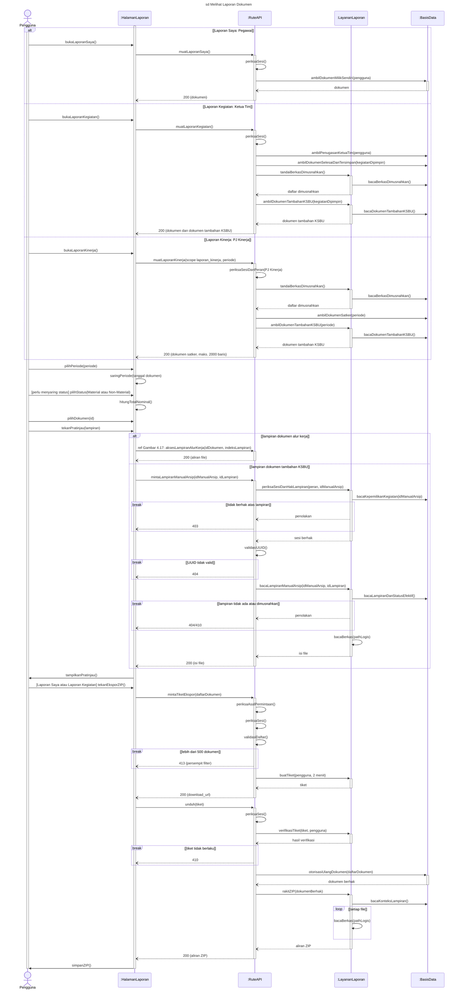

**Narasi.** Laporan Saya dan Laporan Kegiatan memuat dokumen sekali lalu menyaring periode di peramban berdasarkan **tanggal dokumen**; Laporan Kinerja menyaring periode di server dan telusurnya cukup sampai Fungsi → Kegiatan → Dokumen. Dokumen yang berkasnya dimusnahkan tetap tampil dengan penanda, nominalnya tidak dihitung; Laporan Kinerja menandai "File Dibersihkan". Pada Laporan Kegiatan, total untuk satu kegiatan dan satu periode sama dengan Nominal Realisasi (UC-10). Ekspor ZIP Laporan Kegiatan memuat dokumen tambahan KSBU (folder `[Manual] …`). Tiket unduhan disimpan di memori proses (K-10). Nominal di aplikasi bukan realisasi resmi SAKTI.

**Catatan penempatan 4.22.** Pintu lampiran dokumen tambahan KSBU (pesan 27–31) adalah isi Gambar 4.22 lama yang terverifikasi 29 Sept (D-28: Ketua Tim hanya untuk kegiatan yang dipimpin). Ditempatkan di UC-09 karena hanya dibuka dari halaman laporan; hal yang sama berlaku di UC-10 (dirujuk dengan `ref`).

**Terverifikasi (30 Sept):** Laporan Saya lewat ORM langsung; Laporan Kegiatan: `loadDestroyedArchiveIds` sebelum dokumen tambahan; halaman tidak mengirim `scope`; total dihitung di peramban; otorisasi ulang ZIP di rute, pembacaan file privat modul `document-zip.ts` (tanpa `:PenyimpananFile`); lampiran dokumen tambahan KSBU diperiksa di modul `manual-arsip.ts`.

---
## UC-10 Memantau Nominal Realisasi — `sd Memantau Nominal Realisasi` (Gambar 4.29)

**Konteks.** PPK (PPSPM sama persis) melihat total nominal dokumen material Selesai dan dokumen tambahan KSBU per periode, lalu menelusuri per fungsi atau per pegawai sampai dokumen. **Nominal bukan realisasi resmi SAKTI; pembandingan dengan pagu dilakukan di luar sistem.** Sistem tidak menyimpan pagu dan tidak memberi pengingat atau notifikasi. Aktor digambar PPK; PPSPM disebut di narasi.

**Lifeline:** PPK · `:HalamanNominalRealisasi` · `:RuteAPI` · `:LayananLaporan` · `:BasisData`. Endpoint: `GET /api/laporan/kinerja?start_date=…&end_date=…`.

| No | Dari → Ke | Pesan | Padanan | Sumber |
|---|---|---|---|---|
| 1 | PPK → Halaman | `bukaNominalRealisasi()` | A1 · 2 | `/ppk/monitoring-realisasi` |
| — | `loop [setiap kali periode dipilih]` | | A2, D1, A3–A4 · 3, A1 | pertama: triwulan berjalan |
| 2 | Halaman → Rute | `muatRealisasi(periode)` | A2/A4 · 3 | periode di URL, dikirim sebagai `start_date`/`end_date` |
| 3 | Rute ↻ | `periksaSesiDanPeran(PPK atau PPSPM)` | — | `kinerja.ts:122-136`; `scope=laporan_kinerja` hanya PJ Kinerja (403 selain itu, `:141-147`) |
| 4 | Rute → Layanan | `kecualikanBerkasDimusnahkan()` | A2 | `loadDestroyedArchiveIds`, `manual-realisasi.ts:28`; dipanggil `kinerja.ts:168` |
| 5 | Layanan → BasisData | `bacaBerkasDimusnahkan()` | A2 | join `berkas_arsip_item → berkas_arsip` berstatus `DIMUSNAHKAN` |
| 6 | Rute → BasisData | `ambilDokumenSelesai(periode)` | A2 · 3 | material Selesai berkomponen, `kinerja.ts:188-192`; tanggal dokumen `:240-241` |
| 7 | Rute → Layanan | `ambilDokumenTambahanKSBU(periode)` | A2 · A3 | `listManualRealisasiRows`, `kinerja.ts:264` |
| 8 | Layanan → BasisData | `bacaDokumenTambahanKSBU(periode)` | A2 | |
| 9 | Rute ⇢ Halaman | `200 (baris dokumen, maks. 2000)` | A2 | lebih dari 2000 → peringatan (narasi) |
| 10 | Halaman ↻ | `hitungTotalPerFungsi()` | A2/A4 · 3 | di peramban, `monitoring-rows.ts:69-183`; `MonitoringRealisasiView.tsx:240-246` |
| 11 | Halaman → PPK | `tampilkanTotalPerFungsi()` | A2 · 3 | |
| 12 | PPK → Halaman | `[ubah periode] pilihPeriode(periode)` | D1, A3 · A1 | bulanan, triwulan, tahunan, seluruh, kustom |
| — | akhir `loop`; `alt [per fungsi]` | | D2 · 4 | |
| 13 | PPK → Halaman | `telusuriFungsiKegiatanKomponen()` | A5 · 4 | |
| 14 | Halaman ↻ | `kelompokkanFungsiKegiatanKomponen()` | A5 | di peramban, `monitoring-rows.ts:111, 136` |
| — | `[per pegawai]` | | D2 · A2 | |
| 15 | PPK → Halaman | `pilihTampilanPerPegawai()` | A6 · A2 | |
| 16 | Halaman ↻ | `kelompokkanPerPegawai()` | A6 | dapat ditelusuri sampai dokumen, `MonitoringRealisasiView.tsx:254-290, 516-576` |
| — | akhir `alt` | | M2 | |
| 17 | PPK → Halaman | `[membuka dokumen] pilihDokumen(id)` | D3, A7 · 5 | |
| 18 | Halaman → Rute; Rute ⇢ Halaman | `ref Gambar 4.17 dan 4.27: muatDetailDanLampiran(id)` → `200 (detail dan lampiran)` | A8 · 5 | dokumen alur: `GET /api/dokumen/$id` + UC-04 pesan 8–24; dokumen tambahan KSBU: `GET /api/laporan/manual-arsip/$id` + UC-09 pesan 27–31 |
| 19 | Halaman → PPK | `tampilkanDetailDanLampiran()` | A8 · 5 | tanda "Penambahan Dokumen (KSBU)" |

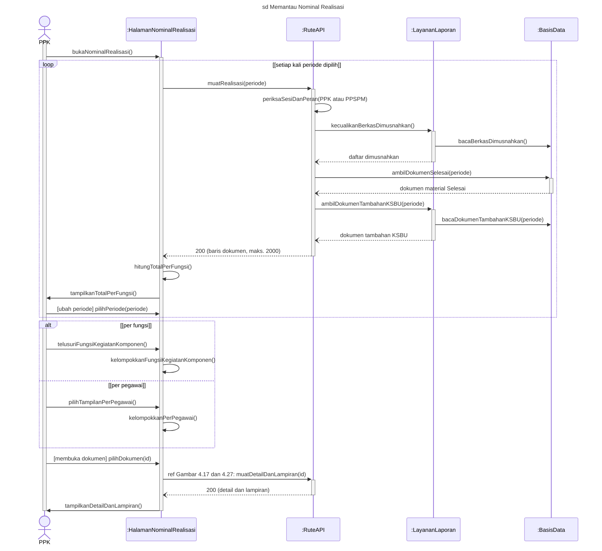

**Narasi.** Dokumen yang berkasnya dimusnahkan tidak ditampilkan dan nominalnya tidak dihitung. Dokumen tambahan KSBU ditandai "Penambahan Dokumen (KSBU)" agar tidak dikira melewati PPK/PPSPM. Lebih dari 2000 baris: halaman menampilkan peringatan agar periode dipersempit. Pemeriksaan kegiatan atau pegawai yang realisasinya belum tercatat dilakukan pengguna sendiri dengan memilih periode kegiatan; sistem tidak mengukur jarak tanggal kegiatan dan pencairan. `scope=laporan_kinerja` ditolak 403 untuk PPK/PPSPM.

**Terverifikasi (30 Sept):** pemeriksaan peran `kinerja.ts:128-136`; total dan pengelompokan di peramban; per pegawai dapat ditelusuri sampai dokumen; batas 2000 baris diterapkan server, peringatan tampil di halaman.

---

## UC-11 Memantau Dokumen Tim — `sd Memantau Dokumen Tim` (Gambar 4.31)

**Konteks.** Ketua Tim melihat posisi dokumen dari kegiatan yang dipimpinnya (di PPK, di PPSPM, revisi pengaju, revisi PPK, selesai), menyaring, membuka detail, dan mengekspor ZIP. Ekspor digambar sebagai bagian skenario; bila tidak mengekspor, interaksi berakhir setelah pesan 12.

**Lifeline:** Ketua Tim · `:HalamanMonitoringTim` · `:RuteAPI` · `:LayananLaporan` · `:BasisData`. Endpoint: `GET /api/users/me/ketua-tim`, `GET /api/laporan/kegiatan?scope=monitoring`, `POST /api/laporan/kegiatan/export-zip?mode=ticket`, `GET …?ticket=…`.

| No | Dari → Ke | Pesan | Padanan | Sumber |
|---|---|---|---|---|
| 1 | Ketua Tim → Halaman | `bukaMonitoringDokumenTim()` | A1 · 2 | `/pegawai/monitoring-dokumen-tim` |
| 1a | Halaman → Rute | `ambilPenugasanSaya()` | A1 · 2 | `GET /api/users/me/ketua-tim`; bukan Ketua Tim → halaman "akses ditolak" dan laporan tidak dimuat (`monitoring-dokumen-tim.tsx:144-152`) |
| 1b | Rute ↻ | `periksaSesi()` | — | `users/me/ketua-tim.ts:20-24` |
| 1c | Rute → BasisData; BasisData ⇢ Rute ⇢ Halaman | `bacaPenugasanKetuaTim(pengguna)` → `penugasan` → `200 (status Ketua Tim)` | A1 | ORM langsung, `ketua-tim.ts:27-48` |
| 2 | Halaman → Rute | `muatDokumenTim(scope monitoring)` | A2 · 3 | `monitoring-dokumen-tim.tsx:157` |
| 3 | Rute ↻ | `periksaSesi()` | — | |
| 4 | Rute → BasisData | `ambilPenugasanKetuaTim(pengguna)` | A2 · 3 | `kegiatan.ts:84-91` |
| 5 | Rute → BasisData | `ambilDokumenTim(kegiatanDipimpin, status monitoring)` | A2 · 3 | Diajukan ke PPK, Menunggu PPSPM, Perlu Revisi, Selesai, Tersimpan (`kegiatan-scope.ts:12-15`) |
| 6 | Rute ⇢ Halaman | `200 (dokumen tim)` | A2 | |
| 7 | Halaman ↻ | `tentukanPosisi()` | A2 · 3 | `getPosisiDokumen` di peramban, `kegiatan-scope.ts:41-55`; `monitoring-dokumen-tim.tsx:648, 700, 727` |
| 8 | Halaman ↻ | `tandaiTertahanMinimal7Hari()` | A2 · A1 | kondisi `days >= 7` dari `updated_at` (`monitoring-dokumen-tim.tsx:121, 661`); K-9 |
| 9 | Halaman → Ketua Tim | `tampilkanRingkasanDanDaftar()` | A2 · 3 | |
| 10 | Ketua Tim → Halaman | `[ubah filter] saringDokumen(kegiatan, posisi, pembuat, lamaTertahan, tanggal)` | D1, A3 · 4 | di peramban |
| 11 | Ketua Tim → Halaman | `[membuka dokumen] pilihDokumen(id)` | D2, A4 · 5 | |
| 12 | Halaman → Rute; Rute ⇢ Halaman | `ref Gambar 4.17: muatDetailDanRiwayat(id)` → `200 (detail dan riwayat)` | A5 · 5 | `GET /api/dokumen/$id` (hak baca Ketua Tim untuk dokumen non-Draf di kegiatannya); lampiran = UC-04 pesan 8–24 |
| 13 | Ketua Tim → Halaman | `tekanEksporZIP()` | D3, A6 · A2 | |
| 14 | Halaman → Rute | `mintaTiketEkspor(dokumen_ids)` | A6 · A2 | tanpa `manual_arsip_ids` (400 bila dikirim) |
| 15 | Rute ↻ | `periksaAsalPermintaan()`, `periksaSesi()`, `validasiDaftar()` | D4 · A2 | |
| — | `break [lebih dari 500 dokumen]` → `413` | | A7 · A2 (usulan) | |
| 16 | Rute → Layanan | `buatTiket(pengguna, 2 menit)` | A8 · A2 | `download-ticket.ts:20` |
| 17 | Rute ⇢ Halaman | `200 (download_url)` | A8 | |
| 18 | Halaman → Rute | `unduh(tiket)` | A9 | |
| 19 | Rute ↻ | `periksaSesi()`; Rute → Layanan `verifikasiTiket(tiket, pengguna)` | A9 | |
| — | `break [tiket tidak berlaku]` → `410` | | | |
| 20 | Rute → BasisData | `otorisasiUlangDokumen(dokumen_ids)` | A9 | ORM di rute, hanya dokumen kegiatan yang dipimpin, `kegiatan.export-zip.ts:114-176` |
| 21 | Rute → Layanan | `rakitZIP(dokumenBerhak)` | A9 | `createKegiatanExportZipResponse`, `document-zip.ts:180-275` |
| 21a | Layanan → BasisData | `bacaKonteksLampiran()` | A9 | `laporan-zip-entries.ts:30-55` |
| 22 | Layanan ↻ | `bacaBerkas(pathLogis)` | A9 | `loop` per file; fungsi privat `document-zip.ts:190, 274` |
| 23 | Rute ⇢ Halaman; Halaman → Ketua Tim | `200 (aliran ZIP)` → `simpanZIP()` | A9 | |

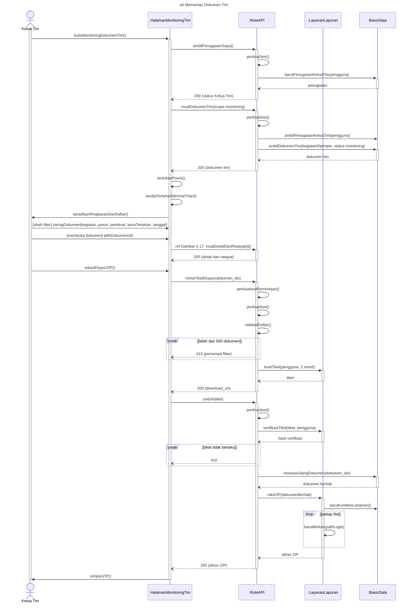

**Narasi.** Hanya dokumen dari kegiatan yang dipimpin pemanggil yang dikembalikan server. "Lama tertahan" dihitung sejak dokumen terakhir ditulis (pengajuan, aksi persetujuan, atau perubahan saat revisi), bukan murni sejak perubahan status (K-9). Penanda tertahan hanya tampilan; tidak ada pengingat atau notifikasi otomatis. ZIP tidak memuat dokumen tambahan KSBU.

**Terverifikasi (30 Sept):** posisi dihitung di peramban; tanpa penugasan → 200 daftar kosong (halaman sudah menyaring lebih dulu lewat `/users/me/ketua-tim`); tertahan bila ≥ 7 hari; pembacaan file ZIP sama dengan UC-09.

---

## UC-12 Membersihkan Lampiran Dokumen Non-Material — `sd Membersihkan Lampiran Dokumen Non-Material` (Gambar 4.33)

**Konteks.** Gambar 4.23 lama dibuat ulang. Perubahan lifeline: `:RutePembersihanDokumen` → `:RuteAPI`; `:RepositoryPembersihan` digabung (repository bawaan didefinisikan di `pembersihan-service.ts:268-361`, berkas yang sama dengan layanan); `:ModulPenyimpananFile` → `:PenyimpananFile`. Langkah GET daftar kandidat memanggil ORM langsung dari rute (sesuai keputusan 3, tanpa layanan). Isi dan urutan pesan tetap.

**Lifeline:** Ketua Tim · `:HalamanPembersihan` · `:RuteAPI` · `:LayananPembersihan` · `:BasisData` · `:PenyimpananFile`. Endpoint: `GET /api/pembersihan-dokumen`, `POST /api/pembersihan-dokumen/bersihkan`.

| No | Dari → Ke | Pesan | Padanan | Sumber |
|---|---|---|---|---|
| 1 | Ketua Tim → Halaman | `bukaPembersihanDokumen()` | A1 · 2 | |
| 2 | Halaman → Rute | `ambilDaftarKandidat()` | A2 · 3 | `pembersihan-dokumen.ts:31` |
| 3 | Rute ↻ | `periksaSesi()` | — | `:32-36` |
| 4 | Rute → BasisData | `ambilPenugasanKetuaTim(pengguna)` | A2 | `:39-42`; tanpa penugasan → daftar kosong |
| 5 | Rute → BasisData | `bacaDokumenNonMaterialKegiatanDipimpin()` | A2 · 3 | `:55-84` |
| 6 | Rute ↻ | `hitungUmurDanTandaiLama(lebih dari 90 hari)` | A2 · 3 | `:88-112` |
| 7 | Rute ⇢ Halaman | `daftar dokumen dan umur` | A2 | |
| 7a | Halaman → Ketua Tim | `tampilkanDaftarKandidat()` | A2 · 3 | tambahan 30 Sept sore (T7) |
| 8 | Ketua Tim → Halaman | `pilihDokumen(daftar, maks. 200)`, `ketikKonfirmasi("BERSIHKAN")` | A3, A4 · 4, 5 | |
| 9 | Halaman → Rute | `bersihkanLampiran(dokumenIds, konfirmasi)` | D1 | `pembersihan-dokumen.tsx:289-293` |
| 10 | Rute ↻ | `periksaAsalPermintaan()`, `periksaSesiDanPeran(PEGAWAI)`, `validasiSkema(1–200 id, frasa BERSIHKAN)` | D1 · 5 | `bersihkan.ts:14-45` |
| — | `break [frasa tidak sesuai]` → `400` | | A5 · 5a | `z.literal` |
| 11 | Rute → BasisData | `ambilPenugasanKetuaTim(pengguna)` | — | `:47-58` |
| — | `break [tidak ada penugasan]` → `403` | | — | `:60-62` |
| 12 | Rute → Layanan | `jalankanPembersihan(dokumenIds, kegiatanDipimpin, pengguna)` | M1 · 6 | `pembersihan-service.ts:130-239` |
| 13 | Layanan → BasisData | `ambilKandidat(dokumenIds)`, `ambilDokumenDalamBerkas(dokumenIds)` | D2 · 6 | |
| 14 | Layanan ↻ | `susunRencanaPembersihan()` | D2, A6 · 6a | enam alasan dilewati, `:55-99` |
| 15 | Layanan → BasisData | `ambilPathTerlindungi(dokumenLolos)` | D3 · 6 | |
| 16 | Layanan → PenyimpananFile | `hapusFileAman(daftarPath, pathTerlindungi)` | A7 · 6 | satu panggilan, `logical-file-deletion.ts:56` |
| — | `loop [setiap path]` PenyimpananFile ↻ `lewatiAtauHapusFile(path)` | | D3, A7, D4 | `:78`, `:93-94` |
| 17 | PenyimpananFile ⇢ Layanan | `hasil per file` | | |
| 18 | Layanan ↻ | `tentukanDokumenBersih()` | A8 | |
| 19 | Layanan → BasisData | `mulaiTransaksi()` | A8 | `:343` |
| — | `loop [setiap dokumen bersih]` | | D4 | |
| 20 | Layanan → BasisData | `tandaiLampiranDibersihkan(PEMBERSIHAN_NON_MATERIAL)`, `tulisJejakAudit(DOKUMEN_LAMPIRAN_DIBERSIHKAN)` | A8 · 6 | status tetap Tersimpan |
| — | akhir `loop` | | | |
| 21 | Layanan → BasisData | `commit()` | A8 | |
| 22 | Layanan ⇢ Rute ⇢ Halaman | `laporan (diminta, dibersihkan, dilewati, gagal)` → `200 (laporan)` | A9 · 7 | |
| 23 | Halaman → Ketua Tim | `tampilkanRingkasanPembersihan()` | A9 · 7 | |

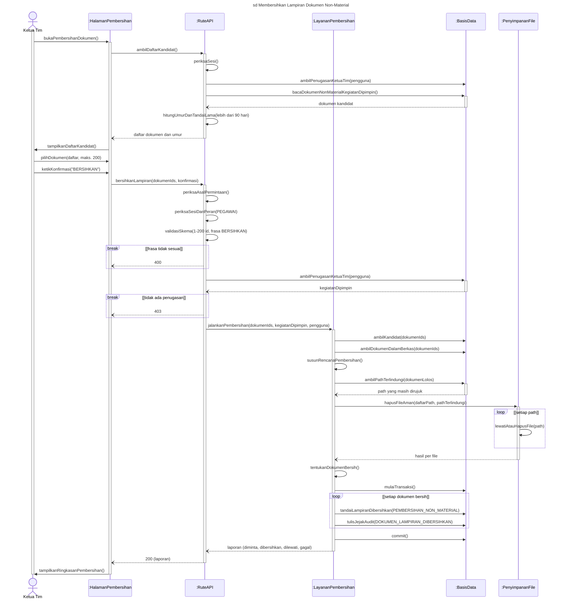

**Narasi.** Urutan **hapus file dulu, baru tandai basis data** disengaja dan berbeda dari pembersihan file berkas (UC-08); bila penandaan gagal, aksi dapat diulang karena idempoten, tetapi tidak atomik (K-5). File yang masih dirujuk dokumen lain atau lampiran dokumen tambahan KSBU tidak ikut terhapus (KNF-14). Dokumen yang sebagian filenya gagal dihapus tidak ditandai dan dilaporkan "gagal". Activity menggambar *loop* per dokumen sebagai penyederhanaan logis; sequence mengikuti urutan kode (rencana untuk semua dokumen → hapus file → tandai semua dalam satu transaksi).

**Catatan konsistensi.** Frasa diperiksa oleh skema sebelum penugasan (kode), sehingga `break` frasa (activity D1) digambar lebih dulu. Pada Gambar 4.23 lama, pemeriksaan skema sudah ada sebagai *self-call* tanpa `break`; `break` frasa ditambahkan agar D1 activity punya padanan. Kode 400 terverifikasi (`bersihkan.ts:41-45`). Pengguna tanpa penugasan Ketua Tim yang membuka halaman melihat pesan "Akses ditolak" (`pembersihan-dokumen.tsx:182-185, 338-345`), bukan daftar kosong.

---

## UC-13 Melihat Log Aktivitas — `sd Melihat Log Aktivitas` (Gambar 4.35) — DISETUJUI

**Konteks.** Pengguna melihat riwayat aktivitas dokumen dan berkas miliknya; Admin dan PJ Kinerja dapat memilih cakupan seluruh pengguna. `alt` dipakai (bukan `break`) karena pada activity cabang A4 kembali ke M1 lalu A5: setelah ditolak, pengguna masih dapat menyaring log miliknya.

**Lifeline:** Pengguna · `:HalamanLogAktivitas` · `:RuteAPI` · `:BasisData`. Endpoint: `GET /api/activity-log`.

| No | Dari → Ke | Pesan | Padanan | Sumber |
|---|---|---|---|---|
| 1 | Pengguna → Halaman | `bukaLogAktivitas()` | A1 · 2 | |
| 2 | Halaman → Rute | `muatLog(cakupan)` | A2 · 3 | bawaan milik sendiri; `scope=all` untuk seluruh pengguna |
| 3 | Rute ↻ | `periksaSesi()` | — | GET tanpa pemeriksaan asal |
| 4 | Rute ↻ | `periksaCakupan(peran, cakupan)` | D1, D2 · A1, A2 | `GLOBAL_SCOPE_ROLES`, `activity-log.ts:15` |
| — | `alt [seluruh pengguna dan peran bukan Admin atau PJ Kinerja]` | | | |
| 5 | Rute ⇢ Halaman | `403 (tidak berhak)` | A4 · A2 | `:65-69` |
| 6 | Halaman → Pengguna | `tampilkanPesanDitolak()` | A4 | |
| — | `[else] berhak atas cakupan yang diminta` | | | |
| 7 | Rute → BasisData | `bacaRiwayatDokumen(cakupan)` | A2/A3 | ORM langsung, `log_aktivitas`, `activity-log.ts:76-94` |
| 8 | Rute → BasisData | `bacaRiwayatBerkas(cakupan)` | — | `berkas_arsip_activity`, `activity-log.ts:118-141` |
| 9 | Rute ↻ | `gabungDanBatasi(500 baris)` | A2 | urut terbaru, `MAX_ROWS` 500, `activity-log.ts:12, 155-158` |
| 12 | Rute ⇢ Halaman | `200 (daftar aktivitas)` | | `activity-log.ts:160` |
| 13 | Halaman → Pengguna | `tampilkanAktivitas()` | A2/A3 | |
| — | akhir `alt` | | | |
| 14 | Pengguna → Halaman | `cariAtauSaring(kataKunci, pengguna, peran)` | A5 · 4 | |
| 15 | Halaman ↻ | `saringDiPeramban()` | A5 | `ActivityLogView.tsx:97-109` |
| 16 | Halaman → Pengguna | `tampilkanHasilSaring()` | A5 | |

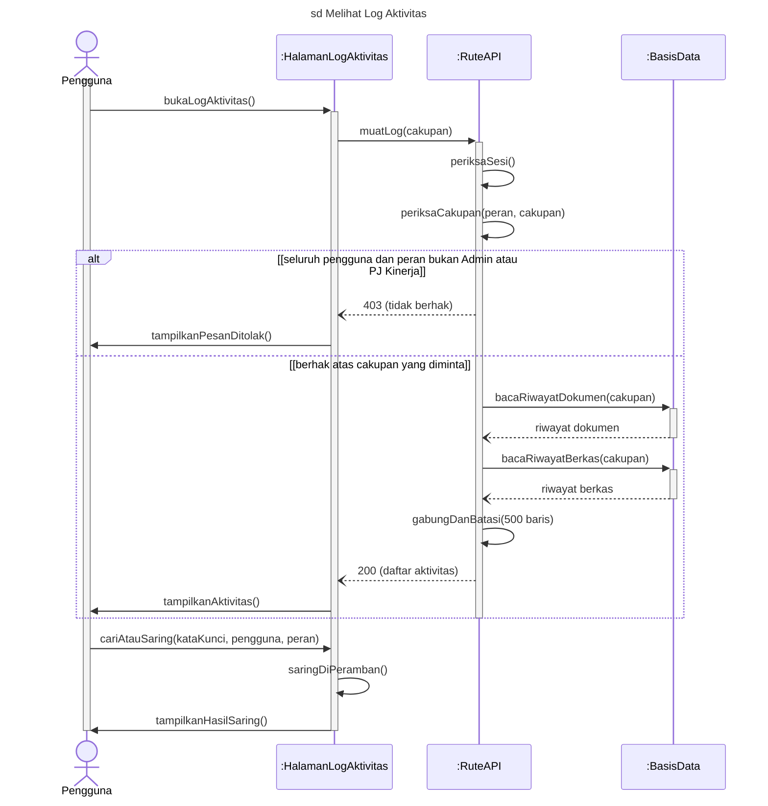

**Narasi.** Tabel `audit.audit_log` tidak dibaca halaman ini (K-8). Filter per pengguna, peran, dan pencarian berjalan di peramban.

**Terverifikasi (30 Sept):** rute memanggil ORM langsung, jadi `:LayananRiwayat` dihapus (keputusan 3, disetujui Daniel); pesan 8–10 lama menjadi `:RuteAPI → :BasisData` dan `gabungDanBatasi` *self-call* `:RuteAPI`.

---
## UC-14 Mengelola Pengguna dan Penugasan Ketua Tim — `sd Mengelola Pengguna dan Penugasan Ketua Tim` (Gambar 4.37)

**Konteks.** Cabang utama mengikuti activity D1: menambah pengguna, atau menugaskan Ketua Tim pada kegiatan. Ubah, nonaktifkan, dan reset kata sandi di narasi.

**Lifeline:** Admin · `:HalamanMasterUser` · `:RuteAPI` · `:LayananPengguna` · `:BasisData`. Endpoint: `GET/POST /api/users/`, `/api/users/$id`, `GET/POST/DELETE /api/ketua-tim/`.

| No | Dari → Ke | Pesan | Padanan | Sumber |
|---|---|---|---|---|
| 1 | Admin → Halaman | `bukaMasterUser()` | A1 · 2 | `/admin/master-data/user` |
| 2 | Halaman → Rute ⇢ Halaman | `muatPengguna()` → `200 (daftar pengguna)` | A2 · 3 | `GET /api/users/`, `admin.master-data.user.tsx:385` |
| 2a | Rute ↻ | `periksaSesiDanPeran(ADMIN)` | — | tambahan 30 Sept sore (T3) |
| 2b | Rute → Layanan → BasisData | `ambilDaftarPengguna()` → `bacaPenggunaDanPeran()` → `pengguna dan peran` | A2 | `getLocalUsersWithRoles`, `local-user-queries.ts:35-73`; sesi 401 lalu ADMIN 403 lebih dulu (`users/index.ts:25-33`) |
| 2c | Halaman → Rute | `muatPenugasanKetuaTim()` → `200 (penugasan)` | A2 | `GET /api/ketua-tim/` (ADMIN), ORM langsung, `admin.master-data.user.tsx:414`; `ketua-tim/index.ts:62-97` |
| 3 | Halaman → Admin | `tampilkanDaftarPengguna()` | A2 · 3 | |
| — | `alt [tambah pengguna]` | | D1 · 4 | |
| 4 | Admin → Halaman | `isiDataPengguna(username, NIP, nama, kataSandiAwal, peran)` | T1 · 4 | kata sandi awal diisi Admin (minimal 8 karakter), `users/index.ts:84-86` |
| 5 | Halaman → Rute | `tambahPengguna(dataPengguna)` | T1 | `POST /api/users` |
| 6 | Rute ↻ | `periksaAsalPermintaan()`, `periksaSesiDanPeran(ADMIN)`, `validasiSkema()` | — | username 3–30 karakter `a-z0-9._-`, minimal satu huruf |
| 7 | Rute ↻ | `normalisasiPeran(peran)` | T3 · 5, A4 | `normalizeAdminRolePayload`, `users/index.ts:107`; tambah PEGAWAI; ADMIN eksklusif |
| 8 | Rute → Layanan | `buatPengguna(dataPengguna, peran)` | T3 · 5 | `createLocalUserWithRoles`, `users/index.ts:113-121`; `local-user-mutations.ts:61` |
| 10 | Layanan ↻ | `hashKataSandi()` | T3 | Argon2id, `local-user-mutations.ts:72` |
| 11 | Layanan → BasisData | `mulaiTransaksi()`, `simpanPenggunaDanPeran()` | T3 · 5 | satu transaksi: baca peran, `INSERT users`, ganti `user_roles`, `local-user-mutations.ts:76-103` |
| — | `break [username atau NIP melanggar keunikan]` → `rollback()`, Layanan ⇢ Rute `penolakan`, Rute ⇢ Halaman `409 (sudah dipakai)` | | T2 · 5a (usulan) | keunikan dicek lewat constraint saat `INSERT`; `23505` → 409 (`local-user-mutations.ts:109-117, 468-489`) |
| 11a | Layanan → BasisData | `commit()` | T3 | |
| 12 | Rute ⇢ Halaman; Halaman → Admin | `201` → `tampilkanPenggunaBaru()` | T3 | |
| — | `[else] tugaskan Ketua Tim` | | D1 · 6 | |
| 13 | Admin → Halaman | `pilihKegiatanDipimpin(pengguna, daftarKegiatan)` | K1 · 6 | dipilih di dialog pengguna; satu `POST` per kegiatan saat disimpan, `DELETE /api/ketua-tim/?id=` untuk yang dilepas (`admin.master-data.user.tsx:703-760`) |
| 14 | Halaman → Rute | `tugaskanKetuaTim(pengguna, kegiatan)` | K1 | `POST /api/ketua-tim/` |
| 15 | Rute ↻ | `periksaAsalPermintaan()`, `periksaSesiDanPeran(ADMIN)`, `validasiSkema()` | — | `src/lib/schemas/ketua-tim.ts` |
| 16 | Rute → BasisData | `simpanAtauGantiPenugasan(pengguna, kegiatan)` | D4, K3 · 7 | ORM langsung, *upsert* pada UNIQUE `ketua_tim_kegiatan_unique`: Ketua Tim lama diganti (alur normal), `ketua-tim/index.ts:119-133` |
| 17 | Rute ⇢ Halaman; Halaman → Admin | `201` → `tampilkanPenugasan()` | K3 · 7 | `ketua-tim/index.ts:140` |

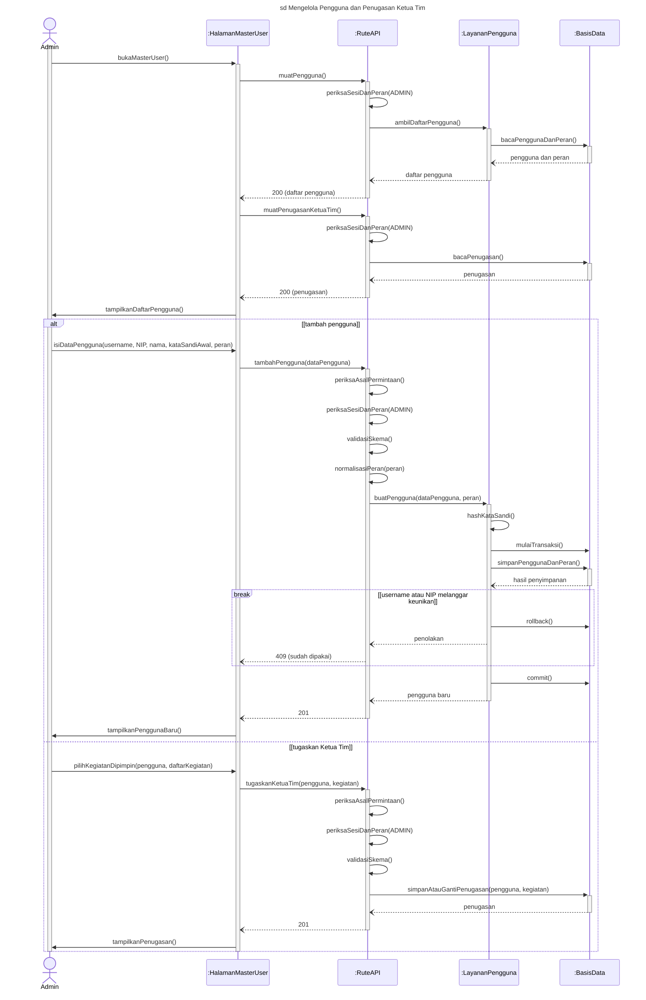

**Narasi.** Hak akses server mengikuti gabungan peran. Bila Admin memberi peran ADMIN bersama peran lain, hanya ADMIN yang disimpan tanpa peringatan (K-1). Ubah pengguna (A1) sepola cabang pertama (`/api/users/$id`, `users/$id.ts:119,128`). Nonaktifkan (A2): ditolak (400) bila Admin aktif terakhir ("Minimal harus ada satu akun ADMIN aktif", `role-assignment.ts:71-83`; tanpa kunci baris, K-2); bila berhasil, seluruh sesi dicabut (`local-user-mutations.ts:328`). Reset kata sandi (A3): Admin mengisi kata sandi baru, seluruh sesi dicabut (`local-user-passwords.ts:44`). Menugaskan Ketua Tim pada kegiatan yang sudah punya Ketua Tim **menggantikan** Ketua Tim lama (alur normal); melepas penugasan memakai `DELETE /api/ketua-tim/?id=`.

**Terverifikasi (30 Sept):** POST memakai `createLocalUserWithRoles` (satu transaksi; keunikan lewat constraint, 409); kata sandi awal diisi Admin; penugasan Ketua Tim: `POST /api/ketua-tim/` ORM langsung, upsert (tanpa penolakan).

---

## UC-15 Mengelola Data Master dan Pengaturan — `sd Mengelola Data Master dan Pengaturan` (Gambar 4.39)

**Konteks.** Skenario utama: Admin menambah atau mengubah data referensi (contoh: Master Komponen, yang punya induk Kegiatan), atau menonaktifkannya. Klasifikasi Cara Pembayaran oleh KSBU dan pengaturan tampilan di narasi. Isi referensi diserahkan ke satker; sistem menyediakan fitur tambah, ubah, dan nonaktifkan.

**Lifeline:** Admin · `:HalamanDataMaster` · `:RuteAPI` · `:BasisData`. Endpoint: `/api/master-*` (mis. `GET/POST /api/master-komponen`, `PATCH/DELETE /api/master-komponen/$id`; `DELETE` = penonaktifan).

| No | Dari → Ke | Pesan | Padanan | Sumber |
|---|---|---|---|---|
| 1 | Admin → Halaman | `bukaMenuDataMaster(jenis)` | A1 · 2 | `/admin/master-data/*` |
| 2 | Halaman → Rute | `muatData(jenis)` | A2 · 3 | GET wajib sesi (`requireAnyLocalSession`, D-23) |
| 2a | Rute ↻ | `periksaSesi()` | — | tambahan 30 Sept sore (T4); `requireAnyLocalSession` |
| 3 | Rute → BasisData; Rute ⇢ Halaman | `bacaDataAktif(jenis)` → `200 (data)` | A2 · 3 | |
| 4 | Halaman → Admin | `tampilkanData()` | A2 · 3 | |
| — | `alt [tambah atau ubah]` | | D2 · 4 | |
| 5 | Admin → Halaman | `isiData(nama, induk)` | A3 · 4 | |
| 6 | Halaman → Rute | `simpanData(jenis, data)` | A3 | |
| 7 | Rute ↻ | `periksaAsalPermintaan()`, `validasiSkema()`, `periksaSesiDanPeran(ADMIN)` | — | skema dicek sebelum sesi/ADMIN, `master-komponen.ts:74-92`; mutasi hanya ADMIN |
| 9 | Rute → BasisData | `periksaIndukAktif(induk)` | D3 · 5 | ORM langsung; induk tidak aktif → 400, `master-komponen.ts:94-104` |
| 10 | Rute → BasisData | `periksaNamaUnikAktif(induk, nama)` | D4 · 5 | *partial unique index* `WHERE is_active = true`; diperiksa aplikasi lebih dulu → 409, `master-komponen.ts:106-121` |
| — | `break [induk tidak aktif atau nama sudah dipakai]` → `400/409 (pesan)` | | A4, A5 · 5b (usulan) | guard dipendekkan (L2) |
| 11 | Rute → BasisData | `simpan(data)` | A6 · 5 | `master-komponen.ts:123-139` |
| 12 | Rute ⇢ Halaman; Halaman → Admin | `200/201` → `tampilkanDataTersimpan()` | A6 | |
| — | `[else] nonaktifkan` | | D2 · A1 | |
| 13 | Admin → Halaman | `pilihNonaktifkan(id)` | A7 · A1 | |
| 14 | Halaman → Rute | `nonaktifkanData(jenis, id)` | A7 | `DELETE /api/master-*/$id` (soft delete), `admin.master-data.komponen.tsx:145` |
| 15 | Rute ↻ | `periksaAsalPermintaan()`, `periksaSesiDanPeran(ADMIN)` | — | |
| 16 | Rute → BasisData | `ambilData(id)` | A7 | 404 bila tidak ada; tidak ada pemeriksaan "masih dipakai" (keterbatasan K-UC15-rujukan), `master-komponen.$id.ts:187-196` |
| 17 | Rute → BasisData | `setelTidakAktif(id)` | A9 · A1 | `is_active = false`, tidak dihapus permanen, `master-komponen.$id.ts:197-201` |
| 18 | Rute ⇢ Halaman; Halaman → Admin | `200` → `tampilkanDataNonaktif()` | A9 | |

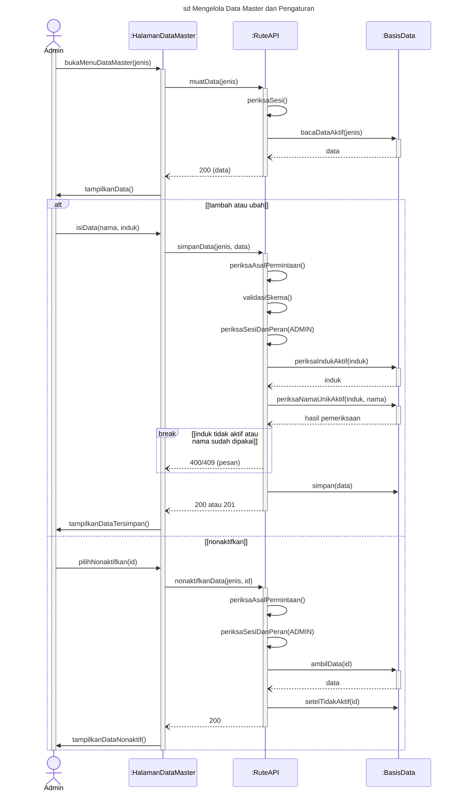

**Narasi.** Data referensi menjadi pilihan dan checklist kelengkapan pada formulir pengajuan (UC-03). **Klasifikasi Cara Pembayaran (KSBU, activity B1–B4, alur A2):** `/kasubag/klasifikasi` → `/api/kasubag/klasifikasi(/$id)` dengan `requireKepalaSubBagianUmum`; struktur induk–anak, kode unik bila diisi, hanya daun yang dipakai untuk berkas; pola sama dengan cabang pertama dengan aktor KSBU. **Pengaturan tampilan (Admin, C1–C3, alur A3):** `/admin/settings` → `/api/settings/{theme,general,epoch}`; tema `se`/`sp`/`st` dan sub-judul disimpan di `app.app_settings` dan berlaku untuk seluruh pengguna. **Keterbatasan (K-UC15-rujukan):** penonaktifan data master tidak memeriksa apakah data masih dirujuk data lain (dokumen, kelengkapan, anak); data nonaktif hanya tidak muncul lagi sebagai pilihan, dan Kelengkapan dihapus permanen tanpa pemeriksaan rujukan (`master-kelengkapan.$id.ts:241`).

**Terverifikasi (30 Sept):** rute `/api/master-*` memanggil ORM langsung (`:LayananDataMaster` dihapus); induk aktif dan nama unik diperiksa aplikasi lebih dulu (400/409); penonaktifan = `DELETE` soft tanpa pemeriksaan rujukan (keterbatasan K-UC15-rujukan); klasifikasi KSBU: kode/nama ganda 409, sub-klasifikasi aktif 409, root 403.

---

## 16. Pemeriksaan Keseimbangan Model (Dennis et al., 2015)

| Aturan | Pemeriksaan | Hasil |
|---|---|---|
| V1 | Setiap sequence terkait satu UC | 15 frame = 15 UC; tidak ada gambar lintas UC. Isi 4.22 dibagi: pintu alur kerja → UC-04, pintu KSBU → UC-09 (UC-10, UC-11 merujuk dengan `ref`) |
| V2 | Aktor ada di use case diagram | Pengguna (UC-01, 02, 09, 13), Pegawai, Ketua Tim, PPK, PPSPM, KSBU, Admin. PJ Kinerja tampil sebagai *guard* pada UC-09 lewat aktor Pengguna |
| V3 | Pesan terkait aksi activity dan langkah UC | Kolom Padanan di setiap tabel. Pesan tanpa padanan activity = rincian teknis di dalam satu aksi "Sistem …" |
| V4 | Transisi BSMD punya pesan | Dokumen: #1 (UC-03), #2–#3 (UC-05), #4–#5 (UC-06), #6 (UC-04), #7–#8 (narasi UC-05), jalur `TERSIMPAN` (UC-03). Berkas: T-B0 dibuka (UC-07), tutup (UC-08), usul/batal (narasi UC-08), dibersihkan (UC-08) |
| V5 | Lifeline sesuai Gambar 4.9 | Lima jenis lifeline seragam; `:Layanan` tidak digambar pada UC-05, UC-06, UC-13, UC-15 (keputusan 3); `:PenyimpananFile` hanya pada UC-02, UC-03, UC-04, UC-08, UC-12 |

## 17. Usulan Penyesuaian Dokumen Lain (belum diterapkan)

| Dokumen | Bagian | Usulan |
|---|---|---|
| Kerangka R12 | 4.2.4 Konvensi c | Tambah: "Bila rute memanggil ORM langsung, `:Layanan` tidak digambar" (keputusan 3); "boleh dua `alt` pada UC-01 dan UC-09" |
| Kerangka R12 | 4.2.4.5, 4.2.4.6 | Lifeline sequence UC-05/UC-06 tanpa `:LayananPersetujuan` |
| Kerangka R12 | 4.2.4.8 Blok 2 | Urutan pesan mengikuti UC-08 di sini (status dulu, baru file) |
| Kerangka R12 | Lampiran C | Baris 4.18–4.23: "dibuat ulang (lifeline seragam)"; 4.22 dibagi ke UC-04 dan UC-09 |
| `rancangan-sequence-diagram.md` | Judul | Tambah catatan: diganti oleh dokumen ini; tetap dipakai sebagai bukti verifikasi kode 27 Sept |
| Bab II | *Sequence diagram* | Satu kalimat notasi *interaction use* (`ref`) bila UC-09, UC-10, UC-11 memakai rujukan `ref` (OMG, 2017) |

## 18. Rekap butir verifikasi Langkah 5 (tambahan Q-18) — SUDAH DIJAWAB (30 Sept, malam)

Semua butir di bawah sudah diverifikasi terhadap kode; hasilnya diterapkan ke tabel dan blok di atas. Rekap ini dipertahankan sebagai riwayat.

| UC | Butir |
|---|---|
| UC-01 | Urutan batas–kredensial–akun aktif; pesan akun nonaktif; same-origin login; `last_login_at`; kode HTTP berpindah peran; logout lewat layanan |
| UC-02 | Rute profil lewat layanan atau ORM; aturan kata sandi baru; kode HTTP kata sandi lama salah; sesi saat ini dicabut; tempat dan aturan foto (menentukan `:PenyimpananFile`) |
| UC-03 | Endpoint status Ketua Tim dan checklist di formulir |
| UC-04 | Riwayat dalam respons detail; urutan PATCH (pindah file vs basis data); rute kirim ulang Pegawai lewat ORM langsung; `validateResubmitRequirements` membaca basis data; ubah non-material mencatat riwayat |
| UC-05 | Endpoint detail PPK; catatan pendek dicegah formulir; reject sepola approve |
| UC-06 | Rute PPSPM memanggil ORM langsung; urutan pemeriksaan; dialog konfirmasi; endpoint detail |
| UC-07 | Kueri penyaringan Cara Pembayaran; urutan pilih TA lalu Cara Pembayaran |
| UC-08 | Path GET berkas; syarat berkas berisi dan kodenya; pengirim transaksi; 409 tutup/bersihkan; urutan status vs hapus file; tanda lampiran dalam transaksi; audit per dokumen; modul penyimpanan terpisah; validasi isian di klien |
| UC-09 | Cakupan Laporan Saya; pembagian kueri rute vs `src/lib/laporan/*`; total di peramban; modul pembaca file ZIP; Ketua Tim tanpa penugasan |
| UC-10 | Baris pemeriksaan peran; total di peramban; per pegawai sampai dokumen; titik batas 2000 |
| UC-11 | Posisi dihitung di mana; tanpa penugasan; pembaca file ZIP |
| UC-12 | Kode HTTP frasa salah |
| UC-13 | Layanan vs ORM; gabungan peran; pilihan cakupan di UI; batas 500; tampilan setelah 403 |
| UC-14 | Layanan vs ORM; kata sandi awal; keunikan dan kode HTTP; transaksi pengguna+peran; path ketua-tim; kegiatan sudah berketua; cara reset |
| UC-15 | Layanan vs ORM; rantai/keunikan dan kode HTTP; "masih dipakai" saat nonaktif; metode nonaktif; aturan klasifikasi |

Setelah langkah 5: ganti label yang berbeda, hapus/tambah lifeline `:Layanan` sesuai keputusan 3, render ulang Mermaid, lalu gambar di Miro (sesi lain).

## 19. Versi Terbaru dan Status Miro (30 Sept 2026, sore)

Kelima belas blok Mermaid di atas adalah versi yang digambar di Miro (board Activity Diagram, area di bawah flowchart, judul "Sequence Diagram 15 UC (Gambar 4.11 s.d. 4.39, lifeline seragam R12)"). ID widget: `claude/Sequence Diagram 15 UC di Miro - Lokasi dan Hasil Validasi (30 Sept 2026).md`.

**Penyesuaian notasi (semua UC, isi tidak berubah):** *return* `-->>` → `--)`; aktor diberi *execution occurrence*; *guard* fragmen dalam `[...]`; UC-09 `:HalamanLaporan` diaktifkan sebelum `alt` menu (sebelumnya hanya pada operand pertama).

**Tambahan pesan (menunggu persetujuan Daniel; bila ditolak, hapus baris bertanda T dari tabel, blok, dan widget):**

| Kode | UC | Tambahan | Alasan |
|---|---|---|---|
| T1 | UC-03 | 7a `bacaMasterKelengkapan(rantai)` + *return* | rute mengembalikan checklist tanpa sumber data |
| T2 | UC-05, UC-06 | 2a `bacaDokumen(idDokumen)` + *return* | idem, pada muat detail |
| T3 | UC-14 | 2a `periksaSesiDanPeran(ADMIN)`, 2b `bacaDaftarPengguna()` + *return* | idem; halaman Admin |
| T4 | UC-15 | 2a `periksaSesi()` | GET wajib sesi (D-23), sudah disebut di kolom Sumber |
| T5 | UC-04 | `Pegawai → Halaman ajukanUlang()` di blok | sudah ada di tabel pesan 28, belum ada di blok |
| T6 | UC-02, UC-07 | 25a / 19a `tampilkanPesanDitolak()` di dalam `break` | sepadan aksi pesan kesalahan activity (A8 UC-02, A6 UC-07) |
| T7 | UC-12 | 7a `tampilkanDaftarKandidat()` | sepadan activity A2 (daftar ditampilkan) |

UC-08 dan UC-13 (DISETUJUI) hanya menerima penyesuaian notasi.

**Gambar lama 4.18–4.23** masih ada di board (y ≈ 15.031) dan tidak dapat dihapus lewat alat; hapus manual bila sudah tidak dipakai.

**Sesudah langkah 5:** bila verifikasi kode mengubah pesan, ubah tabel dan blok di dokumen ini, render ulang, lalu perbarui sumber Mermaid widget yang bersangkutan di Miro.

### 19.1 Perbaikan tata letak (30 Sept 2026, malam)

Atas permintaan Daniel: *ref* pada Gambar 4.27 tumpang tindih dan beberapa label tidak terbaca. Kelima blok di bawah sudah diperbarui di dokumen ini dan di widget Miro; semua blok dirender ulang tanpa galat dan tanpa label terlipat (mermaid-cli).

| Kode | Gambar | Perubahan |
|---|---|---|
| L1 | 4.27, 4.29, 4.31 | *Note* `ref …` (melintang beberapa lifeline, menimpa label operand) diganti pesan ber-label `ref Gambar 4.xx: …` dari halaman ke `:RuteAPI` beserta *return*-nya. Maksud rujukan (*interaction use*) tetap; rincian ada di gambar yang dirujuk |
| L2 | 4.27, 4.39 | *Guard* `break` yang terlalu panjang untuk lebar fragmennya dipendekkan: `[tidak berhak atas lampiran]`, `[tiket tidak berlaku]`, `[isian tidak valid]`, `[data masih dirujuk]`. Rincian kondisinya dipindah ke kolom Sumber tabel pesan dan narasi |
| L3 | 4.25 | *Self-call* dalam `loop [setiap path]` diubah `hapusFile(path)` → `hapusFile(pathLogis)` agar fragmen cukup lebar dan label *guard* tidak terlipat |

Catatan: perenderan lokal (mermaid-cli) menampilkan *guard* sebagai `[[...]]` karena versi Mermaid baru menambahkan kurung siku sendiri. Bila di Miro juga tampil berkurung ganda, hapus kurung siku dari kata kunci `alt`/`break`/`loop` di sumber widget (pesan ber-*guard* tetap memakai `[...]`).

## 20. Penerapan Hasil Langkah 5 (30 Sept 2026, malam)

Sumber: `laporan-verifikasi-langkah5.md` (bagian A–I). Tanda verifikasi dihapus; nomor baris kode diperbarui; nomor pesan sisipan memakai huruf (mis. `3a`, `12a`) atau `N-2`.

| UC | Perubahan utama |
|---|---|
| UC-01 | Tambah `periksaAsalPermintaan()` (3a); urutan `periksaAkunAktif()` → `verifikasiKataSandi` → `periksaPeran()`; hapus `catatWaktuLogin`; guard else `[kredensial salah]`; 429 pada percobaan gagal ke-5; logout lewat `:LayananAutentikasi`; akun nonaktif = alur alternatif (403) di narasi |
| UC-02 | Validasi klien kata sandi dan foto; 400 kata sandi lama salah; hapus cookie; jalur foto `:RuteAPI → :PenyimpananFile` dan `:RuteAPI → :BasisData` tanpa `:LayananAkun` |
| UC-03 | Status Ketua Tim `GET /api/users/me/is-ketua-tim/$kegiatanId`; checklist tanpa parameter rantai (dicocokkan di peramban); nomor baris `submit.ts` diperbarui |
| UC-04 | Riwayat dimuat terpisah; hak baca setelah dokumen dibaca; satu tombol "Ajukan Ulang" + konfirmasi, PATCH lalu POST otomatis; tanpa keterangan (Material); `ambilDokumen` dan `periksaTransisi` sebelum syarat kirim ulang |
| UC-05 | Detail memuat riwayat; validasi catatan di klien; cek status pada tolak |
| UC-06 | Idem UC-05; hapus tanda verifikasi; cek persetujuan ganda di narasi |
| UC-07 | Kueri klasifikasi dan berkas dari rute, penyaringan fungsi murni; TA diisi awal dari tahun dokumen; keterbatasan K-UC07-TA |
| UC-08 | Hanya notasi (argumen tabel disamakan, return kata benda) |
| UC-09 | Tanpa `scope` dan tanpa `:PenyimpananFile`; urutan pesan 11–12 ditukar; lampiran dokumen tambahan KSBU lewat layanan; otorisasi ZIP di rute |
| UC-10 | Hanya penghapusan tanda verifikasi dan rujukan baris |
| UC-11 | Gerbang status Ketua Tim; tertahan ≥ 7 hari; tanpa `:PenyimpananFile`; otorisasi ZIP di rute |
| UC-12 | Narasi: pengguna tanpa penugasan melihat "Akses ditolak" |
| UC-13 | `:LayananRiwayat` dihapus; pesan ke basis data dari `:RuteAPI` |
| UC-14 | Daftar pengguna lewat layanan; kata sandi awal; keunikan lewat constraint (409) dalam satu transaksi; Ketua Tim diganti (upsert, 201, tanpa break) |
| UC-15 | `:LayananDataMaster` dihapus; skema dicek sebelum sesi; induk/nama 400/409; penonaktifan tanpa pemeriksaan rujukan (keterbatasan K-UC15-rujukan) |

**Keterbatasan baru:** K-UC07-TA (tidak ada peringatan bila Tahun Anggaran berbeda dari tahun dokumen); K-UC15-rujukan (penonaktifan data master tidak memeriksa rujukan).

Render ulang Mermaid (mermaid-cli) dan perbarui widget Miro dilakukan di sesi lain.
