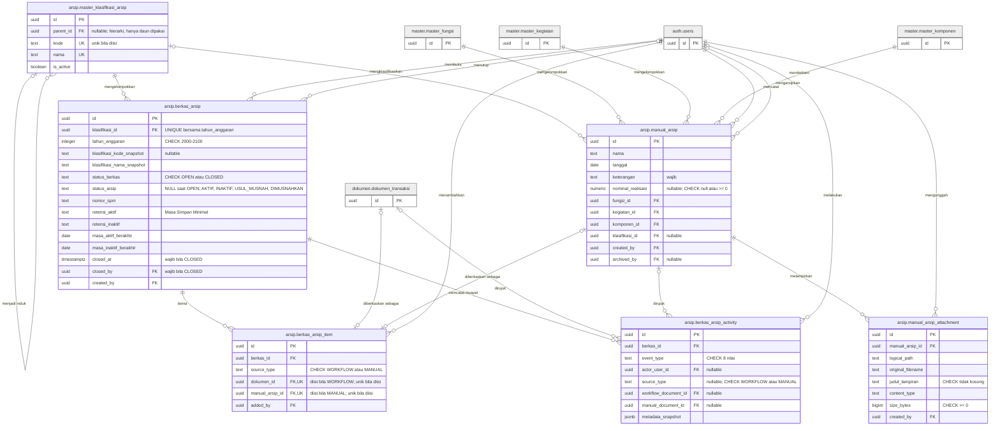

# Laporan Verifikasi Langkah 5 — Sequence Diagram 15 UC, ERD (Q-17), Q-18, Q-19

Tanggal: 30 Sept 2026. Diverifikasi terhadap `src/**` dan `drizzle/**` saja. Tidak ada berkas kode yang diubah, tidak ada tes/migrasi/server yang dijalankan.

**Catatan lokasi bahan.** Folder `.skripsi/` tidak ada. Atas arahan Daniel, bahan dibaca dari `docs/skripsi/` dan laporan disimpan di `docs/skripsi/laporan-verifikasi-langkah5.md`. Singkatan: RSD15 = `docs/skripsi/Rancangan Sequence Diagram 15 UC (30 Sept 2026).md`, RSD6 = `docs/skripsi/rancangan-sequence-diagram.md`, ERD = `docs/skripsi/rancangan-erd.md`. "L…" = nomor baris di RSD15. "C" = Cocok, "TC" = Tidak cocok.

---

## 0. Konteks repo

| Perintah | Hasil |
|---|---|
| `git rev-parse --abbrev-ref HEAD` | `migration/postgres-local` |
| `git log -1 --format='%h %ad %s' --date=iso` | `25d803a 2026-09-29 16:35:19 +0700 docs: D-29 s.d. D-31 status arsip mengikuti berkas, filter Status, unduhan ZIP bawaan browser` |
| `git status --short` | `?? "docs/skripsi/Rancangan Sequence Diagram 15 UC (30 Sept 2026).md"` |
| `ls drizzle/*.sql \| tail -5` | `0017_username_login_identity.sql`, `0018_berkas_tahun_anggaran.sql`, `0019_drop_master_jenis_dokumen.sql`, `0020_dokumen_transaksi_permintaan_fk.sql`, `0021_manual_arsip_drop_own_lifecycle.sql` |
| `git log --oneline --since=2026-09-27 -- src drizzle \| head -40` | `ae8a698` laporan kegiatan + dokumen manual, ekspor zip; `93eeb17` D-28; `8bbfdb6` cleaning dead route; `e6ba99c` filter periode, PJ Kinerja preview; `19e1b2a` lihat kata sandi di login; `37517ff` T-5/D-26 |

---

## A. Tujuh item [cek] wajib (tambahan pesan Miro 30 Sept)

| ID | Item | Klaim rancangan | Bukti kode (`berkas:baris`) | Status | Koreksi yang disarankan |
|---|---|---|---|---|---|
| W1 | UC-03 msg 7, 7a | Setelah rantai dipilih, halaman memanggil `GET /api/master-kelengkapan` dengan argumen `(kegiatan, statusKetuaTim, rantai)`; rute membaca master kelengkapan per rantai; `200 (daftar kelengkapan)` | Pemanggilan: `src/components/dokumen/KelengkapanChecklist.tsx:100-105` mengirim hanya `kegiatan_id` dan `is_ketua_tim`. Dipanggil di `useEffect` (`:88-132`) setiap kali `kegiatanId`, `isKetuaTim`, `komponenId`, `jenisPermintaanId`, `kategoriPermintaanId`, `detailPermintaanId` berubah. Komponen dirender di langkah 2 "Kelengkapan" (`src/routes/pegawai/dokumen/aju.tsx:1001-1007`). Untuk Non-Material tidak memanggil API (`:92-96`). Rute: `requireAnyLocalSession` (`src/routes/api/master-kelengkapan.ts:72-73`, tanpa peran), lalu ORM langsung `master_kelengkapan_dokumen` LEFT JOIN `master_kegiatan`, `master_fungsi`, filter `kegiatan_id`, `is_ketua_tim` (`:76-112`). Rantai **tidak** disaring di server; pencocokan 6 kolom di peramban (`KelengkapanChecklist.tsx:107-115` → `src/lib/kelengkapan-match.ts:31-41`) | TC | Msg 7 (L394): `ambilKelengkapan(kegiatan, statusKetuaTim)`. Tambah *self-call* `R->>R: periksaSesi()` setelah L394. Msg 7a (L395): `bacaMasterKelengkapan(kegiatan, statusKetuaTim)`, return L396 `daftar kelengkapan seluruh rantai`. Lifeline tetap `:RuteAPI → :BasisData` (ORM langsung). Sumber msg 8: `KelengkapanChecklist.tsx:107-115`, `kelengkapan-match.ts:31-41` (bukan `:59-72`) |
| W2a | UC-05 msg 2, 2a, 3 | Halaman detail PPK memanggil detail; rute membaca `dokumen dan lampiran` | Halaman: `apiFetch('/ppk/dokumen/${id}')` (`src/routes/ppk/dokumen/$id/index.tsx:120`) → `GET /api/ppk/dokumen/$id`. Rute: sesi 401 → peran PPK 403 → UUID 404 (`src/routes/api/ppk/dokumen/$id.ts:35-47`); ORM langsung: baca `dokumen_transaksi` + join master (lampiran = kolom `lampiran_urls` di baris yang sama) (`:50-86`); status bukan {IN_PPK_VALIDATION, IN_PPSPM_APPROVAL, NEED_REVISION, COMPLETED} → 400 (`:93-101`); baca `log_aktivitas` (`:103-115`); respons `{dokumen, logs}` (`:117-147`) | TC | Setelah L687 tambah `R->>R: periksaSesiDanPeran(PPK)`. L688 `bacaDokumen(idDokumen)` tetap; tambah `R->>+DB: bacaRiwayat(idDokumen)` / `DB--)-R: riwayat`. L690: `200 (detail, lampiran, riwayat)`. Sumber msg 2: `GET /api/ppk/dokumen/$id` |
| W2b | UC-06 msg 2, 2a | Sama untuk PPSPM | Halaman: `apiFetch('/ppspm/dokumen/${id}')` (`src/routes/ppspm/dokumen/$id.tsx:92`). Rute: sesi 401 → PPSPM 403 → UUID 404 (`src/routes/api/ppspm/dokumen/$id.ts:41-45`); baca dokumen (`:48-87`); `canPpspmRead` → 400 (`:27-31, 89-91`); baca `log_aktivitas` aksi `PPK_APPROVE` (tanggal validasi PPK) (`:93-104`) dan seluruh riwayat (`:106-117`). ORM langsung | TC | Setelah L791 tambah `R->>R: periksaSesiDanPeran(PPSPM)`. Setelah L793 tambah `R->>+DB: bacaRiwayat(idDokumen)` / `DB--)-R: riwayat dan tanggal validasi PPK`. L794: `200 (detail, lampiran, riwayat)`. Sumber msg 2: `GET /api/ppspm/dokumen/$id` |
| W3 | UC-14 msg 2, 2a, 2b | Rute memeriksa sesi dan ADMIN lebih dulu, lalu `R → DB bacaDaftarPengguna()` | Halaman: `apiFetch('/users/')` (`src/routes/admin.master-data.user.tsx:385`) → `GET /api/users/`. Urutan: sesi 401 → ADMIN 403 **lebih dulu** (`src/routes/api/users/index.ts:25-33`), lalu `getLocalUsersWithRoles()` (`:36`) di `src/lib/users/local-user-queries.ts:35`, yang membaca `users` LEFT JOIN `user_roles`, `roles` (peran ikut dibaca, `:52-73`) | TC | Urutan 2a cocok. Msg 2b lewat layanan: ganti L1658–1659 menjadi `R->>+L: ambilDaftarPengguna()`, `L->>+DB: bacaPenggunaDanPeran()`, `DB--)-L: pengguna dan peran`, `L--)-R: daftar pengguna` |
| W4 | UC-15 msg 2, 2a | GET master memeriksa sesi tanpa peran | `GET /api/master-komponen`: `requireAnyLocalSession` (`src/routes/api/master-komponen.ts:23-24`) lalu ORM (`:35-50`). Semua GET `/api/master-*` memakai `requireAnyLocalSession`: `master-detail.ts:27`, `master-detail.$id.ts:27`, `master-fungsi.ts:24`, `master-jenis.ts:23`, `master-jenis.$id.ts:23`, `master-kategori.ts:23`, `master-kategori.$id.ts:23`, `master-kegiatan.ts:23`, `master-kelengkapan.ts:72`, `master-komponen.ts:23`, `master-komponen.$id.ts:23`. `master-fungsi.$id.ts`, `master-kegiatan.$id.ts`, `master-kelengkapan.$id.ts` tidak punya GET. Tidak ada GET tanpa sesi (perintah: `grep -n "GET:\|requireAnyLocalSession" src/routes/api/master-*.ts`) | C | — |
| W5 | UC-04 msg 28, 33 | Pegawai memicu `ajukanUlang()` sebagai aksi tersendiri setelah menyimpan perbaikan | Satu tombol **"Ajukan Ulang"** (`src/routes/pegawai/dokumen/$id/revisi.tsx:671-682`) → dialog konfirmasi "Ajukan ulang dokumen?" / "Ajukan ulang tanpa perubahan?" dengan teks "Perubahan disimpan terlebih dahulu, lalu dokumen diajukan ulang" (`:715-761`) → `handleSubmit` menjalankan berurutan `PATCH /api/dokumen/${id}` body `{lampiranUrls, nominalRealisasi}` (`:282-285`) lalu `POST /api/dokumen/${id}/submit` (`:291-294`). Bila PATCH gagal, POST tidak dikirim (`:286-288`). Tidak ada tombol simpan terpisah. `keteranganDetail` tidak dikirim | TC | Msg 28 (L593, L599): gabung menjadi `P->>H: perbaikiLampiranDanNominal()`, `P->>H: tekanAjukanUlang()`, `H->>P: tampilkanKonfirmasi()`, `P->>H: konfirmasiAjukanUlang()` **sebelum** L594. Hapus L599 `P->>H: ajukanUlang()`. Msg 29 (L594): `simpanPerbaikan(lampiran, nominal)` (tanpa keterangan). Msg 33 (L600) tetap, tetapi dipicu otomatis setelah `200` L598. Tambah narasi: kegagalan PATCH menghentikan pengajuan ulang |
| W6a | UC-02 msg 25a, 14 | Pesan kesalahan tampil pada cabang gagal | Foto: klien `getPhotoUploadErrorMessage` memetakan 400 ke "Ukuran foto terlalu besar. Maksimal 2 MB." / "Format foto tidak didukung. Gunakan JPG, PNG, atau WebP." / "File foto tidak valid. Pilih gambar lain." (`src/routes/profile.tsx:100-126`), ditampilkan lewat `setPendingPhotoError` + toast "Gagal" (`:269-276`, render `:666-668`). Kata sandi lama salah: server 400 "Password lama salah" (`src/lib/users/local-user-passwords.ts:65-68`), halaman `setPasswordError(payload.error)` (`profile.tsx:377-386`) dirender `ErrorState` "Password belum dapat diubah" (`:701-707`) | C | — (kode HTTP msg 13 lihat B02c) |
| W6b | UC-07 msg 18, 19, 19a | 409 berkas tertutup menampilkan pesan dan tidak pindah ke daftar berkas | Server: "Berkas untuk Cara Pembayaran ini TA {tahun} sudah ditutup" (`src/lib/archive/berkas-arsip-service.ts:871`). Halaman: `catch` → `setFormSubmitError(payload.error)`, tutup dialog, `setFormLoading(false)`, `return` (`src/routes/kasubag/dokumen/$id/index.tsx:419-428`); dirender kotak galat (`:821-826`). Navigasi `window.location.href = '/kasubag/berkas'` hanya di jalur sukses (`:417`) | C | — |
| W7 | UC-12 msg 7, 7a | Daftar kandidat tampil dengan penanda > 90 hari | `DocumentTable rows={filteredRows}` (`src/routes/pegawai/pembersihan-dokumen.tsx:428-430`, baris `:725-740`); penanda umur `UmurBadge` merah bila `is_stale` (`:887-895`); ambang dari server `stale_days` (`:188-190`) | C | — |
| W7b | UC-12 msg 7 (kasus `is_ketua_tim: false`) | Tampilan kosong | Rute mengembalikan `{dokumen: [], is_ketua_tim: false}` (`src/routes/api/pembersihan-dokumen.ts:44-51`); halaman menampilkan EmptyState **"Akses ditolak"** + tombol "Kembali ke Dashboard" (`pembersihan-dokumen.tsx:182-185, 338-345`), bukan daftar kosong. Daftar kosong ("Belum ada dokumen non-material") hanya bila Ketua Tim tanpa kandidat (`:420-426`) | TC | Tidak mengubah Mermaid. Narasi UC-12: "Pengguna tanpa penugasan Ketua Tim melihat pesan akses ditolak" |

---

## B. Butir [cek] lain di RSD15 (termasuk Q-18)

| ID | Item | Klaim rancangan | Bukti kode (`berkas:baris`) | Status | Koreksi yang disarankan |
|---|---|---|---|---|---|
| B01a | UC-01 msg 3–12 | Skema → batas → cari akun → Argon2id → akun aktif dan peran | Skema `src/routes/api/auth/login.ts:32-38` → batas `:41-50` → `loginWithLocalCredentials` (`:52-57`): cari akun `src/lib/auth/local-auth-service.ts:134-150` (`or(eq(username), eq(nipNrp))` di `:150`) → **akun nonaktif diperiksa sebelum kata sandi** (`:66-72`) → Argon2id (`:74-77`) → peran `validateAssignedRoles` (`:79-86`; `role-resolution.ts:19-31`) | TC | Tukar L152–L153: `L->>L: periksaAkunAktif()` sebelum `verifikasiKataSandi`, lalu `L->>L: periksaPeran()` sesudahnya. Sumber msg 5: `login.ts:41-50` (bukan `:60,96-103`) |
| B01b | UC-01 msg 12, 19–21 | Akun nonaktif sama dengan kredensial salah (401); hanya 401 dihitung; 429 + `Retry-After` 5/10 menit, jeda 15 menit | Kredensial salah/akun tak ada: 401 "Username/NIP atau password salah" (`local-auth-service.ts:54, 165-172`). Nonaktif: **403** "Akun Anda tidak aktif. Hubungi Administrator." (`:66-72`). Peran tidak valid: 403 (`:79-86`). Hanya 401 dihitung (`login.ts:59-65`). 5 gagal/10 menit → jeda 15 menit (`login-rate-limit.ts:3-5, 91-96`); 429 + `Retry-After` (`login.ts:105-115`). Percobaan gagal ke-5 **langsung** dijawab 429 (`login.ts:61-64`) | TC | Guard else L161: `[kredensial salah]`. Setelah L163 tambah `[batas tercapai] 429 (login dijeda 15 menit)` sebagai pesan ber-*guard* atau narasi. Cabang akun nonaktif/peran tidak valid (403, tidak dihitung): narasi, atau operand tambahan bila Daniel setuju (lihat H.5) |
| B01c | UC-01 msg 3 | Login memanggil `requireSameOrigin`? | Ya (`login.ts:23-24`), sebelum JSON dan skema | TC | Tambah `R->>R: periksaAsalPermintaan()` setelah L142, sebelum `validasiSkema()` |
| B01d | UC-01 msg 13–14 | Sesi 8 jam (30 hari bila `remember_me`); token 32 byte SHA-256; `last_login_at` ditulis | 8 jam saja, tanpa "ingat saya" (`local-auth-service.ts:91-93`; `session-constants.ts:9`; `REMEMBER_ME_DURATION_SECONDS` dihapus di `8bbfdb6`). Token 32 byte, SHA-256 (`session-token.ts:13-25`, `session-constants.ts:6-7`). Sesi disimpan layanan lewat `createSessionRecord` (`session-repository.ts:48-69`). **`last_login_at` tidak pernah ditulis** (hanya definisi kolom `src/db/schema/auth/users.ts:37`; `rg -n "last_login\|lastLogin" src`) | TC | Hapus msg 14 (L156). Label msg 13 tetap `buatSesi(pengguna, 8 jam)` |
| B01e | UC-01 msg 16, 25–26 | Cookie `dms_session` HttpOnly, `dms_active_role`; role-switch menolak ADMIN dan peran tak dimiliki | Cookie sesi HttpOnly, SameSite=Lax, Secure di produksi (`session-cookies.ts:41-51, 69-77`); `dms_active_role` tanpa HttpOnly (`:53-59`). Role-switch: asal (`role-switch.ts:21-22`) → skema 400 (`:30-36`) → sesi 401 (`:39-55`) → peran tidak valid 403 (`:57-60`) → ADMIN **403** (`:62-66`) → peran tak dimiliki **403** (`:68-72`) → 200 + cookie (`:74-78`) | C | Sumber msg 25: kode 403 |
| B01f | UC-01 msg 30–31 | Logout `R → DB cabutSesi` | Rute memanggil `revokeSessionByTokenHash` dari modul `src/lib/auth/session-repository.ts:119-131` (`logout.ts:24`), lalu hapus dua cookie (`:30-33`) | TC | L179: `R->>+L: cabutSesi(tokenSesi)`, `L->>DB: tandaiSesiDicabut(tokenSesi)`, `L--)-R: selesai`. Tambah `R->>R: hapusCookieSesiDanPeran()` |
| B02a | UC-02 msg 2–4 | `GET /api/users/me` membaca profil langsung | ORM langsung `users` (`src/routes/api/users/me.ts:34-43`), plus cek kolom avatar di `information_schema` (`:49-52, 240-272`) | C | — |
| B02b | UC-02 msg 9 | Aturan kata sandi baru | Minimal 8 karakter, tanpa batas maksimum (`change-password.ts:44-49`; `src/lib/types/user.ts:94-96`). Aturan tambahan di layanan: baru ≠ lama → 400 "Password baru harus berbeda dari password lama" (`local-user-passwords.ts:70-72`) | C | Sumber msg 9: "min. 8 karakter". Aturan beda-dari-lama: lihat C-02+b |
| B02c | UC-02 msg 10–13 | Lewat `local-user-passwords.ts`; kode HTTP lama salah | `changeLocalUserPassword` (`local-user-passwords.ts:48-94`); lama salah → **400** "Password lama salah" (`:65-68`) | TC | L268: `400 (kata sandi lama salah)` |
| B02d | UC-02 msg 17–19 | `revokeAllUserSessions` (`:44`) juga mencabut sesi saat ini; diarahkan ke login | Semua sesi pengguna dicabut, termasuk yang sedang dipakai (`local-user-passwords.ts:92`; `session-repository.ts:133-145`); rute menghapus cookie sesi dan peran (`change-password.ts:58-61`); halaman `window.location.href = '/login?password_changed=1'` (`profile.tsx:373-376`) | C | Sumber msg 17: `local-user-passwords.ts:92` (`:44` adalah fungsi reset oleh Admin) |
| B02e | UC-02 msg 23–27 | Foto lewat layanan; `:PenyimpananFile`; aturan format/ukuran | Rute memanggil langsung modul penyimpanan `writeProfileAvatarContent` (`me.ts:130-143`) di `src/lib/storage/profile-avatar.ts:138-192`, yang memvalidasi MIME ∈ {jpeg, png, webp}, ekstensi, ≤ 2 MB (`:14, 110-135`), panjang isi dan *signature* (`:154-160`) lalu menulis file. Kolom `avatar_storage_key`, `avatar_mime_type`, `avatar_size_bytes`, `avatar_updated_at` diperbarui **rute** dengan ORM (`me.ts:145-157`); gagal → file dihapus, 500 (`:158-161`); foto lama dihapus (`:163-165`). Klien juga memeriksa format/ukuran (`profile.tsx:216-232`). Tidak ada modul `:LayananAkun` di jalur foto | TC | `:PenyimpananFile` benar. L282–L291 diganti: `R->>+F: simpanFotoProfil(pengguna, berkas)`, `F->>F: periksaBerkasFoto()`, break (L284-288) `F--)R: ditolak` → `R--)H: 400 (berkas tidak valid)` → `H->>U: tampilkanPesanDitolak()`, `F--)-R: kunciPenyimpanan`, `R->>DB: perbaruiDataFoto(pengguna)`, `R->>F: hapusFotoLama()`. Hapus L289, L291 |
| B02f | UC-02 msg 21 | Metode dan path unggah; hapus DELETE | Unggah `POST /api/users/me?avatar=1` multipart `file` (`profile.tsx:251-254`; `me.ts:88-99`). Hapus `DELETE /api/users/me?avatar=1` (`profile.tsx:286-288`; `me.ts:175-226`) | C | Sumber msg 21: `POST /api/users/me?avatar=1` |
| B03a | UC-03 msg 3–5 | `src/routes/api/users/me/ketua-tim.ts` dipanggil saat kegiatan dipilih | Formulir memanggil **`GET /api/users/me/is-ketua-tim/$kegiatanId`** (`aju.tsx:510`) dari `handleKegiatanChange` (`:349-359`). Rute: sesi 401 → validasi UUID 400 → ORM `ketua_tim_assignments` WHERE `user_id` AND `kegiatan_id` LIMIT 1 (`src/routes/api/users/me/is-ketua-tim/$kegiatanId.ts:18-44`) → `{is_ketua_tim}` | TC | L388: `ambilStatusKetuaTim(kegiatanId)`; tambah `R->>R: periksaSesi()`; L389: `bacaPenugasanKetuaTim(pengguna, kegiatanId)`. Sumber msg 3: `GET /api/users/me/is-ketua-tim/$kegiatanId` |
| B03b | UC-03 msg 7 | (W1) | lihat W1 | TC | lihat W1 |
| B04a | UC-04 msg 4–5 | Riwayat ikut `GET /api/dokumen/$id`; hak baca `:58` | Respons hanya `{dokumen}` dengan `berkas_dimusnahkan` (`src/routes/api/dokumen.$id.ts:414-422`). Riwayat dimuat terpisah: `GET /api/dokumen/$id/log` (`src/components/dokumen/ActivityLog.tsx:61`; `src/routes/api/dokumen.$id.log.ts:64-104`). Urutan: sesi 401 → UUID 404 → **baca dokumen** (`:356-402`) → 404 → `canSessionReadDokumen` (`:58-117`, bisa membaca `ketua_tim_assignments`) → 403 (`:410-412`) | TC | L548–L549: `R->>+DB: bacaDokumen(idDokumen)`, `DB--)-R: dokumen`, lalu `R->>R: periksaHakBaca(peran, status)`. L551: `200 (detail dan lampiran)`. Tambah `H->>+R: muatRiwayat(idDokumen)`, `R->>R: periksaSesiDanHakBaca()`, `R->>+DB: bacaRiwayat(idDokumen)`, `DB--)-R: riwayat`, `R--)-H: 200 (riwayat)` sebelum L552 |
| B04b | UC-04 msg 29–32 | PATCH: pindah file lalu DB; hapus lampiran lama setelah DB (`:627`); `.strict()`; `validateNominalUpdate` | Urutan: asal → skema `.strict()` (`dokumen.$id.ts:439-445`; `schemas/dokumen.ts:52-57`) → sesi → PEGAWAI → UUID → baca dokumen → pemilik 403 → status 400 → `validateNominalUpdate` (`:530-533`) → rencana dan **pindah file** (`src/lib/storage/local-attachment-replacement.ts`, `:543-570`) → transaksi ORM `UPDATE` (`:577-619`) → gagal: file dikembalikan (`:620-632`) → **hapus lampiran lama tak dirujuk** (`src/lib/storage/local-attachment-reference-cleanup.ts`, `:634-641`) | C | Sumber msg 32: `dokumen.$id.ts:635` (bukan `:627`) |
| B04c | UC-04 msg 33–40 | Kirim ulang Pegawai: asal/sesi/pemilik; rute membuka transaksi; update bersyarat → 409; RESUBMIT; ORM | Asal (`dokumen.$id.submit.ts:29-30`) → sesi 401 (`:31-35`) → PEGAWAI 403 (`:37-39`) → UUID → **baca dokumen** (`:61-84`) → pemilik 403 (`:91-93`) → status `NEED_REVISION`+`USER` 400 (`:100-104`) → non-material 400 (`:106-110`) → **`transition` (`:112-116`) sebelum** `validateResubmitRequirements` (`:120-142`) → `db.transaction` oleh rute (`:145`) → `UPDATE … WHERE status = NEED_REVISION AND revision_target = USER` (`:146-160`) → 0 baris → 409 (`:162-164, 174`) → `log_aktivitas` RESUBMIT (`:166-171`). ORM langsung | TC | Setelah L602 tambah `R->>+DB: ambilDokumen(idDokumen)` / `DB--)-R: dokumen (NEED_REVISION, target USER)`. Pindahkan L610 `periksaTransisi(...)` ke sebelum L603. L612: `ubahStatusBersyarat(IN_PPK_VALIDATION, jika status = NEED_REVISION dan target = USER)` |
| B04d | UC-04 msg 35–36 | `validateResubmitRequirements` membaca DB sendiri? Kode HTTP | Menerima dokumen, lampiran, nominal dari rute (`dokumen.$id.submit.ts:122-134`); memeriksa nominal dan lampiran tanpa DB (`resubmit-validation.ts:54-62`); membaca kelengkapan wajib sendiri lewat *repository* (`:64-75`). Gagal → 400 (`dokumen.$id.submit.ts:140-142`) | C | Sumber: `resubmit-validation.ts:41-86` (bukan `:31-76`) |
| B04e | UC-04 narasi | Ubah non-material mencatat riwayat? Hapus mencatat `DOKUMEN_DIHAPUS_PERMANEN` (`:804`) | Ubah non-material: `log_aktivitas` aksi `UPDATE` (`dokumen.$id.ts:611-618`); PATCH material tidak mencatat riwayat. Hapus: transaksi `:804`, `audit_log` aksi `DOKUMEN_DIHAPUS_PERMANEN` (`:809-821`), lalu `log_aktivitas` DELETE (ikut terhapus *cascade*) (`:823-828`) dan hapus baris (`:830-833`) | C | Narasi: "ubah dokumen non-material mencatat riwayat UPDATE; perbaikan dokumen material tidak mencatat riwayat sampai diajukan ulang" |
| B05a | UC-05 msg 2 | (W2a) | lihat W2a | TC | lihat W2a |
| B05b | UC-05 msg 21 | Catatan < 10 karakter dicegah di formulir? | Ya. `ConfirmDialog` tombol konfirmasi nonaktif sampai `reason.trim().length >= minLength` (`src/components/ui/ConfirmDialog.tsx:186-191`), `maxLength` 2000 (`:272`); dipakai dengan `minLength: 10, maxLength: 2000` (`ppk/dokumen/$id/index.tsx:295-310`); `handleReject` mengabaikan < 10 (`:169-171`). Server tetap `rejectDokumenSchema` 10–2000 (`schemas/dokumen.ts:103-105`) | TC | Setelah L717 tambah `H->>H: validasiCatatan(10-2000 karakter)`. `break` L722-724 tetap sebagai pertahanan server; narasi: "tidak terjadi dari formulir normal" |
| B05c | UC-05 msg 20–26 | Reject sepola approve | Urutan sama: asal → sesi → PPK → JSON/skema → UUID → ambil dokumen → **status `IN_PPK_VALIDATION` → 400** (`reject.ts:79-84`) → `transition(REJECT, target USER)` (`:87`) → transaksi, update bersyarat (`:92-111`) → 409 (`:122`) → `PPK_REJECT` + catatan (`:113-119`) | TC | Setelah L726 tambah `R->>R: pastikanStatusMenungguPPK()`. Penjaga 409 cukup di narasi (sudah disebut) |
| B06a | UC-06 | ORM langsung? | Ya; `db.transaction` di rute (`src/routes/api/ppspm/dokumen/$id/approve.ts:85`; `reject.ts:89`), tanpa modul layanan | C | — (keputusan 3 berlaku, `[cek]` di L70 dan L747 dihapus) |
| B06b | UC-06 msg 6, 15 | Urutan pemeriksaan | Asal (`approve.ts:27`) → sesi 401 (`:29-30`) → PPSPM 403 (`:32-33`) → skema (`:38-39`) → UUID (`:41-42`); reject sama (`reject.ts:27-42`) | C | — |
| B06c | UC-06 msg 8 | Cek status sebelum transisi; `fsm.ts:38-43`, `:44-49` | Approve: status → 400 (`approve.ts:62`), lalu **cek riwayat `PPSPM_APPROVE`** di `log_aktivitas` → 400 "Dokumen sudah pernah disetujui" (`:64-79`), lalu `transition` (`:81`). Reject: status bukan `IN_PPSPM_APPROVAL` → cek riwayat PPSPM → 400 (`reject.ts:65-83`), lalu `transition(REJECT, target PPK)` (`:85`). `fsm.ts:38-43` (→ COMPLETED), `:44-49` (→ NEED_REVISION, target PPK) cocok | TC | Lihat C-06+a dan C-06+b |
| B06d | UC-06 msg 4 | Dialog konfirmasi Setujui | Ada: `ConfirmDialog` "Setujui dokumen ini?" (`src/routes/ppspm/dokumen/$id.tsx:263-272`) | C | — |
| B06e | UC-06 msg 2 | (W2b) | lihat W2b | TC | lihat W2b |
| B07a | UC-07 msg 3–7 | Penyaringan lewat layanan; berapa kueri | Rute membaca **sendiri** dua kueri ORM: `master_klasifikasi_arsip` aktif (`klasifikasi/index.ts:148-163`) dan `berkas_arsip` WHERE `tahun_anggaran` (`:176-182`); lalu memanggil fungsi murni `filterKlasifikasiTreeForBerkasSelection` (tanpa DB) (`:184-186`; `berkas-klasifikasi-eligibility.ts:90-127`). Cara Pembayaran dengan berkas tertutup pada TA itu ditandai tidak dapat dipilih (`:106-110`) | TC | L910–L913: `R->>+DB: bacaKlasifikasiAktif()`, `DB--)-R: klasifikasi`, `R->>+DB: bacaBerkas(tahun)`, `DB--)-R: berkas TA itu`, `R->>+L: saringCaraPembayaranLayak(klasifikasi, berkas, tahun)`, `L--)-R: pohon yang layak`. Sumber msg 5: `berkas-klasifikasi-eligibility.ts:90-127` |
| B07b | UC-07 msg 2–3 | Cara Pembayaran dimuat setelah TA dipilih | TA **diisi otomatis dari `dokumen.tahun`** setelah detail dimuat (`kasubag/dokumen/$id/index.tsx:298-300`); daftar Cara Pembayaran dimuat begitu TA terisi dan dimuat ulang setiap TA berubah (`:315-323`). KSBU boleh mengganti TA (`:658-661`) | TC | L907: `[mengganti TA] pilihTahunAnggaran(tahun)`. Narasi butir (1) L958: "TA diisi awal dari tahun dokumen dan dapat diganti KSBU" (bukan "tidak diturunkan dari tanggal dokumen") |
| B09a | UC-09 msg 2–5 | Cakupan status Laporan Saya; langsung/layanan | Sesi saja, tanpa peran (`src/routes/api/laporan/saya.ts:33-37`); ORM langsung; `created_by = pengguna` dan status ∈ {COMPLETED, TERSIMPAN} (`:81-84`) | C | — |
| B09b | UC-09 msg 9–12, 16–19 | Pembagian kueri rute vs `src/lib/laporan/*`; nomor baris | Kegiatan: penugasan `kegiatan.ts:84-91`; dokumen `:96-147` (filter `:143-146`); **`loadDestroyedArchiveIds` (`:154`) sebelum `listManualRealisasiRows` (`:157-161`)**; penanda `:211`, `:251`. Kinerja: sesi/peran `kinerja.ts:122-136`, scope `:145-147`, dimusnahkan `:168`, dokumen diberkaskan `:177-180`, filter `:188-210`, tanggal `:240-241`, daftar tahun `:246-250`, manual `:264-269`. `manual-realisasi.ts:28`, `:77` benar | TC | UC-09 msg 11–12: tukar L1186–1188 dengan L1189–1191. Sumber msg 9: `kegiatan.ts:84-91` |
| B09c | UC-09 msg 24 | Total di peramban | Di peramban: `docs.reduce(... countedNominalRealisasi(d))` (`src/routes/pegawai/laporan/kegiatan.tsx:1366`; `kegiatan-scope.ts:63-70`) | C | — |
| B09d | UC-09 msg 41–43 | Pembaca file ZIP; otorisasi ulang; 250 MB; DAFTAR_ISI | Otorisasi ulang di **rute**, ORM: Laporan Saya `created_by` + status (`saya.export-zip.ts:136-140`); Laporan Kegiatan penugasan + kegiatan + status (`kegiatan.export-zip.ts:114-176`) dan dokumen manual `loadManualArsipExportRows` (`:197-200`). Per dokumen konteks akses (dibersihkan/dimusnahkan) lewat `buildLaporanZipEntries` → `loadDocumentAccessContextForExport` (`src/lib/export/laporan-zip-entries.ts:30-55`; `document-file-access.ts:216`). File dibaca `createReadStream` milik `document-zip.ts` sendiri (`:2, 190, 274`); > 250 MB dilewati (`:74, 224-226`); `DAFTAR_ISI.txt` (`:272`) | TC | L1251–1255: `R->>+DB: otorisasiUlangDokumen(daftarDokumen)` / `DB--)-R: dokumen berhak`, lalu `R->>+L: rakitZIP(dokumenBerhak)`, `L->>DB: bacaKonteksLampiran()`, `loop [setiap file]` `L->>L: bacaBerkas(pathLogis)`. Hapus lifeline `:PenyimpananFile` (L1169) |
| B09e | UC-09 msg 9 | Ketua Tim tanpa penugasan | `200 {dokumen: [], isKetuaTim: false}` (`kegiatan.ts:89-91`). Halaman sudah menyaring lebih dulu lewat `GET /api/users/me` dan `GET /api/users/me/ketua-tim`; bila bukan Ketua Tim, `/api/laporan/kegiatan` tidak dipanggil (`pegawai/laporan/kegiatan.tsx:190-205`) | C | Narasi: halaman memeriksa status Ketua Tim sebelum memuat laporan |
| B09f | UC-09 msg 34–40 | Tiket ekspor | POST: asal → sesi 401 → skema 400 → > `EXPORT_MAX_DOCUMENTS` (500) → **413** (`kegiatan.export-zip.ts:35, 42-63`; `saya.export-zip.ts:30, 37-56`) → tiket (`:66-71`). Tiket 2 menit di memori (`download-ticket.ts:20, 29-38`). GET: sesi 401 (`kegiatan.export-zip.ts:80-83`) → `consumeDownloadTicket` → **410** bila kedaluwarsa/terpakai/milik orang lain (`:85-92`; `download-ticket.ts:45-61`) | C | — |
| B09g | UC-09 msg 27–31 | `requireLaporanManualArsipSession` (`:215`), `isKetuaTimOfManualArsipKegiatan` (`:250`), 401 → 403 → 404 → 404/410 (`:856`) | Nomor baris sekarang: `src/lib/manual-arsip.ts:223-248` dan `:250-262`; berkas/lampiran `loadManualArsipAttachmentFileReference` (`:1131-1176`) memakai status efektif; 404 (`:903-905`), 410 (`:907-909`), baca file `readFile` privat (`:935-940`). Urutan 401 → 403 → 404 (UUID, rute `preview.ts:16-18`) → 404/410 cocok. **Semua pemeriksaan kecuali UUID dilakukan di modul `src/lib/manual-arsip.ts`**, bukan di rute | TC | L1217–1218: `R->>+L: periksaSesiDanHakLampiran(peran, idManualArsip)` / `L->>DB: bacaKepemilikanKegiatan()` / `L--)-R: sesi atau 403`. L1226: `R->>+L: bacaLampiranManualArsip(idManualArsip, idLampiran)`, `L->>DB: bacaLampiranDanStatusEfektif()`, `L->>L: bacaBerkas(pathLogis)`, `L--)-R: isi file atau 404/410`. Sumber: `manual-arsip.ts:223`, `:250`, `:890-957` |
| B10a | UC-10 msg 3 | Baris peran PPK/PPSPM; `scope=laporan_kinerja` 403 | Sesi 401 (`kinerja.ts:122-126`); peran ∈ {PJ Kinerja, PPK, PPSPM} atau 403 (`:128-136`); `scope=laporan_kinerja` tanpa PJ Kinerja → 403 (`:141-147`) | C | Sumber msg 3: `kinerja.ts:128-136` |
| B10b | UC-10 msg 10, 14 | Total dan pengelompokan di peramban | Peramban: `buildFungsiRows`, `buildPegawaiRows`, `totalNominal` (`MonitoringRealisasiView.tsx:240-246`; `monitoring-rows.ts:69, 93, 111, 136, 183`) | C | — |
| B10c | UC-10 msg 15–17 | Per pegawai sampai dokumen | Pegawai → fungsi → kegiatan → komponen → dokumen → dialog detail (`MonitoringRealisasiView.tsx:254-290, 516-576`) | C | — |
| B10d | UC-10 msg 9 | Batas 2000 | Server: `LIMIT 2000` + `truncated` (`kinerja.ts:43, 244, 353-355`); peramban menampilkan peringatan kuning "Menampilkan … dokumen terbaru … persempit periode" (`MonitoringRealisasiView.tsx:406-411`) | C | — |
| B11a | UC-11 msg 7 | Posisi di peramban | Peramban: `getPosisiDokumen` dipanggil di halaman (`monitoring-dokumen-tim.tsx:648, 700, 727`; `kegiatan-scope.ts:41-55`) | C | — |
| B11b | UC-11 msg 4 | Respons `scope=monitoring` tanpa penugasan | 200 daftar kosong (`kegiatan.ts:89-91`); halaman sudah menolak lebih dulu lewat `/users/me/ketua-tim` (`monitoring-dokumen-tim.tsx:148-152`) | C | Lihat C-11+a |
| B11c | UC-11 msg 8, 14, 20–22 | > 7 hari dari `updated_at`; `manual_arsip_ids` → 400; pembaca ZIP | Ambang `STALE_WARNING_DAYS = 7` (`monitoring-dokumen-tim.tsx:121`), kondisi **`days >= 7`** dari `updated_at` (`:661, 745-749`). `manual_arsip_ids` + `scope=monitoring` → 400 (`src/lib/schemas/export.ts:29-32`; `kegiatan.export-zip.ts:50-55`). Pembaca ZIP = B09d | TC | L1402: `tandaiTertahanMinimal7Hari()`; L1426–1430 sama dengan B09d; hapus lifeline `:PenyimpananFile` (L1391) |
| B12a | UC-12 msg 10 | 400 dari `z.literal`, sebelum penugasan | Asal → sesi 401 → PEGAWAI 403 (`bersihkan.ts:32-39`) → skema `z.literal(BERSIHKAN)` → 400 (`:14-19, 41-45`) → penugasan (`:47-58`) → 403 (`:60-62`) | C | — |
| B14a | UC-14 msg 8 | `local-user-mutations.ts:64` atau ORM; `normalizeAdminRolePayload` (`:107`) | Rute memanggil `createLocalUserWithRoles` (`users/index.ts:113-121`; `local-user-mutations.ts:61-122`); `normalizeAdminRolePayload` di rute (`users/index.ts:107`) dan diulang di layanan (`local-user-mutations.ts:64`) | C | — |
| B14b | UC-14 msg 4, 10 | Kata sandi awal | **Diisi Admin** (wajib, ≥ 8, `users/index.ts:84-86`); di-*hash* Argon2id di layanan sebelum transaksi (`local-user-mutations.ts:72`; `src/lib/auth/password.ts:6-19`) | TC | L1663: `isiDataPengguna(username, NIP, nama, kataSandiAwal, peran)` |
| B14c | UC-14 msg 9 | Keunikan dicek dulu atau lewat constraint | Lewat **constraint** saat `INSERT` di transaksi; `23505` dipetakan **409** "Username sudah digunakan" / "NIP/NRP sudah terdaftar" (`local-user-mutations.ts:109-117, 468-489`) | TC | Hapus L1670–1671. Pindahkan `break` L1672-1675 ke setelah `simpanPenggunaDanPeran()` dengan guard `[username atau NIP melanggar keunikan]` dan `L--)R: ditolak (409)`, `R--)H: 409 (sudah dipakai)` |
| B14d | UC-14 msg 11 | Satu transaksi | Ya: `db.transaction` → baca peran, `INSERT users`, ganti `user_roles` (`local-user-mutations.ts:76-103`) | C | L1677: `simpanPenggunaDanPeran()` dapat ditulis `mulaiTransaksi()`, `simpanPenggunaDanPeran()`, `commit()` |
| B14e | UC-14 msg 14–16 | Path/metode Ketua Tim; layanan/ORM; skema | `POST /api/ketua-tim/` body `{user_id, kegiatan_id}` (`admin.master-data.user.tsx:737-743, 838-845`); hapus `DELETE /api/ketua-tim/?id=` (`:720-722`). Rute: asal → sesi/ADMIN → JSON → `assignKetuaTimSchema` (`src/lib/schemas/ketua-tim.ts:3-6`) → ORM langsung (`src/routes/api/ketua-tim/index.ts:99-133`) | C | Sumber msg 14: `POST /api/ketua-tim/` |
| B14f | UC-14 msg 16 | Kegiatan sudah punya Ketua Tim | **Diganti (upsert)**: `onConflictDoUpdate` target `kegiatan_id` menimpa `user_id` (`ketua-tim/index.ts:119-133`), **201** (`:140`). Tidak ada penolakan. Halaman hanya menyembunyikan kegiatan yang sudah dipilih di dialog itu sendiri (`admin.master-data.user.tsx:495-502`) | TC | Hapus `break` L1689-1691. L1687: `simpanAtauGantiPenugasan(pengguna, kegiatan)`. L1692: `201`. Narasi: Ketua Tim lama diganti tanpa peringatan (lihat H.5) |
| B14g | UC-14 narasi | Reset (`:92`), nonaktifkan Admin terakhir (`role-assignment.ts:47-83`), cabut sesi (`:328`) | Reset: `POST /api/users/$id/reset-password`, Admin mengisi kata sandi baru ≥ 8 (`users/$id/reset-password.ts:14-46`), `resetLocalUserPassword` + cabut sesi **`local-user-passwords.ts:44`** (`:92` adalah ganti kata sandi sendiri). Nonaktifkan: kebijakan `evaluateAdminDeactivationPolicy` (`role-assignment.ts:71-83`) → **400** "Minimal harus ada satu akun ADMIN aktif." (`local-user-mutations.ts:297-304`); cabut sesi `:328` | TC | Narasi UC-14 L1699: reset → `local-user-passwords.ts:44`; kebijakan → `role-assignment.ts:71-83`, kode 400 |
| B15a | UC-15 msg 8 | `src/lib/master-data/*` atau ORM | ORM langsung di rute (mis. `master-komponen.ts:94-139`). `src/lib/master-data/index.ts` hanya tipe. Satu-satunya pemakaian `src/lib/master-data/*` = validator rantai `validateKelengkapanChain` di rute Kelengkapan (`master-kelengkapan.ts:13`; `master-kelengkapan.$id.ts:13`) | TC | Hapus `:LayananDataMaster` (keputusan 3). Lihat C UC-15 |
| B15b | UC-15 msg 9–10 | Induk aktif dan nama unik oleh aplikasi atau constraint; kode HTTP | Aplikasi memeriksa lebih dulu (Komponen): induk Kegiatan aktif → 400 "Kegiatan tidak ditemukan atau tidak aktif" (`master-komponen.ts:94-104`); nama aktif ganda → **409** (`:106-121`) | TC | Guard break: `[induk tidak aktif] 400` dan `[nama sudah dipakai data aktif] 409` (atau satu break `400/409`) |
| B15c | UC-15 msg 16 | "Masih dipakai" pada penonaktifan | **Tidak ada** pemeriksaan di penonaktifan maupun hapus; `DELETE` hanya 404 bila tidak ada lalu `is_active = false` (`master-komponen.$id.ts:179-210`; pola sama `master-fungsi.$id.ts:120`, `master-jenis.$id.ts:141`, `master-kategori.$id.ts:142`, `master-kegiatan.$id.ts:153`, `master-detail.$id.ts:171`). Kelengkapan dihapus fisik (`master-kelengkapan.$id.ts:241`). Perintah: `grep -n "dipakai\|digunakan\|masih" src/routes/api/master-*.ts` → kosong | TC | Hapus L1777–1782; ganti `R->>+DB: ambilData(id)`, `DB--)-R: data`, `break [data tidak ditemukan] 404` (opsional) |
| B15d | UC-15 msg 14 | Metode penonaktifan | `DELETE /api/master-*/$id` (soft, `is_active = false`); halaman `method: 'DELETE'` (`admin.master-data.komponen.tsx:145`) | C | Sumber msg 14: `DELETE` |
| B15e | UC-15 narasi | Klasifikasi KSBU | KSBU saja (`klasifikasi/$id.ts:22-29`). Tambah: nama/kode ganda di antara aktif → 409 (`klasifikasi/index.ts:205-230`); induk harus aktif → 400 (`:233-244`). Nonaktifkan (DELETE, soft) → 409 bila masih punya sub-klasifikasi aktif, root → 403 (`klasifikasi/$id.ts:302-345`). Hanya daun dipakai berkas (`berkas-arsip-service.ts:812-825`, dirujuk UC-07 msg 16) | C | — |

---

## C. Sequence baru terhadap rute, layanan, dan kueri nyata

### C.1 UC-01 Login dan Logout

| ID | Item | Klaim rancangan | Bukti kode | Status | Koreksi |
|---|---|---|---|---|---|
| C-01-1 | msg 1 | `bukaHalamanLogin()` `/login` | `src/routes/login.tsx` | C | — |
| C-01-2 | msg 2 | `isiKredensialDanMasuk(identitas, kataSandi)` | `login.tsx:60-78`; skema klien `:65-69` | C | — |
| C-01-3 | msg 3 | `kirimKredensial` | `apiMutation('/auth/login')` (`login.tsx:73`); lihat B01c | TC | Tambah `periksaAsalPermintaan()` (B01c) |
| C-01-4 | msg 4 | `validasiSkema()` | `login.ts:32-38` | C | — |
| C-01-5 | msg 5 | `periksaBatasPercobaan` | `login.ts:41-50` (lihat B01a) | C | Sumber: `login.ts:41-50` |
| C-01-b1 | `break [5 kali gagal dalam 10 menit]` | — | `login-rate-limit.ts:3-5, 49-77` | C | — |
| C-01-6 | msg 6 | `429` + `Retry-After` | `login.ts:105-115` | C | — |
| C-01-7 | msg 7 | `tampilkanPesanJeda()` | 429 ≠ 401 → `setError(error.message)` "Terlalu banyak percobaan login. Coba lagi nanti." (`login.tsx:91-94`) | C | — |
| C-01-8 | msg 8 | `R → L masuk()` | `login.ts:52-57` | C | — |
| C-01-9 | msg 9 | `cariAkun(username atau NIP)` | `local-auth-service.ts:134-150` | C | — |
| C-01-10 | msg 10 | `akun, hash, peran` | `:135-162` | C | — |
| C-01-11 | msg 11 | `verifikasiKataSandi` setelah cari akun | Dijalankan **setelah** cek aktif (`:74-77`) | TC | lihat B01a |
| C-01-12 | msg 12 | `periksaAkunAktifDanPeran()` setelah verifikasi | Aktif `:66-72` (sebelum verifikasi), peran `:79-86` (sesudah) | TC | lihat B01a |
| C-01-a1 | `alt [kredensial valid dan akun aktif]` | — | `:88-110` | C | — |
| C-01-13 | msg 13 | `buatSesi(pengguna, 8 jam)` | `:89-101`; `session-repository.ts:48-69` | C | — |
| C-01-14 | msg 14 | `catatWaktuLogin` | tidak ada (B01d) | TC | Hapus L156 |
| C-01-15 | msg 15 | `tokenSesi, peran` | `:103-110` | C | — |
| C-01-16 | msg 16 | `setelCookieSesiDanPeranAktif()` | `login.ts:73-82` (juga reset hitungan gagal `:73`) | C | — |
| C-01-17 | msg 17 | `200 (peran aktif)` | `login.ts:84-90` | C | — |
| C-01-18 | msg 18 | `tampilkanDashboardPeran()` | `window.location.href = getDefaultRouteForRoles(...)` (`login.tsx:89`) | C | — |
| C-01-a2 | `[else] kredensial salah atau akun nonaktif` | satu cabang 401 | Nonaktif 403 beda pesan (B01b) | TC | Guard L161: `[kredensial salah]` |
| C-01-19 | msg 19 | `gagal` | `local-auth-service.ts:165-172` | C | L162 label: `hasil gagal (401)` (N5) |
| C-01-20 | msg 20 | `catatPercobaanGagal`, hanya 401 | `login.ts:59-65`; ke-5 → 429 | TC | Tambah pesan ber-*guard* `[batas tercapai] 429 (login dijeda 15 menit)` setelah L163 |
| C-01-21 | msg 21 | `401 (login gagal)` | `login.ts:67-70` | C | — |
| C-01-22 | msg 22 | `tampilkanPesanGagal()` | `login.tsx:93` | C | — |
| C-01-a3 | `alt [berpindah peran]` | — | `AppLayout.tsx:330-343` | C | — |
| C-01-23 | msg 23 | `pilihPeranLain(peran)` | `canSwitchRole` (`AppLayout.tsx:373`) | C | — |
| C-01-24 | msg 24 | `pindahPeran` | `AppLayout.tsx:332` | C | — |
| C-01-25 | msg 25 | `periksaSesiDanPeranDimiliki` | `role-switch.ts:21-72` (B01e) | C | — |
| C-01-26 | msg 26 | `setelCookiePeranAktif` | `:74-78` | C | — |
| C-01-27 | msg 27 | `200` | `:74` | C | — |
| C-01-28 | msg 28 | `tampilkanMenuPeranBaru()` | `window.location.href = ROLE_DEFAULT_ROUTE[...]` (`AppLayout.tsx:337`) | C | — |
| C-01-a4 | `[else] keluar` | — | `AppLayout.tsx:345-367` | C | — |
| C-01-29 | msg 29 | `pilihKeluar()` | `AppLayout.tsx:345` | C | — |
| C-01-30 | msg 30 | `keluar()` | `AppLayout.tsx:349` | C | — |
| C-01-31 | msg 31 | `R → DB cabutSesi` | lewat `session-repository.ts` (B01f) | TC | lihat B01f |
| C-01-32 | msg 32 | `200` | `logout.ts:35-37` | C | — |
| C-01-33 | msg 33 | `tampilkanHalamanLogin()` | `AppLayout.tsx:366` | C | — |
| C-01+a | (kode) akun nonaktif/peran tidak valid | — | 403, tidak menambah hitungan (`local-auth-service.ts:66-72, 79-86`; `login.ts:59-60`) | TC | Narasi atau operand ketiga (H.5) |
| C-01+b | (kode) gagal ke-5 | — | 429 langsung (`login.ts:61-64`) | TC | lihat C-01-20 |

### C.2 UC-02 Mengelola Profil dan Kata Sandi

| ID | Item | Klaim rancangan | Bukti kode | Status | Koreksi |
|---|---|---|---|---|---|
| C-02-1 | msg 1 | `/profile` | `src/routes/profile.tsx` | C | — |
| C-02-2 | msg 2 | `GET /api/users/me` | `me.ts:27` | C | — |
| C-02-3 | msg 3 | `periksaSesi()` | `me.ts:28-32` | C | — |
| C-02-4 | msg 4 | `R → DB bacaProfil` | lihat B02a | C | — |
| C-02-5 | msg 5 | `200 (profil)` | `me.ts:69-86` | C | — |
| C-02-6 | msg 6 | `tampilkanProfil()` | `profile.tsx` | C | — |
| C-02-a1 | `alt [ubah kata sandi]` | — | `profile.tsx:339-391` | C | — |
| C-02-7 | msg 7 | `isiKataSandi(lama, baru)` | Form lama, baru, **konfirmasi**; validasi klien (wajib, ≥ 8, konfirmasi cocok) (`profile.tsx:341-362`) | C | Lihat C-02+a |
| C-02-8 | msg 8 | `POST /api/users/me/change-password` | `profile.tsx:366-372` | C | — |
| C-02-9 | msg 9 | asal, sesi, skema | `change-password.ts:22-49` (B02b) | C | — |
| C-02-10 | msg 10 | `R → L gantiKataSandi` | `change-password.ts:52` | C | — |
| C-02-11 | msg 11 | `bacaHashKataSandi` | `local-user-passwords.ts:53-59` | C | — |
| C-02-12 | msg 12 | `verifikasiKataSandiLama()` | `:65` | C | — |
| C-02-b1 | `break [kata sandi lama salah]` | — | `:66-68` | C | — |
| C-02-13 | msg 13 | `4xx` | 400 (B02c) | TC | L268 `400` |
| C-02-14 | msg 14 | `tampilkanPesanDitolak()` | W6a | C | — |
| C-02-15 | msg 15 | `hashKataSandiBaru()` | `:75` | C | — |
| C-02-16 | msg 16 | `simpanHashKataSandi` | `:77-86` | C | — |
| C-02-17 | msg 17 | `cabutSemuaSesi` | `:92` (B02d) | C | Sumber `:92` |
| C-02-18 | msg 18 | `200` | `change-password.ts:58-65`, menghapus cookie | C | Lihat C-02+c |
| C-02-19 | msg 19 | `arahkanKeLogin()` | `profile.tsx:373-376` | C | — |
| C-02-a2 | `[else] unggah foto profil` | — | `profile.tsx:216-280` | C | — |
| C-02-20 | msg 20 | `pilihFotoProfil(berkas)` | Pilih file → validasi klien → pratinjau → tombol Simpan (`profile.tsx:216-237, 239`) | C | Lihat C-02+d |
| C-02-21 | msg 21 | `unggahFotoProfil` | `POST /api/users/me?avatar=1` (B02f) | C | — |
| C-02-22 | msg 22 | asal, sesi | `me.ts:89-95` | C | — |
| C-02-23 | msg 23 | `R → L simpanFotoProfil` | Rute → modul penyimpanan (B02e) | TC | lihat B02e |
| C-02-24 | msg 24 | `L ↻ periksaBerkasFoto()` | di `profile-avatar.ts:110-160` | TC | `F->>F: periksaBerkasFoto()` |
| C-02-b2 | `break [berkas foto tidak valid]` | — | `me.ts:141-143, 316-337` | C | — |
| C-02-25 | msg 25 | `400` | `me.ts:322-331` | C | — |
| C-02-25a | msg 25a | `tampilkanPesanDitolak()` | W6a | C | — |
| C-02-26 | msg 26 | `L → F simpanBerkasFoto` | Validasi dan tulis satu panggilan dari rute (`me.ts:130-140`) | TC | lihat B02e |
| C-02-27 | msg 27 | `L → DB perbaruiDataFoto` | Rute → DB (`me.ts:145-157`) | TC | `R->>DB: perbaruiDataFoto(pengguna)` |
| C-02-28 | msg 28 | `200` | `me.ts:167-173` | C | — |
| C-02-29 | msg 29 | `tampilkanFotoBaru()` | `profile.tsx:255-268` | C | — |
| C-02+a | (kode) validasi klien kata sandi | — | `profile.tsx:341-362` | TC | Setelah L257: `H->>H: validasiIsian(lama, baru, konfirmasi)` |
| C-02+b | (kode) baru sama dengan lama | — | 400 (`local-user-passwords.ts:70-72`) | TC | Narasi (tanpa *decision* activity) |
| C-02+c | (kode) cookie sesi dihapus | — | `change-password.ts:58-61` | TC | Setelah L273: `R->>R: hapusCookieSesiDanPeran()` |
| C-02+d | (kode) validasi foto di klien | — | `profile.tsx:216-232` | TC | Setelah L278: `H->>H: validasiFormatDanUkuran()` |

### C.3 UC-06 Menyetujui Dokumen

| ID | Item | Klaim rancangan | Bukti kode | Status | Koreksi |
|---|---|---|---|---|---|
| C-06-1 | msg 1 | `/ppspm/inbox` | `src/routes/ppspm/inbox.tsx`, `ppspm/dokumen/$id.tsx` | C | — |
| C-06-2 | msg 2 | `muatDetailDokumen` | W2b | TC | lihat W2b |
| C-06-2a | msg 2a | `bacaDokumen` | W2b | TC | lihat W2b |
| C-06-3 | msg 3 | `tampilkanDetail()` | `ppspm/dokumen/$id.tsx` | C | — |
| C-06-a1 | `alt [dokumen lengkap]` | — | — | C | — |
| C-06-4 | msg 4 | tekan, konfirmasi | B06d | C | — |
| C-06-5 | msg 5 | `POST …/approve` | `ppspm/dokumen/$id.tsx:110` | C | — |
| C-06-6 | msg 6 | urutan pemeriksaan | B06b | C | — |
| C-06-7 | msg 7 | `ambilDokumen` | `approve.ts:46-60` | C | — |
| C-06-8 | msg 8 | `pastikanStatusMenungguPPSPM()` | `approve.ts:62` (400) | C | — |
| C-06-9 | msg 9 | `periksaTransisi(IN_PPSPM_APPROVAL, APPROVE, PPSPM)` | `approve.ts:81-82`; `fsm.ts:38-43` | C | — |
| C-06-10 | msg 10 | transaksi + update bersyarat | `approve.ts:85-104` | C | — |
| C-06-b1 | `break [jumlahBarisBerubah = 0]` 409 | — | `approve.ts:103-105, 115` | C | — |
| C-06-11 | msg 11 | `PPSPM_APPROVE`, commit | `approve.ts:106-112` | C | — |
| C-06-12 | msg 12 | `200` → tampilkan | `approve.ts:120`; toast + `setActionResult` (`ppspm/dokumen/$id.tsx:111-117`) | C | — |
| C-06-a2 | `[else] tidak lengkap` | — | — | C | — |
| C-06-13 | msg 13 | tolak + catatan | dialog `ppspm/dokumen/$id.tsx:274-286` | C | — |
| C-06-14 | msg 14 | `POST …/reject` | `:144` | C | — |
| C-06-15 | msg 15 | asal, sesi/peran, skema | `reject.ts:27-39` | C | — |
| C-06-b2 | `break [catatan tidak valid]` 400 | — | Server 400 (`reject.ts:38-39`), tetapi formulir sudah mencegah (`ppspm/dokumen/$id.tsx:141, 285`; `ConfirmDialog.tsx:186-191`) | TC | Setelah L821 tambah `H->>H: validasiCatatan(10-2000 karakter)` (seperti B05b) |
| C-06-16 | msg 16 | `ambilDokumen` | `reject.ts:46-60` | C | — |
| C-06-17 | msg 17 | `periksaTransisi(… REJECT, PPSPM)` target PPK | `reject.ts:85-86` | C | — |
| C-06-18 | msg 18 | transaksi, update bersyarat, `PPSPM_REJECT`, commit | `reject.ts:89-115`; 409 bila 0 baris (narasi) | C | — |
| C-06-19 | msg 19 | `200` → tampilkan | `reject.ts:123`; `ppspm/dokumen/$id.tsx:150-156` | C | — |
| C-06+a | (kode) cek persetujuan ganda | — | Baca `log_aktivitas` `PPSPM_APPROVE` → 400 "Dokumen sudah pernah disetujui" (`approve.ts:64-79`) | TC | Setelah L806: `R->>+DB: periksaRiwayatPersetujuan(idDokumen)` / `DB--)-R: riwayat`, atau narasi (tidak punya *decision* activity; praktis tidak terjadi karena COMPLETED final) |
| C-06+b | (kode) cek status pada tolak | — | `reject.ts:65-83` → 400 | TC | Setelah L830: `R->>R: pastikanStatusMenungguPPSPM()` |

### C.4 UC-10 Memantau Nominal Realisasi

| ID | Item | Klaim rancangan | Bukti kode | Status | Koreksi |
|---|---|---|---|---|---|
| C-10-1 | msg 1 | `/ppk/monitoring-realisasi` | `src/routes/ppk/monitoring-realisasi.tsx:34-37` | C | — |
| C-10-l1 | `loop [setiap kali periode dipilih]` | — | `useEffect` bergantung `periodeRange` (`MonitoringRealisasiView.tsx:196-233`) | C | — |
| C-10-2 | msg 2 | `muatRealisasi(periode)` `start_date`/`end_date` | `apiFetch('/laporan/kinerja', {query: {start_date, end_date, scope}})` (`:200-203`) | C | — |
| C-10-3 | msg 3 | `periksaSesiDanPeran(PPK atau PPSPM)` | B10a | C | — |
| C-10-4 | msg 4 | `R → L kecualikanBerkasDimusnahkan()` | `kinerja.ts:168` | C | — |
| C-10-5 | msg 5 | `bacaBerkasDimusnahkan()` | `manual-realisasi.ts:28-46` | C | — |
| C-10-6 | msg 6 | `ambilDokumenSelesai(periode)` | `kinerja.ts:188-192, 207-209, 212-244` | C | — |
| C-10-7 | msg 7 | `ambilDokumenTambahanKSBU` | `kinerja.ts:264-269` | C | — |
| C-10-8 | msg 8 | `bacaDokumenTambahanKSBU` | `manual-realisasi.ts:77-124` | C | — |
| C-10-9 | msg 9 | `200 (maks. 2000)` | B10d | C | — |
| C-10-10 | msg 10 | `hitungTotalPerFungsi()` | B10b | C | — |
| C-10-11 | msg 11 | `tampilkanTotalPerFungsi()` | — | C | — |
| C-10-12 | msg 12 | `[ubah periode] pilihPeriode` | `PeriodeSelector` (`:405`) | C | — |
| C-10-a1 | `alt [per fungsi]` | — | `activeGroupBy` (`:255-260`) | C | — |
| C-10-13 | msg 13 | telusuri | — | C | — |
| C-10-14 | msg 14 | `kelompokkanFungsiKegiatanKomponen()` di peramban | `monitoring-rows.ts:111, 136` | C | — |
| C-10-a2 | `[per pegawai]` | — | — | C | — |
| C-10-15 | msg 15 | `pilihTampilanPerPegawai()` | `:155` | C | — |
| C-10-16 | msg 16 | `kelompokkanPerPegawai()` | B10c | C | — |
| C-10-17 | msg 17 | `pilihDokumen(id)` | `onOpenDocument={setSelectedDocument}` (`:576`) | C | — |
| C-10-18 | msg 18 | `ref … muatDetailDanLampiran(id)` | Alur: `GET /api/dokumen/$id` (`DokumenDetailDialog.tsx:46`); manual: `GET /api/laporan/manual-arsip/$id` (`ManualArsipDetailDialog.tsx:68`) | C | — |
| C-10-19 | msg 19 | `tampilkanDetailDanLampiran()` | `:583-590` | C | — |

Pesan kode tambahan yang tidak mengubah makna (tanpa *decision*): kueri dokumen yang sudah diberkaskan (`kinerja.ts:177-180`) dan daftar tahun tersedia (`:246-250`). Cukup narasi, tidak diberi ID C-10+.

### C.5 UC-11 Memantau Dokumen Tim

| ID | Item | Klaim rancangan | Bukti kode | Status | Koreksi |
|---|---|---|---|---|---|
| C-11-1 | msg 1 | `/pegawai/monitoring-dokumen-tim` | `src/routes/pegawai/monitoring-dokumen-tim.tsx` | C | — |
| C-11-2 | msg 2 | `muatDokumenTim(scope monitoring)` | `:157` | C | — |
| C-11-3 | msg 3 | `periksaSesi()` | `kegiatan.ts:77-81` | C | — |
| C-11-4 | msg 4 | `ambilPenugasanKetuaTim` | `kegiatan.ts:84-91` | C | — |
| C-11-5 | msg 5 | `ambilDokumenTim(kegiatanDipimpin, status monitoring)` | `kegiatan.ts:96-147`; `kegiatan-scope.ts:12-15` | C | — |
| C-11-6 | msg 6 | `200 (dokumen tim)` | `kegiatan.ts:254-257` | C | — |
| C-11-7 | msg 7 | `tentukanPosisi()` | B11a | C | — |
| C-11-8 | msg 8 | `tandaiTertahanLebihDari7Hari()` | `days >= 7` (B11c) | TC | L1402 `tandaiTertahanMinimal7Hari()` |
| C-11-9 | msg 9 | tampilkan | — | C | — |
| C-11-10 | msg 10 | saring di peramban | filter lanjutan (`:108`, `:710-742`) | C | — |
| C-11-11 | msg 11 | `pilihDokumen(id)` | — | C | — |
| C-11-12 | msg 12 | `ref Gambar 4.17 …` | detail `GET /api/dokumen/$id`, riwayat `GET /api/dokumen/$id/log` | C | — |
| C-11-13 | msg 13 | `tekanEksporZIP()` | `:208-222` | C | — |
| C-11-14 | msg 14 | `mintaTiketEkspor(dokumen_ids)` | `startZipDownload(..., {dokumen_ids, scope: 'monitoring'})` (`:215-218`) | C | — |
| C-11-15 | msg 15 | asal, sesi, validasiDaftar | `kegiatan.export-zip.ts:42-56` | C | — |
| C-11-b1 | `break [lebih dari 500]` 413 | — | `:58-63` | C | — |
| C-11-16 | msg 16 | `buatTiket` | `:66-67` | C | — |
| C-11-17 | msg 17 | `200 (download_url)` | `:71` | C | — |
| C-11-18 | msg 18 | `unduh(tiket)` | `window.location.assign` (`file-helpers.ts:46`) | C | — |
| C-11-19 | msg 19 | `periksaSesi`, `verifikasiTiket` | `kegiatan.export-zip.ts:80-88` | C | — |
| C-11-b2 | `break [tiket tidak berlaku]` 410 | — | `:89-92` | C | — |
| C-11-20 | msg 20 | `R → L rakitZIP(dokumen_ids)` | Fungsi rute `createKegiatanExportZipResponse` (`:100-233`) | TC | lihat B09d |
| C-11-21 | msg 21 | `L → DB otorisasiUlangDokumen` | Kueri di rute (`:114-176`) | TC | `R->>+DB: otorisasiUlangDokumen(dokumen_ids)` sebelum `rakitZIP` |
| C-11-22 | msg 22 | `L → F bacaBerkas` | *self-call* `document-zip.ts:190, 274` | TC | `L->>L: bacaBerkas(pathLogis)`; hapus `:PenyimpananFile` |
| C-11-23 | msg 23 | `200 (aliran ZIP)` → `simpanZIP()` | `document-zip.ts` respons | C | — |
| C-11+a | (kode) gerbang halaman | — | `GET /api/users/me` dan `GET /api/users/me/ketua-tim` sebelum laporan; bukan Ketua Tim → "akses ditolak", laporan tidak dimuat (`monitoring-dokumen-tim.tsx:144-152`) | TC | Setelah L1394: `H->>+R: ambilPenugasanSaya()`, `R--)-H: 200 (daftar kegiatan dipimpin)`; narasi cabang bukan Ketua Tim |
| C-11+b | (kode) batas 500 di klien | — | `if (visibleDocuments.length > 500) return` (`:209`) | TC | Narasi: `break` 413 tidak tercapai dari halaman normal |

### C.6 UC-14 Mengelola Pengguna dan Penugasan Ketua Tim

| ID | Item | Klaim rancangan | Bukti kode | Status | Koreksi |
|---|---|---|---|---|---|
| C-14-1 | msg 1 | `/admin/master-data/user` | `src/routes/admin.master-data.user.tsx` | C | — |
| C-14-2 | msg 2 | `muatPengguna()` | `GET /api/users/` (`:385`) | C | — |
| C-14-2a | msg 2a | `periksaSesiDanPeran(ADMIN)` | W3 | C | — |
| C-14-2b | msg 2b | `R → DB bacaDaftarPengguna()` | lewat layanan (W3) | TC | lihat W3 |
| C-14-3 | msg 3 | `tampilkanDaftarPengguna()` | — | C | — |
| C-14-a1 | `alt [tambah pengguna]` | — | `:810-860` | C | — |
| C-14-4 | msg 4 | `isiDataPengguna(username, NIP, nama, peran)` | + kata sandi awal, status aktif, penugasan kegiatan dalam dialog yang sama (`:818-845`) | TC | B14b |
| C-14-5 | msg 5 | `POST /api/users` | `:818` | C | — |
| C-14-6 | msg 6 | asal, sesi/ADMIN, skema | `users/index.ts:49-104` | C | — |
| C-14-7 | msg 7 | `normalisasiPeran` | `users/index.ts:106-110` | C | — |
| C-14-8 | msg 8 | `R → L buatPengguna` | `users/index.ts:113-121` | C | Sumber: `local-user-mutations.ts:61` |
| C-14-9 | msg 9 | `periksaKeunikan` | tidak ada (B14c) | TC | Hapus L1670-1671 |
| C-14-b1 | `break [username atau NIP sudah dipakai]` `4xx` | — | 409 setelah `INSERT` (B14c) | TC | lihat B14c |
| C-14-10 | msg 10 | `hashKataSandi()` | `local-user-mutations.ts:72` | C | — |
| C-14-11 | msg 11 | `simpanPenggunaDanPeran()` | B14d | C | — |
| C-14-12 | msg 12 | `201` → tampilkan | `users/index.ts:127` | C | — |
| C-14-a2 | `[else] tugaskan Ketua Tim` | — | — | C | — |
| C-14-13 | msg 13 | `pilihPenggunaDanKegiatan` | Kegiatan dipilih di dialog tambah/ubah pengguna; disimpan saat dialog disimpan (`:703-760`) | TC | L1682: `pilihKegiatanDipimpin(pengguna, daftarKegiatan)`; narasi: satu `POST` per kegiatan, `DELETE /api/ketua-tim/?id=` untuk yang dilepas |
| C-14-14 | msg 14 | `tugaskanKetuaTim` | `POST /api/ketua-tim/` (B14e) | C | — |
| C-14-15 | msg 15 | asal, sesi/ADMIN, skema | `ketua-tim/index.ts:100-115` | C | — |
| C-14-16 | msg 16 | `R → DB simpanPenugasan` | ORM upsert (B14f) | C | Label `simpanAtauGantiPenugasan` |
| C-14-b2 | `break [kegiatan sudah memiliki Ketua Tim]` `4xx` | — | tidak ada (upsert) | TC | Hapus L1689-1691 |
| C-14-17 | msg 17 | `200` → tampilkan | **201** (`ketua-tim/index.ts:140`) | TC | L1692 `201` |
| C-14+a | (kode) daftar penugasan dimuat | — | `GET /api/ketua-tim/` saat halaman dibuka (`:414`) | TC | Setelah L1660: `H->>+R: muatPenugasanKetuaTim()`, `R->>R: periksaSesiDanPeran(ADMIN)`, `R->>+DB: bacaPenugasan()`, `DB--)-R: penugasan`, `R--)-H: 200 (penugasan)` |

### C.7 UC-15 Mengelola Data Master dan Pengaturan

| ID | Item | Klaim rancangan | Bukti kode (contoh Komponen) | Status | Koreksi |
|---|---|---|---|---|---|
| C-15-1 | msg 1 | `/admin/master-data/*` | `src/routes/admin.master-data.komponen.tsx` | C | — |
| C-15-2 | msg 2 | `muatData(jenis)` | `GET /api/master-komponen` | C | — |
| C-15-2a | msg 2a | `periksaSesi()` | W4 | C | — |
| C-15-3 | msg 3 | `bacaDataAktif(jenis)` → `200` | `master-komponen.ts:29-66` (filter `is_active = true`) | C | — |
| C-15-4 | msg 4 | `tampilkanData()` | — | C | — |
| C-15-a1 | `alt [tambah atau ubah]` | — | — | C | — |
| C-15-5 | msg 5 | `isiData(nama, induk)` | — | C | — |
| C-15-6 | msg 6 | `simpanData` | `POST /api/master-komponen`, `PATCH /api/master-komponen/$id` (`admin.master-data.komponen.tsx:114`) | C | — |
| C-15-7 | msg 7 | asal → sesi/ADMIN → skema | Asal (`master-komponen.ts:74-75`) → JSON → **skema (`:83-89`) sebelum** sesi/ADMIN (`:91-92`) | TC | Tukar L1758–L1759: `validasiSkema()` sebelum `periksaSesiDanPeran(ADMIN)` |
| C-15-8 | msg 8 | `R → L simpanDataMaster` | ORM langsung (B15a) | TC | Hapus L1760 |
| C-15-9 | msg 9 | `L → DB periksaIndukAktif` | `R → DB`, 400 (`:94-104`) | TC | `R->>+DB: periksaIndukAktif(induk)` / `DB--)-R: induk` |
| C-15-10 | msg 10 | `L → DB periksaNamaUnikAktif` | `R → DB`, 409 (`:106-121`) | TC | `R->>+DB: periksaNamaUnikAktif(induk, nama)` / `DB--)-R: hasil` |
| C-15-b1 | `break [isian tidak valid]` `4xx` | — | 400 / 409 (B15b) | TC | L1765-1766: `R--)H: 400/409 (pesan)` |
| C-15-11 | msg 11 | `L → DB simpan(data)` | `R → DB` (`:123-139`) | TC | `R->>DB: simpan(data)` |
| C-15-12 | msg 12 | `200/201` | POST 201 (`:149`), PATCH 200 | C | — |
| C-15-a2 | `[else] nonaktifkan` | — | — | C | — |
| C-15-13 | msg 13 | `pilihNonaktifkan(id)` | `admin.master-data.komponen.tsx:145` | C | — |
| C-15-14 | msg 14 | metode | `DELETE` (B15d) | C | — |
| C-15-15 | msg 15 | asal, sesi/ADMIN | `master-komponen.$id.ts:180-185` | C | — |
| C-15-16 | msg 16 | `periksaMasihDipakai` | tidak ada (B15c) | TC | lihat B15c |
| C-15-b2 | `break [data masih dirujuk]` | — | tidak ada | TC | Hapus L1779-1782 |
| C-15-17 | msg 17 | `L → DB setelTidakAktif` | `R → DB` (`master-komponen.$id.ts:197-201`) | TC | `R->>DB: setelTidakAktif(id)` |
| C-15-18 | msg 18 | `200` | `:207-210` | C | — |

### C.8 UC yang dibuat ulang dari gambar lama (UC-03, UC-04, UC-05, UC-07, UC-09, UC-12)

Perintah: `git log --since=2026-09-27 --format=%h -- <berkas>` untuk setiap berkas di kolom Sumber. Berkas tanpa perubahan: `local-submit-write-bridge.ts`, `local-submit-drizzle-adapter.ts`, `upload.ts`, `local-upload.ts`, `aju.tsx`, `KelengkapanChecklist.tsx`, `FileUploadButton.tsx`, `fsm.ts`, `dokumen.$id.submit.ts`, `resubmit-validation.ts`, `internal-file-access.ts`, `files/access.ts`, `ppk/**/approve.ts`, `reject.ts`, `ppk/dokumen/$id/index.tsx`, `kasubag/dokumen.$id.archive.ts`, `berkas-arsip-service.ts`, `berkas-arsip-api.ts`, `klasifikasi/index.ts`, `kasubag/dokumen/$id/index.tsx`, `pembersihan-*`, `logical-file-deletion.ts`. UC-05 dan UC-12 tidak terdampak.

| ID | Item | Klaim rancangan | Bukti kode | Status | Koreksi |
|---|---|---|---|---|---|
| R-UC-03-28 | `submit.ts` berubah (`8bbfdb6`, −89 baris) | `submit.ts:403-431`, `:72-81` | Skema/nominal/rantai `submit.ts:325-353`; sesi/peran `:42-51` | TC | Sumber msg 28 |
| R-UC-03-29 | idem | `submit.ts:83-100` | `:53-70` | TC | Sumber msg 29 |
| R-UC-03-30 | idem | `submit.ts:109-116` (injeksi *repository*) | `:79-86` | TC | Sumber msg 30 dan narasi (2) |
| R-UC-03-43 | idem | `submit.ts:125-131` | `:94-101` | TC | Sumber msg 43 |
| R-UC-03-44 | idem | `submit.ts:321-361`, `:335-340` | `:243-283`, `:257-262` | TC | Sumber loop dan msg 44 |
| R-UC-03-46 | idem | `:143-145`, `:356` | `:113-119`, `:278` | TC | Sumber msg 46 |
| R-UC-03-49 | idem | `submit.ts:154` | `:124` | TC | Sumber msg 49 |
| R-UC-03-8 | tidak berubah, tetapi rujukan salah | `KelengkapanChecklist.tsx:59-72` | `:107-115`; `kelengkapan-match.ts:31-41` | TC | Sumber msg 8 (W1) |
| R-UC-04-5 | `dokumen.$id.ts` berubah (`ae8a698`, `e6ba99c`) | `:420`, `:58` | Masih `:420`, `:58` | C | — |
| R-UC-04-32 | idem | `:627` | `:635` | TC | Sumber msg 32 |
| R-UC-04-narasi | idem | `:804` | Transaksi `:804`, aksi `:812` | C | — |
| R-UC-04-9 | `document-file-access.ts` berubah (`e6ba99c`, +8) | `:61-135`, `:74-78`, `:227-264`, `:326-374`, `:101-103`, `:266-302`, `:270-284` | Masih sama (`:61`, `:77`, `:102`, `:227`, `:266`, `:273`, `:281`, `:326`) | C | — |
| R-UC-07-5 | `berkas-klasifikasi-eligibility.ts` berubah (`8bbfdb6`) | `:119-166` | `getKlasifikasiBerkasEligibility` `:90-117`, `filterKlasifikasiTreeForBerkasSelection` `:119-127` | TC | Sumber msg 5 (juga B07a) |
| R-UC-09-11 | `manual-realisasi.ts`, `kegiatan.ts`, `kinerja.ts` berubah | urutan msg 11–12 | lihat B09b | TC | lihat B09b |
| R-UC-09-28 | `manual-arsip.ts` berubah | `:215`, `:856` | `:223`, `:890-909` | TC | lihat B09g |
| R-UC-09-43 | `document-zip.ts`, `download-ticket.ts` berubah (`ae8a698`) | `download-ticket.ts:20` | masih `:20`; pembaca file B09d | TC | lihat B09d |

---

## D. Keputusan 3 dan lifeline per UC

| UC | Lifeline `:Layanan…` di rancangan | Rute memanggil `src/lib/*` atau ORM (`berkas:baris`) | `:PenyimpananFile` perlu? | Status | Koreksi |
|---|---|---|---|---|---|
| UC-01 | `:LayananAutentikasi` | Login lewat `local-auth-service.ts` (`login.ts:52`); logout lewat `session-repository.ts` (`logout.ts:24`); role-switch membaca sesi lewat `session-repository.ts` (`role-switch.ts:48`) | Tidak | TC | Msg 31 pindah ke `:RuteAPI → :LayananAutentikasi → :BasisData` (B01f) |
| UC-02 | `:LayananAkun` | Profil: ORM (`me.ts:34-43`). Kata sandi: `local-user-passwords.ts` (`change-password.ts:52`). Foto: `src/lib/storage/profile-avatar.ts` + ORM (`me.ts:130-157`) | Ya (modul `profile-avatar.ts`) | TC | Msg 23–27 tanpa `:LayananAkun` (B02e) |
| UC-03 | `:LayananPengajuan` | Layanan pengajuan + *repository* (`submit.ts:79-101`); status Ketua Tim dan kelengkapan: ORM (`is-ketua-tim/$kegiatanId.ts:37-44`; `master-kelengkapan.ts:89-112`) | Ya | C | — (msg 3–7 memang `:RuteAPI → :BasisData`) |
| UC-04 | `:LayananDokumen` | Detail, PATCH, kirim ulang: ORM (`dokumen.$id.ts:356, 577`; `dokumen.$id.submit.ts:62, 145`); lampiran lewat `document-file-access.ts`, `internal-file-access.ts`; syarat kirim ulang lewat `resubmit-validation.ts`; file lewat `src/lib/storage/local-attachment-*` | Ya (PATCH) | C | — |
| UC-05 | — | ORM (`ppk/dokumen/$id/approve.ts:60, 92`; `reject.ts:61, 93`) | Tidak | C | — |
| UC-06 | — | ORM (`ppspm/dokumen/$id/approve.ts:85`; `reject.ts:89`) | Tidak | C | Hapus tanda `[cek]` L70, L747 |
| UC-07 | `:LayananBerkas` | Klasifikasi GET: ORM + fungsi murni (`klasifikasi/index.ts:148-186`); klasifikasikan: `berkas-arsip-service.ts` | Tidak | TC | Msg 6 pindah ke `:RuteAPI → :BasisData` (B07a) |
| UC-08 | `:LayananBerkas` | Rute memanggil `berkas-arsip-service.ts` (`close.ts:2`, `lifecycle.ts:4`, `$id.ts:9`). Tidak diperiksa isinya (disetujui) | — | C | — |
| UC-09 | `:LayananLaporan` | Laporan Saya: ORM (`saya.ts:41-85`). Kegiatan/Kinerja: campuran (ORM + `manual-realisasi.ts`). Lampiran manual: `src/lib/manual-arsip.ts`. ZIP: otorisasi ORM di rute, `laporan-zip-entries.ts` + `document-zip.ts` | **Tidak** (pembacaan file privat `document-zip.ts:190`, `manual-arsip.ts:935`) | TC | Msg 28–30 ke `:LayananLaporan` (B09g); msg 42 ke `:RuteAPI → :BasisData`, msg 43 *self-call* (B09d); hapus `:PenyimpananFile` |
| UC-10 | `:LayananLaporan` | Campuran: `manual-realisasi.ts` (`kinerja.ts:168, 264`) + ORM (`:212`) | Tidak | C | — |
| UC-11 | `:LayananLaporan` | Laporan: ORM (`kegiatan.ts:84-147`). ZIP: seperti UC-09; tiket `download-ticket.ts` | **Tidak** | TC | Msg 21 ke `:RuteAPI → :BasisData`, msg 22 *self-call*; hapus `:PenyimpananFile` (C-11-20..22) |
| UC-12 | `:LayananPembersihan` | GET: ORM (`pembersihan-dokumen.ts:39-84`); bersihkan: `pembersihan-service.ts` (`bersihkan.ts:65`), hapus file `logical-file-deletion.ts` | Ya | C | — |
| UC-13 | `:LayananRiwayat` | ORM langsung (`activity-log.ts:2-6, 76-141`, `MAX_ROWS` `:12`). **Tidak diperiksa isinya (disetujui)** | Tidak | TC | Perbedaan jelas terhadap keputusan 3: `:LayananRiwayat` tidak digambar; msg 7–11 menjadi `:RuteAPI → :BasisData` dan `gabungDanBatasi` *self-call* `:RuteAPI` (menunggu keputusan Daniel karena UC-13 sudah disetujui) |
| UC-14 | `:LayananPengguna` | GET daftar: `local-user-queries.ts` (`users/index.ts:36`); POST: `local-user-mutations.ts`; Ketua Tim: ORM (`ketua-tim/index.ts:119`) | Tidak | TC | Msg 2b lewat layanan (W3). Msg 16 tetap `:RuteAPI → :BasisData` |
| UC-15 | `:LayananDataMaster` | ORM langsung (`master-komponen.ts:35, 94, 106, 124`; `master-komponen.$id.ts:187, 198`). Hanya validator rantai Kelengkapan di `src/lib/master-data/kelengkapan-chain.ts` | Tidak | TC | Hapus `:LayananDataMaster` (L1743); msg 8–11, 16–17 menjadi `:RuteAPI → :BasisData` |

---

## E. Konsistensi notasi blok Mermaid di RSD15

Diperiksa dengan skrip parser (keseimbangan `+`/`-`/`activate`, guard, `;`/`#`, jenis panah) ditambah pembacaan manual.

### E.1 UC-08 (hanya notasi)

| ID | Item | Klaim rancangan | Bukti (`RSD15:baris`) | Status | Koreksi |
|---|---|---|---|---|---|
| E-08-N1 | N1 | *Return* `--)` | L1006-1082: tidak ada `-->>`/`-->` | C | — |
| E-08-N2 | N2 | Aktor diaktifkan dan ditutup | L1015, L1082 | C | — |
| E-08-N3 | N3 | Guard dalam `[...]` | L1025, L1039, L1050, L1058, L1073 | C | — |
| E-08-N4 | N4 | Halaman → aktor `->>` | L1024, L1027, L1049, L1052, L1079 | C | — |
| E-08-N5 | N5 | *Return* kata benda/kode | L1041 `L--)R: ditolak` (partisip, bukan kata benda) | TC | L1041: `penolakan (berkas kosong atau tertutup)` |
| E-08-N6 | N6 | Label Indonesia, tanpa nama fungsi kode | Semua label berbahasa Indonesia | C | — |
| E-08-N7 | N7 | `periksaTransisi` *self-call* | Tidak ada transisi status dokumen di UC-08 | C | — |
| E-08-N8 | N8 | ≤ 1 `alt` utama | 1 (L1025) | C | — |
| E-08-N9 | N9 | Aktivasi seimbang | Seimbang (skrip) | C | — |
| E-08-N10 | N10 | Participant = baris Lifeline | L1008-1013 = L968 | C | — |
| E-08-N11 | N11 | Tabel = blok | Tabel msg 27 `hapusFile(path)` vs L1074 `hapusFile(pathLogis)` (perubahan L3 belum masuk tabel); tabel msg 4 `ambilDetailBerkas()` vs L1019 `ambilDetailBerkas(idBerkas)`; tabel msg 13 `tutupBerkas(…)` vs L1034 argumen lengkap | TC | Samakan tabel msg 4, 13, 27 dengan blok |
| E-08-N12 | N12 | Tanpa `;`/`#` | Tidak ada | C | — |

### E.2 UC-13 (hanya notasi)

| ID | Item | Klaim rancangan | Bukti (`RSD15:baris`) | Status | Koreksi |
|---|---|---|---|---|---|
| E-13-N1 | N1 | *Return* `--)` | L1574-1605 | C | — |
| E-13-N2 | N2 | Aktor diaktifkan/ditutup | L1582, L1605 | C | — |
| E-13-N3 | N3 | Guard `[...]` | L1587, L1590 | C | — |
| E-13-N4 | N4 | Halaman → aktor `->>` | L1589, L1599, L1604 | C | — |
| E-13-N5 | N5 | *Return* kata benda/kode | L1588, L1593, L1595, L1597, L1598 | C | — |
| E-13-N6 | N6 | Label Indonesia | Ya | C | — |
| E-13-N7 | N7 | `periksaTransisi` | Tidak relevan | C | — |
| E-13-N8 | N8 | ≤ 1 `alt` | 1 (L1587) | C | — |
| E-13-N9 | N9 | Aktivasi seimbang | `R` diaktifkan L1584, ditutup L1601; `L`, `DB` seimbang | C | — |
| E-13-N10 | N10 | Participant = Lifeline | L1576-1580 = L1549 | C | — |
| E-13-N11 | N11 | Tabel = blok | Guard tabel `[seluruh pengguna, bukan Admin/PJ Kinerja]` / `[else] berhak` (L1557, L1560) vs blok `[seluruh pengguna dan peran bukan Admin atau PJ Kinerja]` / `[berhak atas cakupan yang diminta]` (L1587, L1590) | TC | Samakan teks guard |
| E-13-N12 | N12 | Tanpa `;`/`#` | Tidak ada | C | — |

### E.3 Pelanggaran di 13 UC lain

| ID | Item | Klaim rancangan | Bukti (`RSD15:baris`) | Status | Koreksi |
|---|---|---|---|---|---|
| E-N5-a | N5 | *Return* kata benda | L162 `gagal`; L267, L285, L415, L562, L931, L1673, L1765, L1780 `ditolak`; L274, L291 `berhasil`; L1784 `dinonaktifkan`; L434 `file ada dan milik pengguna` (klausa) | TC | Ganti: `penolakan`, `hasil gagal`, `konfirmasi`, `status nonaktif`, `status file pending` |
| E-N11-03 | N11 UC-03 | Tabel = blok | Tabel msg 6 `(Material, komponen, jenis, kategori, detail, tanggal)` (L318) vs L393 `(Material, rantai, tanggal)` | TC | Samakan |
| E-N11-04a | N11 UC-04 | Tabel = blok | Tabel msg 5 `200 (detail, lampiran, riwayat, berkas_dimusnahkan)` (L488) vs L551 `200 (detail, lampiran, riwayat)` | TC | Samakan (dan B04a) |
| E-N11-04b | N11 UC-04 | Urutan sama | Tabel msg 28 `perbaikiNominalDanKeterangan() lalu ajukanUlang()` sebelum msg 29 (L516) vs blok `ajukanUlang()` setelah `200` PATCH (L599) | TC | Ikuti W5 |
| E-N11-07 | N11 UC-07 | Tabel = blok | Tabel msg 7 `200 (pohon Cara Pembayaran yang layak)` vs L914; tabel msg 19 `409 (Berkas untuk … TA {tahun} sudah ditutup)` vs L933 `409 (Berkas sudah ditutup)` | TC | Samakan (boleh versi pendek di keduanya) |
| E-N11-15 | N11 UC-15 | Tabel = blok | Tabel msg 16 `Rute → Layanan → BasisData periksaMasihDipakai` vs L1777-1778 dua pesan `periksaMasihDipakai` + `bacaRujukan` | TC | Gugur bila B15c diterapkan |
| E-N11-ret | N11 umum | Setiap pesan blok ada di tabel | *Return* dari `:BasisData`/`:Layanan` di blok yang tidak punya baris tabel, mis. UC-02 L253, L264, L274, L291; UC-03 L390, L396, L434, L439, L441, L465; UC-04 L550, L559, L571, L579, L587, L605, L606, L613; UC-07 L912-913, L929, L944, L951; UC-09 L1178, L1188, L1191, L1242, L1247, L1256 | TC | Tetapkan konvensi di 0.3: "*return* tanpa nomor boleh hanya di blok", atau beri nomor sisipan |

Tidak ditemukan pelanggaran N1, N2, N3, N4, N7, N8, N9, N10, N12 pada 13 UC lain. Catatan N8: UC-01 dan UC-09 memakai dua `alt` sesuai pengecualian; UC-11 dan UC-12 tanpa `alt`.

---

## F. ERD — migrasi 0021 dan skema terakhir (Q-17)

| ID | Item | Klaim rancangan | Bukti kode (`berkas:baris`) | Status | Koreksi yang disarankan |
|---|---|---|---|---|---|
| F1 | Migrasi 0021 | — | `drizzle/0021_manual_arsip_drop_own_lifecycle.sql` (commit `ae8a698`, 29 Sept): DROP CHECK `manual_arsip_status_arsip_check` (`:12`), DROP INDEX `idx_manual_arsip_status_arsip` (`:15`), DROP FK `manual_arsip_inactivated_by_users_id_fk`, `…_proposed_destroy_by_…`, `…_destroyed_by_…` (`:18-24`), DROP COLUMN `status_arsip`, `inactivated_at`, `inactivated_by`, `proposed_destroy_at`, `proposed_destroy_by`, `destroyed_at`, `destroyed_by` (`:27-34`). Tidak ada kolom/constraint baru, **tidak ada migrasi data** (komentar `:8-10`: 5 baris AKTIF, kolom siklus kosong) | TC | ERD ditulis untuk 0000–0020; perlu diperbarui |
| F2 | Perubahan skema selain 0021 | — | `git diff --stat 19e1b2a..HEAD -- src/db/schema drizzle`: hanya `0021_….sql`, `drizzle/meta/_journal.json`, `src/db/schema/arsip/manual-arsip.ts` (−17/+4). Tidak ada migrasi setelah 0021. Di luar skema: `REMEMBER_ME_DURATION_SECONDS` dihapus (`8bbfdb6`), jadi sesi selalu 8 jam; kolom `sessions.remember_me` masih ada dan selalu `false` (`src/db/schema/auth/sessions.ts:26`) | TC | Temuan ERD 0A.2 no. 9 usang: "8 jam; kolom `remember_me` tersisa, selalu false" |
| F3 | Kolom `manual_arsip` sekarang | Blok 4.28 memuat `status_arsip` dan 3 kolom pelaku siklus lama | `src/db/schema/arsip/manual-arsip.ts:27-61`: `id` uuid PK default random; `nama` text NN; `tanggal` date NN; `nomor_surat` text; `tanggal_diarsipkan` date; `keterangan` text NN; `nominal_realisasi` numeric(15,2); `fungsi_id` uuid NN FK master_fungsi RESTRICT; `kegiatan_id` uuid NN FK master_kegiatan RESTRICT; `komponen_id` uuid NN FK master_komponen RESTRICT; `klasifikasi_id` uuid FK master_klasifikasi_arsip SET NULL; `klasifikasi_kode_snapshot` text; `klasifikasi_nama_snapshot` text; `retensi_aktif` text; `retensi_inaktif` text; `masa_aktif_berakhir` date; `masa_inaktif_berakhir` date; `archived_by` uuid FK users NO ACTION; `metadata` jsonb NN default `{}`; `created_by` uuid NN FK users NO ACTION; `created_at`, `updated_at` timestamptz NN default now() | TC | Blok 4.28 terkoreksi di bawah |
| F4 | R-49 s.d. R-52 | 4 FK pelaku | R-49 `archived_by` **masih ada** (`manual-arsip.ts:51-52`), masih diisi (`src/lib/manual-arsip.ts:313`). R-50 `inactivated_by`, R-51 `proposed_destroy_by`, R-52 `destroyed_by` **di-DROP** beserta `inactivated_at`, `proposed_destroy_at`, `destroyed_at` (`0021:18-34`) | TC | Hapus R-50 s.d. R-52 |
| F5 | CHECK | `manual_arsip_status_arsip_check` ada | Hilang (`0021:12`; tidak ada di `manual-arsip.ts:63-75`). `manual_arsip_nominal_realisasi_positive` masih ada (`manual-arsip.ts:71-74`) | TC | Bagian 6 |
| F6 | Kolom "sengaja tidak digambar" 0A.3 | 14 kolom | Masih ada: `nomor_surat`, `tanggal_diarsipkan`, `klasifikasi_kode_snapshot`, `klasifikasi_nama_snapshot`, `retensi_aktif`, `retensi_inaktif`, `masa_aktif_berakhir`, `masa_inaktif_berakhir`, `metadata`, `created_at`, `updated_at`. Hilang: `inactivated_at`, `proposed_destroy_at`, `destroyed_at` | TC | Hapus tiga kolom dari baris `manual_arsip` di 0A.3 |
| F7 | Status arsip efektif | — | `manualArsipEffectiveStatusArsip` (`src/lib/archive/manual-arsip-effective-status.ts:18-24`): `coalesce((select ba.status_arsip from berkas_arsip_item bai join berkas_arsip ba on ba.id = bai.berkas_id where bai.manual_arsip_id = manual_arsip.id limit 1), 'AKTIF')`. Berkas OPEN (`status_arsip` NULL) atau belum berkas → AKTIF. Dipakai daftar, detail, akses lampiran (`src/lib/manual-arsip.ts:323, 610, 619, 679, 754, 1138`) | C | Bahan narasi: "status arsip dokumen tambahan KSBU adalah atribut turunan (tidak disimpan), diturunkan dari `berkas_arsip.status_arsip` lewat `berkas_arsip_item`; AKTIF selama berkas masih terbuka" |
| F8 | Nomor baris bergeser | — | R-33 (`berkas-arsip.ts:90-91, 104-106`) dan R-38 (`:129-130`) tidak berubah. R-39–R-42 (`manual-arsip.ts:34-44`) tidak berubah. R-43 `:56-58` → **`:57-59`**; R-44 `:95-97` → **`:82-84`**; R-45 `:103-105` → **`:90-92`**; R-49 `:51-52` tetap. Bagian 3: entitas 19 `:24` tetap, entitas 20 `:91` → **`:78`**. Bagian 6: `manual_arsip` `:80-87` → **`:71-74`**; `manual_arsip_attachment` `:112-113` → **`:99-100`**. V-02 `:97` → **`:84`**; V-05 `:29, 102` → **`:29, 89`**; temuan 14 `:33, 84-87` → **`:33, 71-74`**; temuan 16 `src/lib/manual-arsip.ts:257` → **`:313`** | TC | Perbarui rujukan |
| F9 | `berkas_arsip.status_arsip` | CHECK 4 nilai tidak berubah | `src/db/schema/arsip/berkas-arsip.ts` tidak ada di diff; CHECK NULL atau ∈ {AKTIF, INAKTIF, USUL_MUSNAH, DIMUSNAHKAN} tetap (`:64-67`) | C | — |
| F10 | Rekap relasi | 52 = 49 FK + 3 logis | **49 = 46 FK fisik + 3 logis** (R-04, R-47, R-48). Per kelompok FK: auth 3, master 12, dokumen 10, arsip **20**, audit 1. Relasi ber-induk `users`: **17**; relasi pelaku: **14** (R-04, R-16, R-23, R-24, R-26, R-29, R-30, R-34, R-36, R-43, R-45, R-46, R-48, R-49) | TC | Teks rekap di bawah |

### F.a Tabel temuan (format ERD 0A.2)

| No | Lokasi | Tertulis di rancangan | Fakta di kode (berkas:baris) | Perbaikan |
|---|---|---|---|---|
| 31 | Judul ERD L1, status L3, L6 | "diverifikasi 28 Sept … HEAD `19e1b2a`"; "relasi menjadi 52 (49 FK + 3 logis)" | Migrasi 0021 (`drizzle/0021_manual_arsip_drop_own_lifecycle.sql:18-34`) | "Diverifikasi ulang 30 Sept, HEAD `25d803a`, migrasi 0000–0021. Relasi **49** (46 FK fisik + 3 logis)" |
| 32 | 0A.1 baris Relasi | "Total 52 relasi = 49 FK fisik + 3 logis" | idem | "Total 49 relasi = 46 FK fisik + 3 logis (R-50 s.d. R-52 dihapus migrasi 0021)" |
| 33 | 0A.2 no. 1, 16; Bagian 4 R-50–R-52 | Tiga FK siklus lama `manual_arsip → users` | Di-DROP (`0021:18-34`) | Hapus baris R-50, R-51, R-52; kode R-50–R-52 dinyatakan "tidak dipakai lagi" agar nomor lain tidak bergeser |
| 34 | 0A.2 no. 15; Bagian 6 `manual_arsip`; blok 4.28 | `status_arsip` NOT NULL default AKTIF, CHECK 4 nilai | Kolom dan CHECK di-DROP (`0021:12, 28`); status efektif turunan (`manual-arsip-effective-status.ts:18-24`) | Hapus kolom dari blok; narasi atribut turunan |
| 35 | 0A.2 no. 9 | "8 jam, atau 30 hari bila `remember_me`" | Sesi selalu 8 jam (`src/lib/auth/local-auth-service.ts:91-93`; `session-constants.ts:9`); kolom `remember_me` tersisa, selalu false (`sessions.ts:26`) | "8 jam; kolom `remember_me` tersisa dari rancangan lama, selalu false" |
| 36 | 0A.3 baris `manual_arsip` | termasuk `inactivated_at`, `proposed_destroy_at`, `destroyed_at` | Di-DROP (`0021:29-33`) | Hapus ketiganya |
| 37 | Rujukan baris `manual-arsip.ts` | lihat F8 | lihat F8 | Perbarui |

### F.b Blok Mermaid terkoreksi — Gambar 4.28 ERD Pemberkasan

Gambar 4.24 (Menyeluruh) tidak terdampak: R-50 s.d. R-52 adalah relasi pelaku yang memang tidak digambar di sana (K-6). Gambar 4.25–4.27 dan 4.29 tidak terdampak.

Teks pendamping 4.28 yang ikut diganti:
- **Narasi (L570):** "CHECK 'tepat satu referensi' pada `berkas_arsip_item`; 4 CHECK state berkas (+1 CHECK rentang TA); `manual_arsip` punya dua relasi pelaku ke `users` (`created_by`, `archived_by`). Status arsip dokumen tambahan KSBU tidak disimpan di `manual_arsip`; nilainya diturunkan dari `berkas_arsip.status_arsip` lewat `berkas_arsip_item` dan bernilai AKTIF selama berkas masih terbuka (migrasi 0021)."
- **Perubahan dari draf (L572):** hapus "INAKTIF di `status_arsip`" untuk `manual_arsip` dan "tambah 4 kolom pelaku `manual_arsip` + relasi R-49 s.d. R-52"; ganti "tambah `archived_by` (R-49); kolom `status_arsip` dan tiga kolom pelaku siklus lama dihapus migrasi 0021".
- **Catatan tata letak (L574):** "`users` punya 7 garis ke entitas di gambar ini."

### F.c Teks pengganti

**Bagian 4, paragraf setelah tabel 4.4 (L261):**
> R-49 diletakkan di tabel ini karena termasuk kelompok pemberkasan; nomor ditambahkan di belakang agar kode R-01 s.d. R-48 tidak bergeser. Kode R-50 s.d. R-52 (`inactivated_by`, `proposed_destroy_by`, `destroyed_by`) tidak dipakai lagi: kolom dan FK-nya dihapus migrasi 0021 (`drizzle/0021_manual_arsip_drop_own_lifecycle.sql:18-34`). `archived_by` masih diisi aplikasi (`src/lib/manual-arsip.ts:313`).

**Bagian 4, Rekap (L271):**
> **Rekap:** 49 relasi = **46 FK fisik** (auth 3, master 12, dokumen 10, arsip 20, audit 1) + **3 relasi logis** (R-04, R-47, R-48). Relasi logis tetap tepat tiga, sesuai kerangka Rev 9.1. Relasi dengan induk `users` ada 17; 14 di antaranya relasi pelaku (semua kecuali R-01, R-03, R-15).

**Bagian 6, baris `manual_arsip` (L744):**
> | `manual_arsip` | CHECK `nominal_realisasi` NULL atau ≥ 0 (`manual_arsip_nominal_realisasi_positive`). Tidak ada CHECK status arsip: kolom `status_arsip` dihapus migrasi 0021; status arsip efektif diturunkan dari berkas penaung | — | `arsip/manual-arsip.ts:71-74`; `drizzle/0021:12, 28`; `src/lib/archive/manual-arsip-effective-status.ts:18-24` |

Baris `manual_arsip_attachment` (L745): bukti → `arsip/manual-arsip.ts:99-100`.

**Bagian 7:**
- V-02: bukti `arsip/manual-arsip.ts:84`.
- V-03: "`manual_arsip`: 2 FK (`created_by`, `archived_by`); tiga FK siklus lama dihapus migrasi 0021. `manual_arsip_attachment`: 1 FK (`created_by`)".
- V-05: bukti `arsip/manual-arsip.ts:29, 89`.
- V-08: "Tidak ada FK lain. `manual_arsip → users` tinggal R-43 dan R-49".

**Bagian 8, O-5:**
> | O-5 | **Selesai (gugur).** Relasi siklus lama `manual_arsip` (R-50 s.d. R-52) | — | Kolom dan FK dihapus migrasi 0021 (29 Sept). Tidak digambar; narasi cukup menyebut status arsip dokumen tambahan KSBU sebagai atribut turunan dari berkas |

---

## G. Q-19 — teks UI yang masih memakai "final"

Perintah: `rg -n -i "final" src` (tanpa `src/routeTree.gen.ts`) = 237 baris; tanpa `finally` = 124 baris. Pembagian: **(a) teks UI 49 baris** (31 menyebut dokumen/isi aplikasi, 18 menyebut berkas/metadata berkas), **(b) identifier/nilai API 54 baris** (mis. `scope: 'final'` di `kegiatan-scope.ts:10,13,18`, `schemas/export.ts:22`, `kegiatan.ts:144,153`, `kegiatan.export-zip.ts:104`; `final_statuses` di `kinerja.ts:85,369`, `MonitoringRealisasiView.tsx:75`; `BERKAS_LIFECYCLE_NOT_FINAL`; `FinalArchiveFilter`; `handleFinalSubmit`; `finalName`, `finalRows`, `finalLampirans`, `finalize()`; deskripsi seed peran `src/db/seed/constants.ts:58`, tidak dibaca halaman mana pun), **(c) komentar 21 baris**. (b) dan (c) tidak diusulkan diubah.

### G.1 Definisi dan pemakaian khusus

| ID | berkas:baris | Teks sekarang (persis) | Tampil di halaman/peran | Status | Teks pengganti usulan |
|---|---|---|---|---|---|
| G1 | `src/routes/pegawai/laporan/kegiatan.tsx:69-70` (definisi); dipakai `:402`, `:746` | `Dokumen final: material Selesai, non-material Tersimpan, dan dokumen tambahan KSBU dari kegiatan yang Anda pimpin. Dokumen yang berkasnya sudah dimusnahkan tetap ditampilkan, tetapi nominal realisasinya tidak lagi dihitung.` | Laporan Kegiatan (daftar dan detail kegiatan) / Ketua Tim | TC | `Dokumen Material berstatus Selesai, Non-Material berstatus Tersimpan, dan dokumen tambahan KSBU dari kegiatan yang Anda pimpin. Dokumen yang berkasnya sudah dimusnahkan tetap ditampilkan, tetapi nominal realisasinya tidak lagi dihitung.` |
| G2 | `src/components/kinerja/MonitoringRealisasiView.tsx:118-119` (baris 118 masih benar sebagai deklarasi; teks di 119) | `Dokumen final: material Selesai, non-material Tersimpan, dan dokumen tambahan KSBU. Dokumen yang berkasnya sudah dimusnahkan tetap ditampilkan, tetapi nominal realisasinya tidak lagi dihitung.` | Laporan Kinerja / PJ Kinerja | TC | `Dokumen Material berstatus Selesai, Non-Material berstatus Tersimpan, dan dokumen tambahan KSBU. Dokumen yang berkasnya sudah dimusnahkan tetap ditampilkan, tetapi nominal realisasinya tidak lagi dihitung.` |
| G5 | RSD15 UC-09 msg 7 (L1111, L1182) dan Endpoint L1099 | `muatLaporanKegiatan(scope final)`; `GET /api/laporan/kegiatan?scope=final` | — | TC | Halaman **tidak mengirim `scope`** (`apiFetch('/laporan/kegiatan')`, `kegiatan.tsx:213`); server memakai bawaan `final` = {COMPLETED, TERSIMPAN} (`kegiatan-scope.ts:12-19`). Label: `muatLaporanKegiatan()`; kolom Sumber: "tanpa parameter; cakupan bawaan server: Selesai dan Tersimpan". Endpoint L1099: `GET /api/laporan/kegiatan` |

### G.2 Teks UI yang menyebut dokumen sebagai "final" (Tidak cocok)

| ID | berkas:baris | Teks sekarang (persis) | Tampil di halaman/peran | Status | Teks pengganti usulan |
|---|---|---|---|---|---|
| G3-01 | `src/components/dashboard/DashboardShell.tsx:52` | `Ruang kerja Penanggung Jawab Kinerja untuk laporan metadata dokumen final.` | Dashboard / PJ Kinerja | TC | `Ruang kerja Penanggung Jawab Kinerja untuk metadata dokumen bahan laporan kinerja.` |
| G3-02 | `MonitoringRealisasiView.tsx:123` | `Pantau dokumen final berdasarkan kegiatan atau berdasarkan pegawai.` | Laporan Kinerja (deskripsi bawaan; `laporan-kinerja.tsx` tidak memberi deskripsi) / PJ Kinerja | TC | `Pantau dokumen Selesai dan Tersimpan berdasarkan kegiatan atau berdasarkan pegawai.` |
| G3-03 | `MonitoringRealisasiView.tsx:421` | `Belum ada dokumen final` | Laporan Kinerja, Nominal Realisasi / PJ Kinerja, PPK, PPSPM | TC | `Belum ada dokumen` |
| G3-04 | `MonitoringRealisasiView.tsx:422` | `Dokumen final (status Selesai atau Tersimpan) akan muncul di sini sebagai metadata Laporan Kinerja.` | idem | TC | `Dokumen berstatus Selesai atau Tersimpan akan muncul di sini sebagai metadata Laporan Kinerja.` |
| G3-05 | `MonitoringRealisasiView.tsx:693` | `Dokumen Final` | idem (ringkasan) | TC | `Jumlah Dokumen` |
| G3-06 | `MonitoringRealisasiView.tsx:859` | `Daftar fungsi dan kegiatan dari dokumen final yang diajukan pegawai ini.` | idem (per pegawai) | TC | `Daftar fungsi dan kegiatan dari dokumen yang diajukan pegawai ini.` |
| G3-07 | `MonitoringRealisasiView.tsx:893` | `Pengaju Dokumen Final` | idem | TC | `Pengaju Dokumen` |
| G3-08 | `MonitoringRealisasiView.tsx:905` | `Total Dokumen Final` | idem | TC | `Total Dokumen` |
| G3-09 | `MonitoringRealisasiView.tsx:1034` | `Daftar kegiatan dan dokumen final pada fungsi terpilih.` | idem | TC | `Daftar kegiatan dan dokumen pada fungsi terpilih.` |
| G3-10 | `MonitoringRealisasiView.tsx:1080` | `Total Dokumen Final` | idem | TC | `Total Dokumen` |
| G3-11 | `MonitoringRealisasiView.tsx:1125` | `Daftar komponen dan dokumen final pada kegiatan terpilih.` | idem | TC | `Daftar komponen dan dokumen pada kegiatan terpilih.` |
| G3-12 | `MonitoringRealisasiView.tsx:1374` | `Daftar dokumen final dalam kegiatan terpilih.` / `Daftar dokumen final dalam komponen terpilih.` | idem | TC | `Daftar dokumen dalam kegiatan terpilih.` / `Daftar dokumen dalam komponen terpilih.` |
| G3-13 | `MonitoringRealisasiView.tsx:1474` | `Total Dokumen Final` | idem | TC | `Total Dokumen` |
| G3-14 | `MonitoringRealisasiView.tsx:1664` | `Menampilkan {n}{ dari maksimal m} dokumen final.` | idem | TC | `Menampilkan {n}{ dari maksimal m} dokumen.` |
| G3-15 | `src/routes/kasubag/penambahan-arsip.tsx:1394` | `Dokumen manual ini belum final. Dokumen akan menjadi bagian berkas ketika berkas Cara Pembayaran ditutup.` | Penambahan Dokumen / KSBU | TC | `Berkas Cara Pembayaran dokumen ini masih terbuka. Dokumen menjadi bagian berkas tersimpan ketika berkas ditutup.` |
| G3-16 | `src/routes/pegawai/monitoring-dokumen-tim.tsx:253` | `Dokumen final untuk arsip tetap ada di Laporan Kegiatan.` | Monitoring Dokumen Tim / Ketua Tim | TC | `Dokumen Selesai dan Tersimpan tetap tersedia di Laporan Kegiatan.` |
| G3-17 | `monitoring-dokumen-tim.tsx:326` | `Mengikuti dokumen yang sedang ditampilkan. Dokumen yang masih diproses ikut disertakan dan ditandai BELUM FINAL di daftar isi ZIP.` | idem (dialog ekspor) | TC | `… ditandai MASIH DIPROSES di daftar isi ZIP.` (ubah bersama G3-22) |
| G3-18 | `src/routes/pegawai/laporan/saya.tsx:178` | `Dokumen final milik Anda yang sudah selesai disetujui atau tersimpan.` | Laporan Saya / Pegawai | TC | `Dokumen milik Anda yang sudah selesai disetujui atau tersimpan.` |
| G3-19 | `src/routes/pegawai/laporan/kegiatan.tsx:741` | `Daftar dokumen final dalam kegiatan yang Anda pimpin.` | Laporan Kegiatan / Ketua Tim | TC | `Daftar dokumen Selesai dan Tersimpan dalam kegiatan yang Anda pimpin.` |
| G3-20 | `src/routes/penanggung-jawab-kinerja/index.tsx:62` | `Pantau dokumen final dan nominal realisasi berbasis metadata.` | Dashboard / PJ Kinerja | TC | `Pantau dokumen Selesai dan Tersimpan serta nominal realisasi berbasis metadata.` |
| G3-21 | `penanggung-jawab-kinerja/index.tsx:70`, `:72` | `Total Dokumen Final`; `badge="Final"` | idem | TC | `Total Dokumen`; badge `Selesai/Tersimpan` atau dihapus |
| G3-22 | `src/routes/api/laporan/kegiatan.export-zip.ts:109` | `Monitoring Dokumen Tim (filter aktif klien) - TERMASUK DOKUMEN YANG MASIH DIPROSES, BELUM FINAL` | `DAFTAR_ISI.txt` ZIP Monitoring / Ketua Tim | TC | `… - TERMASUK DOKUMEN YANG MASIH DIPROSES` |
| G3-23 | `penanggung-jawab-kinerja/index.tsx:102`, `:103` | `Dokumen Final Terbaru`; `Ringkasan metadata dokumen final. Dashboard ini hanya membuka halaman Laporan Kinerja.` | idem | TC | `Dokumen Terbaru`; `Ringkasan metadata dokumen Selesai dan Tersimpan. …` |
| G3-24 | `penanggung-jawab-kinerja/index.tsx:112` | `Metadata dokumen final` | idem (teks cadangan) | TC | `Metadata dokumen` |
| G3-25 | `penanggung-jawab-kinerja/index.tsx:121`, `:122` | `Belum ada dokumen final`; `Dokumen final dari Laporan Kinerja akan tampil sebagai metadata di sini.` | idem | TC | `Belum ada dokumen`; `Dokumen dari Laporan Kinerja akan tampil sebagai metadata di sini.` |
| G3-26 | `src/routes/api/kasubag/dokumen.$id.archive.ts:103` | `Dokumen belum berada di tahap final` | Pesan galat pengklasifikasian / KSBU | TC | `Dokumen belum berstatus Selesai` |

### G.3 Teks UI yang memakai "final" untuk berkas (bukan isi dokumen)

Status "Cocok" menurut aturan Q-19 (tidak menyebut isi aplikasi), tetapi dicantumkan agar Daniel dapat memutuskan (H.5 no. 3): `src/routes/kasubag/penambahan-arsip.tsx:430` "Metadata final tetap diisi saat berkas ditutup."; `:2053` "Nama Dokumen Hasil Sistem (Final)"; `src/routes/kasubag/inbox.tsx:126` "…Metadata final seperti Nomor SPM dan retensi tetap diisi saat Tutup Berkas."; `src/routes/bantuan.tsx:149` "…berkas yang sudah difinalisasi…"; `src/routes/kasubag/berkas/$id.tsx:520`, `:521`, `:638`, `:667`, `:969`, `:1834`, `:1890`; `src/routes/kasubag/berkas/index.tsx:212`; `src/routes/kasubag/berkas/-components/CloseBerkasDialog.tsx:122`, `:226`; `src/lib/archive/berkas-arsip-page-format.ts:29`, `:35`, `:101` ("Belum final", "Berkas terbuka dan belum final"); `src/lib/schemas/manual-arsip.ts:162`.

### G.4 Tes yang menegaskan teks (`rg -n -i "dokumen final|Belum final|BELUM FINAL|tahap final|finalisasi|difinalisasi|Final'|\"Final\"" tests`)

| ID | berkas:baris | Teks yang ditegaskan | Terdampak bila diganti |
|---|---|---|---|
| G4-1 | `tests/unit/dashboard/role-dashboard-visual-parity-source.test.ts:114, 116, 120` | `Total Dokumen Final`, `badge="Final"`, `Dokumen Final Terbaru` | G3-21, G3-23 |
| G4-2 | `tests/unit/laporan/kinerja-visual-parity-source.test.ts:62` | `Total Dokumen Final` | G3-08/10/13 |
| G4-3 | `tests/unit/laporan/export-zip.test.ts:280` | `BELUM FINAL` | G3-22 |
| G4-4 | `tests/unit/arsiparis/workflow-archive-route.test.ts:350` | `Dokumen belum berada di tahap final` | G3-26 |
| G4-5 | `tests/unit/arsiparis/berkas-arsip-folder-pages.test.ts:341, 727, 948, 960` | `Belum final`, `…waktu finalisasi berkas…`, `Berkas akan difinalisasi menjadi Arsip Aktif.`, `Finalisasi Berkas` | G.3 (hanya bila teks berkas ikut diganti). Catatan: `:948` mengharapkan "…menjadi Arsip Aktif." sedangkan kode `CloseBerkasDialog.tsx:122` berisi "…menjadi Tersimpan." (tes ini tampaknya sudah tidak cocok; tidak dijalankan) |

Nilai uji data (`'Dokumen Final'` di `tests/unit/arsiparis/workflow-nama-arsip.test.ts:15-17`, `kinerja-route.test.ts:626`) dan `scope = 'final'` (`kegiatan-route.test.ts:221`) tidak terdampak.

**Jumlah perubahan bila diganti (hanya G.1–G.2):** 31 baris teks UI di 9 berkas (`MonitoringRealisasiView.tsx` 14, `penanggung-jawab-kinerja/index.tsx` 8, `pegawai/laporan/kegiatan.tsx` 2, `monitoring-dokumen-tim.tsx` 2, `DashboardShell.tsx` 1, `penambahan-arsip.tsx` 1, `pegawai/laporan/saya.tsx` 1, `kegiatan.export-zip.ts` 1, `kasubag/dokumen.$id.archive.ts` 1), ditambah 4 berkas tes (6 baris: G4-1 s.d. G4-4). Bila teks berkas (G.3) ikut diganti: +18 baris di 8 berkas dan 4 baris tes (G4-5).

---

## H. Ringkasan akhir

### H.1 Jumlah item

| Bagian | Cocok | Tidak cocok |
|---|---|---|
| A (10 item) | 4 | 6 |
| B (56 item) | 27 | 29 |
| C.1 UC-01 (40 baris) | 31 | 9 |
| C.2 UC-02 (38 baris) | 29 | 9 |
| C.3 UC-06 (26 baris) | 21 | 5 |
| C.4 UC-10 (22 baris) | 22 | 0 |
| C.5 UC-11 (27 baris) | 21 | 6 |
| C.6 UC-14 (24 baris) | 16 | 8 |
| C.7 UC-15 (23 baris) | 14 | 9 |
| C.8 R-UC (16 baris) | 3 | 13 |
| D (15 UC) | 7 | 8 |
| E.1–E.2 (24 aturan) | 21 | 3 |
| E.3 (7 kelompok pelanggaran) | 0 | 7 |
| F (10 item) | 2 | 8 |
| G.1–G.2 (29 item) | 0 | 29 |

(A: W4, W6a, W6b, W7 cocok; W7b dihitung terpisah, jadi 10 item.)

### H.2 Daftar ubah RSD15

| UC | No pesan | Label/lifeline/fragmen lama | Baru | Baris Mermaid |
|---|---|---|---|---|
| UC-01 | 3 | (tidak ada) | `R->>R: periksaAsalPermintaan()` | setelah L142 |
| UC-01 | 11–12 | `verifikasiKataSandi` lalu `periksaAkunAktifDanPeran` | `periksaAkunAktif()` → `verifikasiKataSandi(kataSandi, hash)` → `periksaPeran()` | L152–153 |
| UC-01 | 14 | `catatWaktuLogin(pengguna)` | dihapus | L156 |
| UC-01 | else | `[kredensial salah atau akun nonaktif]` | `[kredensial salah]`; akun nonaktif/peran → 403 di narasi | L161 |
| UC-01 | 19 | `gagal` | `hasil gagal (401)` | L162 |
| UC-01 | 20 | — | tambah `[batas tercapai] 429 (login dijeda 15 menit)` | setelah L163 |
| UC-01 | 31 | `R->>DB: cabutSesi(tokenSesi)` | `R->>+L: cabutSesi(tokenSesi)`, `L->>DB: tandaiSesiDicabut(tokenSesi)`, `L--)-R: selesai`, `R->>R: hapusCookieSesiDanPeran()` | L179 |
| UC-01 | Sumber 5 | `login.ts:60,96-103` | `login.ts:41-50` | tabel |
| UC-02 | 7 | — | tambah `H->>H: validasiIsian(lama, baru, konfirmasi)` | setelah L257 |
| UC-02 | 13 | `4xx (kata sandi lama salah)` | `400 (kata sandi lama salah)` | L268 |
| UC-02 | 13 | `L--)R: ditolak` | `L--)R: penolakan` | L267 |
| UC-02 | 18 | — | tambah `R->>R: hapusCookieSesiDanPeran()` | setelah L274 |
| UC-02 | 20 | — | tambah `H->>H: validasiFormatDanUkuran()` | setelah L278 |
| UC-02 | 23–27 | via `:LayananAkun` | `R->>+F: simpanFotoProfil(pengguna, berkas)`, `F->>F: periksaBerkasFoto()`, break `F--)R: penolakan` → `400` → `tampilkanPesanDitolak()`, `F--)-R: kunciPenyimpanan`, `R->>DB: perbaruiDataFoto(pengguna)`, `R->>F: hapusFotoLama()` | L282–291 |
| UC-02 | Sumber 17 | `local-user-passwords.ts:44` | `:92` | tabel |
| UC-03 | 3–4 | `ambilPenugasanSaya()`, `bacaPenugasanKetuaTim(pengguna)` | `ambilStatusKetuaTim(kegiatanId)`, `R->>R: periksaSesi()`, `bacaPenugasanKetuaTim(pengguna, kegiatanId)`; Endpoint L309 `GET /api/users/me/is-ketua-tim/$kegiatanId` | L388–389 |
| UC-03 | 6 | argumen tabel ≠ blok | samakan | L393 / tabel |
| UC-03 | 7, 7a | `ambilKelengkapan(kegiatan, statusKetuaTim, rantai)`, `bacaMasterKelengkapan(rantai)` | `ambilKelengkapan(kegiatan, statusKetuaTim)`, `R->>R: periksaSesi()`, `bacaMasterKelengkapan(kegiatan, statusKetuaTim)`, return `daftar kelengkapan seluruh rantai` | L394–396 |
| UC-03 | Sumber 8, 28–30, 43–46, 49 | lihat R-UC-03 | baris baru | tabel |
| UC-04 | 3–5 | `periksaHakBaca` sebelum baca; `bacaDokumenDanRiwayat` | `bacaDokumen` → `periksaHakBaca`; `200 (detail dan lampiran)`; tambah permintaan `muatRiwayat(idDokumen)` terpisah | L548–551 |
| UC-04 | 28–33 | simpan dan ajukan ulang sebagai dua aksi | satu `tekanAjukanUlang()` + konfirmasi sebelum PATCH; `simpanPerbaikan(lampiran, nominal)`; POST otomatis setelah `200`; hapus L599 | L593–600 |
| UC-04 | 34–37 | tanpa `ambilDokumen`; `periksaTransisi` setelah syarat | tambah `ambilDokumen(idDokumen)`; `periksaTransisi` sebelum `periksaSyaratKirimUlang` | setelah L602; L610 → sebelum L603 |
| UC-04 | 38 | `ubahStatusBersyarat(IN_PPK_VALIDATION, jika status = NEED_REVISION)` | `… jika status = NEED_REVISION dan target = USER` | L612 |
| UC-04 | Sumber 32, 35 | `:627`; `:31-76` | `:635`; `:41-86` | tabel |
| UC-05 | 2a | tanpa sesi/peran, tanpa riwayat | tambah `periksaSesiDanPeran(PPK)`, `bacaRiwayat(idDokumen)`; `200 (detail, lampiran, riwayat)` | L687–690 |
| UC-05 | 19–21 | — | tambah `H->>H: validasiCatatan(10-2000 karakter)` | setelah L717 |
| UC-05 | 22–23 | — | tambah `R->>R: pastikanStatusMenungguPPK()` | setelah L726 |
| UC-06 | 2a | seperti UC-05 | tambah `periksaSesiDanPeran(PPSPM)`, `bacaRiwayat`; `200 (detail, lampiran, riwayat)` | L791–794 |
| UC-06 | 8–9 | — | tambah `periksaRiwayatPersetujuan(idDokumen)` (atau narasi) | setelah L806 |
| UC-06 | 13–15 | — | tambah `H->>H: validasiCatatan(10-2000 karakter)` | setelah L821 |
| UC-06 | 16–17 | — | tambah `R->>R: pastikanStatusMenungguPPSPM()` | setelah L830 |
| UC-06 | fragmen | `— (rute → ORM) [cek]` | hapus `[cek]` | L70, L747 |
| UC-07 | 2 | `pilihTahunAnggaran(tahun)` | `[mengganti TA] pilihTahunAnggaran(tahun)`; narasi TA diisi awal dari tahun dokumen | L907; narasi L958 |
| UC-07 | 5–7 | `L->>DB: bacaKlasifikasiDanBerkas(tahun)` | `R->>DB: bacaKlasifikasiAktif()`, `R->>DB: bacaBerkas(tahun)`, `R->>L: saringCaraPembayaranLayak(klasifikasi, berkas, tahun)` | L910–913 |
| UC-07 | 18 | `ditolak: berkas TA ini sudah ditutup` | `penolakan: berkas TA ini sudah ditutup` | L931 |
| UC-07 | Sumber 5 | `berkas-klasifikasi-eligibility.ts:119-166` | `:90-127` | tabel |
| UC-09 | 7 | `muatLaporanKegiatan(scope final)` | `muatLaporanKegiatan()`; Endpoint L1099 `GET /api/laporan/kegiatan` | L1182 |
| UC-09 | 11–12 | `ambilDokumenTambahanKSBU` lalu `tandaiBerkasDimusnahkan` | ditukar | L1186–1191 |
| UC-09 | 28–30 | *self-call* `:RuteAPI` | lewat `:LayananLaporan` (B09g) | L1217–1218, L1226 |
| UC-09 | 41–43 | `rakitZIP` + `L->>DB otorisasiUlang` + `L->>F bacaBerkas` | `R->>DB otorisasiUlangDokumen`, `R->>L rakitZIP(dokumenBerhak)`, `L->>DB bacaKonteksLampiran()`, `L->>L bacaBerkas(pathLogis)` | L1251–1255 |
| UC-09 | lifeline | `:PenyimpananFile` | dihapus | L1169, L1099 (Lifeline) |
| UC-11 | 2 | — | tambah gerbang `ambilPenugasanSaya()` (C-11+a) | setelah L1394 |
| UC-11 | 8 | `tandaiTertahanLebihDari7Hari()` | `tandaiTertahanMinimal7Hari()` | L1402 |
| UC-11 | 20–22 | seperti UC-09 | seperti UC-09 | L1426–1430 |
| UC-11 | lifeline | `:PenyimpananFile` | dihapus | L1391, L1353 |
| UC-12 | narasi | — | pengguna tanpa penugasan melihat "Akses ditolak" | narasi |
| UC-14 | 2b | `R->>DB: bacaDaftarPengguna()` | `R->>L: ambilDaftarPengguna()`, `L->>DB: bacaPenggunaDanPeran()` | L1658–1659 |
| UC-14 | 2 (+) | — | tambah `muatPenugasanKetuaTim()` | setelah L1660 |
| UC-14 | 4 | `isiDataPengguna(username, NIP, nama, peran)` | `isiDataPengguna(username, NIP, nama, kataSandiAwal, peran)` | L1663 |
| UC-14 | 9 + break | `periksaKeunikan` sebelum simpan; `4xx` | hapus L1670–1671; break setelah simpan: `409 (sudah dipakai)` | L1670–1677 |
| UC-14 | 13 | `pilihPenggunaDanKegiatan(pengguna, kegiatan)` | `pilihKegiatanDipimpin(pengguna, daftarKegiatan)` | L1682 |
| UC-14 | 16 + break | `simpanPenugasan`; break kegiatan sudah berketua | `simpanAtauGantiPenugasan`; hapus break | L1687–1691 |
| UC-14 | 17 | `200` | `201` | L1692 |
| UC-14 | narasi | reset `:92`; kebijakan `:47-83` | reset `:44`; kebijakan `:71-83`, kode 400 | L1699 |
| UC-15 | lifeline | `:LayananDataMaster` | dihapus | L1743, L1709 |
| UC-15 | 7 | asal → sesi/peran → skema | asal → skema → sesi/peran | L1758–1759 |
| UC-15 | 8–11 | via Layanan | `R->>DB: periksaIndukAktif(induk)`, `R->>DB: periksaNamaUnikAktif(induk, nama)`, break `400/409 (pesan)`, `R->>DB: simpan(data)` | L1760–1769 |
| UC-15 | 16–17 | `periksaMasihDipakai`, break masih dirujuk | hapus; `R->>DB: ambilData(id)`; `R->>DB: setelTidakAktif(id)` | L1777–1784 |
| UC-08 | tabel 4, 13, 27 | argumen tabel ≠ blok | samakan dengan blok (notasi saja) | tabel |
| UC-08 | N5 | `L--)R: ditolak` | `penolakan (berkas kosong atau tertutup)` | L1041 |
| UC-13 | N11 | guard tabel ≠ blok | samakan | L1557/L1560 vs L1587/L1590 |
| semua | N5 | `ditolak`, `berhasil`, `dinonaktifkan` | kata benda | L285, L291, L415, L434, L562, L1673, L1765, L1780, L1784 |

### H.3 Perubahan lifeline karena keputusan 3

- **UC-15:** hapus `:LayananDataMaster`. Semua pesan ke basis data dari `:RuteAPI`.
- **UC-13 (disetujui, tidak diperiksa isinya):** rute memanggil ORM langsung, jadi menurut keputusan 3 `:LayananRiwayat` juga tidak digambar. Perlu keputusan Daniel.
- **UC-09, UC-11:** hapus `:PenyimpananFile`; pembacaan file ZIP dan lampiran manual menjadi *self-call* `:LayananLaporan`; otorisasi ulang ZIP menjadi `:RuteAPI → :BasisData`.
- **UC-02:** jalur foto tanpa `:LayananAkun` (`:RuteAPI → :PenyimpananFile` dan `:RuteAPI → :BasisData`); `:LayananAkun` tetap untuk ganti kata sandi.
- **UC-01:** logout lewat `:LayananAutentikasi`.
- **UC-07:** msg 6 menjadi `:RuteAPI → :BasisData`; `:LayananBerkas` tetap.
- **UC-14:** msg 2b lewat `:LayananPengguna` (arah sebaliknya: rancangan menulis ORM langsung).
- **UC-06:** tanpa `:Layanan` terkonfirmasi.

### H.4 Daftar ubah `rancangan-erd.md`

1. Judul/status (L1, L3, L6): HEAD `25d803a`, migrasi 0000–0021, relasi 49 (46 FK + 3 logis).
2. 0A.1 baris Relasi (L30): total 49.
3. 0A.2: tambah temuan 31–37 (F.a); temuan 9 (L47) dan 15–16 (L53–54) ditandai usang.
4. 0A.3 baris `manual_arsip` (L90): hapus `inactivated_at`, `proposed_destroy_at`, `destroyed_at`.
5. Bagian 3 (L180): entitas 20 → `arsip/manual-arsip.ts:78`.
6. Bagian 4: R-43 → `:57-59`, R-44 → `:82-84`, R-45 → `:90-92`; hapus R-50–R-52 (L257–259); paragraf L261 dan Rekap L271 diganti (F.c).
7. Gambar 4.28: blok Mermaid diganti (F.b); narasi L570, L572, L574 diganti.
8. Bagian 6: baris `manual_arsip` (L744) dan bukti `manual_arsip_attachment` (L745) (F.c).
9. Bagian 7: V-02, V-03, V-05, V-08 (F.c).
10. Bagian 8: O-5 gugur (F.c).

### H.5 Pertanyaan yang perlu keputusan Daniel (sudah dijawab, lihat bagian I)

1. **UC-01 akun nonaktif (403, pesan sendiri, tidak dihitung batas percobaan):** cukup narasi, atau operand ketiga di `alt` masuk (menambah fragmen di UC yang sudah memakai dua `alt`)?
2. **UC-13:** rute log aktivitas memanggil ORM langsung. Terapkan keputusan 3 (hapus `:LayananRiwayat`) walaupun UC-13 sudah disetujui?
3. **Q-19 untuk berkas:** kata "finalisasi berkas", "metadata final", "Belum final" (G.3) juga diganti, atau hanya teks yang menyebut dokumen?
4. **UC-07:** TA diisi otomatis dari tahun dokumen. Narasi Q5 "TA dipilih, tidak diturunkan dari tanggal dokumen" perlu ditulis ulang. Setuju dengan rumusan "diisi awal dari tahun dokumen dan dapat diganti KSBU"?
5. **UC-14:** penugasan Ketua Tim menimpa Ketua Tim lama tanpa peringatan (upsert, 201). Digambar sebagai perilaku normal, atau dicatat sebagai keterbatasan (K-…)?
6. **UC-15:** tidak ada pemeriksaan "masih dipakai" saat menonaktifkan data master. Hapus `break` dan *decision* D5 activity, atau catat sebagai keterbatasan?
7. **N11 umum:** *return* di blok tanpa baris tabel. Tetapkan konvensi "return tanpa nomor", atau beri nomor sisipan?
8. **UC-04 revisi:** keterangan tidak dikirim saat perbaikan. Hapus "keterangan" dari label, atau ini memang fitur yang belum ada?
9. **Tes:** `tests/unit/arsiparis/berkas-arsip-folder-pages.test.ts:948` mengharapkan "…menjadi Arsip Aktif." sedangkan `CloseBerkasDialog.tsx:122` berisi "…menjadi Tersimpan." Perlu dicek saat menjalankan tes (di luar cakupan laporan ini).

---

## I. Keputusan Daniel atas H.5 (30 Sept 2026) dan dampaknya

| No | Keputusan | Dampak pada RSD15 / ERD / kode | Keterbatasan baru |
|---|---|---|---|
| 1 | Akun nonaktif (403) = **alur alternatif** | UC-01: tidak ada operand baru. Guard else L161 `[kredensial salah]`. Deskripsi UC-01 mendapat alur alternatif "akun nonaktif: sistem menolak dengan pesan 'Akun Anda tidak aktif. Hubungi Administrator.' (403) dan tidak menghitungnya sebagai percobaan gagal" (`local-auth-service.ts:66-72`; `login.ts:59-60`). Urutan L152–153 tetap dikoreksi (B01a) | — |
| 2 | Bila tidak ada di kode, **hapus**, termasuk di diagram | UC-13: hapus `:LayananRiwayat` (L1579). Msg 7–11 menjadi `R->>+DB: bacaRiwayatDokumen(cakupan)`, `R->>+DB: bacaRiwayatBerkas(cakupan)`, `R->>R: gabungDanBatasi(500 baris)` (`activity-log.ts:12, 76-141`). Berlaku juga untuk semua pesan yang tidak ada di kode: UC-01 msg 14 `catatWaktuLogin` (L156), UC-14 msg 9 `periksaKeunikan` (L1670-1671), UC-14 break Ketua Tim (L1689-1691), UC-15 msg 16 dan break "masih dirujuk" (L1777-1782), UC-15 lifeline `:LayananDataMaster` | — |
| 3 | Kata "final" diganti, termasuk untuk berkas. Rumus label: Material = dokumen **Selesai**, Non-Material = dokumen **Tersimpan** | Cocok dengan kode: `LAPORAN_KEGIATAN_SCOPE_STATUSES.final = ['COMPLETED', 'TERSIMPAN']` (`kegiatan-scope.ts:13`); COMPLETED hanya dicapai Material, TERSIMPAN hanya Non-Material (`local-submit-write-bridge.ts:439-459`). Teks usulan G.2 tetap; teks berkas pada tabel I.a. Tes terdampak: G4-1 s.d. G4-5 | — |
| 4 | Tahun dokumen tidak diubah KSBU; Tahun Anggaran (TA) dipilih KSBU saat klasifikasi | **Klarifikasi kode:** KSBU memang tidak mengubah tahun dokumen. Yang terjadi: pilihan TA di formulir klasifikasi **diisi awal** dengan tahun dokumen (`kasubag/dokumen/$id/index.tsx:300`), lalu KSBU bebas memilih TA lain dari daftar (`:656-673`); yang dikirim hanya `tahun_anggaran` (`:407-414`). Tahun dokumen sendiri berasal dari **tanggal dokumen** yang diisi Pegawai saat pengajuan (`aju.tsx:345`), bukan waktu pengajuan. **Tidak ada peringatan** bila TA ≠ tahun dokumen (dialog konfirmasi `:844-872` tidak memeriksanya; rute `archive.ts:65, 110` juga tidak). RSD15 UC-07 L907: `pilihTahunAnggaran(tahun)` tetap (bukan guard), dengan Sumber "diisi awal tahun dokumen". Narasi L958 butir (1): "TA dipilih KSBU (diisi awal dengan tahun dokumen); tahun dokumen dan TA berkas independen" | **K-baru (UC-07):** sistem tidak memberi peringatan bila dokumen dimasukkan ke berkas dengan TA yang berbeda dari tahun dokumen; keputusan akhir sepenuhnya pada TA yang dipilih KSBU |
| 5 | Mengganti Ketua Tim = **alur normal** Admin | UC-14: hapus break L1689-1691; L1687 `simpanAtauGantiPenugasan(pengguna, kegiatan)`; L1692 `201`. Narasi: "Bila kegiatan sudah punya Ketua Tim, penugasan baru menggantikannya" (`ketua-tim/index.ts:119-133`). Bukan keterbatasan | — |
| 6 | Data master **sesuai kode** + catat keterbatasan | UC-15: hapus `:LayananDataMaster`; msg 7 skema sebelum sesi; msg 9–11 `R → DB` dengan break `400/409`; msg 16 dan break "masih dirujuk" dihapus; msg 17 `R->>DB: setelTidakAktif(id)`. Activity UC-15 D5 ikut dihapus | **K-baru (UC-15):** penonaktifan data master tidak memeriksa apakah data masih dirujuk data lain (dokumen, kelengkapan, anak); data nonaktif hanya tidak muncul lagi sebagai pilihan. Kelengkapan dihapus permanen tanpa pemeriksaan rujukan (`master-kelengkapan.$id.ts:241`) |
| 7 | *Return* tanpa baris tabel: "tidak ada data" | Ditafsirkan: *return* yang tidak membawa data baru tidak diberi nomor sendiri di tabel; tetap boleh ada di blok. Tambah kalimat konvensi di RSD15 0.3: "*Return* tanpa nomor hanya digambar di blok". E-N11-ret tidak perlu diperbaiki satu per satu. **Mohon koreksi bila maksudnya lain** (mis. *return* itu dihapus dari blok) | — |
| 8 | Revisi = dokumen Material, jadi **tidak ada kolom keterangan** | Cocok dengan kode: halaman revisi hanya mengirim `{lampiranUrls, nominalRealisasi}` (`revisi.tsx:282-285`); keterangan detail hanya untuk Non-Material. UC-04: tabel msg 28 `perbaikiLampiranDanNominal()`; L593 idem; L594 `simpanPerbaikan(lampiran, nominal)`; tabel msg 29 idem. Narasi ubah Non-Material (U1–U2) tetap menyebut keterangan | — |
| 9 | Tidak ada istilah "arsip"; yang benar "Tersimpan" | Kode `CloseBerkasDialog.tsx:122` ("…menjadi Tersimpan.") sudah benar; **tes `tests/unit/arsiparis/berkas-arsip-folder-pages.test.ts:948` usang** (masih "…menjadi Arsip Aktif."). Belum diubah (di luar izin tulis laporan ini). Bila teks I.a diterapkan, tes ini disesuaikan sekaligus | — |

### I.a Teks pengganti untuk "final" pada berkas (G.3)

| ID | berkas:baris | Teks sekarang | Teks pengganti usulan |
|---|---|---|---|
| G3-B01 | `src/routes/kasubag/penambahan-arsip.tsx:430` | `Metadata final tetap diisi saat berkas ditutup.` | `Nomor SPM dan masa simpan diisi saat berkas ditutup.` |
| G3-B02 | `penambahan-arsip.tsx:2053` | `Nama Dokumen Hasil Sistem (Final)` | `Nama Dokumen Hasil Sistem` |
| G3-B03 | `src/routes/kasubag/inbox.tsx:126` | `… Metadata final seperti Nomor SPM dan retensi tetap diisi saat Tutup Berkas.` | `… Nomor SPM dan masa simpan diisi saat Tutup Berkas.` |
| G3-B04 | `src/routes/bantuan.tsx:149` | `… berkas yang sudah difinalisasi dan tidak menerima dokumen tambahan lagi.` | `… berkas yang sudah ditutup dan tidak menerima dokumen tambahan lagi.` |
| G3-B05 | `src/routes/kasubag/berkas/$id.tsx:520` | `Metadata berkas berjalan sebelum finalisasi berkas.` | `Metadata berkas sebelum berkas ditutup.` |
| G3-B06 | `berkas/$id.tsx:521` | `Metadata final folder-first untuk lifecycle berkas.` | `Metadata yang dicatat saat berkas ditutup.` |
| G3-B07 | `berkas/$id.tsx:638` | `Perbarui metadata final berkas selama statusnya masih Tersimpan.` | `Perbarui metadata berkas selama statusnya masih Tersimpan.` |
| G3-B08 | `berkas/$id.tsx:667` | `Tanggal tutup adalah waktu finalisasi berkas dan tidak diubah dari edit metadata.` | `Tanggal tutup adalah waktu berkas ditutup dan tidak diubah dari edit metadata.` |
| G3-B09 | `berkas/$id.tsx:969` | `Pemberitahuan: Pembersihan file ini bersifat final.` | `Pemberitahuan: Pembersihan file ini tidak dapat dibatalkan.` |
| G3-B10 | `berkas/$id.tsx:1834`, `:1890` | `Metadata final seperti Nomor SPM dan retensi sudah dicatat.` | `Nomor SPM dan masa simpan sudah dicatat.` |
| G3-B11 | `src/routes/kasubag/berkas/index.tsx:212` | `… memilih cara pembayaran yang belum final.` | `… memilih cara pembayaran yang berkasnya belum ditutup.` |
| G3-B12 | `src/routes/kasubag/berkas/-components/CloseBerkasDialog.tsx:122` | `Berkas akan difinalisasi menjadi Tersimpan.` | `Berkas akan ditutup dan berstatus Tersimpan.` |
| G3-B13 | `CloseBerkasDialog.tsx:226` (sr-only) | `Finalisasi Berkas` | `Tutup Berkas` |
| G3-B14 | `src/lib/archive/berkas-arsip-page-format.ts:29`, `:35` | `Belum final` | `Terbuka` (sesuai label 0.4 RSD15: OPEN = Terbuka) |
| G3-B15 | `berkas-arsip-page-format.ts:101` | `Berkas terbuka dan belum final` | `Berkas masih terbuka` |
| G3-B16 | `src/lib/schemas/manual-arsip.ts:162` | `Metadata retensi final harus lengkap atau dikosongkan` | `Metadata masa simpan harus lengkap atau dikosongkan` |

Tes terdampak I.a: `tests/unit/arsiparis/berkas-arsip-folder-pages.test.ts:341` (`Belum final`), `:727`, `:948` (sudah usang, keputusan 9), `:960`.

### I.b Keterbatasan baru untuk Bab IV/V

- **K-UC07-TA:** tidak ada peringatan saat TA berkas berbeda dari tahun dokumen.
- **K-UC15-rujukan:** penonaktifan data master tidak memeriksa rujukan; Kelengkapan dihapus permanen tanpa pemeriksaan.
