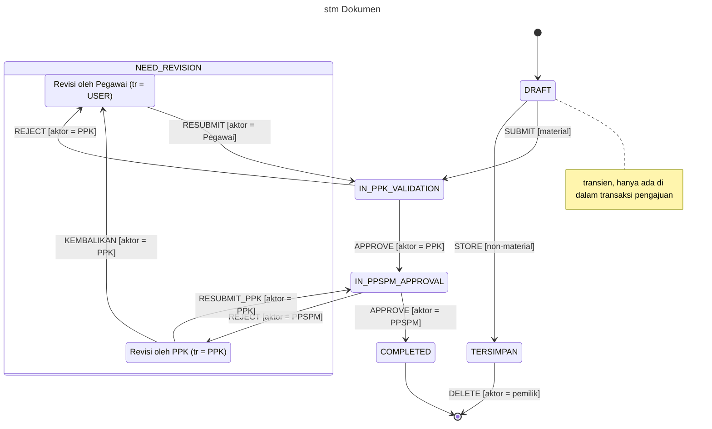
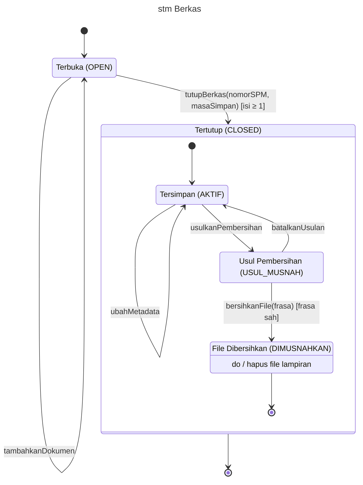

# Rancangan *Behavioral State Machine Diagram* Bab IV (Gambar 4.15 dan 4.17)

Dibuat 28 September 2026. Status: **sudah diverifikasi terhadap kode (28 Sept 2026)**. **Opsi B (*composite state*) dipilih untuk kedua gambar** (Q-SM1). Blok Mermaid Opsi A dihapus agar tidak tertukar saat menggambar.

> **Catatan verifikasi.** Otoritas satu-satunya adalah `src/` dan `drizzle/`. Kolom **Cek** berisi **S** (sesuai), **B** (beda; versi kode dan `berkas:baris` ditulis), **T** (tidak ada di kode), atau **+** (ada di kode, sebelumnya belum ada di rancangan). Daftar transisi sudah diperiksa **tertutup**: setiap penulisan `dokumen_transaksi.status` dan `berkas_arsip.status_berkas`/`status_arsip` di kode punya tepat satu baris transisi (bagian 7, D-8 dan B-8). Kode aplikasi tidak diubah.

Penomoran gambar mengikuti **"Daftar Gambar Bab IV - Status dan Revisi"** (4.15 status dokumen, 4.17 status berkas), yang mengesampingkan penomoran Kerangka Bab IV Revisi 9.1 (4.15 dan 4.19). Isi transisi diambil dari `penjelasan-proyek-aplikasi.md` bagian B.2 dan B.3, tabel transisi di Kerangka Bab IV 4.2.2.1, dan hasil verifikasi *sequence diagram* 27 Sept.

---

## 0. Ringkasan koreksi per gambar

| Gambar | Koreksi yang mengubah gambar | Koreksi kecil (hanya tabel/label/narasi) |
|---|---|---|
| 4.15 | (1) *Event* `simpan` → **`STORE`** dan `hapus` → **`DELETE`**, supaya semua *event* di gambar memakai konstanta aksi seperti `SUBMIT`/`APPROVE` (K-SM2); keduanya nilai `log_aktivitas.aksi` di kode. (2) *Guard* hapus disederhanakan menjadi **`[aktor = pemilik]`**: syarat "tidak di berkas" selalu benar untuk `TERSIMPAN`, karena pengklasifikasian hanya menerima dokumen `COMPLETED` (`kasubag/dokumen.$id.archive.ts:103`). Pemeriksaannya tetap ada di kode sebagai pengaman dan ditulis di tabel. (3) Blok *composite* ditulis **sebelum** panah yang menuju sub-statusnya, agar Mermaid meletakkan sub-status di dalam `NEED_REVISION` | Label tampilan `IN_PPK_VALIDATION` = **"Menunggu PPK"**, bukan "Divalidasi PPK" (D-1). `current_step` di tiap sub-status sudah pasti: Revisi Pegawai = PPK, Revisi PPK = PPSPM. Setelah KEMBALIKAN, `current_step` berubah PPSPM → PPK. T-D6 **tidak** menghapus file; penghapusan file lama terjadi di PATCH simpan perbaikan. Catatan KEMBALIKAN di `revision_notes` dan di `log_aktivitas.catatan` isinya berbeda (D-5). PPSPM APPROVE punya pemeriksaan tambahan "belum pernah disetujui" |
| 4.17 | (1) **Tambah `Tertutup --> [*]`** di luar *composite*. Tanpa panah ini status akhir di dalam "Tertutup" hanya menyelesaikan *region* dalam, dan mesin status berkas tidak pernah selesai. (2) **`/ hapus file` dipindah dari label transisi ke *activity* `do / hapus file lampiran` di dalam "File Dibersihkan"**. Menurut UML, aksi transisi dijalankan *sebelum* status tujuan dimasuki. Kode justru mengubah status lebih dulu, baru menghapus file (`lifecycle.ts:55-62`), dan penghapusannya berulang per file serta bisa gagal sebagian. Itu sifat *activity* (nonatomik), bukan *action*, menurut Dennis. (3) Nilai atribut ditulis di **nama status**, mis. "Tersimpan (AKTIF)", bukan di kompartemen. Kompartemen status di UML untuk perilaku internal, jadi ini menjawab Q-SM7 | Nomor baris service (`closeBerkasArsip` 355-408, `updateActiveBerkasMetadata` 460-505, pemetaan status 921-946). Pesan 409 tanpa kata "pada". Pembersihan menghapus file lampiran **WORKFLOW dan MANUAL**; hanya dokumen WORKFLOW yang ditandai `BERKAS_DIMUSNAHKAN`, dan penandaan itu *best-effort* setelah file dihapus. Tiga transisi siklus dan ubah metadata **tidak** satu transaksi dengan pencatatan riwayat (lihat Temuan K-1) |
| Keduanya | Bagian 1.3 dan paragraf Bab II (bagian 9) ditambah ***activity*** (`do / …`), karena sekarang dipakai satu kali. Tabel UML (bagian 2) disesuaikan dengan Opsi B: KEMBALIKAN bukan lagi *self-transition* | — |

### Temuan kode (dicatat saja, kode **tidak** diubah)

| # | Temuan | Rujukan | Dampak ke naskah |
|---|---|---|---|
| K-1 | `transitionBerkasArchiveStatus` dan `updateActiveBerkasMetadata` memakai *repository* bawaan tanpa `runInRepositoryTransaction`. Perubahan status dan penulisan riwayat berkas adalah dua pernyataan terpisah (*autocommit*). Bila penulisan riwayat gagal, status tetap berubah tanpa riwayat. `closeBerkasArsip` sudah dibungkus transaksi | `berkas-arsip-service.ts:355-361` (dibungkus) vs `:410-458`, `:460-505` (tidak) | Untuk berkas, **jangan** menulis "dalam transaksi yang sama". Cukup "setiap transisi dicatat pada riwayat berkas". Bila ingin diperbaiki, itu tugas terpisah |
| K-2 | PATCH simpan perbaikan (Pegawai dan PPK) memeriksa status lalu menulis dengan `WHERE id` saja, tanpa syarat status | `dokumen.$id.ts:587-590`, `ppk/resubmit/$id.ts:353-356` | Tidak mengubah status, jadi tidak berdampak ke diagram. Cukup diketahui |

---

## 1. Notasi menurut Dennis et al. (2015)

Sumber utama: Dennis, Wixom, & Tegarden (2015), *Systems Analysis and Design: An Object-Oriented Approach with UML* (ed. ke-5), Bab 6 "Behavioral Modeling", subbab *Behavioral State Machines*. **[PERLU DICEK oleh Daniel: nomor halaman terhadap buku; perkiraan ± hlm. 226–234.]**

### 1.1 Definisi dan kapan dipakai

- *Behavioral state machine* adalah model dinamis yang menunjukkan **status-status yang dilalui satu objek** sepanjang hidupnya sebagai tanggapan atas kejadian (*event*), beserta tanggapan dan aksinya.
- Diagram ini **tidak dibuat untuk semua objek**, hanya untuk objek yang kompleks, yaitu objek yang perilakunya berbeda-beda menurut statusnya. Di aplikasi ini hanya ada dua objek seperti itu: **dokumen** (`dokumen.dokumen_transaksi`) dan **berkas** (`arsip.berkas_arsip`). Karena itu Bab IV cukup memuat dua gambar.
- Subbab Bab II yang sudah ada (draf "Draf Landasan Teori - FSM dan State Machine Diagram") memakai istilah resmi ***Behavioral State Machine Diagram*** dan enam unsur Figure 6-17. Dokumen ini mengikuti istilah itu.

### 1.2 Enam unsur notasi (Figure 6-17, sudah ada di Bab II)

| No | Unsur | Simbol | Dipakai di rancangan ini |
|---|---|---|---|
| 1 | *State* | Persegi panjang bersudut membulat, diberi nama | Enam status dokumen (dua sub-status di `NEED_REVISION`); dua status berkas (tiga sub-status di "Tertutup") |
| 2 | *Initial state* | Lingkaran kecil terisi penuh | Satu per diagram, ditambah satu di dalam "Tertutup" (sub-status awal) |
| 3 | *Final state* | Lingkaran mengelilingi lingkaran kecil terisi (*bull's-eye*) | Satu per diagram, ditambah satu di dalam "Tertutup" |
| 4 | *Event* | Label teks pada transisi | Konstanta aksi (dokumen) atau nama operasi (berkas) |
| 5 | *Transition* | Panah garis penuh dari satu status ke status lain | Semua perpindahan |
| 6 | *Frame* | Kotak dengan label bertakik di kiri atas | `stm Dokumen`, `stm Berkas` |

### 1.3 Unsur yang dijelaskan dalam teks Dennis, tetapi tidak ada di tabel Figure 6-17

Rancangan ini memakai tiga unsur berikut. **Bab II perlu ditambah satu paragraf** yang menyebutkannya (draf di bagian 9), karena tabel enam unsur di Bab II tidak memuatnya.

| Unsur | Makna menurut Dennis et al. | Cara menulis | Dipakai di |
|---|---|---|---|
| ***Guard condition*** | Ekspresi Boolean atas nilai atribut; transisi hanya terjadi bila kondisinya benar | `[kondisi]` setelah nama *event* | Kedua gambar |
| ***Action*** | Proses atomik yang tidak dapat disela, dijalankan saat transisi terjadi | `/ aksi` setelah *guard* | Tidak ada lagi di Opsi B (aksi `tr ← …` tersirat dari sub-status tujuan). Unsur ini tetap dijelaskan di Bab II karena merupakan bagian sintaks label transisi |
| ***Activity*** | Proses nonatomik yang melekat pada status dan dapat disela | `do / aktivitas` di dalam status | Satu kali: "File Dibersihkan" (`do / hapus file lampiran`) di Gambar 4.17 |

### 1.4 Lima langkah pembuatan

| Langkah | Isi | Penerapan |
|---|---|---|
| 1. *Set context* | Tentukan objek yang dimodelkan; digambar sebagai *frame* | Bagian "Konteks" tiap gambar |
| 2. *Identify the initial, final, and stable states* | Tentukan status awal, akhir, dan status stabil objek | Tabel "Status" |
| 3. *Determine the order* | Tentukan urutan objek melewati status-status stabil | Tata letak diagram (atas ke bawah) |
| 4. *Identify the events, actions, and guard conditions* | Tentukan kejadian, aksi, dan kondisi penjaga tiap transisi | Tabel "Transisi" |
| 5. *Validate* | Pastikan setiap status dapat dicapai dan dapat ditinggalkan (kecuali status akhir), dan diagram seimbang dengan model lain | Bagian 6 dan hasil verifikasi |

### 1.5 Pedoman penggambaran

1. Buat hanya untuk objek yang perilakunya berubah menurut status. ✔ (dokumen, berkas)
2. Letakkan *initial state* di kiri atas dan *final state* di kanan bawah. (Mermaid menata otomatis; atur ulang saat gambar akhir bila memungkinkan.)
3. Beri nama status yang sederhana tetapi deskriptif.
4. Waspadai ***black hole*** (status tanpa transisi keluar, padahal bukan status akhir) dan ***miracle*** (status tanpa transisi masuk, padahal bukan status awal).
5. *Guard condition* pada transisi yang keluar dari status yang sama untuk *event* yang sama harus **saling meniadakan**.
6. Setiap transisi harus terkait dengan satu pesan dan operasi (lihat keseimbangan di bagian 6).

---

## 2. Notasi pelengkap dari UML 2.5.1 (di luar buku Dennis)

Sumber: OMG (2017), *Unified Modeling Language* versi 2.5.1 (formal/17-12-05), klausul 14 *StateMachines*. Ringkasan notasi dicek melalui [uml-diagrams.org — State Machine Diagrams](https://www.uml-diagrams.org/state-machine-diagrams.html) dan [uml-diagrams.org — Protocol State Machines](https://www.uml-diagrams.org/protocol-state-machine-diagrams.html).

> **[PERLU DICEK oleh Daniel]** PDF OMG belum bisa dibuka dari lingkungan kerja ini. Cocokkan nomor subbab dengan PDF resmi (https://www.omg.org/spec/UML/2.5.1/PDF) sebelum menyitasi nomor subbab. Yang biasa dirujuk: 14.2 *Behavior StateMachines*, 14.2.4 *Notation*, 14.4 *ProtocolStateMachines*.

| Hal | Aturan UML 2.5.1 | Dampak pada rancangan |
|---|---|---|
| Sintaks label transisi | `[trigger] ['[' guard ']'] ['/' behavior-expression]` | Semua label mengikuti urutan *event* `[guard]` |
| Urutan eksekusi | Saat transisi terjadi: *exit* status asal → *effect* (aksi transisi) → *entry* status tujuan → *do-activity* | Alasan `hapus file` ditulis sebagai *do-activity* "File Dibersihkan", bukan aksi transisi: di kode status diubah lebih dulu, lalu file dihapus |
| Label *frame* | Jenis diagram untuk *state machine* ditulis `stm` | *Frame* `stm Dokumen` dan `stm Berkas` (sejalan dengan `sd …` di *sequence diagram*) |
| *Self-transition* | Transisi yang asal dan tujuannya status yang sama; objek keluar lalu masuk lagi | Dipakai untuk `tambahkanDokumen` dan `ubahMetadata` (berkas). **KEMBALIKAN bukan lagi *self-transition*** di Opsi B, melainkan transisi antar-sub-status di dalam `NEED_REVISION` |
| *Internal transition* | Kejadian ditangani tanpa keluar dari status; ditulis di kompartemen dalam status | Tidak dipakai (tidak ada di Dennis). Kejadian yang tidak mengubah status dinarasikan (bagian 4.4 dan 5.4) |
| *Completion transition* | Transisi tanpa *trigger*; terjadi segera setelah status (dan *do-activity*-nya) selesai | `COMPLETED → final`; "File Dibersihkan" → final dalam; `Tertutup → final` (terjadi saat *region* dalam mencapai final) |
| Transisi dari *initial state* | Boleh membawa aksi, tetapi tidak boleh memiliki *guard* | Transisi awal dibiarkan tanpa label; percabangan material/non-material diletakkan setelah `DRAFT` |
| *Composite state* | Status yang berisi sub-status di dalam satu *region*. Objek yang berada di sub-status juga berada di status komposit. Transisi dari luar boleh langsung menuju sub-status (*explicit entry*); transisi yang berakhir di batas status komposit masuk ke sub-status awalnya (*default entry*). *Final state* di dalam *region* menyelesaikan status komposit, lalu memicu *completion transition* dari status komposit itu | Dokumen: `REJECT` masuk langsung ke sub-status (*explicit entry*). Berkas: `tutupBerkas` berakhir di batas "Tertutup" lalu masuk ke "Tersimpan" lewat sub-status awal (*default entry*); final dalam + `Tertutup → final` |
| *Behavior* vs *protocol state machine* | *Protocol state machine* (kata kunci `{protocol}`) menyatakan urutan pemanggilan operasi yang sah, dengan label `[prakondisi] operasi / [pascakondisi]`, tanpa aksi | Modul transisi status memang mirip *protocol state machine*. Tetap dipakai *behavioral state machine* karena itu yang dibahas Dennis dan Bab II. Cukup disadari; tidak perlu ditulis di naskah |

---

## 3. Konvensi yang dipakai di kedua gambar

| # | Konvensi | Alasan |
|---|---|---|
| K-SM1 | Satu diagram = satu objek. Status = nilai atribut status objek di basis data | Dennis: *state* adalah sekumpulan nilai atribut; menjamin keseimbangan dengan ERD |
| K-SM2 | **Dokumen:** *event* = konstanta aksi berhuruf kapital: aksi modul transisi status (`SUBMIT`, `APPROVE`, `REJECT`, `RESUBMIT`, `RESUBMIT_PPK`, `KEMBALIKAN`), ditambah `STORE` dan `DELETE` untuk dua jalur di luar modul (nilai `log_aktivitas.aksi`, `local-submit-write-bridge.ts:451`, `dokumen.$id.ts:811`) | Sama dengan Tabel Transisi Status Dokumen, 49 kasus uji, dan argumen `tentukanTransisi(…, APPROVE, PPK)` di *sequence* 4.18/4.20. `STORE` sudah dipakai di *sequence* 4.18 pesan 19. **[Keputusan Daniel, Q-SM3]** |
| K-SM3 | **Berkas:** *event* = nama operasi berbahasa Indonesia (`tutupBerkas`, `usulkanPembersihan`, …) | Tidak ada tabel aksi baku untuk berkas; nama kode (`propose_destruction`, dll.) berbahasa Inggris dan berbentuk *snake_case*. Gaya ini sama dengan label pesan *sequence* (K5) |
| K-SM4 | Aktor ditulis sebagai *guard* `[aktor = PPK]` (hanya dokumen) | Modul transisi status memang menolak aktor yang tidak berhak (pemeriksaan pertama di `transition()`, `fsm.ts:87-93`), jadi aktor secara harfiah adalah kondisi penjaga |
| K-SM5 | Singkatan `tr` = `revision_target`, dipakai **hanya di nama sub-status** `NEED_REVISION` | Di Opsi B, sub-status tujuan sudah menyatakan siapa yang memperbaiki, jadi aksi `tr ← …` tidak ditulis. Singkatan dijelaskan di keterangan gambar |
| K-SM6 | Label di gambar **ringkas** (*event* dan *guard* utama). Prasyarat lengkap, perubahan atribut pendamping, pencatatan riwayat, dan rujukan kode ada di tabel | Label panjang membuat gambar tidak terbaca. Rincian tetap lengkap di tabel yang berdampingan dengan gambar |
| K-SM7 | **Pencatatan riwayat tidak ditulis di setiap label**, cukup satu kalimat keterangan | Berlaku untuk semua transisi. Untuk dokumen boleh ditulis "dalam transaksi yang sama"; untuk berkas **tidak** (Temuan K-1) |
| K-SM8 | Kejadian yang **tidak mengubah status** tidak digambar (kecuali *self-transition* yang menjadi klaim rancangan), tetapi didaftar di tabel tersendiri | Mencegah diagram penuh; tetap terdokumentasi untuk narasi |
| K-SM9 | Istilah naskah: "dokumen" sebelum diberkaskan, "berkas" sesudahnya; "modul transisi status" untuk `fsm.ts` | "Pedoman Penulisan dan Diagram (disepakati)" |
| K-SM10 | Nilai atribut penentu status ditulis di **nama status** dalam kurung, mis. "Tersimpan (AKTIF)" | Memperlihatkan definisi Dennis (status = nilai atribut) tanpa memakai kompartemen, yang di UML khusus untuk perilaku internal |

---

## 4. Gambar 4.15 — *Behavioral State Machine Diagram* Status Dokumen

### 4.1 Konteks

- **Frame:** `stm Dokumen`.
- **Objek:** satu baris `dokumen.dokumen_transaksi`.
- **Atribut penentu status:** `status` (6 nilai, `src/lib/constants/document-status.ts:1-8`). Sub-status `NEED_REVISION` ditentukan `revision_target` (USER/PPK). `current_step` (PPK/PPSPM/null) tidak digambar, tetapi nilainya selalu sejalan dengan status dan sub-status (tabel 4.2).
- **Pengatur transisi:** modul transisi status terpusat (`src/lib/fsm.ts`) untuk delapan transisi dokumen material (`fsm.ts:19-68`). Jalur non-material `DRAFT → TERSIMPAN` sengaja di luar modul (`local-submit-write-bridge.ts:439-452`); begitu pula hapus permanen.
- **Bukan status:** "sudah diberkaskan" (dibaca dari `arsip.berkas_arsip_item`), "lampiran sudah dibersihkan" (kolom `lampiran_dibersihkan_*`), dan posisi dokumen di Monitoring Dokumen Tim (diturunkan dari `status` + `revision_target`).

### 4.2 Status

Label tampilan diambil dari sumber baku `DOCUMENT_STATUS_BADGE_CONFIG` (`src/components/ui/StatusBadge.tsx:36-43`). Daftar dokumen Pegawai memakai label sendiri (`pegawai/dokumen/index.tsx:330-345`: "Validasi PPK", "Menunggu Persetujuan", "Dikembalikan ke PPK"); pakai label baku di naskah.

| Status (nama di gambar) | Label tampilan | Jenis | `current_step` | `revision_target` | Keterangan | Cek |
|---|---|---|---|---|---|---|
| `DRAFT` | Draft | Awal, **transien** | null | null | Baris dibuat `DRAFT` (`local-submit-drizzle-adapter.ts:216`) lalu langsung diubah dalam **transaksi yang sama** (`executeLocalSubmitWritePlan`, `local-submit-write-bridge.ts:366-398`). Tidak pernah terlihat di luar transaksi. Kolom `status` berbawaan `'DRAFT'` (`dokumen-transaksi.ts:47`) | S |
| `IN_PPK_VALIDATION` | **Menunggu PPK** | Stabil | PPK | null | Menunggu PPK; tampil di kotak masuk `/ppk/inbox` | B (label) |
| `IN_PPSPM_APPROVAL` | Menunggu PPSPM | Stabil | PPSPM | null | Menunggu PPSPM; tampil di `/ppspm/inbox` | S |
| `NEED_REVISION` (komposit) | Perlu Revisi | Stabil | lihat sub-status | USER atau PPK | Menunggu perbaikan. Tidak pernah dimasuki tanpa sub-status | S |
| ↳ Revisi oleh Pegawai (`tr = USER`) | Perlu Revisi | Sub-status | **PPK** | USER | Dimasuki lewat REJECT PPK atau KEMBALIKAN. `current_step` = PPK (`fsm.ts:34,64`) | + |
| ↳ Revisi oleh PPK (`tr = PPK`) | Perlu Revisi (daftar Pegawai: "Dikembalikan ke PPK") | Sub-status | **PPSPM** | PPK | Dimasuki lewat REJECT PPSPM (`fsm.ts:46-47`) | + |
| `COMPLETED` | Selesai | Akhir (material) | null | null | Tidak ada aksi yang mengubahnya lagi. Pengklasifikasian ke berkas **tidak** mengubah status | S |
| `TERSIMPAN` | Tersimpan | Akhir (non-material) | null | null | Tidak berubah status. Satu-satunya jalan keluar: dihapus permanen oleh pemilik | S |

### 4.3 Transisi

Prasyarat bersama **"syarat lengkap"** = nominal > 0 (material), minimal satu lampiran, dan kelengkapan wajib terunggah (`validateResubmitRequirements`, `src/lib/dokumen/resubmit-validation.ts`; untuk SUBMIT: `checkLampiranNotEmpty` dan `checkRequiredKelengkapan`, `local-submit-write-bridge.ts:269,296`).

Semua transisi material memakai **pembaruan bersyarat** `WHERE status = <asal>` (ditambah `AND revision_target = <tr>` untuk transisi dari `NEED_REVISION`). Bila baris tidak ter-update, rute melempar `DokumenTransitionConflictError` → 409.

| # | Asal | *Event* (label) | *Guard* di gambar | Prasyarat lengkap (tabel/narasi) | Perubahan atribut (tabel/narasi) | Tujuan | Riwayat (`log_aktivitas.aksi`) | Rujukan kode | Cek |
|---|---|---|---|---|---|---|---|---|---|
| T-D0 | *initial* | — | — | — | Baris dokumen dibuat berstatus `DRAFT` di dalam transaksi pengajuan | `DRAFT` | — | `tx.createDokumen`, `local-submit-write-bridge.ts:372`; INSERT `local-submit-drizzle-adapter.ts:216` | S |
| T-D1 | `DRAFT` | `SUBMIT` | `[material]` | aktor Pegawai; syarat lengkap; Komponen terisi; status Ketua Tim diambil dari penugasan, bukan dari isian (`:281-294`) | `current_step ← PPK`; pindah file *pending* ke lokasi tetap di dalam transaksi (`afterWrites`) | `IN_PPK_VALIDATION` | `SUBMIT` | `fsm.ts:20-25`; dipanggil `local-submit-write-bridge.ts:456`; UPDATE `local-submit-drizzle-adapter.ts:229` | S |
| T-D1n | `DRAFT` | **`STORE`** | `[non-material]` | aktor Pegawai; minimal satu lampiran; Nama Dokumen terisi | `current_step ← null`; **di luar modul transisi status** (disengaja) | `TERSIMPAN` | `STORE` | `buildLocalSubmitTransitionPlan`, `local-submit-write-bridge.ts:439-452`; UPDATE sama dengan T-D1 | B (label `simpan` → `STORE`) |
| T-D2 | `IN_PPK_VALIDATION` | `APPROVE` | `[aktor = PPK]` | pembaruan bersyarat | `current_step ← PPSPM`, `revision_notes ← null` | `IN_PPSPM_APPROVAL` | `PPK_APPROVE` | `fsm.ts:26-31`; `api/ppk/dokumen/$id/approve.ts:79-83` (cek status), `:86`, `:93-119` | S |
| T-D3 | `IN_PPK_VALIDATION` | `REJECT` | `[aktor = PPK]` | catatan 10–2000 karakter (`rejectDokumenSchema`, `schemas/dokumen.ts:103-105`); pembaruan bersyarat | `tr ← USER`, `current_step ← PPK` (tetap), `revision_notes ← catatan` | Revisi oleh Pegawai | `PPK_REJECT` (catatan ikut disimpan) | `fsm.ts:32-37`; `api/ppk/dokumen/$id/reject.ts:87`, `:94-119` | S |
| T-D4 | `IN_PPSPM_APPROVAL` | `APPROVE` | `[aktor = PPSPM]` | pembaruan bersyarat; belum pernah ada `PPSPM_APPROVE` untuk dokumen ini (pengaman lama, `:64-79`) | `current_step ← null`, `revision_notes ← null` | `COMPLETED` | `PPSPM_APPROVE` | `fsm.ts:38-43`; `api/ppspm/dokumen/$id/approve.ts:81`, `:86-112` | S (+ pengaman) |
| T-D5 | `IN_PPSPM_APPROVAL` | `REJECT` | `[aktor = PPSPM]` | catatan 10–2000 karakter; pembaruan bersyarat | `tr ← PPK`, `current_step ← PPSPM` (tetap), `revision_notes ← catatan` | Revisi oleh PPK | `PPSPM_REJECT` (catatan ikut disimpan) | `fsm.ts:44-49`; `api/ppspm/dokumen/$id/reject.ts:85`, `:90-115` | S |
| T-D6 | Revisi oleh Pegawai | `RESUBMIT` | `[aktor = Pegawai]` | pemilik; **material** (non-material ditolak, `:106-110`); syarat lengkap; pembaruan bersyarat `status = NEED_REVISION ∧ tr = USER` | `tr ← null`, `current_step ← PPK`, `revision_notes ← null`. **Tidak ada penghapusan file** di rute ini (file sudah disimpan lewat PATCH, tabel 4.4) | `IN_PPK_VALIDATION` | `RESUBMIT` | `fsm.ts:50-55,104-109`; `api/dokumen.$id.submit.ts:100`, `:112`, `:145-171` | B (hapus file dipindah ke 4.4) |
| T-D7 | Revisi oleh PPK | `RESUBMIT_PPK` | `[aktor = PPK]` | syarat lengkap; pembaruan bersyarat `status = NEED_REVISION ∧ tr = PPK` | `tr ← null`, `current_step ← PPSPM`, `revision_notes ← null` (alasan PPSPM tetap ada di `log_aktivitas`); lampiran/nominal ikut disimpan; file dipindah sebelum transaksi, dikembalikan bila gagal, file lama yang diganti dihapus setelah *commit*. **Langsung ke PPSPM** tanpa antre di PPK | `IN_PPSPM_APPROVAL` | `RESUBMIT_PPK` | `fsm.ts:56-61,110-115`; `api/ppk/resubmit/$id.ts:448`, `:484-495`, `:498-539`, `:558` | S |
| T-D8 | Revisi oleh PPK | `KEMBALIKAN` | `[aktor = PPK]` | `tr = PPK` diperiksa **di rute** (`kembalikan/$id.ts:76`) dan di pembaruan bersyarat (`:98-102`) | `tr ← USER`, **`current_step ← PPK`** (sebelumnya PPSPM); `revision_notes ←` "Dikembalikan ke pegawai oleh PPK. Alasan penolakan PPSPM: …" (`:14-23,85`). `status` tetap `NEED_REVISION`; hanya sub-status yang berpindah | Revisi oleh Pegawai | `PPK_KEMBALIKAN` (catatan hanya "Dikembalikan ke pegawai oleh PPK", `:113`) | `fsm.ts:62-67`; `api/ppk/kembalikan/$id.ts:82`, `:87-116` | B (`current_step` berubah; beda isi catatan) |
| T-D9 | `COMPLETED` | — (*completion*) | — | — | Alur persetujuan dokumen material berakhir; baris tetap berstatus `COMPLETED` | *final* | — | Tidak ada penulisan `status` dari `COMPLETED` (D-7, D-8) | S |
| T-D10 | `TERSIMPAN` | **`DELETE`** | **`[aktor = pemilik]`** | peran Pegawai; pemilik; non-material murni (`is_non_material` dan tanpa jenis/kategori/detail permintaan); `TERSIMPAN`; bukan anggota berkas WORKFLOW (pengaman; selalu benar, lihat bagian 0). Lampiran yang sudah dibersihkan **tidak** menghalangi | baris dihapus permanen; `audit.audit_log` `DOKUMEN_DIHAPUS_PERMANEN` ditulis **sebelum** baris dihapus; `log_aktivitas` `DELETE` ikut terhapus (*cascade*, `log-aktivitas.ts:20`); file dihapus setelah *commit* | *final* | `DELETE` (terhapus *cascade*) + audit | `DELETE /api/dokumen/$id`, `dokumen.$id.ts:680-750` (syarat), `:753-773` (cek berkas), `:789-823` (transaksi) | B (label dan *guard*) |

**Periksa kelengkapan *guard* (pedoman 5).** Dari `DRAFT`: `[material]` dan `[non-material]` saling meniadakan (keduanya terpicu oleh satu permintaan pengajuan; cabang ditentukan `is_non_material`). Dari sub-status Revisi oleh PPK: `RESUBMIT_PPK` dan `KEMBALIKAN` berbeda *event*. Dari `IN_PPK_VALIDATION` dan `IN_PPSPM_APPROVAL`: `APPROVE` dan `REJECT` berbeda *event*.

**Black hole / miracle (pedoman 4).** Tidak ada. Setiap status dan sub-status stabil punya transisi masuk dan keluar. `COMPLETED` dan `TERSIMPAN` punya transisi ke *final state*.

**Konflik bersamaan (409).** Bukan transisi. Bila dua pejabat menekan tombol bersamaan, pembaruan bersyarat hanya berhasil untuk satu; yang lain mendapat 409 dan status tidak berubah (`DokumenTransitionConflictError`, `src/lib/dokumen/transition-conflict.ts`). Dinarasikan, tidak digambar.

### 4.4 Kejadian yang tidak mengubah status dokumen (tidak digambar, dinarasikan)

| Kejadian | Status saat itu | Yang berubah | Rujukan | Cek |
|---|---|---|---|---|
| Pegawai menyimpan perbaikan (lampiran, nominal, keterangan) sebelum mengajukan ulang | `NEED_REVISION`, `tr = USER`, pemilik | kolom dokumen; status tetap; file lama yang diganti dihapus setelah *commit* bila tidak dirujuk lagi. **Tidak** menulis `log_aktivitas` untuk dokumen material | `PATCH /api/dokumen/$id`, `dokumen.$id.ts:498-512` (syarat), `:561-603`, `:619-625` (hapus file) | B (hapus file pindah ke sini) |
| PPK menyimpan perbaikan tanpa mengirim | `NEED_REVISION`, `tr = PPK` | lampiran, nominal; status tetap; tanpa `log_aktivitas` | `PATCH /api/ppk/resubmit/$id`, `ppk/resubmit/$id.ts:261-372` (syarat `:310`) | S |
| Pemilik mengubah dokumen non-material | `TERSIMPAN`, lampiran belum dibersihkan | nama dokumen (judul dihitung ulang), keterangan, lampiran; `log_aktivitas` `UPDATE` | `dokumen.$id.ts:498-503`, `:596-603` | S (+ riwayat `UPDATE`) |
| Ketua Tim membersihkan lampiran non-material | `TERSIMPAN` | `lampiran_dibersihkan_*` (alasan `PEMBERSIHAN_NON_MATERIAL`) + `audit_log` `DOKUMEN_LAMPIRAN_DIBERSIHKAN`; status tetap | `api/pembersihan-dokumen.bersihkan.ts`; `pembersihan-service.ts:78`, `:337-361` | S |
| KSBU mengklasifikasikan dokumen ke berkas | `COMPLETED` (syarat, `archive.ts:103`) | baris baru `berkas_arsip_item`; status tetap | `api/kasubag/dokumen.$id.archive.ts:105-118` | S |
| KSBU membersihkan file berkas | `COMPLETED` (anggota berkas WORKFLOW) | `lampiran_dibersihkan_alasan = BERKAS_DIMUSNAHKAN` + `audit_log` `BERKAS_LAMPIRAN_DIBERSIHKAN`; status tetap | `berkas-arsip-physical-destruction.ts:297-302`, `:682-720` | S |
| Admin mencabut penugasan Ketua Tim | apa pun | tidak ada; `is_ketua_tim` dibekukan sejak SUBMIT (D-12) | `resubmit-validation.ts` (komentar kebijakan) | S |

### 4.5 Kode Mermaid final (Opsi B: `NEED_REVISION` sebagai *composite state*)

`NEED_REVISION` dipecah menjadi dua sub-status menurut `revision_target`. `REJECT` masuk langsung ke sub-status (*explicit entry*). `KEMBALIKAN` menjadi transisi antar-sub-status: status dokumen tetap `NEED_REVISION`, hanya pihak yang memperbaiki yang berganti. Blok *composite* sengaja ditulis sebelum panah yang menuju sub-statusnya.



**Keterangan gambar (untuk naskah):** "tr = *revision_target* (pihak yang harus memperbaiki). Setiap transisi menulis satu baris riwayat aktivitas dalam transaksi yang sama dan memakai pembaruan bersyarat terhadap status asal. Transisi `STORE` dan `DELETE` (dokumen non-material) tidak melalui modul transisi status."

### 4.6 Draf narasi (untuk naskah 4.2.2.1)

> Perpindahan status dokumen dimodelkan dengan *Behavioral State Machine Diagram* pada Gambar 4.15, sebagai visualisasi aturan modul transisi status terpusat: hanya transisi yang tergambar yang diizinkan. Dokumen dibuat berstatus `DRAFT` dan dalam transaksi yang sama langsung berpindah ke `IN_PPK_VALIDATION` bila bersifat material, atau ke `TERSIMPAN` bila non-material, sehingga status `DRAFT` tidak pernah tersimpan permanen. Status `NEED_REVISION` digambar sebagai status komposit dengan dua sub-status menurut pihak yang harus memperbaiki. Penolakan oleh PPK membawa dokumen ke sub-status Revisi oleh Pegawai, sedangkan penolakan oleh PPSPM membawanya ke sub-status Revisi oleh PPK. Dari sub-status Revisi oleh PPK, PPK dapat mengirim ulang langsung ke PPSPM atau mengembalikan dokumen ke Pegawai; pengembalian ini tidak mengubah status dokumen, hanya memindahkan sub-statusnya. `COMPLETED` dan `TERSIMPAN` adalah status akhir; pengklasifikasian ke berkas tidak mengubah status dokumen, dan dokumen `TERSIMPAN` hanya dapat keluar dari status tersebut bila dihapus permanen oleh pemiliknya. Rincian prasyarat dan perubahan atribut setiap transisi disajikan pada Tabel 4.x.

---

## 5. Gambar 4.17 — *Behavioral State Machine Diagram* Status Berkas

### 5.1 Konteks

- **Frame:** `stm Berkas`.
- **Objek:** satu baris `arsip.berkas_arsip` (satu per pasangan Cara Pembayaran × Tahun Anggaran; UNIQUE `berkas_arsip_klasifikasi_tahun_unique`).
- **Atribut penentu status:** `status_berkas` (OPEN/CLOSED) di tingkat luar, `status_arsip` (AKTIF/USUL_MUSNAH/DIMUSNAHKAN) di dalam "Tertutup". Kombinasi dijaga CHECK di `src/db/schema/arsip/berkas-arsip.ts:62-76` (OPEN ⇒ `status_arsip` NULL; CLOSED ⇔ `closed_at/closed_by` terisi). INAKTIF hanya ada di CHECK dan tidak pernah ditulis.
- **Aktor semua transisi:** KSBU (`requireBerkasArsipApiSession`, `berkas-arsip-api.ts:22`; rute klasifikasi `archive.ts:57`). Karena satu aktor, aktor **tidak** ditulis sebagai *guard* (beda dengan 4.15); cukup di keterangan gambar.
- **Mengapa gambar ini penting:** pembersihan file berkas **tidak punya *activity diagram*** (keputusan 27 Sept). Gambar ini satu-satunya gambar yang memperlihatkan alur usul → batal/bersihkan.

### 5.2 Status

Label diambil dari `FOLDER_STATUS_BADGE_CONFIG` dan `ARCHIVE_STATUS_BADGE_CONFIG` (`StatusBadge.tsx:45-54`).

| Status (nama di gambar) | `status_berkas` | `status_arsip` | Label di aplikasi | Jenis | Cek |
|---|---|---|---|---|---|
| Terbuka (OPEN) | OPEN | NULL | Berkas Terbuka (menu Berkas Terbuka) | Awal stabil | S |
| Tertutup (CLOSED) — komposit | CLOSED | salah satu sub-status | Berkas Ditutup | Komposit | S |
| ↳ Tersimpan (AKTIF) | CLOSED | AKTIF | Tersimpan (menu Berkas Tertutup) | Sub-status awal, stabil | S |
| ↳ Usul Pembersihan (USUL_MUSNAH) | CLOSED | USUL_MUSNAH | Usul Pembersihan | Stabil | S |
| ↳ File Dibersihkan (DIMUSNAHKAN) | CLOSED | DIMUSNAHKAN | File Dibersihkan | Akhir; *do / hapus file lampiran*; metadata, Nomor SPM, item, riwayat tetap ada | S |
| *(tidak digambar)* | CLOSED | INAKTIF | — | Nilai enum mati, tidak pernah dituju (D-16) | S |
| *(tidak digambar)* | CLOSED | NULL | — | Diizinkan CHECK, tetapi tidak pernah ditulis: penutupan mengisi CLOSED dan AKTIF sekaligus (`berkas-arsip-service.ts:707-710`) | + |

### 5.3 Transisi

| # | Asal | *Event* (label) | *Guard* di gambar | Prasyarat lengkap | Perubahan atribut / aksi lain | Tujuan | Riwayat (`berkas_arsip_activity`) | Rujukan kode | Cek |
|---|---|---|---|---|---|---|---|---|---|
| T-B0 | *initial* | — | — | Cara Pembayaran aktif dan simpul daun; belum ada berkas untuk pasangan (klasifikasi, TA) | dibuat otomatis (*get-or-create*) saat dokumen persetujuan pertama diklasifikasikan atau dokumen manual pertama ditambahkan, di dalam transaksi pemanggil; `INSERT … ON CONFLICT DO NOTHING`; hanya pemenang balapan yang mencatat | Terbuka | `BERKAS_DIBUKA` | `getOrCreateOpenBerkasForKlasifikasi`, `berkas-arsip-service.ts:249-272`; `insertOpenBerkasWithActivity` `:878-903`; pemanggil `kasubag/dokumen.$id.archive.ts:106-118` dan `manual-arsip.ts:234`, `:290-301`. `POST /api/kasubag/berkas/open` **tidak dipanggil halaman mana pun** (B-1) | S |
| T-B1 | Terbuka | `tambahkanDokumen` | — | berkas masih OPEN (`BERKAS_CLOSED` 409 bila tidak); sumber dokumen `COMPLETED` (WORKFLOW) atau entri manual (MANUAL); Cara Pembayaran sumber = berkas; dokumen belum ada di berkas lain (UNIQUE `dokumen_id`/`manual_arsip_id`) | *self-transition*; INSERT `berkas_arsip_item` | Terbuka | `DOKUMEN_PERSETUJUAN_DIKLASIFIKASIKAN` atau `DOKUMEN_MANUAL_DITAMBAHKAN` | `assertBerkasCanAcceptItems` `:274-291`; `addWorkflowDocumentToOpenBerkas` `:293-322`; `addManualDocumentToOpenBerkas` `:324-353` | S |
| T-B2 | Terbuka | `tutupBerkas(nomorSPM, masaSimpan)` | `[isi ≥ 1]` | status OPEN; Nomor SPM wajib (≤120 karakter); Masa Simpan Minimal 1/3/5/10 Tahun/Permanen; tanggal tutup opsional (bawaan hari ini); berkas kosong ditolak (`BERKAS_EMPTY`, 409); pembaruan bersyarat `WHERE status_berkas = OPEN`; **satu transaksi** dengan riwayat | `status_berkas ← CLOSED`, `status_arsip ← AKTIF` (masuk sub-status awal); isi `closed_at/closed_by`, `nomor_spm`, `retensi_aktif`; hitung `masa_aktif_berakhir`. Pasangan (klasifikasi, TA) terkunci permanen (Q2) | Tertutup → Tersimpan (*default entry*) | `BERKAS_DITUTUP` | `POST /api/kasubag/berkas/$id/close`; `berkas-arsip-service.ts:355-408`; UPDATE `:703-725`; skema `schemas/berkas-arsip.ts:48-59` | B (baris) |
| T-B3 | Tersimpan | `ubahMetadata` | — | hanya CLOSED + AKTIF (`BERKAS_METADATA_NOT_EDITABLE`, 409); pembaruan bersyarat | *self-transition*; ubah `nomor_spm` dan `retensi_aktif`; `masa_aktif_berakhir` **dihitung ulang** dari `closed_at` lama (tanggal tutup tidak bisa diubah) | Tersimpan | `METADATA_ARSIP_AKTIF_DIPERBARUI` | `PATCH /api/kasubag/berkas/$id`; `berkas-arsip-service.ts:460-505`, `:507-532`; UPDATE `:746-766` | S |
| T-B4 | Tersimpan | `usulkanPembersihan` | — | **tidak** mensyaratkan jatuh tempo; jatuh tempo hanya penanda dan penyaring tombol "usulkan semua" di UI; pembaruan bersyarat `status_arsip = AKTIF` | `status_arsip ← USUL_MUSNAH` | Usul Pembersihan | `BERKAS_DIPINDAHKAN_KE_USUL_MUSNAH` | aksi `propose_destruction`, `api/kasubag/berkas/$id/lifecycle.ts:19-24`; `transitionBerkasArchiveStatus` `berkas-arsip-service.ts:410-458`; pemetaan `:921-946`; UPDATE `:728-744` | B (baris) |
| T-B5 | Usul Pembersihan | `batalkanUsulan` | — | pembaruan bersyarat `status_arsip = USUL_MUSNAH` | `status_arsip ← AKTIF` | Tersimpan | `METADATA_ARSIP_AKTIF_DIPERBARUI` (sengaja memakai peristiwa yang sudah ada di CHECK) | aksi `cancel_proposal`; pemetaan peristiwa `berkas-arsip-service.ts:988-1001` | S |
| T-B6 | Usul Pembersihan | `bersihkanFile(frasa)` | `[frasa sah]` | frasa persis `BERSIHKAN FILE BERKAS` ditegakkan server (`z.literal`, `lifecycle.ts:25-30`; konstanta `berkas-arsip-page-format.ts:16`); pembaruan bersyarat `status_arsip = USUL_MUSNAH` | `status_arsip ← DIMUSNAHKAN`. **Setelah** status berubah, *do-activity* status tujuan menghapus file (bagian 5.4a) | File Dibersihkan | `BERKAS_DIMUSNAHKAN` | aksi `approve_destruction`, `lifecycle.ts:55-62`, `:76-89` | B (`hapus file` jadi *activity*) |
| T-B7 | File Dibersihkan | — (*completion*, dalam) | — | *do-activity* selesai (berhasil atau gagal) | *region* "Tertutup" selesai | *final* dalam | — | tidak ada aksi keluar dari DIMUSNAHKAN (`:921-946`) | S |
| T-B8 | Tertutup | — (*completion*) | — | *region* dalam mencapai final | siklus hidup berkas berakhir; akses file berikutnya 410 "Data file sudah dimusnahkan" | *final* | — | `berkas-arsip-file-access.ts:140`, `:187` | + |

#### 5.4a Isi *do-activity* "hapus file lampiran" (T-B6)

| Langkah | Isi | Rujukan |
|---|---|---|
| 1 | Pastikan berkas CLOSED + DIMUSNAHKAN; bila tidak, berhenti (`FOLDER_NOT_DIMUSNAHKAN`) | `berkas-arsip-physical-destruction.ts:234-243` |
| 2 | Kumpulkan kandidat file dari keanggotaan berkas: lampiran dokumen **WORKFLOW** dan lampiran dokumen **MANUAL** | `:329-345`, `:390`, `:422` |
| 3 | Hapus file satu per satu; hitung terhapus/sudah hilang/dilewati/gagal | `:252-275`, `unlink` `:552` |
| 4 | Bila hasil `completed` atau `partial`: tandai dokumen **WORKFLOW** `lampiran_dibersihkan_alasan = BERKAS_DIMUSNAHKAN` dan tulis `audit_log` `BERKAS_LAMPIRAN_DIBERSIHKAN` per dokumen (*best-effort*; kegagalan tidak mengubah laporan) | `:297-302`, `:682-720` |
| 5 | Bila penghapusan gagal total, respons tetap 200 berisi laporan `failed`; status tetap DIMUSNAHKAN dan akses file tetap tertutup | `lifecycle.ts:80-104` |

**Black hole / miracle.** Tidak ada. Terbuka hanya bisa ditinggalkan lewat penutupan: **tidak ada** fitur hapus berkas atau mengeluarkan item dari berkas (B-4).

**Mengapa `tambahkanDokumen` digambar.** *Self-transition* ini memperlihatkan klaim rancangan bahwa berkas **hanya menerima dokumen selama Terbuka**; setelah ditutup, penambahan ditolak 409 "Berkas untuk Cara Pembayaran ini TA {tahun} sudah ditutup" (`berkas-arsip-service.ts:868-872`). Tanpa panah ini, pembaca tidak melihat perbedaan perilaku Terbuka dan Tertutup.

### 5.4 Kejadian yang tidak mengubah status berkas (dinarasikan)

| Kejadian | Status | Catatan | Cek |
|---|---|---|---|
| Ekspor ZIP per berkas / ekspor CSV | semua (ZIP ditolak setelah File Dibersihkan, `export-zip.ts:50`) | baca saja | S |
| Umur berkas dan penanda Jatuh Tempo dihitung saat halaman dibuka | Tersimpan | tanpa penjadwal (`computeBerkasAging`); bukan *time event* | S |
| Akses file anggota berkas | Terbuka, Tersimpan, Usul Pembersihan | 410 setelah File Dibersihkan (`berkas-arsip-file-access.ts:140,187`) | S |

> **Catatan *time event*.** Dennis menyebut berlalunya waktu sebagai salah satu jenis *event*. Di aplikasi ini jatuh tempo **tidak** memicu perpindahan status apa pun (tidak ada penjadwal), jadi tidak digambar sebagai transisi `after(…)`. Tulis satu kalimat di narasi agar penguji tidak menyangka status berubah otomatis.

### 5.5 Kode Mermaid final (Opsi B: "Tertutup" sebagai *composite state*)

`status_berkas` di tingkat luar, `status_arsip` di dalam "Tertutup". `tutupBerkas` berakhir di batas "Tertutup" dan masuk ke "Tersimpan" lewat sub-status awal (*default entry*), yang menyatakan bahwa `status_arsip` otomatis AKTIF saat ditutup. Final di dalam menyelesaikan "Tertutup", lalu `Tertutup --> [*]` mengakhiri siklus berkas.



**Keterangan gambar (untuk naskah):** "Seluruh transisi dilakukan KSBU dan dicatat pada riwayat berkas. Nilai dalam kurung adalah nilai `status_berkas` (tingkat luar) dan `status_arsip` (di dalam Tertutup). Frasa sah = `BERSIHKAN FILE BERKAS`. Jatuh tempo masa simpan hanya penanda dan tidak memindahkan status secara otomatis."

### 5.6 Draf narasi (untuk naskah 4.2.2.3)

> Siklus hidup berkas dimodelkan pada Gambar 4.17. Berkas dibuat otomatis dalam status Terbuka saat dokumen pertama untuk pasangan cara pembayaran dan tahun anggaran tertentu diklasifikasikan atau ditambahkan, dan hanya dalam status ini berkas dapat menerima dokumen. Penutupan berkas mensyaratkan minimal satu dokumen, Nomor SPM, dan masa simpan minimal. Status Tertutup digambar sebagai status komposit: begitu ditutup, berkas langsung berada pada sub-status Tersimpan, dan pasangan cara pembayaran serta tahun anggarannya tidak dapat dipakai lagi. Selama Tersimpan, metadata penutupan masih dapat diubah. Pembersihan file dilakukan dua tahap: KSBU mengusulkan pembersihan, yang masih dapat dibatalkan, lalu mengonfirmasi dengan frasa `BERSIHKAN FILE BERKAS`. Status diubah lebih dulu menjadi File Dibersihkan, kemudian aktivitas penghapusan file lampiran dijalankan di dalam status tersebut, sehingga bila penghapusan gagal, akses ke file tetap tertutup. Metadata, Nomor SPM, daftar isi, dan riwayat berkas tetap tersimpan. Jatuh tempo masa simpan dihitung saat halaman dibuka dan tidak memindahkan status secara otomatis.

---

## 6. Keseimbangan dengan model lain (langkah *Validate*)

Aturan dari Dennis et al. yang sudah dipakai di `rancangan-sequence-diagram.md` bagian 1.5, diterapkan untuk *behavioral state machine*:

- **V4.** Setiap transisi terkait dengan pesan pada *sequence diagram*.
- **V6.** Setiap status terkait dengan nilai atribut pada model struktural. Karena Bab IV tidak memakai *class diagram*, dicocokkan dengan **ERD** (4.27 transaksi dokumen, 4.28 pemberkasan).
- **V7.** Setiap transisi terkait dengan aksi pada *activity diagram* atau langkah skenario use case.

| Transisi | *Sequence* (V4) | *Activity* / use case (V7) | ERD (V6) | Catatan |
|---|---|---|---|---|
| T-D1 SUBMIT | 4.18 pesan 17 `tentukanTransisi(DRAFT, SUBMIT, PEGAWAI)` | 4.13 langkah 9; UC-05 | `dokumen_transaksi.status` | ✔ |
| T-D1n STORE | 4.18 pesan 19 `tetapkanStatusTersimpan(aksi STORE)` | 4.13 langkah 9; UC-05 alur alternatif | sama | ✔ (nama *event* kini sama dengan *sequence*) |
| T-D2 APPROVE (PPK) | 4.20 pesan 8 `tentukanTransisi(IN_PPK_VALIDATION, APPROVE, PPK)` | 4.14; UC-09 | sama | ✔ |
| T-D3 REJECT (PPK) | tidak digambar; narasi 4.20 "sepola" | 4.14; UC-09 alur alternatif | `status`, `revision_target` | Celah V4 yang diterima; sudah ditulis di catatan narasi 4.20 |
| T-D4 APPROVE (PPSPM) | narasi 4.20 "sepola" | 4.14; UC-11 | sama | sama |
| T-D5 REJECT (PPSPM) | narasi 4.20 | 4.14; UC-11 | `status`, `revision_target` | sama |
| T-D6 RESUBMIT | tidak ada | 4.14 (revisi Pegawai); UC-07 | sama | Tambahkan satu kalimat di narasi 4.2.2.4: "pengiriman ulang memakai pola yang sama dengan Gambar 4.20 ditambah validasi syarat lengkap" |
| T-D7 RESUBMIT_PPK | tidak ada | 4.14; UC-10 | sama | sama |
| T-D8 KEMBALIKAN | tidak ada | 4.14; UC-10 alur alternatif | `revision_target`, `current_step` | sama |
| T-D10 DELETE | tidak ada | UC-06 | `audit_log` (entitas tanpa FK) | Cukup narasi UC-06 |
| T-B0 buka berkas | 4.21 `sisipkanBerkasTerbuka` + `catatAktivitasBerkas(BERKAS_DIBUKA)` | 4.16(a); UC-13, UC-14 | `berkas_arsip.status_berkas` | ✔ |
| T-B1 tambahkanDokumen | 4.21 `sisipkanItemBerkas(WORKFLOW, …)` | 4.16(a) | `berkas_arsip_item` | ✔ |
| T-B2 tutupBerkas | tidak ada | 4.16(b); UC-15 | `status_berkas`, `status_arsip`, `closed_at/by` | ✔ lewat *activity* |
| T-B3 ubahMetadata | tidak ada | UC-15 | `berkas_arsip` | Narasi |
| T-B4–T-B6 pembersihan | tidak ada | **tidak ada *activity*** (diwakili gambar ini, keputusan 27 Sept); UC-16 | `status_arsip`; `lampiran_dibersihkan_*` | Skenario UC-16 harus memuat langkah usul, batal, bersihkan agar V7 terpenuhi |

---

## 7. Hasil butir [PERLU DICEK]

### 7.1 Dokumen (Gambar 4.15)

| # | Pertanyaan | Hasil |
|---|---|---|
| D-1 | Label tampilan persis setiap status | Sumber baku `DOCUMENT_STATUS_BADGE_CONFIG`, `StatusBadge.tsx:36-43`: DRAFT "Draft", IN_PPK_VALIDATION **"Menunggu PPK"**, IN_PPSPM_APPROVAL "Menunggu PPSPM", NEED_REVISION "Perlu Revisi", COMPLETED "Selesai", TERSIMPAN "Tersimpan". Bukan "Divalidasi PPK" maupun "Sedang Divalidasi PPK". Daftar Pegawai memakai label lain (`pegawai/dokumen/index.tsx:330-345`) |
| D-2 | Hanya `executeLocalSubmitWritePlan` yang membuat baris `DRAFT`? | **Ya.** Satu-satunya INSERT ke `dokumen_transaksi` adalah `local-submit-drizzle-adapter.ts:216`, dipanggil dari `local-submit-write-bridge.ts:372`. *Seed* (`src/db/seed/*`) tidak membuat dokumen. `src/routes/dokumen/*` hanya halaman dan tidak menulis. Sisa baris `DRAFT` di data **belum dicek** (perlu akses basis data): jalankan `SELECT count(*) FROM dokumen.dokumen_transaksi WHERE status = 'DRAFT';`, hasilnya harus 0 |
| D-3 | Aktor per transisi di `fsm.ts` | **Sesuai** (`isActorValidForAction`, `fsm.ts:129-156`): SUBMIT PEGAWAI; APPROVE/REJECT PPK di `IN_PPK_VALIDATION`, PPSPM di `IN_PPSPM_APPROVAL`; RESUBMIT PEGAWAI; RESUBMIT_PPK PPK; KEMBALIKAN PPK di `NEED_REVISION`. RESUBMIT juga mensyaratkan `tr = USER` dan RESUBMIT_PPK `tr = PPK` di dalam modul (`:104-115`). KEMBALIKAN tidak memeriksa `tr` di modul; `tr = PPK` diperiksa rute |
| D-4 | `current_step`, `revision_target`, `revision_notes` setelah tiap transisi | SUBMIT: PPK/null/null. PPK APPROVE: PPSPM/null/null. **PPK REJECT: PPK/USER/catatan.** PPSPM APPROVE: null/null/null. **PPSPM REJECT: PPSPM/PPK/catatan.** RESUBMIT: PPK/null/null. RESUBMIT_PPK: PPSPM/null/null. **KEMBALIKAN: PPK/USER/catatan otomatis.** Catatan penolakan juga disimpan di `log_aktivitas.catatan` |
| D-5 | Catatan KEMBALIKAN disimpan di mana? | **Keduanya, dengan isi berbeda.** `revision_notes` = "Dikembalikan ke pegawai oleh PPK. Alasan penolakan PPSPM: {alasan}" (`kembalikan/$id.ts:19-23,85`); `log_aktivitas.catatan` = "Dikembalikan ke pegawai oleh PPK" saja (`:113`) |
| D-6 | Syarat hapus permanen | Peran Pegawai; pemilik; non-material murni (`is_non_material = true` dan tanpa jenis/kategori/detail permintaan, `dokumen.$id.ts:745-748`); `TERSIMPAN`; tidak ada item berkas WORKFLOW (`:753-773`). Lampiran yang sudah dibersihkan **tidak** menghalangi. `log_aktivitas` ikut terhapus (*cascade*, `log-aktivitas.ts:20`); `audit_log` ditulis lebih dulu di transaksi yang sama (`:789-806`) |
| D-7 | Tidak ada rute yang mengubah `status` dari `COMPLETED`/`TERSIMPAN` | **Benar.** PATCH, pembersihan lampiran non-material, pengklasifikasian, dan pembersihan file berkas tidak menulis kolom `status` (lihat D-8). Satu-satunya jalan keluar dari `TERSIMPAN` adalah DELETE |
| D-8 | Daftar lengkap penulisan `status` | 10 tempat, semua cocok satu baris T-D: INSERT `local-submit-drizzle-adapter.ts:216` (T-D0); UPDATE `:229` (T-D1, T-D1n); `ppk/dokumen/$id/approve.ts:94` (T-D2); `ppk/dokumen/$id/reject.ts:95` (T-D3); `ppspm/dokumen/$id/approve.ts:87` (T-D4); `ppspm/dokumen/$id/reject.ts:91` (T-D5); `dokumen.$id.submit.ts:147` (T-D6); `ppk/resubmit/$id.ts:521` (T-D7); `ppk/kembalikan/$id.ts:90` (T-D8); DELETE `dokumen.$id.ts:816` (T-D10). UPDATE lain tanpa `status`: `dokumen.$id.ts:587`, `ppk/resubmit/$id.ts:353`, `pembersihan-service.ts:345`, `berkas-arsip-physical-destruction.ts:702`. Tidak ada tanda **+** |
| D-9 | Ketujuh rute memakai pembaruan bersyarat? | **Ya, semuanya.** `WHERE status = <asal>`; RESUBMIT, RESUBMIT_PPK, dan KEMBALIKAN juga `AND revision_target = <tr>`. Semua juga memeriksa status lebih dulu dan membalas 400 bila salah |
| D-10 | Syarat PATCH | `PATCH /api/dokumen/$id`: pemilik; material hanya saat `NEED_REVISION ∧ tr = USER`; non-material hanya saat `TERSIMPAN ∧` lampiran belum dibersihkan (`dokumen.$id.ts:489-512`). `log_aktivitas` (`UPDATE`) hanya untuk non-material. `PATCH /api/ppk/resubmit/$id`: hanya `NEED_REVISION ∧ tr = PPK` (`:310`), tanpa `log_aktivitas`. Keduanya menulis dengan `WHERE id` saja (Temuan K-2) |

### 7.2 Berkas (Gambar 4.17)

| # | Pertanyaan | Hasil |
|---|---|---|
| B-1 | Apakah `POST /api/kasubag/berkas/open` dan `POST …/$id/items` dipanggil halaman? | **Tidak.** Halaman hanya memanggil `…/lifecycle`, `…/close`, `PATCH …/$id`, `…/export-zip`, dan URL pratinjau/unduh item (`kasubag/berkas/$id.tsx:254,300,340,389,1061,2105`; `tertutup.tsx:116,134`; `pembersihan/index.tsx:150`). T-B0 cukup menyebut *get-or-create* dari pengklasifikasian dan penambahan dokumen manual |
| B-2 | PATCH metadata | Hanya CLOSED + AKTIF (`berkas-arsip-service.ts:471-476`, UPDATE bersyarat `:758-762`). Kolom: `nomor_spm`, `retensi_aktif`. `masa_aktif_berakhir` **dihitung ulang** dari `closed_at` lama; `closed_at` tidak bisa diubah (`:507-532`). Riwayat `METADATA_ARSIP_AKTIF_DIPERBARUI` (`:489-502`) |
| B-3 | Pembaruan bersyarat? Respons bila status asal salah? | **Bersyarat.** Penutupan: cek lalu `WHERE status_berkas = OPEN` (`:719-722`), dalam transaksi. Siklus: cek lalu `WHERE status_berkas = CLOSED ∧ status_arsip = <asal>` (`:737-741`). Status asal salah → **409** (`BERKAS_NOT_OPEN`, `BERKAS_EMPTY`, `BERKAS_LIFECYCLE_INVALID`, `BERKAS_LIFECYCLE_NOT_FINAL`, `BERKAS_METADATA_NOT_EDITABLE`; `berkas-arsip-api.ts:92-103`). Aksi tidak dikenal atau frasa salah → 400 (`lifecycle.ts:50-52`). Catatan: siklus dan metadata tidak satu transaksi dengan riwayat (Temuan K-1) |
| B-4 | Ada fitur hapus berkas atau keluarkan item? | **Tidak ada.** Satu-satunya `delete(berkasArsip…)` ada di `phase15-berkas-activity-dev-reset-analysis.ts:192-195`, alat reset pengembangan yang tidak diimpor di mana pun |
| B-5 | Asal yang sah tiap aksi siklus | **Sesuai.** `propose_destruction`: AKTIF → USUL_MUSNAH; `cancel_proposal`: USUL_MUSNAH → AKTIF; `approve_destruction`: USUL_MUSNAH → DIMUSNAHKAN (`berkas-arsip-service.ts:921-946`) |
| B-6 | Isi `approve_destruction` | Urutan: **status dulu** (`lifecycle.ts:55-59`), **lalu file** (`:60-62`). File yang dihapus: lampiran WORKFLOW **dan** MANUAL. Penandaan `BERKAS_DIMUSNAHKAN` + `audit_log` `BERKAS_LAMPIRAN_DIBERSIHKAN` **hanya untuk dokumen WORKFLOW**, *best-effort*, setelah file dihapus dan hanya bila hasilnya `completed`/`partial` (`berkas-arsip-physical-destruction.ts:297-302`, `:682-720`). Rincian di 5.4a |
| B-7 | Tidak ada aksi keluar dari DIMUSNAHKAN dan tidak ada jalur ke INAKTIF? | **Benar.** Tabel `allowed` tidak punya kunci DIMUSNAHKAN sebagai asal; INAKTIF tidak ditulis di kode mana pun (hanya ada di CHECK) |
| B-8 | Daftar lengkap penulisan `status_berkas`/`status_arsip` | Service: INSERT `berkas-arsip-service.ts:620` (T-B0), UPDATE tutup `:707` (T-B2), UPDATE siklus `:732` (T-B4/5/6). Adaptor *repository* dalam transaksi pemanggil: INSERT `kasubag/dokumen.$id.archive.ts:197` dan `manual-arsip.ts:426` (T-B0); keduanya juga mendefinisikan `closeOpenBerkas` (`archive.ts:265`, `manual-arsip.ts:496`) yang tidak pernah dipanggil jalurnya. UPDATE metadata `:750` tidak menyentuh status. Tidak ada tanda **+** |
| B-9 | Kode peristiwa riwayat | `DOKUMEN_MANUAL_DITAMBAHKAN` ✔ (`:346`), `BERKAS_DITUTUP` ✔ (`:393`), `DOKUMEN_PERSETUJUAN_DIKLASIFIKASIKAN` ✔ (`:315`), `BERKAS_DIBUKA` ✔ (`:891`) |

### 7.3 Sintaks

Kedua blok final (4.5 dan 5.5) sudah dirender ulang 28 Sept dengan `@mermaid-js/mermaid-cli` 10 tanpa galat. Sub-status tergambar di dalam status komposit, "Tertutup" berlabel "Tertutup (CLOSED)", dan kompartemen `do / hapus file lampiran` tampil di bawah garis pemisah. Blok memakai: *front-matter* `title`, `note right of`, alias `state "…" as X`, deskripsi status `X : …`, *composite state*, sub-status awal/akhir di dalam *composite*, dan transisi dari luar ke sub-status. Hindari tanda `;` dan `{}` di label (dibaca sebagai sintaks Mermaid). *Guard* ditulis dengan kurung siku biasa.

---

## 8. Pilihan alat gambar (diputuskan nanti)

| Pilihan | Kelebihan | Kekurangan |
|---|---|---|
| **A. Widget Mermaid di Miro** (seperti *sequence* 4.18–4.23 dan ERD 4.24–4.29) | Seragam dengan 12 gambar lain di board; kode sumber tersimpan di widget; cepat diperbarui dari hasil verifikasi | *Frame* bertakik `stm` tidak ada (hanya judul); tata letak otomatis. **[PERLU DICEK Daniel: apakah widget Miro menerima `stateDiagram-v2`, *front-matter* `title`, `note`, dan *composite state*]**. Bila `title` ditolak, bungkus diagram dengan *frame* Miro berjudul "stm Dokumen" |
| **B. Bentuk asli Miro lewat konektor** (kotak, panah, *frame* digambar satu per satu) | Notasi paling mirip Dennis (*frame* bertakik, *bull's-eye*, tata letak bebas: *initial* kiri atas, *final* kanan bawah); kompartemen `do / …` bisa digambar dengan garis pemisah | Lebih lama; setiap koreksi harus digeser manual; beda gaya dengan gambar lain di board |
| **C. Mermaid langsung ke PNG** (mermaid.live atau `mmdc`) | Paling cepat; PNG siap tempel | Di luar Miro; tampilan bawaan Mermaid |

Saran awal: **A**, demi keseragaman dengan *sequence diagram* dan ERD yang sudah diterima dengan keterbatasan widget yang sama. Pilih B hanya bila penguji mempersoalkan *frame*.

---

## 9. Tambahan yang dibutuhkan di Bab II

Tabel enam unsur di subbab *Behavioral State Machine Diagram* tetap. Tambahkan paragraf berikut setelah tabel (draf, sesuaikan halaman):

> Selain enam unsur tersebut, Dennis et al. (2015) menjelaskan bahwa suatu transisi dapat dilengkapi kondisi penjaga (*guard condition*), yaitu ekspresi Boolean atas nilai atribut objek yang harus bernilai benar agar transisi terjadi, serta aksi (*action*), yaitu proses atomik yang dijalankan saat transisi berlangsung. Pada diagram, kondisi penjaga ditulis di dalam kurung siku setelah nama kejadian, sedangkan aksi ditulis setelah garis miring, dengan pola `kejadian [kondisi penjaga] / aksi` sebagaimana sintaks label transisi pada spesifikasi UML (Object Management Group, 2017). Berbeda dengan aksi, aktivitas (*activity*) adalah proses nonatomik yang melekat pada suatu status dan dapat disela; aktivitas ditulis di dalam status dengan awalan `do /`.

Karena Opsi B dipakai, tambahkan juga:

> Status juga dapat berupa status komposit (*composite state*), yaitu status yang memuat sub-status di dalamnya, sehingga objek yang berada pada salah satu sub-status sekaligus berada pada status komposit yang melingkupinya. Transisi dari luar dapat langsung menuju salah satu sub-status, atau berakhir di batas status komposit sehingga objek masuk ke sub-status awalnya (Object Management Group, 2017).

Daftar Pustaka (bila belum ada dari *sequence diagram*):

```
Object Management Group. (2017). OMG Unified Modeling Language (OMG UML), version 2.5.1 (formal/17-12-05). https://www.omg.org/spec/UML/2.5.1/
```

---

## 10. Keputusan untuk Daniel

| # | Pertanyaan | Status |
|---|---|---|
| Q-SM1 | Opsi A atau Opsi B? | **Diputuskan: Opsi B** untuk kedua gambar |
| Q-SM2 | Nama status di gambar dokumen: identifier kode atau label tampilan? | Saran: identifier (`IN_PPK_VALIDATION`), agar sama dengan Tabel Transisi dan *sequence* 4.18/4.20; label tampilan ("Menunggu PPK") disebut di tabel status |
| Q-SM3 | *Event* dokumen: konstanta aksi atau kata kerja Indonesia? | Konstanta aksi (K-SM2), termasuk `STORE` dan `DELETE` |
| Q-SM4 | Transisi hapus (TERSIMPAN → *final*) digambar? | Ya, sebagai `DELETE [aktor = pemilik]` |
| Q-SM5 | *Completion transition* `COMPLETED → final` digambar? | Ya. Narasi menegaskan status tetap `COMPLETED` |
| Q-SM6 | Alat gambar | Lihat bagian 8; saran A |
| Q-SM7 | Kompartemen nilai atribut di status berkas | **Terjawab oleh K-SM10:** nilai atribut ditulis di nama status, kompartemen hanya untuk `do / …` |
| Q-SM8 | Tabel transisi status berkas di naskah? | Ya, satu tabel ringkas (T-B0–T-B8) di bawah Gambar 4.17, sejajar dengan Tabel Transisi Status Dokumen, karena pembersihan file berkas tidak punya *activity diagram* |
| Q-SM9 | `hapus file` sebagai *do-activity* (baru) | Saran: terima. Alternatif bila ingin tetap tanpa *activity*: `entry / hapus file lampiran` (tetap benar urutannya, tetapi Dennis mendefinisikan *action* sebagai atomik, sedangkan penghapusan banyak file tidak atomik) |

---

## 11. Referensi

- Dennis, A., Wixom, B. H., & Tegarden, D. (2015). *Systems analysis and design: An object-oriented approach with UML* (5th ed.). Wiley. Bab 6, subbab *Behavioral State Machines*.
- Object Management Group. (2017). *OMG Unified Modeling Language (OMG UML), version 2.5.1* (formal/17-12-05). https://www.omg.org/spec/UML/2.5.1/
- Wagner, F., Schmuki, R., Wagner, T., & Wolstenholme, P. (2006). *Modeling software with finite state machines: A practical approach*. Auerbach Publications. (landasan FSM di Bab II; tidak dirujuk di Bab IV)
- uml-diagrams.org. *UML state machine diagrams*. https://www.uml-diagrams.org/state-machine-diagrams.html (sumber sekunder; sitasi naskah tetap ke OMG, 2017)
- uml-diagrams.org. *UML protocol state machine diagrams*. https://www.uml-diagrams.org/protocol-state-machine-diagrams.html (sumber sekunder)
