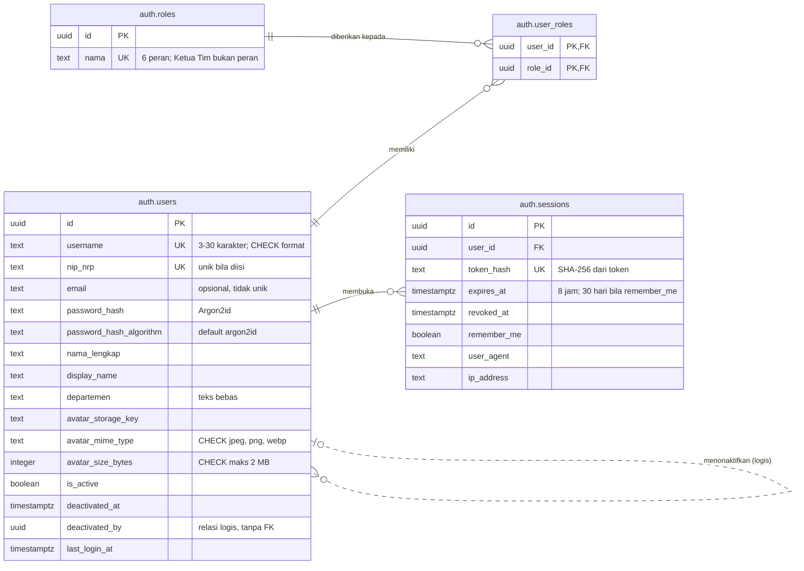
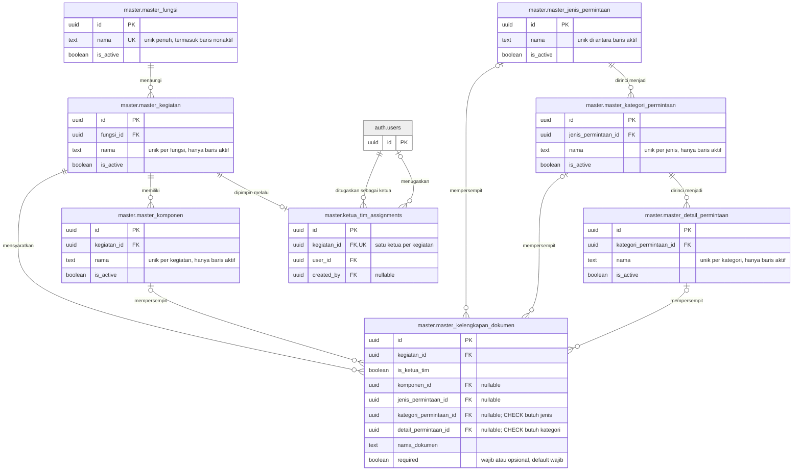
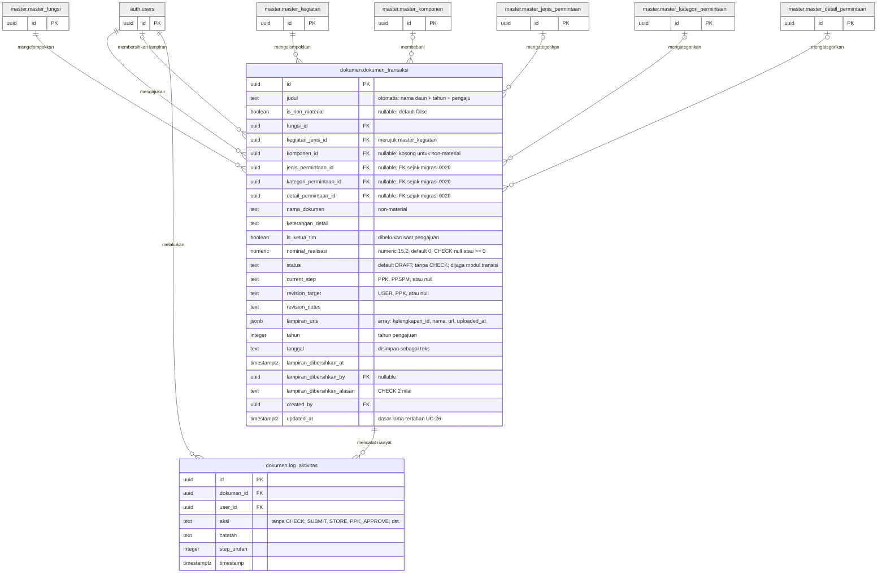
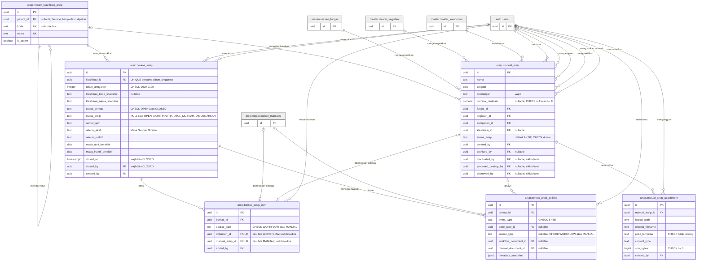
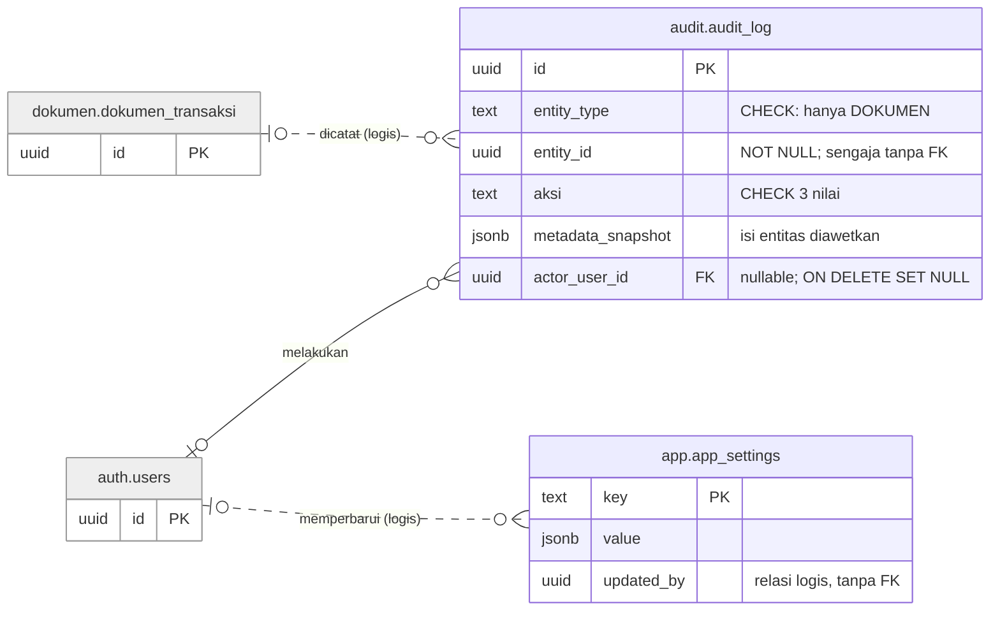

# Rancangan ERD Bab IV — Gambar 4.24–4.29 (27 Sept 2026, diverifikasi 28 Sept 2026)

> **Status:** **sudah diverifikasi terhadap kode** (28 Sept 2026, branch `migration/postgres-local`, HEAD `19e1b2a`). Siap digambar. Semua isian **CEK** dari draf 27 Sept sudah dijawab. Hasilnya ada di Bagian 0A.
> **Nomor gambar** mengikuti "Daftar Gambar Bab IV - Status dan Revisi (27 Sept 2026)" (4.24–4.29), bukan kerangka Rev 9.1 (4.27–4.32).
> **Sumber fakta:** `src/db/schema/**` dan `drizzle/0000`–`0020*.sql`. Rujukan `berkas:baris` di dokumen ini relatif terhadap `src/db/schema/`, kecuali yang diawali `drizzle/`.
> **Perubahan terbesar dari draf:** relasi menjadi **52** (49 FK fisik + 3 logis), bukan 48. Empat FK `manual_arsip → users` terlewat di draf (R-49 s.d. R-52).
> **Render:** blok Mermaid di draf 27 Sept lolos `@mermaid-js/mermaid-cli` v11. Blok yang dikoreksi di bawah memakai sintaks yang sama, tetapi **belum dirender ulang**. Render ulang sebelum diekspor.

---

## 0. Instruksi verifikasi (arsip prompt, sudah dikerjakan)

Kamu memverifikasi rancangan ERD skripsi terhadap kode. **Otoritas tunggal: `src/db/schema/**` dan `drizzle/*.sql` (termasuk 0019 dan 0020).** Jangan pakai `docs/` atau `AGENTS.md` sebagai sumber fakta.

1. **Inventaris entitas (Bagian 3).** Pastikan tepat 22 tabel domain, dengan skema yang benar. Laporkan tabel yang ada di skema tetapi tidak ada di daftar, dan sebaliknya. `drizzle.__drizzle_migrations` dan `master_jenis_dokumen` memang tidak digambar.
2. **Daftar relasi (Bagian 4).** Untuk setiap baris R-01 s.d. R-48, cek: (a) nama kolom FK, (b) apakah FK fisik ada (`.references()` / `REFERENCES` di SQL) atau hanya logis, (c) `ON DELETE`, (d) **nullability kolom FK** — ini menentukan simbol di sisi induk (`||` bila NOT NULL, `|o` bila nullable), (e) unique pada kolom FK — ini menentukan sisi anak (`o|` bila unik, `o{` bila tidak).
3. **Atribut (Bagian 5, blok Mermaid 4.25–4.29).** Cocokkan nama kolom dan tipe. Ganti setiap komentar "CEK" dengan nama/tipe yang benar. Tambahkan kolom yang terlewat hanya bila penting untuk narasi (PK, FK, kolom status, kolom yang dikenai UNIQUE/CHECK). Kolom audit rutin (`created_at`, `updated_at`) cukup disebut di laporan, tidak perlu masuk diagram kecuali sudah ada.
4. **Constraint (Bagian 6).** Cek setiap UNIQUE, partial unique, dan CHECK yang dikutip.
5. **Keluaran:** tabel temuan `No | Lokasi (R-xx / entitas.kolom) | Tertulis di rancangan | Fakta di kode (berkas:baris) | Perbaikan`, lalu **blok Mermaid yang sudah dikoreksi** untuk 4.24–4.29. Jangan mengubah label relasi (kata kerja) kecuali salah makna.

---

## 0A. Hasil verifikasi (28 Sept 2026)

### 0A.1 Ringkasan

| Bagian | Hasil |
|---|---|
| Inventaris entitas | **Cocok.** Tepat 22 tabel domain di 6 skema. Tabel yang pernah ada lalu dihapus migrasi (tidak digambar): `arsip.arsip`, `arsip.arsip_usul_musnah` (`drizzle/0009:13-15`), `arsip.manual_arsip_category` (`drizzle/0012:140`), `master.master_jenis_dokumen` (`drizzle/0019:15`). |
| Relasi R-01 s.d. R-48 | 45 FK fisik dan 3 logis **cocok** untuk kolom, ON DELETE, nullability, dan unique. Dua nama kolom salah (R-43, R-45). **Empat FK fisik terlewat** → ditambah sebagai R-49 s.d. R-52. Total **52 relasi = 49 FK fisik + 3 logis**. |
| Atribut | 9 koreksi nama/tipe/keterangan, 6 kolom ditambah (lihat 0A.2). |
| Constraint | Satu nilai CHECK terlewat (`INAKTIF` pada `berkas_arsip.status_arsip`). Tiga CHECK tambahan tidak dikutip (`users` ×2, `berkas_arsip_item` ×1). Satu CHECK aktivitas berkas belum dirinci. Tiga CHECK `users` **hanya ada di SQL**, tidak di skema Drizzle. |
| Relasi logis tanpa FK | Terkonfirmasi tepat **tiga**: `users.deactivated_by` (`auth/users.ts:36`; `drizzle/0000:14`, hanya indeks di `drizzle/0000:237`), `audit_log.entity_id` (`audit/audit-log.ts:40`, komentar "SENGAJA TANPA .references()" baris 31), `app_settings.updated_by` (`app/app-settings.ts:9`; `drizzle/0015:13`). |

### 0A.2 Tabel temuan

| No | Lokasi | Tertulis di rancangan | Fakta di kode (berkas:baris) | Perbaikan |
|---|---|---|---|---|
| 1 | Bagian 4, jumlah relasi | 48 relasi (45 FK + 3 logis) | `manual_arsip` punya 5 FK ke `users`, bukan 1: `archived_by`, `created_by`, `inactivated_by`, `proposed_destroy_by`, `destroyed_by` (`arsip/manual-arsip.ts:51-52, 56-58, 62-63, 65-66, 68-69`; `drizzle/0003:51-57`, `drizzle/0006:28-29`) | Tambah R-49 (`archived_by`), R-50 (`inactivated_by`), R-51 (`proposed_destroy_by`), R-52 (`destroyed_by`). Semua nullable, NA → `\|o--o{`. Total 52 |
| 2 | R-43 kolom | **CEK nama kolom** | `created_by` uuid NOT NULL, FK → users, NO ACTION (`arsip/manual-arsip.ts:56-58`) | Kolom `created_by`; `\|\|--o{` tetap benar |
| 3 | R-45 kolom; `manual_att.uploaded_by` | **CEK nama kolom**; `uploaded_by` | `created_by` uuid NOT NULL, FK → users, NO ACTION (`arsip/manual-arsip.ts:103-105`). Tidak ada kolom `uploaded_by` | Ganti `uploaded_by` → `created_by` |
| 4 | Gambar 4.24 | R-37, R-38 tidak digambar | Keduanya FK fisik ke dokumen, **bukan** relasi pelaku (`arsip/berkas-arsip.ts:127-130`) | Tambah ke 4.24 agar sesuai K-6 (yang dikecualikan hanya relasi pelaku ke `users`) |
| 5 | `users.avatar_path` | `text avatar_path` "CEK" | Kolom avatar ada 4: `avatar_storage_key` text, `avatar_mime_type` text, `avatar_size_bytes` integer, `avatar_updated_at` timestamptz (`auth/users.ts:28-31`) | Ganti `avatar_path` → `avatar_storage_key`. Tambah `avatar_mime_type` dan `avatar_size_bytes` karena keduanya dikenai CHECK (temuan 6) |
| 6 | Bagian 6, `users` | CHECK format username saja | Ada **3 CHECK**, semuanya hanya di SQL, tidak dideklarasikan di `auth/users.ts`: `auth_users_username_format_check` `^[a-z0-9._-]{3,30}$` dan minimal satu huruf (`drizzle/0017:51-52`); `auth_users_avatar_mime_type_check` ∈ {image/jpeg, image/png, image/webp} (`drizzle/0011:8-12`); `auth_users_avatar_size_bytes_check` 1–2.097.152 byte (`drizzle/0011:15-19`) | Tambah 2 CHECK avatar. Di kamus data, rujuk migrasi SQL untuk ketiganya |
| 7 | `users.nip_nrp` UK | UK | UNIQUE penuh pada kolom nullable; NIP kosong dinormalkan ke NULL dan NULL boleh kembar (`auth/users.ts:44`; `drizzle/0017:58-63`) | Keterangan "unik bila diisi" |
| 8 | `users.email` | "opsional, tidak unik" | Benar. Unique email dihapus (`drizzle/0017:66`) | — |
| 9 | `sessions.expires_at` | "8 jam" | 8 jam, atau 30 hari bila `remember_me` (`src/lib/auth/session-constants.ts:9-10`; nilai dari aplikasi, bukan constraint) | Keterangan "8 jam; 30 hari bila remember_me" |
| 10 | `berkas_arsip.klasifikasi_kode`, `klasifikasi_nama` | "snapshot; CEK nama kolom" | `klasifikasi_kode_snapshot` text **nullable**; `klasifikasi_nama_snapshot` text **NOT NULL** (`arsip/berkas-arsip.ts:36-37`) | Ganti nama kolom |
| 11 | `berkas_arsip.status_arsip` | "AKTIF, USUL_MUSNAH, DIMUSNAHKAN" | CHECK: NULL atau ∈ {AKTIF, **INAKTIF**, USUL_MUSNAH, DIMUSNAHKAN} (`arsip/berkas-arsip.ts:64-67`; `drizzle/0008:12-13`) | Tambah INAKTIF |
| 12 | `berkas_arsip` retensi | hanya `retensi_aktif`, `masa_aktif_berakhir` | Ada juga `retensi_inaktif` text dan `masa_inaktif_berakhir` date (`arsip/berkas-arsip.ts:41-44`) | Tambah keduanya, karena status INAKTIF ada |
| 13 | `manual_arsip.tanggal` | `text tanggal` "CEK tipe" | `date` NOT NULL (`arsip/manual-arsip.ts:29`). Berbeda dengan `dokumen_transaksi.tanggal` yang memang `text` (`dokumen/dokumen-transaksi.ts:55`) | Ganti tipe → `date` |
| 14 | `manual_arsip.nominal_realisasi` | "CHECK >= 0" | Nullable; CHECK `IS NULL OR >= 0` (`arsip/manual-arsip.ts:33, 84-87`) | Keterangan "nullable; CHECK NULL atau >= 0" |
| 15 | `manual_arsip.status_arsip` | tanpa keterangan | NOT NULL, default AKTIF, CHECK ∈ {AKTIF, INAKTIF, USUL_MUSNAH, DIMUSNAHKAN} (`arsip/manual-arsip.ts:54, 80-83`) | Tambah keterangan |
| 16 | `manual_arsip` kolom pengguna | hanya `created_by`; kolom siklus lama "catatan kaki, tidak digambar" | 4 kolom tambahan ber-FK fisik (temuan 1). `archived_by` masih diisi aplikasi (`src/lib/manual-arsip.ts:257`); tiga lainnya tidak diisi di `src/lib` | Gambar kelimanya di 4.28 (FK fisik harus tampil). Narasi: tiga kolom siklus lama tetap ada di basis data, tidak dipakai alur saat ini |
| 17 | `dokumen_transaksi.tahun` | `int` | `integer` NOT NULL (`dokumen/dokumen-transaksi.ts:54`) | Pakai nama tipe PostgreSQL `integer` (seragam dengan blok lain) |
| 18 | `dokumen_transaksi.status` | "tanpa CHECK" | Benar, tanpa CHECK; default `DRAFT`; nilai kanonik DRAFT, IN_PPK_VALIDATION, IN_PPSPM_APPROVAL, NEED_REVISION, COMPLETED, TERSIMPAN (komentar `dokumen/dokumen-transaksi.ts:45-47`) | Keterangan diperjelas |
| 19 | `dokumen_transaksi.is_non_material`, `nominal_realisasi` | tanpa keterangan nullability | `is_non_material` boolean **nullable** default false (baris 68); `nominal_realisasi` numeric(15,2) nullable default 0 (baris 67) | Keterangan ditambah |
| 20 | V-06 `dokumen_transaksi.created_at` | ? | Ada, timestamptz NOT NULL default now() (`dokumen/dokumen-transaksi.ts:59`) | Tidak digambar (kolom audit rutin); masuk kamus data |
| 21 | V-06 `master_kelengkapan_dokumen.is_active` | ? | **Tidak ada** kolom `is_active` (`master/kelengkapan-dokumen.ts:22-38`); kelengkapan dihapus fisik, bukan *soft delete* | Diagram sudah benar (tanpa `is_active`); sebut di narasi |
| 22 | Bagian 6, `master_fungsi` | "partial atau penuh?" | UNIQUE **penuh** `master_fungsi_nama_unique` (`master/fungsi.ts:24`), berbeda dengan 5 master lain yang partial `WHERE is_active = true` | Tulis "UNIQUE `nama` (penuh, termasuk baris nonaktif)" |
| 23 | Bagian 6, `master_kelengkapan_dokumen` | 2 CHECK | Benar 2 CHECK (`master/kelengkapan-dokumen.ts:51-58`). CHECK ketiga `jenis_requires_komponen` pernah ditambah (`drizzle/0012:110-111`) lalu **dihapus** (`drizzle/0016:25`) | Jangan kutip CHECK jenis ⇒ komponen |
| 24 | Bagian 6, `berkas_arsip_item` | UNIQUE ×2 + CHECK referensi | Ada juga CHECK `source_type` ∈ {WORKFLOW, MANUAL} (`arsip/berkas-arsip.ts:107`) | Tambah |
| 25 | Bagian 6, `berkas_arsip_activity` | "CHECK 8 event_type; CHECK referensi"; "daftar 8 nilai" | 3 CHECK: `event_type` 8 nilai (BERKAS_DIBUKA, DOKUMEN_PERSETUJUAN_DIKLASIFIKASIKAN, DOKUMEN_MANUAL_DITAMBAHKAN, BERKAS_DITUTUP, METADATA_ARSIP_AKTIF_DIPERBARUI, BERKAS_DIPINDAHKAN_KE_INAKTIF, BERKAS_DIPINDAHKAN_KE_USUL_MUSNAH, BERKAS_DIMUSNAHKAN); `source_type` NULL atau ∈ {WORKFLOW, MANUAL}; referensi sesuai `source_type` (`arsip/berkas-arsip.ts:141-163`) | Tulis lengkap |
| 26 | Bagian 6, `dokumen_transaksi` | "nama constraint" CEK | `dokumen_nominal_realisasi_positive`, `dokumen_lampiran_dibersihkan_alasan_check` (`dokumen/dokumen-transaksi.ts:101-108`) | Isi nama |
| 27 | R-47 simbol induk `\|o` | `\|o..o{` | `entity_id` uuid **NOT NULL** (`audit/audit-log.ts:40`). Menurut K-3 seharusnya `\|\|`, tetapi karena tidak ada FK, dokumen yang dirujuk boleh sudah terhapus | **Tetap `\|o`**, sebagai pengecualian K-3 yang ditulis di narasi: kolom selalu terisi, tetapi keberadaan dokumennya tidak dijamin basis data |
| 28 | `master_klasifikasi_arsip.created_at` | (tidak digambar) | `timestamp` **tanpa** zona waktu dan nullable (`arsip/klasifikasi-arsip.ts:21`), satu-satunya yang berbeda dari tabel lain | Catat di kamus data |
| 29 | `log_aktivitas.aksi` | "SUBMIT, STORE, PPK_APPROVE, dst." | Tanpa CHECK (`dokumen/log-aktivitas.ts:24`); contoh nilai benar (`src/lib/dokumen/local-submit-repository.ts:82`, `src/routes/api/ppk/dokumen/$id/approve.ts:116`) | Tambah "tanpa CHECK" |
| 30 | Bagian 3, peran | "CEK isi seed" | Seed 6 peran: PEGAWAI, PPK, PPSPM, KEPALA_SUB_BAGIAN_UMUM, PENANGGUNG_JAWAB_KINERJA, ADMIN (`src/db/seed/constants.ts:34-62`). Tidak ada KETUA_TIM | Terkonfirmasi |

### 0A.3 Yang dicek dan cocok (tanpa perubahan)

R-01 s.d. R-42, R-44, R-46 s.d. R-48 cocok untuk kelima kriteria (kolom, FK fisik/logis, ON DELETE, nullability, unique). Rincian bukti ada di kolom "Bukti" Bagian 4. Catatan kecil untuk narasi: `NA` (NO ACTION) dan `R` (RESTRICT) sama-sama menolak penghapusan induk yang masih dirujuk. Bedanya hanya waktu pemeriksaan: NO ACTION dicek di akhir pernyataan, RESTRICT langsung.

Kolom yang ada di kode tetapi sengaja tidak digambar (kolom audit rutin atau tidak penting untuk narasi; masuk kamus data):

| Tabel | Kolom |
|---|---|
| `users` | `metadata` jsonb, `inactive_reason`, `avatar_updated_at`, `password_updated_at`, `created_at`, `updated_at` |
| `roles` | `description`, `created_at`, `updated_at` |
| `user_roles` | `created_at` |
| `sessions` | `created_at`, `last_used_at` |
| 6 tabel master (fungsi s.d. detail) | `deskripsi`, `created_at`, `updated_at` |
| `master_kelengkapan_dokumen` | `created_at`, `updated_at` |
| `ketua_tim_assignments` | `created_at` |
| `dokumen_transaksi` | `created_at` |
| `master_klasifikasi_arsip` | `deskripsi`, `created_at` |
| `berkas_arsip` | `created_at`, `updated_at` |
| `berkas_arsip_item` | `added_at` |
| `berkas_arsip_activity` | `catatan`, `created_at` |
| `manual_arsip` | `nomor_surat`, `tanggal_diarsipkan` (date), `klasifikasi_kode_snapshot`, `klasifikasi_nama_snapshot`, `retensi_aktif`, `retensi_inaktif`, `masa_aktif_berakhir`, `masa_inaktif_berakhir`, `metadata`, `inactivated_at`, `proposed_destroy_at`, `destroyed_at`, `created_at`, `updated_at` |
| `manual_arsip_attachment` | `metadata`, `created_at` |
| `audit_log` | `created_at` |
| `app_settings` | `updated_at` |

---

## 1. Hasil eksplorasi: ERD menurut sumber resmi dan Bab II

### 1.1 Sumber

| Sumber | Yang diambil | Catatan |
|---|---|---|
| Chen, P. P. (1976). *The Entity-Relationship Model — Toward a Unified View of Data*. ACM TODS 1(1), 9–36. doi:10.1145/320434.320440 | Asal model ER: entitas, relasi, atribut. Notasi asli: entitas persegi panjang, **relasi belah ketupat**, atribut elips | Sumber primer model ER; layak ditambahkan ke Bab II sebagai rujukan asal |
| Connolly & Begg (2005), *Database Systems* (sudah dipakai di Bab II) | Definisi ERD, pendekatan *top-down*, entitas, atribut, relasi, kardinalitas, partisipasi | **Perlu dicek di buku:** setahu saya bab *Entity–Relationship Modeling* di buku ini memakai notasi **UML**, sedangkan **Chen dan Crow's Feet** disajikan di lampiran *Alternative ER Modeling Notations*. Kerangka Rev 9.1 menulis "Notasi Crow's Foot (Connolly & Begg, 2005)"; sitasinya sebaiknya menunjuk ke lampiran itu (sebut nomor halaman/lampiran) |
| Dokumentasi resmi Mermaid, *Entity Relationship Diagrams* (mermaid.js.org) | Sintaks `erDiagram`; penanda kardinalitas `\|o`, `\|\|`, `}o`, `}\|`; garis `--` (*identifying*) vs `..` (*non-identifying*); kunci `PK`, `FK`, `UK`; komentar atribut | Mermaid menyatakan notasinya turunan **crow's foot** |
| Miro, *ER diagram templates* (blog resmi Miro) | Miro punya *shape pack* ERD dengan konektor crow's foot, dan integrasi Mermaid lewat Marketplace | Relevan untuk keputusan alat gambar (Bagian 8) |

### 1.2 Isi notasi Crow's Foot yang dipakai

| Unsur | Simbol | Arti | Kode Mermaid |
|---|---|---|---|
| Entitas | Kotak dengan judul | Satu tabel | `nama["skema.tabel"] { ... }` |
| Atribut | Baris di dalam kotak | Kolom; tipe, nama, kunci, keterangan | `uuid id PK "keterangan"` |
| Kunci utama | `PK` | Mengidentifikasi baris secara unik | `PK` |
| Kunci tamu | `FK` | Merujuk PK entitas lain | `FK` |
| Kunci unik | `UK` | Nilai tidak boleh kembar | `UK` |
| Tepat satu | dua garis tegak | minimum 1, maksimum 1 | `\|\|` |
| Nol atau satu | lingkaran + garis tegak | minimum 0, maksimum 1 | `\|o` / `o\|` |
| Nol atau banyak | lingkaran + kaki gagak | minimum 0, maksimum banyak | `}o` / `o{` |
| Satu atau banyak | garis tegak + kaki gagak | minimum 1, maksimum banyak | `}\|` / `\|{` |
| Relasi dengan FK fisik | garis penuh | dijaga basis data | `--` |
| Relasi logis tanpa FK | garis putus-putus | dijaga aplikasi / sengaja tanpa FK | `..` (lihat keputusan K-2) |

Crow's Foot menampilkan **kardinalitas maksimum dan minimum (partisipasi)** sekaligus di ujung garis. Ini lebih lengkap daripada pembagian 1:1 / 1:M / M:M yang saat ini ditulis di Bab II.

### 1.3 Ketidaksesuaian di Bab II yang perlu diperbaiki

Subbab ERD di "Buku Skripsi Daniel New.docx" saat ini:

1. **Atribut "digambarkan dalam bentuk elips"** dan **PK "diberi garis bawah"**. Itu notasi Chen. Rancangan Bab IV memakai Crow's Foot (atribut di dalam kotak, PK ditandai `PK`). Penguji bisa menanyakan mengapa teori dan gambar berbeda.
2. **Relasi "garis penghubung yang memuat kata kerja"**. Di Chen, relasi berupa belah ketupat; di Crow's Foot, garis berlabel. Kalimat sekarang sudah cocok dengan Crow's Foot, jadi tinggal dipertegas.
3. **Kardinalitas hanya 1:1, 1:M, M:M**, tanpa **partisipasi/kardinalitas minimum** (nol atau satu). Padahal simbol lingkaran di Crow's Foot justru menyatakan itu, dan banyak relasi di aplikasi ini opsional (mis. `komponen_id` kosong untuk non-material).
4. **Belum ada tabel notasi**, padahal *use case*, *activity*, dan *State Machine Diagram* punya.
5. **M:M** perlu satu kalimat: di basis data relasional, M:M dipecah dengan entitas asosiatif. Contoh di aplikasi: `users`–`roles` melalui `user_roles`.

**Usulan revisi Bab II:** (a) satu paragraf bahwa model ER berasal dari Chen (1976) dan memiliki beberapa notasi; penelitian ini memakai Crow's Foot; (b) ganti kalimat elips/garis bawah dengan "atribut dituliskan di dalam kotak entitas; kunci utama dan kunci tamu diberi penanda PK dan FK"; (c) tambah kardinalitas minimum; (d) tambah tabel notasi dari Bagian 1.2 (kolom kode Mermaid dibuang); (e) satu kalimat entitas asosiatif.

---

## 2. Konvensi penggambaran (usulan, menunggu persetujuan Daniel)

| Kode | Konvensi | Alasan |
|---|---|---|
| K-1 | Notasi Crow's Foot, atribut di dalam kotak | Sesuai kerangka Rev 9.1; sesuai Mermaid dan *shape pack* Miro |
| K-2 | **Garis penuh = FK fisik; garis putus-putus = relasi logis tanpa FK**, dijelaskan di keterangan gambar | Sesuai kerangka ("relasi logis tanpa FK, garis putus-putus"). **Catatan:** di Mermaid, `..` resminya berarti *non-identifying*. Karena itu arti garis putus-putus wajib ditulis di keterangan gambar/narasi. Lihat keputusan terbuka O-2 |
| K-3 | Kardinalitas minimum diturunkan dari **constraint basis data**, bukan aturan aplikasi. FK NOT NULL → `\|\|`; FK nullable → `\|o`. Sisi anak `o{`, atau `o\|` bila kolom FK unik. **Pengecualian tunggal:** R-47 (`audit_log.entity_id` NOT NULL tanpa FK) digambar `\|o`, karena tanpa FK basis data tidak menjamin dokumennya masih ada | Konsisten dengan otoritas kode. Aturan aplikasi (mis. "setiap pengguna minimal punya peran PEGAWAI", "berkas ditutup bila berisi ≥ 1 dokumen") ditulis di narasi, bukan di simbol |
| K-4 | Nama entitas memakai identifier asli `skema.tabel` | Sesuai catatan penamaan kerangka: identifier kearsipan hanya di ERD dan kamus data |
| K-5 | Label relasi = kata kerja bahasa Indonesia, dibaca dari entitas induk ke anak | Sesuai definisi relasi di Bab II |
| K-6 | **4.24 (menyeluruh):** nama entitas saja, tanpa atribut; relasi "pelaku" ke `auth.users` (created_by, added_by, closed_by, actor_user_id, archived_by, dst.) **tidak digambar** kecuali `mengajukan` | 22 entitas + 52 relasi terlalu padat untuk satu halaman. Relasi pelaku digambar lengkap di ERD kelompok. Dinyatakan di keterangan Gambar 4.24 |
| K-7 | **4.25–4.29 (per kelompok):** atribut kunci; entitas dari kelompok lain tampil sebagai **entitas rujukan** (abu-abu, hanya `id PK`) | Pembaca melihat asal FK tanpa mengulang atribut |
| K-8 | Kolom lengkap (tipe, panjang, default, constraint) ada di **kamus data**, bukan di gambar | Sesuai kerangka (kamus data 5 entitas inti di badan bab, sisanya lampiran) |
| K-9 | Tidak digambar: `drizzle.__drizzle_migrations`, `master_jenis_dokumen` (dihapus migrasi 0019) | Sesuai kerangka |
| K-10 | Tipe atribut ditulis dengan nama tipe PostgreSQL: `uuid`, `text`, `integer`, `bigint`, `boolean`, `numeric`, `date`, `timestamptz`, `jsonb`. Presisi (mis. `numeric(15,2)`) ditulis di keterangan karena Mermaid tidak menerima koma di nama tipe | Seragam di semua gambar; cocok dengan kamus data |

---

## 3. Inventaris entitas (22 tabel, 6 skema) — terverifikasi

| No | Skema | Tabel | Nama di narasi | ERD kelompok | Bukti |
|---|---|---|---|---|---|
| 1 | auth | `users` | Pengguna | 4.25 | `auth/users.ts:16` |
| 2 | auth | `roles` | Peran | 4.25 | `auth/roles.ts:11` |
| 3 | auth | `user_roles` | Peran pengguna (asosiatif) | 4.25 | `auth/user-roles.ts:7` |
| 4 | auth | `sessions` | Sesi | 4.25 | `auth/sessions.ts:14` |
| 5 | master | `master_fungsi` | Fungsi | 4.26 | `master/fungsi.ts:13` |
| 6 | master | `master_kegiatan` | Kegiatan | 4.26 | `master/kegiatan.ts:15` |
| 7 | master | `master_komponen` | Komponen | 4.26 | `master/komponen.ts:15` |
| 8 | master | `master_jenis_permintaan` | Jenis Permintaan | 4.26 | `master/jenis-permintaan.ts:14` |
| 9 | master | `master_kategori_permintaan` | Kategori Permintaan | 4.26 | `master/kategori-permintaan.ts:15` |
| 10 | master | `master_detail_permintaan` | Detail Permintaan | 4.26 | `master/detail-permintaan.ts:15` |
| 11 | master | `master_kelengkapan_dokumen` | Kelengkapan Dokumen | 4.26 | `master/kelengkapan-dokumen.ts:19` |
| 12 | master | `ketua_tim_assignments` | Penugasan Ketua Tim | 4.26 | `master/ketua-tim-assignments.ts:13` |
| 13 | dokumen | `dokumen_transaksi` | Dokumen | 4.27 | `dokumen/dokumen-transaksi.ts:33` |
| 14 | dokumen | `log_aktivitas` | Riwayat aktivitas dokumen | 4.27 | `dokumen/log-aktivitas.ts:14` |
| 15 | arsip | `master_klasifikasi_arsip` | Klasifikasi (Cara Pembayaran) | 4.28 | `arsip/klasifikasi-arsip.ts:14` |
| 16 | arsip | `berkas_arsip` | Berkas | 4.28 | `arsip/berkas-arsip.ts:28` |
| 17 | arsip | `berkas_arsip_item` | Isi berkas | 4.28 | `arsip/berkas-arsip.ts:80` |
| 18 | arsip | `berkas_arsip_activity` | Riwayat berkas | 4.28 | `arsip/berkas-arsip.ts:116` |
| 19 | arsip | `manual_arsip` | Dokumen tambahan KSBU | 4.28 | `arsip/manual-arsip.ts:24` |
| 20 | arsip | `manual_arsip_attachment` | Lampiran dokumen tambahan | 4.28 | `arsip/manual-arsip.ts:91` |
| 21 | audit | `audit_log` | Log audit | 4.29 | `audit/audit-log.ts:35` |
| 22 | app | `app_settings` | Pengaturan aplikasi | 4.29 | `app/app-settings.ts:5` |

Peran di `auth.roles` ada enam (PEGAWAI, PPK, PPSPM, KEPALA_SUB_BAGIAN_UMUM, PENANGGUNG_JAWAB_KINERJA, ADMIN; `src/db/seed/constants.ts:34-62`). Ketua Tim **bukan** baris di `roles`, melainkan baris di `ketua_tim_assignments` (satu per kegiatan).

---

## 4. Daftar relasi (R-01 s.d. R-52) — terverifikasi

Singkatan ON DELETE: C = cascade, R = restrict, SN = set null, NA = no action, — = tidak ada FK. Kolom "Kardinalitas" = penanda Mermaid (induk → anak). Kolom "Bukti" = lokasi definisi FK di `src/db/schema/`. **Tebal** = diubah dari draf 27 Sept.

### 4.1 Autentikasi (4.25)

| Kode | Induk | Anak | Kolom | Kardinalitas | ON DELETE | Jenis | Label | Bukti |
|---|---|---|---|---|---|---|---|---|
| R-01 | users | user_roles | `user_id` (bagian PK), NOT NULL | `\|\|--o{` | C | FK | memiliki | `auth/user-roles.ts:10-12, 19-22` |
| R-02 | roles | user_roles | `role_id` (bagian PK), NOT NULL | `\|\|--o{` | C | FK | diberikan kepada | `auth/user-roles.ts:13-15` |
| R-03 | users | sessions | `user_id` NOT NULL | `\|\|--o{` | C | FK | membuka | `auth/sessions.ts:18-20` |
| R-04 | users | users | `deactivated_by` nullable | `\|o..o{` | — | logis | menonaktifkan | `auth/users.ts:36` (tanpa `.references()`) |

### 4.2 Data master (4.26)

| Kode | Induk | Anak | Kolom | Kardinalitas | ON DELETE | Jenis | Label | Bukti |
|---|---|---|---|---|---|---|---|---|
| R-05 | master_fungsi | master_kegiatan | `fungsi_id` NOT NULL | `\|\|--o{` | R | FK | menaungi | `master/kegiatan.ts:19-21` |
| R-06 | master_kegiatan | master_komponen | `kegiatan_id` NOT NULL | `\|\|--o{` | R | FK | memiliki | `master/komponen.ts:19-21` |
| R-07 | master_jenis_permintaan | master_kategori_permintaan | `jenis_permintaan_id` NOT NULL | `\|\|--o{` | R | FK | dirinci menjadi | `master/kategori-permintaan.ts:19-21` |
| R-08 | master_kategori_permintaan | master_detail_permintaan | `kategori_permintaan_id` NOT NULL | `\|\|--o{` | R | FK | dirinci menjadi | `master/detail-permintaan.ts:19-21` |
| R-09 | master_kegiatan | master_kelengkapan_dokumen | `kegiatan_id` NOT NULL | `\|\|--o{` | C | FK | mensyaratkan | `master/kelengkapan-dokumen.ts:23-25` |
| R-10 | master_komponen | master_kelengkapan_dokumen | `komponen_id` nullable | `\|o--o{` | R | FK | mempersempit | `master/kelengkapan-dokumen.ts:29-30` |
| R-11 | master_jenis_permintaan | master_kelengkapan_dokumen | `jenis_permintaan_id` nullable | `\|o--o{` | R | FK | mempersempit | `master/kelengkapan-dokumen.ts:31-32` |
| R-12 | master_kategori_permintaan | master_kelengkapan_dokumen | `kategori_permintaan_id` nullable | `\|o--o{` | R | FK | mempersempit | `master/kelengkapan-dokumen.ts:33-34` |
| R-13 | master_detail_permintaan | master_kelengkapan_dokumen | `detail_permintaan_id` nullable | `\|o--o{` | R | FK | mempersempit | `master/kelengkapan-dokumen.ts:35-36` |
| R-14 | master_kegiatan | ketua_tim_assignments | `kegiatan_id` NOT NULL, UNIQUE penuh | `\|\|--o\|` | C | FK | dipimpin melalui | `master/ketua-tim-assignments.ts:20-22, 28` |
| R-15 | users | ketua_tim_assignments | `user_id` NOT NULL | `\|\|--o{` | C | FK | ditugaskan sebagai ketua | `master/ketua-tim-assignments.ts:17-19` |
| R-16 | users | ketua_tim_assignments | `created_by` nullable | `\|o--o{` | SN | FK | menugaskan | `master/ketua-tim-assignments.ts:24-25` |

### 4.3 Transaksi dokumen (4.27)

| Kode | Induk | Anak | Kolom | Kardinalitas | ON DELETE | Jenis | Label | Bukti |
|---|---|---|---|---|---|---|---|---|
| R-17 | master_fungsi | dokumen_transaksi | `fungsi_id` NOT NULL | `\|\|--o{` | R | FK | mengelompokkan | `dokumen/dokumen-transaksi.ts:38-40` |
| R-18 | master_kegiatan | dokumen_transaksi | `kegiatan_jenis_id` NOT NULL | `\|\|--o{` | R | FK | mengelompokkan | `dokumen/dokumen-transaksi.ts:41-43` |
| R-19 | master_komponen | dokumen_transaksi | `komponen_id` nullable | `\|o--o{` | R | FK | membebani | `dokumen/dokumen-transaksi.ts:70-71` |
| R-20 | master_jenis_permintaan | dokumen_transaksi | `jenis_permintaan_id` nullable | `\|o--o{` | R | FK (0020) | mengategorikan | `dokumen/dokumen-transaksi.ts:61-62`; `drizzle/0020:17-20` |
| R-21 | master_kategori_permintaan | dokumen_transaksi | `kategori_permintaan_id` nullable | `\|o--o{` | R | FK (0020) | mengategorikan | `dokumen/dokumen-transaksi.ts:63-64`; `drizzle/0020:32-35` |
| R-22 | master_detail_permintaan | dokumen_transaksi | `detail_permintaan_id` nullable | `\|o--o{` | R | FK (0020) | mengategorikan | `dokumen/dokumen-transaksi.ts:65-66`; `drizzle/0020:47-50` |
| R-23 | users | dokumen_transaksi | `created_by` NOT NULL | `\|\|--o{` | NA | FK | mengajukan | `dokumen/dokumen-transaksi.ts:56-58` |
| R-24 | users | dokumen_transaksi | `lampiran_dibersihkan_by` nullable | `\|o--o{` | SN | FK | membersihkan lampiran | `dokumen/dokumen-transaksi.ts:79-80` |
| R-25 | dokumen_transaksi | log_aktivitas | `dokumen_id` NOT NULL | `\|\|--o{` | C | FK | mencatat riwayat | `dokumen/log-aktivitas.ts:18-20` |
| R-26 | users | log_aktivitas | `user_id` NOT NULL | `\|\|--o{` | NA | FK | melakukan | `dokumen/log-aktivitas.ts:21-23` |

### 4.4 Pemberkasan (4.28)

| Kode | Induk | Anak | Kolom | Kardinalitas | ON DELETE | Jenis | Label | Bukti |
|---|---|---|---|---|---|---|---|---|
| R-27 | master_klasifikasi_arsip | master_klasifikasi_arsip | `parent_id` nullable | `\|o--o{` | SN | FK (rekursif) | menjadi induk | `arsip/klasifikasi-arsip.ts:22-23` |
| R-28 | master_klasifikasi_arsip | berkas_arsip | `klasifikasi_id` NOT NULL | `\|\|--o{` | R | FK | mengelompokkan | `arsip/berkas-arsip.ts:32-34` |
| R-29 | users | berkas_arsip | `created_by` NOT NULL | `\|\|--o{` | NA | FK | membuka | `arsip/berkas-arsip.ts:48-50` |
| R-30 | users | berkas_arsip | `closed_by` nullable | `\|o--o{` | NA | FK | menutup | `arsip/berkas-arsip.ts:46-47` |
| R-31 | berkas_arsip | berkas_arsip_item | `berkas_id` NOT NULL | `\|\|--o{` | NA | FK | berisi | `arsip/berkas-arsip.ts:84-86` |
| R-32 | dokumen_transaksi | berkas_arsip_item | `dokumen_id` nullable, UNIQUE parsial | `\|o--o\|` | NA | FK | diberkaskan sebagai | `arsip/berkas-arsip.ts:88-89, 101-103` |
| R-33 | manual_arsip | berkas_arsip_item | `manual_arsip_id` nullable, UNIQUE parsial | `\|o--o\|` | NA | FK | diberkaskan sebagai | `arsip/berkas-arsip.ts:90-91, 104-106` |
| R-34 | users | berkas_arsip_item | `added_by` NOT NULL | `\|\|--o{` | NA | FK | menambahkan | `arsip/berkas-arsip.ts:92-94` |
| R-35 | berkas_arsip | berkas_arsip_activity | `berkas_id` NOT NULL | `\|\|--o{` | NA | FK | mencatat riwayat | `arsip/berkas-arsip.ts:120-122` |
| R-36 | users | berkas_arsip_activity | `actor_user_id` nullable | `\|o--o{` | NA | FK | melakukan | `arsip/berkas-arsip.ts:124-125` |
| R-37 | dokumen_transaksi | berkas_arsip_activity | `workflow_document_id` nullable | `\|o--o{` | NA | FK | dirujuk | `arsip/berkas-arsip.ts:127-128` |
| R-38 | manual_arsip | berkas_arsip_activity | `manual_document_id` nullable | `\|o--o{` | NA | FK | dirujuk | `arsip/berkas-arsip.ts:129-130` |
| R-39 | master_fungsi | manual_arsip | `fungsi_id` NOT NULL | `\|\|--o{` | R | FK | mengelompokkan | `arsip/manual-arsip.ts:34-36` |
| R-40 | master_kegiatan | manual_arsip | `kegiatan_id` NOT NULL | `\|\|--o{` | R | FK | mengelompokkan | `arsip/manual-arsip.ts:37-39` |
| R-41 | master_komponen | manual_arsip | `komponen_id` NOT NULL | `\|\|--o{` | R | FK | membebani | `arsip/manual-arsip.ts:40-42` |
| R-42 | master_klasifikasi_arsip | manual_arsip | `klasifikasi_id` nullable | `\|o--o{` | SN | FK | mengklasifikasikan | `arsip/manual-arsip.ts:43-44` |
| R-43 | users | manual_arsip | **`created_by`** NOT NULL | `\|\|--o{` | NA | FK | mencatat | `arsip/manual-arsip.ts:56-58` |
| R-44 | manual_arsip | manual_arsip_attachment | `manual_arsip_id` NOT NULL | `\|\|--o{` | NA | FK | melampirkan | `arsip/manual-arsip.ts:95-97` |
| R-45 | users | manual_arsip_attachment | **`created_by`** NOT NULL | `\|\|--o{` | NA | FK | mengunggah | `arsip/manual-arsip.ts:103-105` |
| **R-49** | users | manual_arsip | **`archived_by`** nullable | `\|o--o{` | NA | FK | **mengarsipkan** | `arsip/manual-arsip.ts:51-52`; `drizzle/0006:28-29` |
| **R-50** | users | manual_arsip | **`inactivated_by`** nullable | `\|o--o{` | NA | FK (siklus lama) | **menginaktifkan** | `arsip/manual-arsip.ts:62-63`; `drizzle/0003:53` |
| **R-51** | users | manual_arsip | **`proposed_destroy_by`** nullable | `\|o--o{` | NA | FK (siklus lama) | **mengusulkan musnah** | `arsip/manual-arsip.ts:65-66`; `drizzle/0003:55` |
| **R-52** | users | manual_arsip | **`destroyed_by`** nullable | `\|o--o{` | NA | FK (siklus lama) | **memusnahkan** | `arsip/manual-arsip.ts:68-69`; `drizzle/0003:57` |

R-49 s.d. R-52 diletakkan di tabel ini karena termasuk kelompok pemberkasan; nomor ditambahkan di belakang agar kode R-01 s.d. R-48 yang sudah dirujuk dokumen lain tidak bergeser. "Siklus lama" = kolom siklus retensi per dokumen dari rancangan sebelum berkas; FK-nya masih ada di basis data, tetapi tidak diisi alur aplikasi saat ini (`archived_by` masih diisi, `src/lib/manual-arsip.ts:257`).

### 4.5 Audit dan pengaturan (4.29)

| Kode | Induk | Anak | Kolom | Kardinalitas | ON DELETE | Jenis | Label | Bukti |
|---|---|---|---|---|---|---|---|---|
| R-46 | users | audit_log | `actor_user_id` nullable | `\|o--o{` | SN | FK | melakukan | `audit/audit-log.ts:42-43` |
| R-47 | dokumen_transaksi | audit_log | `entity_id` NOT NULL | `\|o..o{` | — | logis, disengaja | dicatat | `audit/audit-log.ts:31-34, 40` (lihat K-3, pengecualian) |
| R-48 | users | app_settings | `updated_by` nullable | `\|o..o{` | — | logis | memperbarui | `app/app-settings.ts:9`; `drizzle/0015:13` |

**Rekap:** 52 relasi = **49 FK fisik** (auth 3, master 12, dokumen 10, arsip 23, audit 1) + **3 relasi logis** (R-04, R-47, R-48). Relasi logis tetap tepat tiga, sesuai kerangka Rev 9.1. Relasi dengan induk `users` ada 20; 17 di antaranya relasi pelaku (semua kecuali R-01, R-03, R-15).

---

## 5. Kode Mermaid per gambar (sudah dikoreksi)

### Gambar 4.24 — ERD Menyeluruh

**Yang harus terlihat:** Seluruh 22 entitas dan relasi antarkelompok, tanpa atribut. Relasi pelaku ke `auth.users` hanya `mengajukan` (K-6). `app.app_settings` tampil tanpa garis karena satu-satunya relasinya logis ke `users` (boleh ditambah bila Daniel memilih O-3 = lengkap).

**Perubahan dari draf:** ditambah R-37 dan R-38 (`dirujuk`), karena keduanya bukan relasi pelaku.

**Keterangan gambar yang disarankan:** "Relasi pelaku (pengguna yang membuat, menutup, menambahkan, atau mencatat) tidak ditampilkan kecuali relasi *mengajukan*; relasi pelaku lengkap ada pada Gambar 4.25–4.29. Garis putus-putus menyatakan relasi logis tanpa kunci tamu."

**Catatan tata letak:** tata letak otomatis Mermaid untuk 22 entitas melebar ke samping (±2.400 px × 480 px) dan banyak garis bersilang. Untuk buku, gambar ini sebaiknya diatur manual (Bagian 8).

```mermaid
erDiagram
  users["auth.users"]
  roles["auth.roles"]
  user_roles["auth.user_roles"]
  sessions["auth.sessions"]
  m_fungsi["master.master_fungsi"]
  m_kegiatan["master.master_kegiatan"]
  m_komponen["master.master_komponen"]
  m_jenis["master.master_jenis_permintaan"]
  m_kategori["master.master_kategori_permintaan"]
  m_detail["master.master_detail_permintaan"]
  m_kelengkapan["master.master_kelengkapan_dokumen"]
  ketua_tim["master.ketua_tim_assignments"]
  dokumen["dokumen.dokumen_transaksi"]
  log_akt["dokumen.log_aktivitas"]
  klasifikasi["arsip.master_klasifikasi_arsip"]
  berkas["arsip.berkas_arsip"]
  berkas_item["arsip.berkas_arsip_item"]
  berkas_act["arsip.berkas_arsip_activity"]
  manual["arsip.manual_arsip"]
  manual_att["arsip.manual_arsip_attachment"]
  audit_log["audit.audit_log"]
  app_settings["app.app_settings"]

  users ||--o{ user_roles : "memiliki"
  roles ||--o{ user_roles : "diberikan kepada"
  users ||--o{ sessions : "membuka"

  m_fungsi ||--o{ m_kegiatan : "menaungi"
  m_kegiatan ||--o{ m_komponen : "memiliki"
  m_jenis ||--o{ m_kategori : "dirinci menjadi"
  m_kategori ||--o{ m_detail : "dirinci menjadi"
  m_kegiatan ||--o{ m_kelengkapan : "mensyaratkan"
  m_komponen |o--o{ m_kelengkapan : "mempersempit"
  m_jenis |o--o{ m_kelengkapan : "mempersempit"
  m_kategori |o--o{ m_kelengkapan : "mempersempit"
  m_detail |o--o{ m_kelengkapan : "mempersempit"
  m_kegiatan ||--o| ketua_tim : "dipimpin melalui"
  users ||--o{ ketua_tim : "ditugaskan sebagai ketua"

  users ||--o{ dokumen : "mengajukan"
  m_fungsi ||--o{ dokumen : "mengelompokkan"
  m_kegiatan ||--o{ dokumen : "mengelompokkan"
  m_komponen |o--o{ dokumen : "membebani"
  m_jenis |o--o{ dokumen : "mengategorikan"
  m_kategori |o--o{ dokumen : "mengategorikan"
  m_detail |o--o{ dokumen : "mengategorikan"
  dokumen ||--o{ log_akt : "mencatat riwayat"

  klasifikasi |o--o{ klasifikasi : "menjadi induk"
  klasifikasi ||--o{ berkas : "mengelompokkan"
  berkas ||--o{ berkas_item : "berisi"
  dokumen |o--o| berkas_item : "diberkaskan sebagai"
  manual |o--o| berkas_item : "diberkaskan sebagai"
  berkas ||--o{ berkas_act : "mencatat riwayat"
  dokumen |o--o{ berkas_act : "dirujuk"
  manual |o--o{ berkas_act : "dirujuk"
  m_fungsi ||--o{ manual : "mengelompokkan"
  m_kegiatan ||--o{ manual : "mengelompokkan"
  m_komponen ||--o{ manual : "membebani"
  klasifikasi |o--o{ manual : "mengklasifikasikan"
  manual ||--o{ manual_att : "melampirkan"

  dokumen |o..o{ audit_log : "dicatat (logis)"
```

### Gambar 4.25 — ERD Autentikasi dan Otorisasi

**Yang harus terlihat:** `user_roles` sebagai entitas asosiatif M:M `users`–`roles` (PK komposit); `sessions` menyimpan *hash* token; relasi logis `deactivated_by` (garis putus-putus, rekursif).

**Perubahan dari draf:** `avatar_path` → `avatar_storage_key`; tambah `avatar_mime_type`, `avatar_size_bytes` (ber-CHECK); keterangan `nip_nrp` dan `expires_at`.

### Gambar 4.26 — ERD Data Master

**Yang harus terlihat:** Dua cabang independen: Fungsi → Kegiatan → Komponen dan Jenis → Kategori → Detail, yang bertemu hanya di `master_kelengkapan_dokumen`. Penugasan Ketua Tim unik per kegiatan (`||--o|`).

Narasi: pencocokan *exact-match* enam kolom; dua CHECK rantai; nama unik hanya di antara baris aktif (*soft delete*), **kecuali `master_fungsi` yang unik penuh**; `master_kelengkapan_dokumen` tidak punya `is_active` (dihapus fisik).

**Perubahan dari draf:** keterangan `m_fungsi.nama` (unik penuh) dan `required` (default). Struktur dan relasi tidak berubah.

### Gambar 4.27 — ERD Transaksi Dokumen

**Yang harus terlihat:** Rantai dokumen ber-FK penuh (termasuk jenis/kategori/detail sejak migrasi 0020); `komponen_id` opsional untuk non-material; lampiran sebagai `jsonb`, bukan tabel; `log_aktivitas` ikut terhapus (*cascade*) bila dokumen dihapus.

Narasi: status tanpa CHECK (dijaga modul transisi status); `tahun` dokumen tidak terhubung ke `tahun_anggaran` berkas (KP-7).

**Perubahan dari draf:** `int` → `integer`; keterangan `status`, `is_non_material`, `nominal_realisasi`, `aksi`.

### Gambar 4.28 — ERD Pemberkasan

**Yang harus terlihat:** Klasifikasi hierarkis (rekursif); satu berkas per (klasifikasi, TA); isi berkas bersumber dari dokumen alur kerja **atau** dokumen tambahan KSBU (`o|` = satu dokumen paling banyak di satu berkas); riwayat berkas.

Narasi: CHECK "tepat satu referensi" pada `berkas_arsip_item`; 4 CHECK state berkas (+1 CHECK rentang TA); `manual_arsip` punya lima relasi pelaku ke `users`, tiga di antaranya (`inactivated_by`, `proposed_destroy_by`, `destroyed_by`) adalah kolom siklus lama yang FK-nya masih ada tetapi tidak diisi alur saat ini.

**Perubahan dari draf:** nama kolom *snapshot* klasifikasi; INAKTIF di `status_arsip`; tambah `retensi_inaktif`, `masa_inaktif_berakhir`; `manual_arsip.tanggal` → `date`; tambah 4 kolom pelaku `manual_arsip` + relasi R-49 s.d. R-52; `uploaded_by` → `created_by`.

**Catatan tata letak:** `users` kini punya 9 garis ke entitas di gambar ini. Bila hasil render terlalu padat, letakkan `users` di tepi (atas atau bawah) dan `manual` di dekatnya.

### Gambar 4.29 — ERD Audit dan Pengaturan

**Yang harus terlihat:** `audit_log.entity_id` sengaja tanpa FK (garis putus-putus) agar jejak tetap ada setelah dokumen dihapus; `app_settings` berbentuk *key–value* `jsonb`.

**Perubahan dari draf:** keterangan `entity_id` (NOT NULL). Relasi tidak berubah.

---

## 6. Constraint yang tidak tergambar sebagai garis (untuk narasi dan kamus data) — terverifikasi

| Entitas | Constraint (nama di basis data) | Aturan bisnis yang dijaga | Bukti |
|---|---|---|---|
| `users` | UNIQUE `username` (`auth_users_username_unique`); UNIQUE `nip_nrp` (`auth_users_nip_nrp_unique`, NULL boleh kembar); CHECK format username `^[a-z0-9._-]{3,30}$` + minimal satu huruf (`auth_users_username_format_check`); CHECK `avatar_mime_type` NULL atau ∈ {image/jpeg, image/png, image/webp}; CHECK `avatar_size_bytes` NULL atau 1–2.097.152 | Login dengan username/NIP; foto profil dibatasi jenis dan ukuran | `auth/users.ts:43-44`; `drizzle/0017:51-52, 55, 63`; `drizzle/0011:8-19`. **Ketiga CHECK hanya ada di SQL**, tidak dideklarasikan di skema Drizzle |
| `roles` | UNIQUE `nama` (`auth_roles_nama_unique`) | — | `auth/roles.ts:21` |
| `user_roles` | PK komposit (`user_id`, `role_id`) | Satu peran tidak dobel pada satu pengguna | `auth/user-roles.ts:19-22` |
| `sessions` | UNIQUE `token_hash` (`auth_sessions_token_hash_unique`) | Token disimpan sebagai *hash* | `auth/sessions.ts:31` |
| `master_fungsi` | UNIQUE `nama` **penuh** (`master_fungsi_nama_unique`) | Nama fungsi unik, termasuk yang nonaktif | `master/fungsi.ts:24` |
| `master_kegiatan` / `master_komponen` / `master_kategori_permintaan` / `master_detail_permintaan` | UNIQUE (induk, `nama`) WHERE `is_active = true` | Nama unik per induk hanya di antara baris aktif | `master/kegiatan.ts:32-34`; `master/komponen.ts:32-34`; `master/kategori-permintaan.ts:31-33`; `master/detail-permintaan.ts:31-33` |
| `master_jenis_permintaan` | UNIQUE `nama` WHERE `is_active = true` | Jenis bersifat global | `master/jenis-permintaan.ts:26-28`; `drizzle/0016:22` |
| `master_kelengkapan_dokumen` | CHECK kategori ⇒ jenis (`master_kelengkapan_kategori_requires_jenis_check`); CHECK detail ⇒ kategori (`master_kelengkapan_detail_requires_kategori_check`); INDEX 6 kolom (`idx_master_kelengkapan_chain`) | Rantai kelengkapan tidak loncat. (CHECK jenis ⇒ komponen sudah dihapus di `drizzle/0016:25`; jangan dikutip) | `master/kelengkapan-dokumen.ts:43-58` |
| `ketua_tim_assignments` | UNIQUE `kegiatan_id` penuh (`ketua_tim_kegiatan_unique`) | Satu Ketua Tim per kegiatan; satu pengguna boleh memimpin banyak kegiatan | `master/ketua-tim-assignments.ts:28, 34-36` |
| `dokumen_transaksi` | CHECK `nominal_realisasi` NULL atau ≥ 0 (`dokumen_nominal_realisasi_positive`); CHECK `lampiran_dibersihkan_alasan` NULL atau ∈ {BERKAS_DIMUSNAHKAN, PEMBERSIHAN_NON_MATERIAL} (`dokumen_lampiran_dibersihkan_alasan_check`). `status` **tanpa** CHECK | — | `dokumen/dokumen-transaksi.ts:101-108` |
| `log_aktivitas` | Tanpa CHECK; *append-only* berdasarkan kontrak aplikasi | Riwayat tidak diubah | `dokumen/log-aktivitas.ts:37-38` |
| `master_klasifikasi_arsip` | UNIQUE `nama` (`master_klasifikasi_arsip_nama_unique`); UNIQUE `kode` WHERE `kode IS NOT NULL` (`idx_master_klasifikasi_kode_unique`) | — | `arsip/klasifikasi-arsip.ts:27-30` |
| `berkas_arsip` | UNIQUE (`klasifikasi_id`, `tahun_anggaran`) (`berkas_arsip_klasifikasi_tahun_unique`); CHECK TA 2000–2100; CHECK `status_berkas` ∈ {OPEN, CLOSED}; CHECK `status_arsip` NULL atau ∈ {AKTIF, **INAKTIF**, USUL_MUSNAH, DIMUSNAHKAN}; CHECK OPEN ⇒ `status_arsip` NULL; CHECK OPEN ⇔ `closed_at`/`closed_by` NULL (CLOSED ⇔ keduanya terisi) | Satu berkas per Cara Pembayaran per TA; state berkas konsisten | `arsip/berkas-arsip.ts:60-76`; `drizzle/0018:21-28` |
| `berkas_arsip_item` | UNIQUE `dokumen_id` WHERE NOT NULL; UNIQUE `manual_arsip_id` WHERE NOT NULL; CHECK `source_type` ∈ {WORKFLOW, MANUAL}; CHECK tepat satu referensi sesuai `source_type` | Satu dokumen hanya di satu berkas | `arsip/berkas-arsip.ts:101-112` |
| `berkas_arsip_activity` | CHECK `event_type` ∈ {BERKAS_DIBUKA, DOKUMEN_PERSETUJUAN_DIKLASIFIKASIKAN, DOKUMEN_MANUAL_DITAMBAHKAN, BERKAS_DITUTUP, METADATA_ARSIP_AKTIF_DIPERBARUI, BERKAS_DIPINDAHKAN_KE_INAKTIF, BERKAS_DIPINDAHKAN_KE_USUL_MUSNAH, BERKAS_DIMUSNAHKAN}; CHECK `source_type` NULL atau ∈ {WORKFLOW, MANUAL}; CHECK referensi sesuai `source_type` (keduanya NULL bila `source_type` NULL) | Riwayat berkas hanya berisi peristiwa yang dikenal | `arsip/berkas-arsip.ts:141-163` |
| `manual_arsip` | CHECK `status_arsip` ∈ {AKTIF, INAKTIF, USUL_MUSNAH, DIMUSNAHKAN} (`manual_arsip_status_arsip_check`); CHECK `nominal_realisasi` NULL atau ≥ 0 (`manual_arsip_nominal_realisasi_positive`) | — | `arsip/manual-arsip.ts:80-87` |
| `manual_arsip_attachment` | CHECK `size_bytes` ≥ 0 (`manual_arsip_attachment_size_bytes_nonnegative`); CHECK `length(trim(judul_lampiran)) > 0` (`manual_arsip_attachment_judul_lampiran_nonempty`) | — | `arsip/manual-arsip.ts:112-113` |
| `audit_log` | CHECK `entity_type` ∈ {DOKUMEN}; CHECK `aksi` ∈ {DOKUMEN_LAMPIRAN_DIBERSIHKAN, DOKUMEN_DIHAPUS_PERMANEN, BERKAS_LAMPIRAN_DIBERSIHKAN} | — | `audit/audit-log.ts:51-59` |

---

## 7. Checklist verifikasi — semua terjawab

| No | Pertanyaan | Jawaban | Bukti |
|---|---|---|---|
| V-01 | Nullability kolom FK | Semua sesuai simbol di Bagian 4. `dokumen_transaksi.fungsi_id`, `kegiatan_jenis_id`, `created_by`; `log_aktivitas.user_id`; `berkas_arsip.created_by`; `berkas_arsip_item.added_by` NOT NULL. `berkas_arsip_activity.actor_user_id` nullable | Bagian 4, kolom Bukti |
| V-02 | ON DELETE `berkas_arsip_item.berkas_id`, `manual_arsip_attachment.manual_arsip_id`, `berkas_arsip_activity.berkas_id` | Ketiganya NO ACTION | `arsip/berkas-arsip.ts:86, 122`; `arsip/manual-arsip.ts:97` |
| V-03 | Kolom pengguna di `manual_arsip` dan `manual_arsip_attachment` | `manual_arsip`: 5 FK (`created_by`, `archived_by`, `inactivated_by`, `proposed_destroy_by`, `destroyed_by`). `manual_arsip_attachment`: 1 FK (`created_by`) | Temuan 1–3 |
| V-04 | Kolom avatar; kolom *snapshot* klasifikasi | `avatar_storage_key` (+3 kolom avatar); `klasifikasi_kode_snapshot`, `klasifikasi_nama_snapshot` | Temuan 5, 10 |
| V-05 | Tipe `tahun`, `tanggal`, `tahun_anggaran`, `retensi_aktif`, `masa_aktif_berakhir`, `size_bytes` | `dokumen.tahun` integer; `dokumen.tanggal` text; `manual.tanggal` date; `tahun_anggaran` integer; `retensi_aktif` text; `masa_aktif_berakhir` date; `size_bytes` bigint | `dokumen/dokumen-transaksi.ts:54-55`; `arsip/manual-arsip.ts:29, 102`; `arsip/berkas-arsip.ts:35, 41, 43` |
| V-06 | `dokumen_transaksi.created_at`; `master_kelengkapan_dokumen.is_active` | Ada `created_at`; **tidak ada** `is_active` | Temuan 20–21 |
| V-07 | FK fisik `berkas_arsip_activity` → dokumen & manual | Ada, NO ACTION | `arsip/berkas-arsip.ts:127-130`; `drizzle/0010:71-89` |
| V-08 | FK lain yang tidak tercantum | 4 FK `manual_arsip` → `users` (R-49 s.d. R-52). Tidak ada FK lain | Temuan 1 |
| V-09 | `app_settings.updated_by`, `users.deactivated_by` tanpa FK | Terkonfirmasi tanpa FK | `app/app-settings.ts:9`; `auth/users.ts:36` |
| V-10 | Seed `auth.roles` | 6 peran | `src/db/seed/constants.ts:34-62` |

---

## 8. Keputusan terbuka untuk Daniel

| No | Pertanyaan | Pilihan | Saran |
|---|---|---|---|
| O-1 | **Alat gambar** | (a) Mermaid → PNG langsung (mmdc/Mermaid Live), (b) Mermaid sebagai widget di Miro (seperti *sequence diagram*), (c) *shape* ERD asli Miro digambar manual dari kode Mermaid yang sudah terverifikasi | Lihat tabel di bawah. Verifikasi sudah selesai; keputusan tinggal alat |
| O-2 | Arti garis putus-putus | (a) Relasi logis tanpa FK (kerangka sekarang), (b) *non-identifying* sesuai semantik Mermaid | (a), dengan keterangan di bawah gambar. Semantik *identifying* tidak dibahas di Bab II, jadi (a) lebih mudah dijelaskan |
| O-3 | Isi Gambar 4.24 | (a) Tanpa relasi pelaku ke `users` (K-6), (b) semua 52 relasi | (a); relasi pelaku sudah lengkap di 4.25–4.29 |
| O-4 | Revisi Bab II subbab ERD (Bagian 1.3) | Dikerjakan sekarang / setelah gambar final | Sekarang, supaya notasi teori dan gambar sama sebelum narasi 4.2.3 ditulis |
| O-5 | **Baru.** Tiga relasi siklus lama `manual_arsip` (R-50 s.d. R-52) | (a) Digambar penuh di 4.28 (versi di dokumen ini), (b) tidak digambar, disebut di catatan kaki | (a). FK-nya masih ada di basis data; ERD yang menghilangkan FK fisik tidak lagi cocok dengan skema. Kolomnya bisa dijelaskan di narasi sebagai sisa rancangan sebelumnya |

### Perbandingan alat (bahan O-1)

| Aspek | Mermaid → PNG | Widget Mermaid di Miro | *Shape* ERD Miro manual |
|---|---|---|---|
| Kecepatan | Paling cepat; kode di dokumen ini langsung jadi | Cepat (alur sama dengan *sequence diagram*) | Lambat: 22 entitas, 52 relasi |
| Kebenaran notasi | Crow's Foot benar; PK/FK/UK tampil | Sama dengan Mermaid | Crow's Foot benar |
| Tata letak | Otomatis. Baik untuk 4.25–4.29; **4.24 berantakan** (lihat catatan) | Otomatis, sama; widget tidak bisa diatur per kotak | Bebas diatur; paling rapi untuk 4.24 |
| Warna entitas rujukan | Bisa (`classDef`) | Tergantung dukungan widget | Bisa |
| Konsistensi dengan gambar lain | Berbeda gaya dari *activity diagram* Miro | Sama dengan *sequence diagram* | Sama dengan *activity diagram* |
| Revisi bila skema berubah | Ubah teks, render ulang | Ubah teks | Ubah manual |

Saran awal: **4.25–4.29 cukup Mermaid** (tata letak otomatisnya sudah terbaca), **4.24 diatur manual** (Miro *shape* atau susun ulang posisi) karena tata letak otomatisnya terlalu melebar untuk satu halaman buku.

---

## 9. Sumber

- Chen, P. P. (1976). The entity-relationship model — toward a unified view of data. *ACM Transactions on Database Systems*, 1(1), 9–36. https://dl.acm.org/doi/10.1145/320434.320440
- Connolly, T. M., & Begg, C. E. (2005). *Database Systems: A Practical Approach to Design, Implementation, and Management* (4th ed.). Addison-Wesley. (Sudah di Bab II; cek bab *Entity–Relationship Modeling* dan lampiran notasi alternatif.)
- Mermaid. *Entity Relationship Diagrams* (dokumentasi resmi). https://mermaid.js.org/syntax/entityRelationshipDiagram.html
- Miro. *Database modeling made simple with new ER diagram templates in Miro*. https://miro.com/blog/database-modeling-erd-templates/
- `src/db/schema/**` dan `drizzle/0000`–`0020*.sql` (otoritas verifikasi 28 Sept 2026).
- "Kerangka Bab IV - Analisis dan Perancangan" Rev 9.1, subbab 4.2.3.
