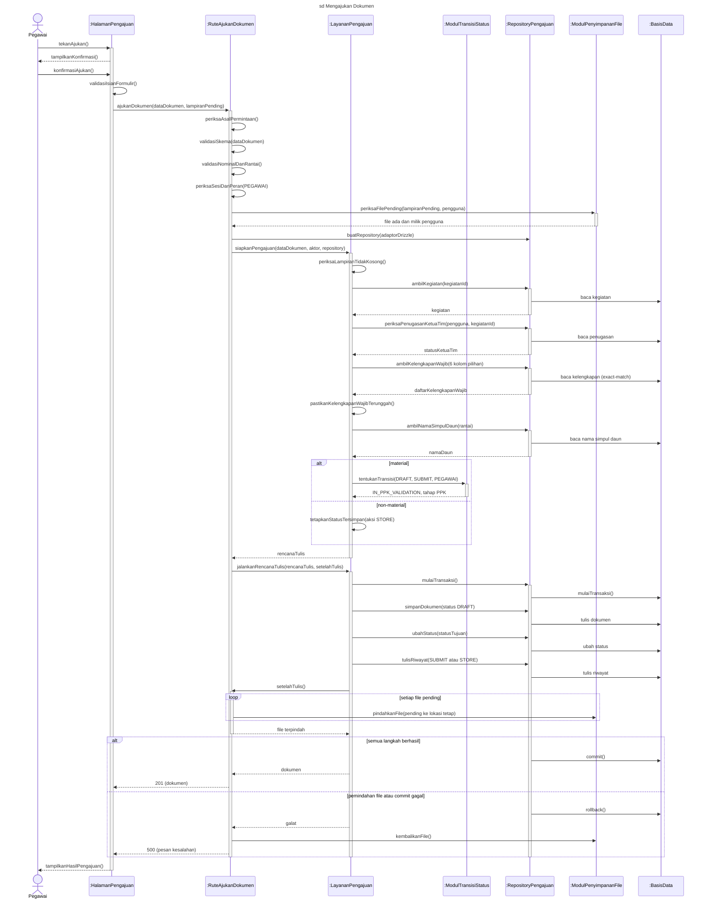
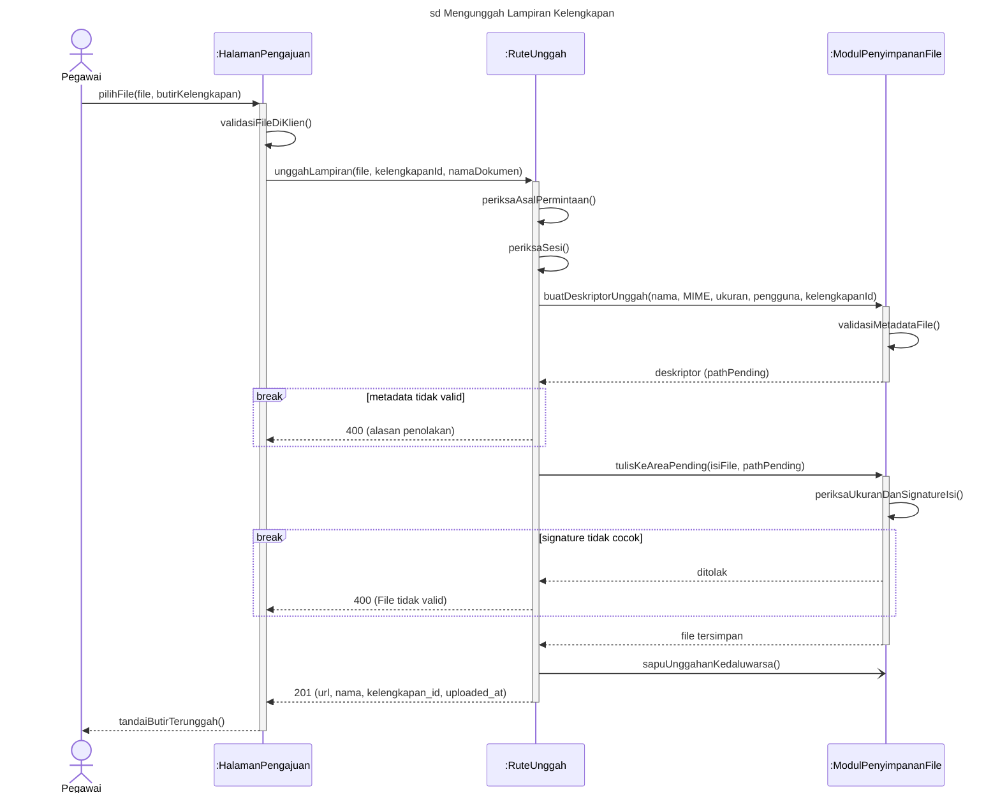
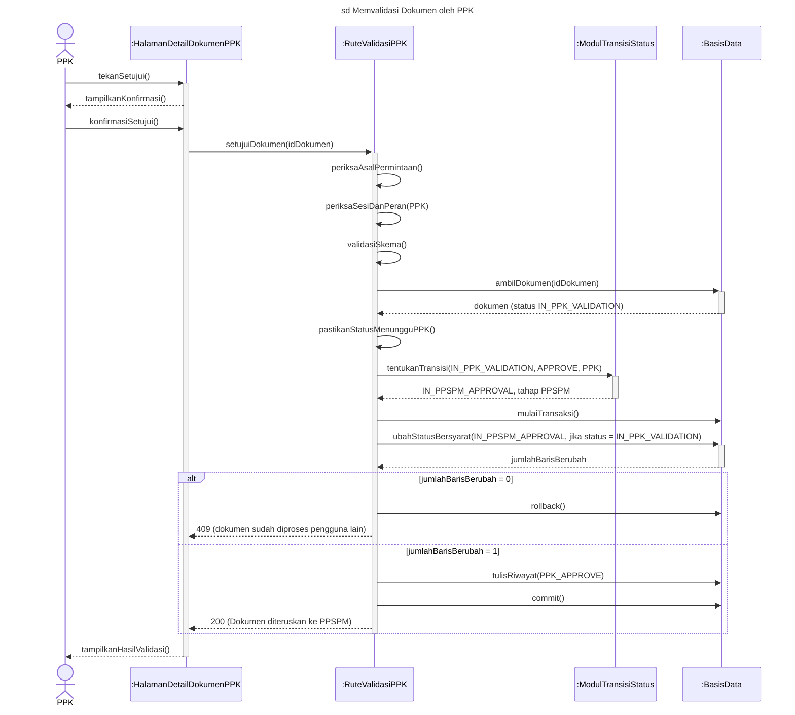
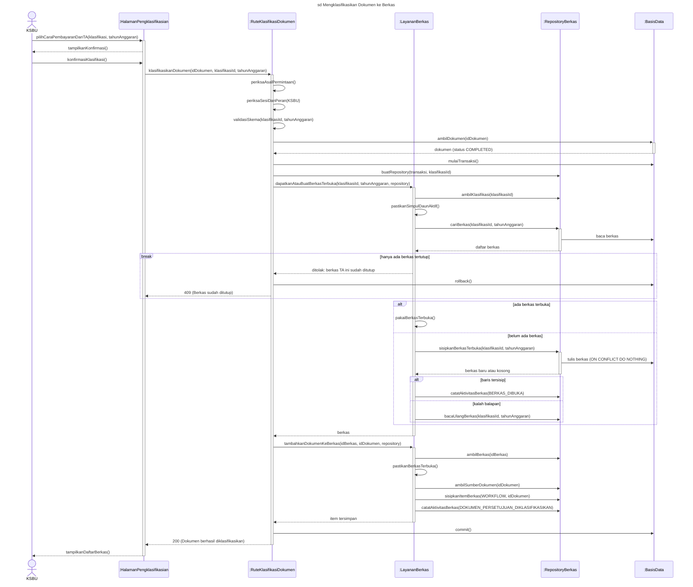
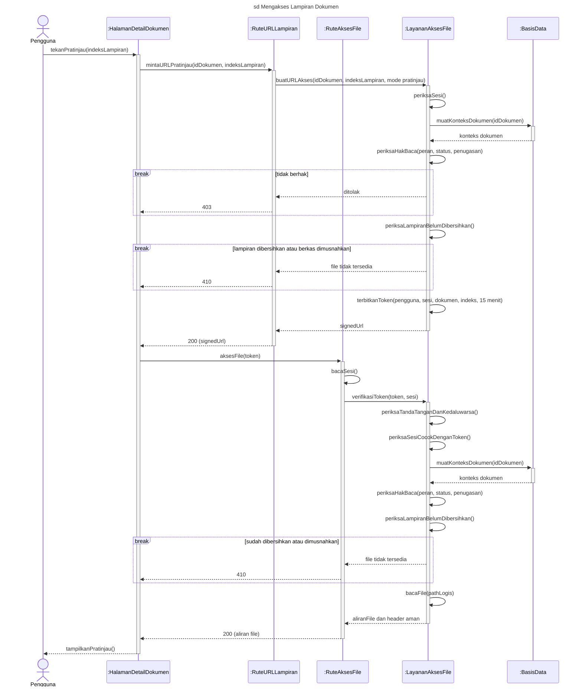
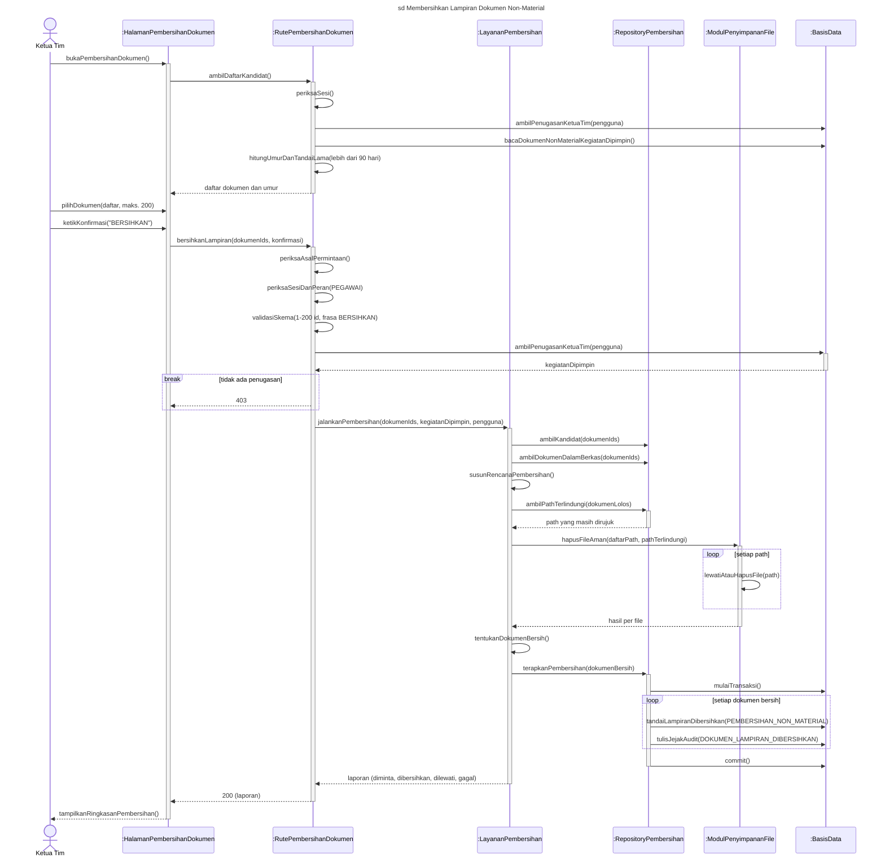

# Rancangan *Sequence Diagram* Bab IV (Gambar 4.18–4.23)

Dibuat 27 September 2026. Status: **sudah diverifikasi terhadap kode (27 Sept 2026)**; blok Mermaid sudah dikoreksi, belum dirender ulang, belum digambar. Ringkasan koreksi: bagian 5.0.

> **Untuk Claude Code (verifikator).** Dokumen ini berisi rancangan enam *sequence diagram*. Tugas Anda: cocokkan setiap lifeline dan pesan di tabel "Pesan" dengan kode di `src/` (otoritas tunggal: `src/` + `drizzle/`). Untuk tiap baris, isi kolom **Cek** dengan **S** (sesuai), **B** (beda, tulis versi kode yang benar + `berkas:baris`), atau **T** (tidak ada di kode). Perhatikan terutama **urutan** pesan dan **siapa memanggil siapa**, karena itulah yang digambar. Butir bertanda **[PERLU DICEK]** adalah hal yang saya ragukan. Jangan mengubah kode. Keluarkan hasilnya sebagai daftar koreksi per gambar, lalu perbaiki blok Mermaid yang terdampak.

Penomoran gambar mengikuti **"Daftar Gambar Bab IV - Status dan Revisi (27 Sept 2026)"** (4.18–4.23), yang mengesampingkan penomoran di Kerangka Bab IV Revisi 9.1 (4.21–4.26). Isi rantai pemanggilan diambil dari `penjelasan-proyek-aplikasi.md` bagian B.5 dan tabel 4.2.2.4 di kerangka.

---

## 1. Notasi resmi menurut Dennis et al. (2015)

Sumber utama: Dennis, Wixom, & Tegarden (2015), *Systems Analysis and Design: An Object-Oriented Approach with UML* (ed. ke-5), Bab 6 "Behavioral Modeling", hlm. 204–215.

### 1.1 Definisi dan kedudukan

- *Sequence diagram* adalah salah satu dari dua *interaction diagram* (bersama *communication diagram*). Diagram ini menggambarkan objek yang terlibat dalam satu *use case* dan pesan yang dipertukarkan di antara objek tersebut **menurut urutan waktu**. Karena itu, diagram ini disebut model dinamis (hlm. 204).
- Ada dua bentuk: ***generic sequence diagram*** (memuat semua skenario satu *use case*) dan ***instance sequence diagram*** (satu skenario). Dennis menyarankan *instance* karena lebih mudah dibaca dan diuji; kondisi percabangan biasanya tidak digambar, tetapi diwakili oleh diagram terpisah (hlm. 204, 207, 209).
- Diagram dipakai pada tahap analisis **dan** perancangan. Diagram tahap perancangan "sangat spesifik terhadap implementasi, sering memuat objek basis data atau komponen antarmuka pengguna sebagai objeknya" (hlm. 204). Kalimat ini menjadi dasar Bab IV memakai lifeline berupa komponen sistem (halaman, rute, layanan, basis data).

### 1.2 Elemen notasi (Figure 6-2, hlm. 206)

| No | Elemen | Simbol | Keterangan menurut Dennis et al. |
|---|---|---|---|
| 1 | *Actor* | Orang lidi (bawaan) atau persegi panjang berlabel `<<actor>>` untuk aktor bukan manusia | Orang atau sistem di luar sistem yang memperoleh manfaat; ikut mengirim/menerima pesan; diletakkan di bagian atas diagram |
| 2 | *Object* | Persegi panjang berisi `anObject : aClass` (bergaris bawah) | Ikut mengirim/menerima pesan; diletakkan di bagian atas diagram |
| 3 | *Lifeline* | Garis putus-putus vertikal | Masa hidup objek selama urutan; diakhiri X bila objek berhenti berinteraksi |
| 4 | *Execution occurrence* | Persegi panjang sempit di atas lifeline | Menandai saat objek sedang mengirim atau menerima pesan |
| 5 | *Message* | Panah garis penuh berlabel `aMessage()` untuk pemanggilan operasi; panah **putus-putus** berlabel nilai kembalian untuk *return* | Menyampaikan informasi dari satu objek ke objek lain |
| 6 | *Guard condition* | `[aGuardCondition]: aMessage()` | Syarat yang harus terpenuhi agar pesan dikirim |
| 7 | *Object destruction* | X di ujung lifeline | Objek berhenti ada |
| 8 | *Frame* | Kotak dengan label bertakik di kiri atas (`sd Nama`) | Konteks diagram |

Aturan tambahan dari teks (hlm. 205–207):

- Nama kelas ditulis setelah nama objek (`aPatient:Patient`). Bila hanya ada satu objek dari satu kelas, cukup `:NamaKelas` (hlm. 208).
- Argumen pesan ditulis dalam kurung setelah nama pesan. Urutan waktu dibaca dari atas ke bawah.
- *Return message* boleh dihilangkan bila tidak menambah informasi, karena membuat diagram penuh (hlm. 207).
- Objek dapat mengirim pesan ke dirinya sendiri (*self-delegation*). Objek yang membuat objek lain digambar dengan panah yang langsung menuju kotak objek baru, bukan lifeline-nya (hlm. 207).
- Objek sementara (*temporary object*) diakhiri X di lifeline-nya (hlm. 205).

### 1.3 Pedoman penggambaran (Ambler, 2005, dikutip Dennis et al., hlm. 207–209)

1. Susun pesan dari atas ke bawah **dan**, bila memungkinkan, dari kiri ke kanan. Aktor dan objek diurutkan menurut urutan keterlibatannya.
2. Aktor dan objek yang mewakili konsep yang sama diberi nama yang sama.
3. Pemicu skenario (aktor atau objek) diletakkan paling kiri.
4. Objek diberi nama hanya bila ada beberapa objek dari kelas yang sama; selain itu cukup nama kelas.
5. Nilai kembalian hanya ditampilkan bila tidak jelas dengan sendirinya.
6. Nama pesan dan nilai kembalian diletakkan dekat ujung panah.

### 1.4 Enam langkah pembuatan (hlm. 209–210)

| Langkah | Isi | Penerapan di dokumen ini |
|---|---|---|
| 1. *Set Context* | Tentukan konteks: sistem, *use case*, atau satu skenario; digambar sebagai *frame* | Bagian "Konteks" tiap gambar |
| 2. *Identify Actors and Objects* | Aktor dari model fungsional (use case), objek dari model struktural | Tabel "Lifeline" (aktor dari Gambar 4.6–4.11; objek dari arsitektur Gambar 4.12, karena *class diagram* tidak dipakai) |
| 3. *Set Lifeline* | Garis putus-putus di bawah tiap aktor/objek; X bila objek berakhir | Semua lifeline bertahan sampai akhir (tidak ada objek sementara yang perlu X) |
| 4. *Add Messages* | Panah dari atas ke bawah; parameter dalam kurung | Tabel "Pesan" |
| 5. *Place Execution Occurrence* | Persegi panjang sempit saat objek aktif | Diatur di blok Mermaid (`activate`) |
| 6. *Validate* | Pastikan diagram memuat seluruh langkah proses | Bagian 4 (daftar cek) dan verifikasi kode oleh Claude Code |

### 1.5 Aturan validasi dan keseimbangan model (hlm. 233–234, 243–245, 254)

Dennis et al. menuntut model perilaku seimbang dengan model fungsional dan struktural. Aturan yang relevan untuk Bab IV (tanpa *communication diagram*, CRUDE, dan *class diagram*):

- **V1.** Setiap *sequence diagram* terkait dengan satu *use case* di diagram use case dan skenario use case (hlm. 243).
- **V2.** Aktor pada *sequence diagram* harus ada di diagram use case atau disebut di skenario use case (hlm. 243).
- **V3.** Pesan pada *sequence diagram* harus terkait dengan aksi pada *activity diagram* dan langkah pada skenario use case (hlm. 245).
- **V4.** Setiap transisi pada *behavioral state machine* harus terkait dengan pesan pada *sequence diagram* (hlm. 233).
- **V5.** Objek pada *sequence diagram* harus merupakan instans dari kelas di model struktural (hlm. 254). Karena Bab IV tidak memakai *class diagram*, aturan ini diterapkan terhadap komponen pada **rancangan arsitektur (Gambar 4.12)** dan tabel pada **ERD**.

### 1.6 Lapisan (Dennis et al., Bab 7, hlm. 259–260)

Saat model analisis dikembangkan menjadi model perancangan, Dennis et al. menambahkan **lapisan** (*layers*): *foundation*, *problem domain*, *data management* (berisi kelas *Data Access and Manipulation*/DAM), *human–computer interaction*, dan *physical architecture* (Figure 7-17). Rancangan ini memakai lapisan tersebut untuk mengurutkan lifeline dari kiri ke kanan.

---

## 2. Notasi pelengkap dari UML 2.5.1 (di luar buku)

Buku Dennis et al. **tidak membahas *combined fragment*** (`alt`, `opt`, `loop`, `break`, dan lainnya) maupun pesan asinkron. Padahal beberapa alur di aplikasi ini hanya bermakna bila cabang kegagalannya tampak (konflik 409, *rollback* file, 410 file sudah dibersihkan). Notasi berikut diambil dari spesifikasi resmi UML 2.5.1 (OMG, 2017, formal/17-12-05, bab 17 *Interactions*), sebagaimana dirangkum oleh [uml-diagrams.org](https://www.uml-diagrams.org/sequence-diagrams-combined-fragment.html) dan [uml-diagrams.org — notation reference](https://www.uml-diagrams.org/sequence-diagrams-reference.html).

> **[PERLU DICEK oleh Daniel]** PDF spesifikasi OMG tidak dapat saya buka dari lingkungan kerja ini (akses ke omg.org ditolak). Nomor subbab yang biasa dirujuk untuk *CombinedFragment* adalah 17.6 dan untuk *Message* 17.4, tetapi cocokkan dengan PDF resmi (https://www.omg.org/spec/UML/2.5.1/PDF) sebelum menyitasi nomor subbab.

| Elemen | Simbol | Makna | Dipakai di |
|---|---|---|---|
| *Combined fragment* `alt` | Kotak berlabel `alt`, dibagi garis putus-putus per operand, tiap operand diberi *guard* `[...]` | Paling banyak satu operand dijalankan, yaitu yang *guard*-nya benar; `[else]` = semua *guard* lain salah | 4.18, 4.20, 4.21 (termasuk `alt` bersarang) |
| `opt` | Kotak berlabel `opt` dengan satu *guard* | Operand dijalankan atau tidak sama sekali | — (tidak dipakai lagi; `opt` di 4.21 diganti `alt` setelah verifikasi) |
| `loop` | Kotak berlabel `loop` dengan *guard* atau batas `loop(min,max)` | Operand diulang | 4.18, 4.23 |
| `break` | Kotak berlabel `break` dengan *guard* | Bila *guard* benar, operand dijalankan **sebagai ganti** sisa fragmen yang melingkupinya (skenario pengecualian) | 4.19, 4.21, 4.22, 4.23 |
| Pesan sinkron | Garis penuh, kepala panah **terisi** | Pengirim menunggu balasan | Semua |
| Pesan asinkron | Garis penuh, kepala panah **terbuka** | Pengirim tidak menunggu | 4.19 (pembersihan *pending* tanpa menunggu) |
| *Reply message* | Garis putus-putus, kepala panah terbuka | Balasan atas pemanggilan | Semua (hanya bila informatif) |

Prinsip pemakaian: fragmen dipakai **hemat**, hanya untuk cabang yang menjadi klaim rancangan (KNF-07, KNF-11, KNF-06). Cabang kesalahan rutin (401 tanpa sesi, 403 peran salah, 400 skema tidak valid) **tidak digambar**; cukup disebut di narasi. Ini tetap sejalan dengan Dennis et al. yang menyarankan diagram per skenario: tiap gambar adalah **skenario utama (berhasil)** ditambah satu atau dua cabang kegagalan penting.

---

## 3. Konvensi yang dipakai di keenam gambar

| # | Konvensi | Alasan |
|---|---|---|
| K1 | **Tingkat perancangan**, bukan analisis. Lifeline = komponen sistem pada Gambar 4.12 | Dennis et al. hlm. 204; subbab 4.2 menjawab "bagaimana diwujudkan" |
| K2 | Nama lifeline objek memakai bentuk anonim **`:NamaKomponen`** (bergaris bawah saat digambar) | Dennis et al. hlm. 208: nama objek hanya bila ada lebih dari satu objek sekelas |
| K3 | Nama aktor **sama persis** dengan diagram use case: Pegawai, Ketua Tim, PPK, KSBU, Pengguna | Pedoman Ambler no. 2; aturan V2 |
| K4 | Urutan lifeline kiri→kanan mengikuti **lapisan**: Aktor → Antarmuka (halaman) → Rute API → Layanan/Domain → Modul transisi status → *Repository* (DAM) → Penyimpanan file → Basis data | Pedoman no. 1 dan 3; sama dengan urutan kolom Gambar 4.12. Penyimpangan kecil dari urutan keterlibatan disengaja agar keenam gambar seragam |
| K5 | Label pesan berbahasa Indonesia dalam bentuk operasi `kataKerjaObjek(argumen)`. Nama fungsi kode **tidak** ditulis di gambar, hanya di tabel verifikasi | Figure 6-2; naskah memakai istilah tampilan |
| K6 | Pemeriksaan di dalam rute (asal permintaan, sesi, peran, skema) digambar sebagai ***self-delegation*** pada lifeline rute, bukan lifeline tersendiri | Menjaga lebar diagram; pemeriksaan ini tidak bertukar pesan bermakna dengan komponen lain |
| K7 | Transaksi basis data digambar dengan pesan eksplisit `mulaiTransaksi()` dan `commit()` / `rollback()` ke `:BasisData` | Notasi murni Dennis; tidak menyalahgunakan operator `critical` (yang maknanya "tidak boleh disela", bukan "transaksi") |
| K8 | *Return* hanya bila membawa informasi (status baru, jumlah baris, kode HTTP) | Pedoman no. 5 |
| K9 | Tidak ada nomor urut di gambar akhir. Nomor di tabel "Pesan" hanya untuk verifikasi dan rujukan narasi | Nomor urut adalah ciri *communication diagram* (Figure 6-11), bukan *sequence diagram* |
| K10 | Istilah naskah: "dokumen" sebelum diberkaskan, "berkas" setelahnya; "dokumen elektronik", bukan "soft file"; "Cara Pembayaran" untuk klasifikasi; "modul transisi status" untuk `fsm.ts` | "Pedoman Penulisan dan Diagram (disepakati)" |
| K11 | Garis bawah pada nama objek, orang lidi untuk aktor, dan label *frame* `sd …` wajib ada di gambar akhir (Miro/draw.io). Mermaid tidak bisa menggarisbawahi nama objek | Figure 6-2 |

### Daftar lifeline bersama

| Lifeline | Lapisan (Dennis Bab 7) | Kotak di Gambar 4.12 | Berkas kode utama |
|---|---|---|---|
| `:HalamanPengajuan`, `:HalamanDetailDokumen`, dst. | *Human–computer interaction* | Peramban (aplikasi klien React) | `src/routes/<peran>/…tsx` |
| `:Rute…` | *Problem domain* (pintu masuk) | Pemeriksaan permintaan + Rute API + Validasi masukan | `src/routes/api/…` |
| `:LayananPengajuan`, `:LayananBerkas`, `:LayananPembersihan`, `:LayananAksesFile` | *Problem domain* | Layanan dan repository / Layanan akses file bertoken | `src/lib/dokumen/*`, `src/lib/archive/*`, `src/lib/storage/*` |
| `:ModulTransisiStatus` | *Problem domain* | Modul transisi status terpusat | `src/lib/fsm.ts` |
| `:RepositoryPengajuan`, `:RepositoryBerkas`, `:RepositoryPembersihan` | *Data management* (kelas DAM) | Drizzle ORM | adaptor Drizzle yang diinjeksikan |
| `:ModulPenyimpananFile` | *Data management* | Modul penyimpanan file (+ filesystem lokal) | `src/lib/storage/*` (tidak dipakai di 4.20 dan 4.22) |
| `:BasisData` | *Data management* (penyimpanan) | Basis data PostgreSQL | — |

---

## 4. Ringkasan keenam gambar

| Gambar | Frame (`sd …`) | Use case | Keseimbangan dengan gambar lain | Fragmen |
|---|---|---|---|---|
| 4.18 | `sd Mengajukan Dokumen` | UC-05 | Activity 4.13 langkah 7–9; SMD 4.15 transisi #1 (`DRAFT → IN_PPK_VALIDATION`) dan jalur `DRAFT → TERSIMPAN` | `alt` material/non-material; `loop` pindah file; `alt` transaksi berhasil/gagal |
| 4.19 | `sd Mengunggah Lampiran Kelengkapan` | UC-05 (langkah unggah) | Activity 4.13 langkah 5–6 | `break` file tidak valid; pesan asinkron |
| 4.20 | `sd Memvalidasi Dokumen oleh PPK` | UC-09 | Activity 4.14 (PPK setuju); SMD 4.15 transisi #2 | `alt` konflik 409 |
| 4.21 | `sd Mengklasifikasikan Dokumen ke Berkas` | UC-13 | Activity 4.16(a); SMD berkas 4.17 (pembentukan berkas `Terbuka`) | `break` berkas tertutup; `alt` terbuka/belum ada; `alt` bersarang tersisip/kalah balapan |
| 4.22 | `sd Mengakses Lampiran Dokumen` | UC-06, UC-09, UC-11, UC-26 (pratinjau/unduh) | KNF-06 | `break` 403, `break` 410 (dua kali) |
| 4.23 | `sd Membersihkan Lampiran Dokumen Non-Material` | UC-08 | **Pengganti activity diagram** pembersihan non-material (keputusan 27 Sept) | `break` tanpa penugasan; `loop` hapus file (di modul file); `loop` penandaan per dokumen |

---

## 5. Rancangan per gambar

> **Hasil verifikasi kode (27 Sept 2026).** Kolom **Cek**: **S** = sesuai, **B** = beda (versi kode + `berkas:baris` ditulis), **T** = tidak ada di kode, **+** = pesan baru hasil verifikasi. Blok Mermaid di bawah **sudah** versi terkoreksi. Ringkasan koreksi per gambar ada di bagian 5.0.

### 5.0 Ringkasan koreksi per gambar

| Gambar | Koreksi yang mengubah gambar | Koreksi kecil (hanya rujukan/label) |
|---|---|---|
| 4.18 | (1) Halaman menampilkan **dialog konfirmasi** sebelum mengirim (`aju.tsx:1175-1191`). (2) **Rute membuat repository** lalu menyuntikkannya ke layanan (`submit.ts:109-116`), jadi ini bukti KNF-12. (3) Tiga pesan tulis dikirim **Layanan → Repository**, bukan dimulai Repository. (4) Pemindahan file adalah *callback* **milik rute**: Layanan memanggil balik Rute (`afterWrites`), lalu Rute → PenyimpananFile dalam `loop`. (5) `kembalikanFile()` dikirim **Rute**, bukan Layanan. (6) Modul transisi status **tidak** mengembalikan aksi riwayat; `SUBMIT`/`STORE` ditetapkan layanan. | Nomor baris aju/submit/bridge; narasi "409" diganti 400 |
| 4.19 | `:KebijakanUnggah` **digabung** ke `:ModulPenyimpananFile`: validasi metadata dipanggil dari `local-upload.ts` (`createLocalUploadDescriptor`), bukan modul terpisah. `:PembersihUnggahanTertunda` juga **digabung** ke `:ModulPenyimpananFile` (pesan asinkron jadi modul memanggil dirinya sendiri) sehingga tidak perlu kotak baru di Gambar 4.12. Tambah validasi di klien (`FileUploadButton.tsx:141`) | Kode HTTP signature = 400 |
| 4.20 | Tambah dialog konfirmasi dan pemeriksaan status `IN_PPK_VALIDATION` sebelum modul transisi (`approve.ts:79-83`). Return modul transisi tanpa "aksi PPK_APPROVE" (aksi ditulis rute, `:116`). Respons 200 berisi pesan, bukan status baru | Nomor baris transaksi/commit |
| 4.21 | (1) **Rute membuat `:RepositoryBerkas`** di dalam transaksi (`archive.ts:107`). (2) `opt` kalah balapan salah urutan: `BERKAS_DIBUKA` dicatat **hanya bila baris tersisip**; bila kalah balapan, berkas dibaca ulang tanpa log. Diganti `alt` bersarang. (3) `tambahkanDokumenKeBerkas` lebih dulu **membaca ulang berkas dan memastikan masih terbuka**, lalu membaca sumber dokumen. (4) Setelah berhasil, halaman **pindah ke daftar berkas** | Pesan galat tanpa kata "pada"; 409 terkonfirmasi; `:630` → `archive.ts:195-211` |
| 4.22 | (1) Tahap 2 **memeriksa hak baca lagi** (`document-file-access.ts:160-175`); tanpa pesan ini klaim "diperiksa dua kali" tidak tampak di gambar. (2) Sesi dibaca rute `files/access.ts:15` lalu diteruskan ke layanan. (3) `:ModulPenyimpananFile` **dihapus**: `readLocalLogicalPathFile` adalah fungsi privat di `internal-file-access.ts:357`, jadi digambar sebagai *self* | `storagePathBelongsToUser` tidak dipakai untuk token dokumen; token tidak sah = 401 |
| 4.23 | (1) Umur dan penanda >90 hari **dihitung server** (`pembersihan-dokumen.ts:88-112`), bukan halaman. (2) Hapus file = **satu panggilan** berisi seluruh path; perulangan dan pengecualian path terlindungi terjadi **di dalam** `:ModulPenyimpananFile`. (3) Penandaan basis data = **satu panggilan** `terapkanPembersihan()`; repository membuka transaksi dan mengulang per dokumen | Enam alasan tolak (ada `NOT_FOUND`), bukan lima |
| Semua | **K5 dilanggar** oleh label `transition(...)` (nama fungsi kode). Diganti `tentukanTransisi(...)` | — |

---

### Gambar 4.18 — *Sequence Diagram* Pengajuan Dokumen

**Konteks.** `sd Mengajukan Dokumen`. Skenario utama: Pegawai mengajukan dokumen **material** yang lengkap, semua file *pending* sudah terunggah (Gambar 4.19), dan transaksi berhasil. Jalur non-material dan kegagalan transaksi ditampilkan sebagai `alt`. Ini contoh utama KNF-12 (injeksi *repository*) dan KNF-11 (file dipindah di dalam transaksi, dikembalikan bila gagal).

**Endpoint:** `POST /api/dokumen/submit` (`src/routes/api/dokumen/submit.ts`).

**Lifeline**

| Lifeline | Kode |
|---|---|
| Pegawai (aktor) | — |
| `:HalamanPengajuan` | `src/routes/pegawai/dokumen/aju.tsx` |
| `:RuteAjukanDokumen` | `src/routes/api/dokumen/submit.ts` |
| `:LayananPengajuan` | `src/lib/dokumen/local-submit-write-bridge.ts` |
| `:ModulTransisiStatus` | `src/lib/fsm.ts` |
| `:RepositoryPengajuan` | `local-submit-repository.ts` + `local-submit-drizzle-adapter.ts` (dibuat rute, `submit.ts:109-110`) |
| `:ModulPenyimpananFile` | `src/lib/storage/submit-move-plan.ts` + `src/lib/dokumen/submit-file-preflight.ts` (pemeriksaan), `src/lib/storage/local-pending-move.ts` (pindah), `local-attachment-replacement.ts` (kembalikan) |
| `:BasisData` | PostgreSQL |

**Pesan**

| No | Dari → Ke | Pesan (label di gambar) | Jenis | Rujukan kode | Cek |
|---|---|---|---|---|---|
| 1 | Pegawai → Halaman | `tekanAjukan()` | panggilan | tombol di langkah Tinjau, nonaktif bila kelengkapan wajib kurang atau lampiran kosong: `submitDisabled`, `aju.tsx:1075` | S |
| 1a | Halaman ⇢ Pegawai | `tampilkanKonfirmasi()` | *return* | `ConfirmDialog` "Ajukan dokumen ini?", `aju.tsx:1175-1191` | + |
| 1b | Pegawai → Halaman | `konfirmasiAjukan()` | panggilan | `onConfirm={handleSubmit}`, `aju.tsx:1191` | + |
| 1c | Halaman → Halaman | `validasiIsianFormulir()` | *self* | `validateSubmission()`, `aju.tsx:577` | + |
| 2 | Halaman → Rute | `ajukanDokumen(dataDokumen, lampiranPending)` | panggilan | `apiMutation('/api/dokumen/submit')`, **`aju.tsx:602`** (bukan :584) | B |
| 3 | Rute → Rute | `periksaAsalPermintaan()` | *self* | `requireSameOrigin`, `submit.ts:403` | S |
| 4 | Rute → Rute | `validasiSkema(dataDokumen)` | *self* | `createAndSubmitDokumenSchema.safeParse`, `:412` | S |
| 5 | Rute → Rute | `validasiNominalDanRantai()` | *self* | `validateNominalForMaterial` `:421`, `validateWorkflowChainForCharacteristic` `:431` | S |
| 6 | Rute → Rute | `periksaSesiDanPeran(PEGAWAI)` | *self* | `handleLocalDbSubmit` → `getLocalServerSession` `:72-76` → `createLocalSubmitActorFromSession` `:78-81` (peran PEGAWAI dicek di `local-submit-write-bridge.ts:238`). **Terjawab:** sesi memang diperiksa **setelah** validasi skema; kerangka yang harus disesuaikan | S |
| 7 | Rute → PenyimpananFile | `periksaFilePending(lampiranPending, pengguna)` | panggilan | `buildSubmitMovePlan` (cek pemilik path, `submit-move-plan.ts:164-169`) + `preflightSubmitFiles` (sumber ada, tujuan kosong), `submit.ts:83-100`. Gagal → **400**, bukan 409 | S |
| 8 | PenyimpananFile ⇢ Rute | `file ada dan milik pengguna` | *return* | | S |
| 8a | Rute → Repository | `buatRepository(adaptorDrizzle)` | panggilan (pembuatan objek) | `createLiveLocalSubmitDrizzleAdapter` + `createLocalSubmitBridgeRepository`, `submit.ts:109-110`. Di gambar akhir, panah menuju **kotak** objek (Dennis hlm. 207) | + |
| 9 | Rute → Layanan | `siapkanPengajuan(dataDokumen, aktor, repository)` | panggilan | `prepareLocalSubmitWriteBridge`, dipanggil `submit.ts:111-116`, definisi **`local-submit-write-bridge.ts:262-355`**. Argumen `repository` ditambahkan: inilah injeksinya | B |
| 10 | Layanan → Layanan | `periksaLampiranTidakKosong()` | *self* | `checkLampiranNotEmpty`, dipanggil `:269`, definisi **`:518-524`** | B |
| 11 | Layanan → Repository | `ambilKegiatan(kegiatanId)` | panggilan | `getKegiatanById`, `:274` | S |
| 12 | Layanan → Repository | `periksaPenugasanKetuaTim(pengguna, kegiatanId)` | panggilan | `hasKetuaTimAssignment`, **`:282-292`**. **Terjawab:** (a) selalu dipanggil, apa pun isi `isKetuaTim` dari klien; (b) dipanggil sebelum pengecekan kelengkapan (`:296`), dan hasilnya menggantikan `isKetuaTim` (`:294`) | B |
| 13 | Repository ⇢ Layanan | `statusKetuaTim` | *return* | klaim Ketua Tim tanpa penugasan → 403 (tidak digambar) | S |
| 14 | Layanan → Repository | `ambilKelengkapanWajib(6 kolom pilihan)` | panggilan | `checkRequiredKelengkapan` **`:540-575`** → `buildRequiredKelengkapanCondition`, `local-submit-drizzle-adapter.ts:160`. Untuk non-material, pembacaan dilewati bila `jenisPermintaanId` kosong (`:588-590`) | B |
| 15 | Layanan → Layanan | `pastikanKelengkapanWajibTerunggah()` | *self* | `getMissingRequiredKelengkapanNames`, `:577-586` | S |
| 16 | Layanan → Repository | `ambilNamaSimpulDaun(rantai)` | panggilan | `resolveLocalSubmitLeafName`, dipanggil `:311`, definisi `:461-505`. **Terjawab:** untuk material **membaca basis data** (Detail → Kategori → Jenis → Komponen, yang pertama ada); untuk non-material memakai `namaDokumen` tanpa basis data | S |
| — | `alt [material]` | | | `buildLocalSubmitTransitionPlan`, **`:439-459`** | |
| 17 | Layanan → ModulTransisi | `tentukanTransisi(DRAFT, SUBMIT, PEGAWAI)` | panggilan | `transition(...)`, `:456`. Label diganti karena K5 | B |
| 18 | ModulTransisi ⇢ Layanan | `IN_PPK_VALIDATION, tahap PPK` | *return* | `fsm.ts:20-25`. Modul transisi **tidak** mengembalikan aksi; `SUBMIT` ditetapkan layanan (`auditAction`, `:457`) | B |
| — | `[else] non-material` | | | | |
| 19 | Layanan → Layanan | `tetapkanStatusTersimpan(aksi STORE)` | *self* | **`:442-452`**; satu-satunya jalur di luar modul transisi status | S |
| — | akhir `alt` | | | | |
| 20 | Layanan ⇢ Rute | `rencanaTulis` | *return* | | S |
| 21 | Rute → Layanan | `jalankanRencanaTulis(rencanaTulis, setelahTulis)` | panggilan | `executeLocalSubmitWritePlan`, dipanggil `submit.ts:124-132` dengan *callback* `afterWrites`, definisi **`:366-400`** | B |
| 22 | Layanan → Repository | `mulaiTransaksi()` | panggilan | `withSubmitWriteTransaction`, `:371` | S |
| 22a | Repository → BasisData | `mulaiTransaksi()` | panggilan | `database.transaction`, `local-submit-drizzle-adapter.ts:148` | + |
| 23 | Layanan → Repository | `simpanDokumen(status DRAFT)` | panggilan | `tx.createDokumen`, `:372`. **Pengirim = Layanan**; Repository meneruskan satu kueri ke BasisData | B |
| 24 | Layanan → Repository | `ubahStatus(statusTujuan)` | panggilan | `tx.updateDokumenStatus`, `:378` | B |
| 25 | Layanan → Repository | `tulisRiwayat(SUBMIT atau STORE)` | panggilan | `tx.appendLog`, `:384` | B |
| 26 | Layanan → Rute | `setelahTulis()` | panggilan (*callback*) | `options.afterWrites()`, `:386`. **Terjawab:** fungsinya didefinisikan di rute (`submit.ts:125-131`), jadi saat dijalankan pemanggilnya layanan, **tetapi kode yang memanggil modul file adalah kode rute**. Karena itu digambar Layanan → Rute → PenyimpananFile | B |
| — | `loop [setiap file pending]` | | | `moveSubmitFilesOrRollback`, `submit.ts:321-361` | + |
| 26a | Rute → PenyimpananFile | `pindahkanFile(pending → lokasi tetap)` | panggilan | `moveLocalPendingFileToFormal`, `:335-340` | B |
| — | akhir `loop` | | | | |
| — | `alt [semua langkah berhasil]` | | | | |
| 27 | Repository → BasisData | `commit()` | panggilan | otomatis saat *callback* transaksi selesai tanpa galat | S |
| 28 | Rute ⇢ Halaman | `201 (dokumen)` | *return* | `submit.ts:154` | S |
| — | `[else] pemindahan file atau commit gagal` | | | | |
| 30 | Repository → BasisData | `rollback()` | panggilan | otomatis karena galat dilempar di dalam transaksi | S |
| 29 | Rute → PenyimpananFile | `kembalikanFile()` | panggilan | `rollbackLocalAttachmentMovements`. **Pengirim = Rute**, bukan Layanan: di dalam *callback* bila pemindahan gagal (`:356`), atau di `catch` bila commit gagal (`:143-145`) | B |
| 31 | Rute ⇢ Halaman | `500 (Gagal mengajukan dokumen, silakan coba lagi)` | *return* | `:138`, `:148` | S |
| — | akhir `alt` | | | | |
| 32 | Halaman ⇢ Pegawai | `tampilkanHasilPengajuan()` | *return* | toast + tampilan hasil, `aju.tsx:623-634` | S |

**Catatan narasi (untuk naskah).** Diagram memperlihatkan empat klaim rancangan: (1) server memeriksa ulang semua syarat yang sudah dicek formulir; (2) rute membuat *repository* lalu menyuntikkannya ke layanan pengajuan, sehingga layanan tidak bergantung langsung pada ORM (KNF-12); (3) aturan transisi hanya diputuskan modul transisi status, kecuali jalur non-material yang disengaja; (4) dokumen, status, riwayat, dan pemindahan file terjadi dalam satu transaksi sehingga status `DRAFT` tidak pernah tersimpan permanen. Urutan pada cabang gagal bergantung pada titik gagalnya: bila pemindahan file gagal, file yang sudah dipindah dikembalikan lebih dulu, baru transaksi dibatalkan; bila *commit* yang gagal, transaksi batal lebih dulu, baru file dikembalikan. Gambar memakai urutan kedua. Cabang 400/401/403 (skema, sesi, peran atau penugasan Ketua Tim, file *pending* tidak ditemukan atau bukan milik pengguna) disebut di narasi, tidak digambar.

---

### Gambar 4.19 — *Sequence Diagram* Unggah Lampiran Kelengkapan

**Konteks.** `sd Mengunggah Lampiran Kelengkapan`. Skenario utama: Pegawai memilih file untuk satu butir kelengkapan pada formulir pengajuan; file lolos semua pemeriksaan dan disimpan ke **area *pending***. Tidak melibatkan basis data maupun modul transisi status. File baru dipindah ke lokasi tetap saat pengajuan (Gambar 4.18, pesan 26a).

**Endpoint:** `POST /api/upload` (`src/routes/api/upload.ts`), *multipart/form-data*.

**Lifeline**

| Lifeline | Kode |
|---|---|
| Pegawai (aktor) | — |
| `:HalamanPengajuan` | `aju.tsx` → `StepUploadLampiran` → `KelengkapanChecklist` → **`FileUploadButton`** (`src/components/dokumen/FileUploadButton.tsx`). **Terjawab:** nama komponen benar |
| `:RuteUnggah` | `src/routes/api/upload.ts` |
| `:ModulPenyimpananFile` | `src/lib/storage/local-upload.ts` (`createLocalUploadDescriptor`, `writeLocalUploadContent`) + `src/lib/storage/pending-upload-sweeper.ts` (penyapu otomatis); aturan ekstensi/MIME/ukuran/signature diambil dari `src/lib/upload/document-upload-policy.ts` |

> **Terjawab (penggabungan `:KebijakanUnggah`).** Rute tidak pernah memanggil modul kebijakan secara langsung. Rute memanggil `createLocalUploadDescriptor` (`local-upload.ts:199-220`), yang di dalamnya memanggil `validateLocalUploadFileMetadata` (`:107-140`) dengan konstanta dari `document-upload-policy.ts`. Jadi `:KebijakanUnggah` digabung ke `:ModulPenyimpananFile` (aturan C2). Bila tetap ingin memisahkan kebijakan, lifeline itu harus dipanggil oleh `:ModulPenyimpananFile`, bukan oleh rute.

> **`:PembersihUnggahanTertunda` digabung ke `:ModulPenyimpananFile`** (koreksi setelah diskusi 27 Sept, menggantikan lifeline terpisah pada draf sebelumnya). Kotak "Modul penyimpanan file" di Gambar 4.12 sudah mencakup tanggung jawab *safe-delete*; penyapu otomatis (`pending-upload-sweeper.ts`) adalah bentuk *safe-delete* yang dipicu berkala, bukan komponen arsitektur terpisah, sehingga tidak perlu kotak baru di 4.12 (lihat pesan 11 di bawah: sekarang digambar sebagai panggilan asinkron modul ke dirinya sendiri).

**Pesan**

| No | Dari → Ke | Pesan | Jenis | Rujukan kode | Cek |
|---|---|---|---|---|---|
| 1 | Pegawai → Halaman | `pilihFile(file, butirKelengkapan)` | panggilan | `handleFileSelect`, `FileUploadButton.tsx:137` | S |
| 1a | Halaman → Halaman | `validasiFileDiKlien()` | *self* | `validateDocumentUploadClientFileMetadata`, `FileUploadButton.tsx:141` | + |
| 2 | Halaman → Rute | `unggahLampiran(file, kelengkapanId, namaDokumen)` | panggilan | `fetch('/api/upload')`, `FileUploadButton.tsx:154-159`; dibaca `upload.ts:74-96` | S |
| 3 | Rute → Rute | `periksaAsalPermintaan()` | *self* | `requireSameOrigin`, `:61-62` | S |
| 4 | Rute → Rute | `periksaSesi()` | *self* | `getLocalServerSession`, `:63-67`; **tanpa** pemeriksaan peran | S |
| 5 | Rute → PenyimpananFile | `buatDeskriptorUnggah(nama, MIME, ukuran, pengguna, kelengkapanId)` | panggilan | `createLocalUploadDescriptor`, `upload.ts:98-111` → `local-upload.ts:199-220` | B |
| 5a | PenyimpananFile → PenyimpananFile | `validasiMetadataFile()` | *self* | `validateLocalUploadFileMetadata`, `local-upload.ts:107-140`: ekstensi, MIME, pasangan ekstensi–MIME, ukuran > 0 dan ≤ 5 MB, sanitasi nama | + |
| 5b | PenyimpananFile ⇢ Rute | `deskriptor (pathPending)` | *return* | path `<pengguna>/<kelengkapan>_<waktu>_<nama>`, `local-upload.ts:194` | + |
| — | `break [metadata tidak valid]` | | | | |
| 6 | Rute ⇢ Halaman | `400 (alasan penolakan)` | *return* | `localUploadErrorResponse`, `upload.ts:152-176` | S |
| — | akhir `break` | | | | |
| 7 | Rute → PenyimpananFile | `tulisKeAreaPending(isiFile, pathPending)` | panggilan | `writeLocalUploadContent`, `upload.ts:120-127` | S |
| 8 | PenyimpananFile → PenyimpananFile | `periksaUkuranDanSignatureIsi()` | *self* | `local-upload.ts:236-258` | S |
| — | `break [signature tidak cocok]` | | | **Terjawab:** `invalid-file-signature` → **400** "File tidak valid. Pilih file lain." (`upload.ts:168-171`) | |
| 9 | Rute ⇢ Halaman | `400 (File tidak valid)` | *return* | | S |
| — | akhir `break` | | | | |
| 10 | PenyimpananFile ⇢ Rute | `file tersimpan` | *return* | URL yang dikembalikan ke klien adalah `descriptor.logicalPath` (`upload.ts:142`) | S |
| 11 | Rute –) PenyimpananFile | `sapuUnggahanKedaluwarsa()` | **asinkron** | `void maybeSweepStalePendingUploads()`, `upload.ts:139`; maks. sekali per jam per proses (`pending-upload-sweeper.ts:80-81`); hapus file *pending* > 24 jam yang tidak dirujuk. **Tujuan digabung ke `:ModulPenyimpananFile`** (lihat catatan lifeline di atas) | B |
| 12 | Rute ⇢ Halaman | `201 (url, nama, kelengkapan_id, uploaded_at)` | *return* | `:141-146` | S |
| 13 | Halaman ⇢ Pegawai | `tandaiButirTerunggah()` | *return* | | S |

**Catatan narasi.** Diagram ini menjelaskan mengapa file dapat diunggah sebelum dokumen tersimpan tanpa menumpuk di disk: file hanya masuk area *pending* milik pengguna, dipindah saat pengajuan berhasil, dan yang ditinggalkan dibersihkan (saat halaman ditinggalkan, oleh penyapu otomatis > 24 jam, atau skrip). Jenis dan ukuran file diperiksa dua kali: di peramban untuk umpan balik cepat, dan di server sebagai penentu. Cabang `?cleanup=pending` (`upload.ts:178-235`) tidak digambar; cukup satu kalimat.

---

### Gambar 4.20 — *Sequence Diagram* Validasi Dokumen oleh PPK

**Konteks.** `sd Memvalidasi Dokumen oleh PPK`. Skenario utama: PPK menyetujui dokumen berstatus `IN_PPK_VALIDATION`. Cabang yang digambar: **konflik** saat dokumen sudah diproses pihak lain (pembaruan bersyarat mengenai 0 baris → 409). Ini bukti KNF-07 (pembaruan bersyarat) dan KNF-08 (riwayat dalam transaksi yang sama).

**Endpoint:** `POST /api/ppk/dokumen/$id/approve`.

**Sengaja tanpa lifeline layanan/repository.** Rute ini memanggil ORM langsung setelah modul transisi status (Validasi Rancangan 24 Sept, temuan 5). Perbedaan dengan Gambar 4.18 justru menjadi dasar kalimat KNF-12 "sebagian modul". **Terkonfirmasi** oleh `approve.ts:4-5` (impor `db` dan skema langsung).

**Lifeline**

| Lifeline | Kode |
|---|---|
| PPK (aktor) | — |
| `:HalamanDetailDokumenPPK` | **`src/routes/ppk/dokumen/$id/index.tsx`** (bukan `$id.tsx`; berkas itu hanya *layout*) |
| `:RuteValidasiPPK` | `src/routes/api/ppk/dokumen/$id/approve.ts` |
| `:ModulTransisiStatus` | `src/lib/fsm.ts` |
| `:BasisData` | PostgreSQL (lewat Drizzle langsung dari rute) |

**Pesan**

| No | Dari → Ke | Pesan | Jenis | Rujukan kode | Cek |
|---|---|---|---|---|---|
| 1 | PPK → Halaman | `tekanSetujui()` | panggilan | | S |
| 1a | Halaman ⇢ PPK | `tampilkanKonfirmasi()` | *return* | `ConfirmDialog open={approveOpen}`, `index.tsx:284-291` | + |
| 1b | PPK → Halaman | `konfirmasiSetujui()` | panggilan | | + |
| 2 | Halaman → Rute | `setujuiDokumen(idDokumen)` | panggilan | `apiMutation('/api/ppk/dokumen/${id}/approve')`, `index.tsx:140` | S |
| 3 | Rute → Rute | `periksaAsalPermintaan()` | *self* | `requireSameOrigin`, `approve.ts:27-28` | S |
| 4 | Rute → Rute | `periksaSesiDanPeran(PPK)` | *self* | `getLocalServerSession` `:29-33` + `hasLocalRole(session,'PPK')` `:35-37` | S |
| 5 | Rute → Rute | `validasiSkema()` | *self* | `approveDokumenSchema.safeParse`, `:46` (skema kosong `.strict()`) | S |
| 6 | Rute → BasisData | `ambilDokumen(idDokumen)` | panggilan | SELECT, `:58-71` | S |
| 7 | BasisData ⇢ Rute | `dokumen (status IN_PPK_VALIDATION)` | *return* | | S |
| 7a | Rute → Rute | `pastikanStatusMenungguPPK()` | *self* | `:79-83`; bukan `IN_PPK_VALIDATION` → 400 (tidak digambar) | + |
| 8 | Rute → ModulTransisi | `tentukanTransisi(IN_PPK_VALIDATION, APPROVE, PPK)` | panggilan | `transition(...)`, `:86`. Label diganti karena K5 | B |
| 9 | ModulTransisi ⇢ Rute | `IN_PPSPM_APPROVAL, tahap PPSPM` | *return* | `fsm.ts:26-31`. Aksi `PPK_APPROVE` **tidak** berasal dari modul transisi; ditulis rute (`approve.ts:116`) | B |
| 10 | Rute → BasisData | `mulaiTransaksi()` | panggilan | `db.transaction`, **`:92`** | B |
| 11 | Rute → BasisData | `ubahStatusBersyarat(IN_PPSPM_APPROVAL, jika status = IN_PPK_VALIDATION)` | panggilan | `UPDATE … WHERE id AND status = 'IN_PPK_VALIDATION' RETURNING id`, `:93-106` | S |
| 12 | BasisData ⇢ Rute | `jumlahBarisBerubah` | *return* | panjang `updatedRows` | S |
| — | `alt [jumlahBarisBerubah = 0]` | | | | |
| 13 | Rute → BasisData | `rollback()` | panggilan | `throw new DokumenTransitionConflictError()` **di dalam** `db.transaction` (`:108-110`), sehingga Drizzle membatalkan transaksi. **Terjawab:** memang *rollback*, bukan pemeriksaan di luar transaksi | S |
| 14 | Rute ⇢ Halaman | `409 (dokumen sudah diproses pengguna lain)` | *return* | `dokumenTransitionConflictResponse`, `:121`; pesan di `transition-conflict.ts:6-7` | S |
| — | `[else]` | | | | |
| 15 | Rute → BasisData | `tulisRiwayat(PPK_APPROVE)` | panggilan | INSERT `log_aktivitas`, `:113-118` | S |
| 16 | Rute → BasisData | `commit()` | panggilan | otomatis saat *callback* transaksi selesai, **`:119`** | B |
| 17 | Rute ⇢ Halaman | `200 (Dokumen diteruskan ke PPSPM)` | *return* | `:126-129`; respons berisi pesan, **bukan** status baru | B |
| — | akhir `alt` | | | | |
| 18 | Halaman ⇢ PPK | `tampilkanHasilValidasi()` | *return* | `setActionResult(... kind: 'approve')`, `index.tsx:147` | S |

**Catatan narasi.** Penolakan oleh PPK (`POST …/reject`) memakai pola yang sama dengan dua perbedaan: skema mewajibkan catatan 10–2000 karakter (`rejectDokumenSchema`, `src/lib/schemas/dokumen.ts:103-105`), dan modul transisi status mengembalikan `NEED_REVISION` dengan `revision_target = USER` (`fsm.ts:32-37`). Cukup satu kalimat; tidak perlu gambar terpisah. Persetujuan PPSPM juga sepola (transisi #4).

---

### Gambar 4.21 — *Sequence Diagram* Pengklasifikasian Dokumen ke Berkas

**Konteks.** `sd Mengklasifikasikan Dokumen ke Berkas`. Skenario utama: KSBU memilih Cara Pembayaran (simpul daun) dan Tahun Anggaran untuk dokumen `COMPLETED`; berkas pasangan (Cara Pembayaran, TA) dicari, dibuat bila belum ada, lalu dokumen ditambahkan sebagai item `WORKFLOW`. Cabang yang digambar: berkas sudah tertutup (ditolak), berkas terbuka (dipakai), belum ada (dibuat, termasuk kalah balapan `ON CONFLICT`). Bukti aturan "satu berkas per (Cara Pembayaran, TA)" dan KNF-11 (*get-or-create* tahan balapan).

**Endpoint:** `POST /api/kasubag/dokumen/$id/archive` (`src/routes/api/kasubag/dokumen.$id.archive.ts`).

**Lifeline**

| Lifeline | Kode |
|---|---|
| KSBU (aktor) | — |
| `:HalamanPengklasifikasian` | **`src/routes/kasubag/dokumen/$id/index.tsx`** |
| `:RuteKlasifikasiDokumen` | `dokumen.$id.archive.ts` |
| `:LayananBerkas` | `src/lib/archive/berkas-arsip-service.ts` |
| `:RepositoryBerkas` | **Terjawab:** objek *repository* tersendiri, dibuat rute di dalam transaksi: `createWorkflowArchiveBerkasRepository(tx, klasifikasiId)`, dipanggil `archive.ts:107`, didefinisikan di berkas rute yang sama `:140-311`, lalu diteruskan ke layanan lewat `deps.repository` |
| `:BasisData` | PostgreSQL |

**Pesan**

| No | Dari → Ke | Pesan | Jenis | Rujukan kode | Cek |
|---|---|---|---|---|---|
| 1 | KSBU → Halaman | `pilihCaraPembayaranDanTA(klasifikasi, tahunAnggaran)` | panggilan | | S |
| 1a | Halaman ⇢ KSBU | `tampilkanKonfirmasi()` | *return* | `ConfirmDialog` "Klasifikasikan dokumen?", `index.tsx:844-857` | + |
| 1b | KSBU → Halaman | `konfirmasiKlasifikasi()` | panggilan | `onConfirm={submitArchive}` | + |
| 2 | Halaman → Rute | `klasifikasikanDokumen(idDokumen, klasifikasiId, tahunAnggaran)` | panggilan | `apiMutation(... '/archive')`, `index.tsx:407-414` | S |
| 3 | Rute → Rute | `periksaAsalPermintaan()` | *self* | `:52-53` | S |
| 4 | Rute → Rute | `periksaSesiDanPeran(KSBU)` | *self* | `:54-57`, `hasLocalRole(KEPALA_SUB_BAGIAN_UMUM)` | S |
| 5 | Rute → Rute | `validasiSkema(klasifikasiId, tahunAnggaran)` | *self* | Zod, TA 2000–2100, `:62-77` | S |
| 6 | Rute → BasisData | `ambilDokumen(idDokumen)` | panggilan | **`:88-95`** | B |
| 7 | BasisData ⇢ Rute | `dokumen (status COMPLETED)` | *return* | bukan `COMPLETED` → 400, `:103` (tidak digambar) | S |
| 8 | Rute → BasisData | `mulaiTransaksi()` | panggilan | `db.transaction`, `:106-119` | S |
| 8a | Rute → Repository | `buatRepository(transaksi, klasifikasiId)` | panggilan (pembuatan objek) | `createWorkflowArchiveBerkasRepository`, `:107` | + |
| 9 | Rute → Layanan | `dapatkanAtauBuatBerkasTerbuka(klasifikasiId, tahunAnggaran, repository)` | panggilan | `getOrCreateOpenBerkasForKlasifikasi`, `:108-112`; definisi `berkas-arsip-service.ts:249-272` | S |
| 10 | Layanan → Repository | `ambilKlasifikasi(klasifikasiId)` | panggilan | `findKlasifikasiForOperationalSelection` (baca baris + cek punya anak), `archive.ts:145-169` | S |
| 11 | Layanan → Layanan | `pastikanSimpulDaunAktif()` | *self* | `validateKlasifikasiForOperationalSelection`, `:812-825` | S |
| 12 | Layanan → Repository | `cariBerkas(klasifikasiId, tahunAnggaran)` | panggilan | `resolveExistingBerkasForKlasifikasi` `:851-876` → `findBerkasByKlasifikasiId` (semua status) | S |
| 13 | Repository ⇢ Layanan | `daftar berkas` | *return* | | S |
| — | `break [hanya ada berkas tertutup]` | | | | |
| 14 | Layanan ⇢ Rute | `ditolak: berkas TA ini sudah ditutup` | *return* | `:868-873`; pesan persis: "Berkas untuk Cara Pembayaran ini TA {tahun} sudah ditutup" (tanpa kata "pada") | B |
| 15 | Rute → BasisData | `rollback()` | panggilan | otomatis karena galat keluar dari `db.transaction` | S |
| 16 | Rute ⇢ Halaman | `409 (Berkas … sudah ditutup)` | *return* | **Terjawab:** `BERKAS_KLASIFIKASI_CLOSED` → **409**, `berkas-arsip-api.ts:93,103`; `archive.ts:121-125` | S |
| — | akhir `break`, lalu `alt [ada berkas terbuka]` | | | | |
| 17 | Layanan → Layanan | `pakaiBerkasTerbuka()` | *self* | `:256` | S |
| — | `[else] belum ada berkas` | | | | |
| 18 | Layanan → Repository | `sisipkanBerkasTerbuka(klasifikasiId, tahunAnggaran)` | panggilan | `insertOpenBerkasWithActivity` `:878-903` → `insertOpenBerkas … ON CONFLICT DO NOTHING`, **`archive.ts:195-211`** (`:630` adalah *repository* bawaan yang tidak dipakai rute ini) | B |
| 18a | Repository ⇢ Layanan | `berkas baru atau kosong` | *return* | | + |
| — | `alt [baris tersisip]` (menggantikan `opt`) | | | | |
| 20 | Layanan → Repository | `catatAktivitasBerkas(BERKAS_DIBUKA)` | panggilan | **Terjawab:** hanya bila baris baru benar-benar tersisip (`:886-889`) | B |
| — | `[else] kalah balapan` | | | | |
| 19 | Layanan → Repository | `bacaUlangBerkas(klasifikasiId, tahunAnggaran)` | panggilan | `:268-269`; **tanpa** log aktivitas | B |
| — | akhir `alt` (dua tingkat) | | | | |
| 21 | Layanan ⇢ Rute | `berkas` | *return* | | S |
| 22 | Rute → Layanan | `tambahkanDokumenKeBerkas(idBerkas, idDokumen, repository)` | panggilan | `addWorkflowDocumentToOpenBerkas`, `archive.ts:114-118`; definisi `:293-322` | S |
| 22a | Layanan → Repository | `ambilBerkas(idBerkas)` | panggilan | `assertBerkasCanAcceptItems` `:274-291` → `findBerkasById` | + |
| 22b | Layanan → Layanan | `pastikanBerkasTerbuka()` | *self* | bukan `OPEN` → `BERKAS_CLOSED` (409) | + |
| 22c | Layanan → Repository | `ambilSumberDokumen(idDokumen)` | panggilan | `findWorkflowSource`, `:299`; kecocokan Cara Pembayaran `:304` selalu lolos di rute ini karena `klasifikasiId` sumber diisi dari permintaan (`archive.ts:227`), jadi tidak digambar | + |
| 23 | Layanan → Repository | `sisipkanItemBerkas(WORKFLOW, idDokumen)` | panggilan | `insertBerkasItemSafely` `:905-919`; UNIQUE `berkas_arsip_item_dokumen_id_unique` → 409 "Dokumen sudah terhubung ke berkas" | S |
| 24 | Layanan → Repository | `catatAktivitasBerkas(DOKUMEN_PERSETUJUAN_DIKLASIFIKASIKAN)` | panggilan | `:313-319` | S |
| 25 | Rute → BasisData | `commit()` | panggilan | otomatis di akhir *callback*, `archive.ts:119` | S |
| 26 | Rute ⇢ Halaman | `200 (Dokumen berhasil diklasifikasikan)` | *return* | `:132`; respons berisi pesan, **bukan** objek berkas | B |
| 27 | Halaman ⇢ KSBU | `tampilkanDaftarBerkas()` | *return* | `window.location.href = '/kasubag/berkas'`, `index.tsx:417`; status dokumen tetap `COMPLETED` | B |

> Pesan dari `:RepositoryBerkas` ke `:BasisData` tidak ditulis satu per satu pada tabel (setiap pesan *repository* = satu kueri). Di gambar hanya digambar untuk pembacaan yang menentukan cabang (`cariBerkas`, `sisipkanBerkasTerbuka`).

**Catatan narasi.** Tiga hal ditegaskan: (1) TA dipilih KSBU, tidak diturunkan dari tanggal dokumen (KP-7); (2) pasangan (Cara Pembayaran, TA) yang sudah ditutup terkunci permanen secara sengaja (KP-5, Q2); (3) keunikan pasangan dijaga *unique index* `berkas_arsip_klasifikasi_tahun_unique` di basis data, sehingga dua permintaan bersamaan tetap menghasilkan satu berkas, dan hanya pemenang balapan yang mencatat `BERKAS_DIBUKA`. Penambahan dokumen manual (UC-14) memakai *get-or-create* yang sama; cukup disebut di narasi.

> **Catatan notasi.** Cabang "berkas tertutup" digambar dengan `break`, bukan sebagai operand ketiga `alt`, karena pada cabang itu sisa interaksi (pesan 17–27) tidak dijalankan. Makna `break` dalam UML 2.5.1 persis itu: operand dijalankan sebagai ganti sisa fragmen yang melingkupinya. Cabang kalah balapan kini `alt` (bukan `opt`) karena dua operand-nya saling meniadakan: catat aktivitas **atau** baca ulang.

---

### Gambar 4.22 — *Sequence Diagram* Akses Pratinjau/Unduh Lampiran Dokumen

**Konteks.** `sd Mengakses Lampiran Dokumen`. Skenario utama: pengguna yang berhak membuka pratinjau satu lampiran dokumen alur kerja. Dua tahap: (1) meminta URL sementara bertanda tangan; (2) peramban membuka URL itu dan menerima aliran file. Cabang yang digambar: tidak berhak (403) dan file sudah dibersihkan (410). Bukti KNF-06 (URL HMAC terikat pengguna dan sesi, hak baca diperiksa dua kali).

**Endpoint:** tahap 1 `GET /api/dokumen/$id/preview/$lampiranIndex` (atau `/download/…`, atau varian `/api/ppk|ppspm/dokumen/$id/preview/$lampiranIndex`); tahap 2 `GET /api/files/access?token=…`.

**Aktor.** Dipakai aktor umum **Pengguna** karena alur ini sama untuk Pegawai, Ketua Tim, PPK, PPSPM, dan KSBU (untuk dokumen `COMPLETED`). Aktor "Pengguna" sudah ada sebagai generalisasi di diagram use case M5. **[Keputusan Daniel]** Bila penguji mungkin mempersoalkan aktor generik, ganti dengan PPK (skenario PPK membuka lampiran di kotak masuk) dan sebutkan peran lain di narasi.

> Lingkup: hanya **lampiran dokumen alur kerja**. File di dalam berkas dan lampiran dokumen manual KSBU dibuka lewat rute KSBU yang memeriksa sesi dan peran **tanpa** token HMAC (D-11). Tulis satu kalimat di narasi.

**Lifeline**

| Lifeline | Kode |
|---|---|
| Pengguna (aktor) | — |
| `:HalamanDetailDokumen` | halaman detail per peran |
| `:RuteURLLampiran` | **Terjawab:** `src/routes/api/dokumen.$id.preview.$lampiranIndex.ts` (mode `central`); varian `src/routes/api/ppk/dokumen/$id/preview/$lampiranIndex.ts` (mode `ppk`) dan `…/ppspm/…`. Bukan `dokumen/preview-url.ts`/`download-url.ts`: keduanya menerima path mentah `?url=` dan dipakai alur lain |
| `:RuteAksesFile` | `src/routes/api/files/access.ts` |
| `:LayananAksesFile` | `src/lib/storage/document-file-access.ts` (penerbitan dan pemeriksaan dokumen) + `internal-file-access.ts` (penanganan akses, pembacaan file) + `file-access-token.ts` (verifikasi HMAC) + `internal-file-access-url.ts` (pembuatan URL) |
| `:BasisData` | PostgreSQL (dibaca langsung lewat `db`, tanpa *repository*) |

> **`:ModulPenyimpananFile` dihapus dari gambar ini.** `readLocalLogicalPathFile` adalah fungsi privat di `internal-file-access.ts:357`, satu modul dengan layanan akses file; tidak ada pemanggilan ke modul penyimpanan terpisah (aturan C2).

**Pesan**

| No | Dari → Ke | Pesan | Jenis | Rujukan kode | Cek |
|---|---|---|---|---|---|
| 1 | Pengguna → Halaman | `tekanPratinjau(indeksLampiran)` | panggilan | | S |
| 2 | Halaman → RuteURL | `mintaURLPratinjau(idDokumen, indeksLampiran)` | panggilan | | S |
| 3 | RuteURL → Layanan | `buatURLAkses(idDokumen, indeksLampiran, mode pratinjau)` | panggilan | `createDocumentLampiranAccessUrlResponse`, `document-file-access.ts:61-135` | S |
| 4 | Layanan → Layanan | `periksaSesi()` | *self* | `:74-78`; 401 bila tidak ada sesi | S |
| 5 | Layanan → BasisData | `muatKonteksDokumen(idDokumen)` | panggilan | `loadDocumentAccessContext` `:92`, definisi `:227-264` (dokumen + apakah ada di berkas dimusnahkan) | S |
| 6 | Layanan → Layanan | `periksaHakBaca(peran, status, penugasan)` | *self* | `canRouteAccessDocument` `:326-342` / `canSessionReadDocument` `:344-374`; untuk Ketua Tim membaca `ketua_tim_assignments` (`:364-373`) | S |
| — | `break [tidak berhak]` → RuteURL ⇢ Halaman `403` | | | `:101-103` | S |
| 7 | Layanan → Layanan | `periksaLampiranBelumDibersihkan()` | *self* | `resolveDocumentLampiranReference`, `:266-302` (memakai konteks dari pesan 5, tanpa kueri baru) | S |
| — | `break [lampiran dibersihkan atau berkas dimusnahkan]` → RuteURL ⇢ Halaman `410` | | | "Data file sudah dibersihkan" / "…dimusnahkan", `:270-284` | S |
| 8 | Layanan → Layanan | `terbitkanToken(pengguna, sesi, dokumen, indeks, 15 menit)` | *self* | `createInternalFileAccessUrl` (**`internal-file-access-url.ts:14`**), muatan `document-file-access.ts:115-129`; pratinjau 900 dtk, unduh 3600 dtk (`:56-57`) | S |
| 9 | Layanan ⇢ RuteURL | `signedUrl` | *return* | | S |
| 10 | RuteURL ⇢ Halaman | `200 (signedUrl)` | *return* | `:131` | S |
| 11 | Halaman → RuteAksesFile | `aksesFile(token)` | panggilan | peramban membuka URL | S |
| 11a | RuteAksesFile → RuteAksesFile | `bacaSesi()` | *self* | `getLocalServerSession`, `files/access.ts:15` | + |
| 12 | RuteAksesFile → Layanan | `verifikasiToken(token, sesi)` | panggilan | `handleInternalFileAccessRequest`, `internal-file-access.ts:82-140` | B |
| 13 | Layanan → Layanan | `periksaTandaTanganDanKedaluwarsa()` | *self* | `verifyFileAccessToken`, `file-access-token.ts:81`, `timingSafeEqual` `:105,309-313`; gagal → **401** (`internal-file-access.ts:96-99`) | S |
| 14 | Layanan → Layanan | `periksaSesiCocokDenganToken()` | *self* | `subjectUserId`/`sessionId`, **`document-file-access.ts:148-154`** (bukan `internal-file-access.ts:100`); tidak cocok → 403 | B |
| 15 | Layanan → BasisData | `muatKonteksDokumen(idDokumen)` | panggilan | `resolveDocumentLampiranAccessForToken`, `:160-169` | B |
| 15a | Layanan → Layanan | `periksaHakBaca(peran, status, penugasan)` | *self* | `canSessionReadDocument`, `:171-173`. **Pemeriksaan hak baca kedua**, dasar klaim "diperiksa dua kali" | + |
| 15b | Layanan → Layanan | `periksaLampiranBelumDibersihkan()` | *self* | `resolveDocumentLampiranReference`, `:175` | + |
| — | `break [sudah dibersihkan atau dimusnahkan]` → RuteAksesFile ⇢ Halaman `410` | | | | S |
| 16 | Layanan → Layanan | `bacaFile(pathLogis)` | *self* | `readLocalLogicalPathFile`, `internal-file-access.ts:357`; path dinormalisasi `assertSafeLogicalStoragePath` + `resolvePhysicalStoragePath` (`:127-133`) | B |
| 17 | Layanan ⇢ RuteAksesFile | `aliranFile + header aman` | *return* | `secureHeaders` `:400`, `Content-Disposition` `:388` | B |
| 18 | RuteAksesFile ⇢ Halaman | `200 (aliran file)` | *return* | | S |
| 19 | Halaman ⇢ Pengguna | `tampilkanPratinjau()` | *return* | | S |

> **Terjawab.** (a) `storagePathBelongsToUser` **tidak** ada di `files/access.ts`. Fungsi itu dipakai di `internal-file-access.ts` hanya untuk token *path* mentah dan file *pending* (`authorizeRawLogicalPathAccess`), bukan token dokumen, jadi tidak ditambahkan. (b) Token tidak sah atau kedaluwarsa → **401** "Invalid or expired token"; token sah tetapi milik pengguna/sesi lain → **403**. Keduanya cukup di narasi.

**Catatan narasi.** Hak baca diperiksa **dua kali**: saat URL diterbitkan dan saat URL dipakai (pesan `periksaHakBaca` muncul di kedua tahap). Token hanya berlaku untuk pengguna dan sesi yang memintanya, sehingga URL yang disalin ke orang lain atau dipakai setelah logout tidak dapat membuka file. Dasar butir kuesioner *Confidentiality*.

> Urutan lifeline `:RuteURLLampiran` dan `:RuteAksesFile` diletakkan berdampingan (keduanya rute) sebelum `:LayananAksesFile`, sesuai K4.

---

### Gambar 4.23 — *Sequence Diagram* Pembersihan Lampiran Dokumen Non-Material

**Konteks.** `sd Membersihkan Lampiran Dokumen Non-Material`. Skenario utama: Ketua Tim membuka daftar dokumen non-material dari kegiatan yang dipimpinnya, memilih beberapa dokumen, mengetik `BERSIHKAN`, dan server membersihkan file fisiknya sambil mempertahankan metadata. Karena **tidak ada activity diagram** untuk alur ini (keputusan 27 Sept), diagram ini juga memuat langkah membuka daftar. Cabang yang digambar: pengguna tanpa penugasan Ketua Tim (403) dan perulangan hapus file.

**Endpoint:** **Terjawab:** `GET /api/pembersihan-dokumen` (`src/routes/api/pembersihan-dokumen.ts`) dan `POST /api/pembersihan-dokumen/bersihkan` (`src/routes/api/pembersihan-dokumen.bersihkan.ts`).

**Lifeline**

| Lifeline | Kode |
|---|---|
| Ketua Tim (aktor) | — |
| `:HalamanPembersihanDokumen` | `src/routes/pegawai/pembersihan-dokumen.tsx` |
| `:RutePembersihanDokumen` | `src/routes/api/pembersihan-dokumen*.ts` (GET daftar dan POST bersihkan digambar sebagai satu lifeline rute) |
| `:LayananPembersihan` | `src/lib/dokumen/pembersihan-service.ts` |
| `:RepositoryPembersihan` | `defaultPembersihanExecutionRepository`, `pembersihan-service.ts:268-361` (antarmuka `:114-126`; diinjeksikan lewat `deps.repository`, bawaan dipakai rute) |
| `:ModulPenyimpananFile` | `deleteLogicalFilesSafely`, `src/lib/storage/logical-file-deletion.ts:56` |
| `:BasisData` | PostgreSQL |

**Pesan**

| No | Dari → Ke | Pesan | Jenis | Rujukan kode | Cek |
|---|---|---|---|---|---|
| 1 | Ketua Tim → Halaman | `bukaPembersihanDokumen()` | panggilan | | S |
| 2 | Halaman → Rute | `ambilDaftarKandidat()` | panggilan | `GET /api/pembersihan-dokumen`, `pembersihan-dokumen.ts:31` | S |
| 2a | Rute → Rute | `periksaSesi()` | *self* | `:32-36`; GET tanpa cek peran/asal | + |
| 3 | Rute → BasisData | `ambilPenugasanKetuaTim(pengguna)` | panggilan | `:39-42`; tanpa penugasan → daftar kosong `is_ketua_tim: false` (bukan 403) | B |
| 3a | Rute → BasisData | `bacaDokumenNonMaterialKegiatanDipimpin()` | panggilan | `:55-84`. **Terjawab:** server membatasi ke non-material murni (jenis/kategori/detail `NULL`), `TERSIMPAN`, belum dibersihkan, kegiatan yang dipimpin | S |
| 5 | Rute → Rute | `hitungUmurDanTandaiLama(lebih dari 90 hari)` | *self* | `computeDokumenAging`, `:88-112`; `NON_MATERIAL_STALE_DAYS`, `pembersihan.ts:10`. **Terjawab:** dihitung **server**, bukan klien (klien hanya memfilter `is_stale`, `pembersihan-dokumen.tsx:127`). Penanda, bukan syarat | B |
| 4 | Rute ⇢ Halaman | `daftar dokumen + umur` | *return* | `:114-119` | S |
| 6 | Ketua Tim → Halaman | `pilihDokumen(daftar, maks. 200)` | panggilan | `PEMBERSIHAN_BATCH_LIMIT`, `pembersihan.ts:21` | S |
| 7 | Ketua Tim → Halaman | `ketikKonfirmasi("BERSIHKAN")` | panggilan | `requireTyped`, `pembersihan-dokumen.tsx:486` | S |
| 8 | Halaman → Rute | `bersihkanLampiran(dokumenIds, konfirmasi)` | panggilan | `apiFetch('/pembersihan-dokumen/bersihkan')`, `pembersihan-dokumen.tsx:289-293` | S |
| 9 | Rute → Rute | `periksaAsalPermintaan()` | *self* | `:32-33` | S |
| 10 | Rute → Rute | `periksaSesiDanPeran(PEGAWAI)` | *self* | `:35-39`, `hasLocalRole('PEGAWAI')` | S |
| 11 | Rute → Rute | `validasiSkema(1–200 id, frasa BERSIHKAN)` | *self* | `bodySchema.strict()`, `z.literal`, `:14-19,41-45` | S |
| 12 | Rute → BasisData | `ambilPenugasanKetuaTim(pengguna)` | panggilan | `:47-58` | S |
| — | `break [tidak ada penugasan]` → Rute ⇢ Halaman `403` | | | "Anda bukan ketua tim kegiatan manapun", `:60-62` | S |
| 13 | Rute → Layanan | `jalankanPembersihan(dokumenIds, kegiatanDipimpin, pengguna)` | panggilan | `executePembersihanLampiran`, `pembersihan-service.ts:130-239` | S |
| 14 | Layanan → Repository | `ambilKandidat(dokumenIds)` | panggilan | `listCandidatesByIds` | S |
| 15 | Layanan → Repository | `ambilDokumenDalamBerkas(dokumenIds)` | panggilan | `listDokumenIdsInBerkasArsip` | S |
| 16 | Layanan → Layanan | `susunRencanaPembersihan()` | *self* | `buildPembersihanPlan`, `:55-99`; **enam** alasan tolak: tidak ditemukan, bukan non-material murni, bukan `TERSIMPAN`, bukan kegiatan yang dipimpin, sudah dibersihkan, ada di berkas. Tidak ada yang lolos → laporan langsung dikembalikan (tidak digambar) | B |
| 17 | Layanan → Repository | `ambilPathTerlindungi(dokumenLolos)` | panggilan | `loadProtectedLogicalPaths`: path dokumen lain + semua lampiran arsip manual | S |
| 18 | Layanan → PenyimpananFile | `hapusFileAman(daftarPath, pathTerlindungi)` | panggilan | **Satu panggilan** untuk seluruh path, bukan per file | B |
| — | `loop [setiap path]` **di dalam** PenyimpananFile | | | `logical-file-deletion.ts:78`; path terlindungi dilewati `:93-94`; idempoten bila file sudah hilang | B |
| 18a | PenyimpananFile → PenyimpananFile | `lewatiAtauHapusFile(path)` | *self* | | + |
| — | akhir `loop` | | | | |
| 18b | PenyimpananFile ⇢ Layanan | `hasil per file` | *return* | | + |
| 18c | Layanan → Layanan | `tentukanDokumenBersih()` | *self* | dokumen bersih bila semua filenya `deleted`/`already_missing`/`duplicate_skipped`; sisanya `gagal` | + |
| 19 | Layanan → Repository | `terapkanPembersihan(dokumenBersih)` | panggilan | `applyCleanup`, hanya bila ada dokumen bersih. Satu panggilan; layanan tidak memanggil `mulaiTransaksi()` sendiri | B |
| 19a | Repository → BasisData | `mulaiTransaksi()` | panggilan | `database.transaction`, `pembersihan-service.ts:343` | + |
| — | `loop [setiap dokumen bersih]` | | | | + |
| 20 | Repository → BasisData | `tandaiLampiranDibersihkan(PEMBERSIHAN_NON_MATERIAL)` | panggilan | UPDATE `lampiran_dibersihkan_at/by/alasan`; status tetap `TERSIMPAN` | S |
| 21 | Repository → BasisData | `tulisJejakAudit(DOKUMEN_LAMPIRAN_DIBERSIHKAN)` | panggilan | INSERT `audit.audit_log` | S |
| — | akhir `loop` | | | | |
| 22 | Repository → BasisData | `commit()` | panggilan | otomatis di akhir *callback* | S |
| 23 | Layanan ⇢ Rute | `laporan (diminta, dibersihkan, dilewati, gagal)` | *return* | `summarize` | S |
| 24 | Rute ⇢ Halaman | `200 (laporan)` | *return* | `:71` | S |
| 25 | Halaman ⇢ Ketua Tim | `tampilkanRingkasanPembersihan()` | *return* | | S |

**Catatan narasi.** Diagram ini sengaja memperlihatkan urutan **hapus file dulu, baru tandai basis data**. Urutan ini berbeda dari pembersihan file berkas (status diubah dulu, baru file dihapus) dan menjadi keterbatasan yang ditulis apa adanya (D-13): bila penandaan gagal setelah file terhapus, aksi dapat diulang karena idempoten, tetapi tidak atomik. File yang masih dirujuk dokumen lain atau lampiran arsip manual tidak ikut terhapus (KNF-14); pengecualian ini diputuskan di dalam modul penyimpanan file. Dokumen yang sebagian filenya gagal dihapus tidak ditandai dan dilaporkan sebagai "gagal".

---

## 6. Daftar cek verifikasi (untuk Claude Code)

### 6.1 Per pesan
Sudah diisi di setiap tabel "Pesan" (S/B/T/+). Tidak ada pesan berstatus **T**; semua pesan rancangan ada padanannya di kode, sebagian dengan pengirim, urutan, atau rujukan yang dikoreksi (B).

### 6.2 Per gambar
| # | Pemeriksaan | 4.18 | 4.19 | 4.20 | 4.21 | 4.22 | 4.23 |
|---|---|---|---|---|---|---|---|
| C1 | Urutan pemeriksaan di rute (asal, skema, sesi, peran) sama dengan kode | S (asal → skema → nominal/rantai → sesi → peran) | S (asal → sesi; tanpa peran) | S (asal → sesi → peran → skema) | S (asal → sesi → peran → skema) | S (sesi diperiksa layanan; tahap 2 dibaca rute) | S (asal → sesi → peran → skema) |
| C2 | Setiap lifeline benar-benar ada sebagai modul/berkas terpisah di kode | S | Dikoreksi (`:KebijakanUnggah` dan `:PembersihUnggahanTertunda` digabung ke `:ModulPenyimpananFile`) | S | S (repository didefinisikan di berkas rute, tetapi objek tersendiri) | Dikoreksi (`:ModulPenyimpananFile` dihapus) | S |
| C3 | Tidak ada lifeline layanan/repository yang digambar padahal kode memanggil ORM langsung | S | S | S | S | S (layanan membaca `db` langsung, digambar Layanan → BasisData) | S (GET dan penugasan: rute → BasisData) |
| C4 | Pesan ke `:BasisData` yang ada di dalam transaksi memang di dalam `db.transaction` | S | — (tanpa basis data) | S | S | — (tanpa transaksi) | S (hanya penandaan; hapus file di luar transaksi, sesuai D-13) |
| C5 | Setiap `break`/`alt` sesuai cabang nyata dan kode HTTP-nya benar | Dikoreksi (pengirim `kembalikanFile`) | S (400/400) | S (409) | Dikoreksi (`opt` → `alt`; 409 benar) | Dikoreksi (hak baca kedua; 403/410 benar) | S (403) + `loop` dipindah ke modul file |
| C6 | Semua butir **[PERLU DICEK]** terjawab | S | S | S | S | S | S |

### 6.3 Keseimbangan model (aturan Dennis et al., bagian 1.5)
| Aturan | Pemeriksaan | Hasil |
|---|---|---|
| V1 | Setiap gambar terkait satu use case (tabel bagian 4) | Tidak dapat dicek dari kode; periksa manual terhadap Gambar 4.6–4.11 |
| V2 | Aktor Pegawai, Ketua Tim, PPK, KSBU, Pengguna ada di Gambar 4.6–4.11 | Tidak dapat dicek dari kode; periksa manual |
| V3 | Pesan utama 4.18/4.20/4.21 terkait aksi di activity 4.13/4.14/4.16(a) | Periksa manual. Perhatikan: pesan baru `tampilkanKonfirmasi()` (4.18, 4.20, 4.21) perlu padanan aksi "konfirmasi" di activity; bila tidak ada, tambahkan di activity atau hapus dari sequence |
| V4 | Transisi SMD 4.15 #1 dan #2 punya pesan `tentukanTransisi(...)` di 4.18 dan 4.20; transisi lain (#3–#8) dinarasikan sepola 4.20 | S dari sisi kode (`fsm.ts:20-25`, `:26-31`). Pastikan label di SMD cocok dengan label baru |
| V5 | Semua lifeline objek punya padanan di Gambar 4.12; tabel yang ditulis (`dokumen_transaksi`, `log_aktivitas`, `berkas_arsip`, `berkas_arsip_item`, `berkas_arsip_activity`, `audit_log`) ada di ERD | Tabel: S, keenamnya ada di `src/db/schema` (`audit_log` di skema `audit`). Lifeline vs Gambar 4.12: periksa manual; `:PembersihUnggahanTertunda` sudah digabung ke `:ModulPenyimpananFile` sehingga tidak menambah kotak baru |

### 6.4 Sintaks
Blok Mermaid yang diubah (keenamnya) **belum** dirender ulang setelah verifikasi, karena `mermaid-cli` tidak terpasang di proyek. Fitur yang dipakai sama dengan versi awal (`alt`, `break`, `loop`, pesan asinkron, aktivasi `+`/`-`), ditambah `alt` bersarang (4.21) dan aktivasi bersarang pada lifeline yang sama (4.18, `L->>+R: setelahTulis()`). Keduanya didukung Mermaid, tetapi render ulang sebelum menggambar. Catatan: di Mermaid, *guard* ditulis **tanpa** kurung siku (`alt material`) karena Mermaid menambahkannya sendiri; di tabel dan gambar akhir tetap `[material]`.

---

## 7. Keputusan yang masih terbuka untuk Daniel

| # | Pertanyaan | Saran saya |
|---|---|---|
| Q-S1 | Aktor 4.22: "Pengguna" (umum) atau PPK (spesifik)? | "Pengguna", karena sudah ada sebagai generalisasi di use case M5 dan alurnya memang sama untuk semua peran |
| Q-S2 | Gambar akhir dibuat di Miro/draw.io mengikuti Mermaid ini? | Ya; Mermaid hanya untuk verifikasi. Di gambar akhir: nama objek bergaris bawah, *frame* `sd …` bertakik, tanpa nomor urut. Pesan `buatRepository(...)` (4.18, 4.21) digambar dengan panah ke **kotak** objek, dan kotak `:Repository…` diturunkan sejajar pesan itu (Dennis hlm. 207) |
| Q-S3 | Bab II heading *Sequence Diagram* masih kosong | Isi dengan bagian 1.1, tabel 1.2 (Figure 6-2), dan satu paragraf *combined fragment* dari bagian 2. Sitasi: Dennis et al. (2015) dan OMG (2017) |
| Q-S4 | Kerangka Bab IV menulis sesi dicek **sebelum** validasi skema pada pengajuan | Ubah kerangka mengikuti kode (skema dulu, baru sesi) |

---

## 8. Referensi

- Dennis, A., Wixom, B. H., & Tegarden, D. (2015). *Systems analysis and design: An object-oriented approach with UML* (5th ed.). Wiley. Bab 6 (hlm. 202–236), Bab 7 (hlm. 243–260).
- Ambler, S. W. (2005). *The elements of UML 2.0 style*. Cambridge University Press. (dikutip melalui Dennis et al., 2015)
- Object Management Group. (2017). *OMG Unified Modeling Language (OMG UML), version 2.5.1* (formal/17-12-05). https://www.omg.org/spec/UML/2.5.1/
- uml-diagrams.org. *UML sequence diagrams: Combined fragment*. https://www.uml-diagrams.org/sequence-diagrams-combined-fragment.html (sumber sekunder untuk ringkasan operator; sitasi naskah tetap ke OMG, 2017)
